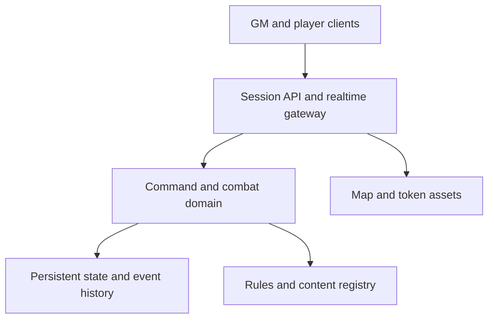
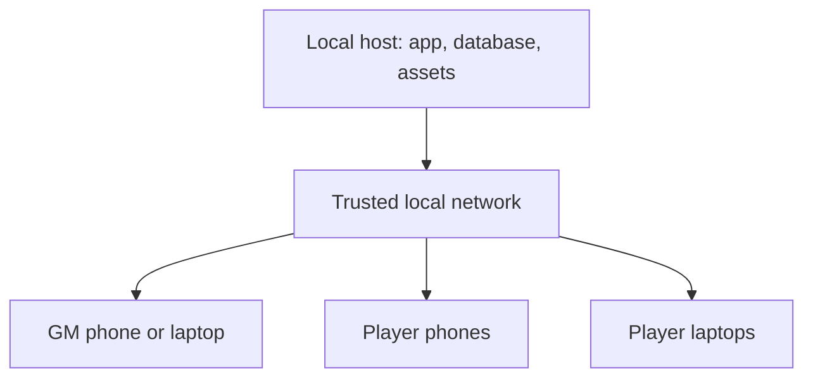

# Combat-First VTT — Comprehensive Build Plan

> A living product, design, and engineering roadmap for a private home-game virtual tabletop centered on D&D fifth-edition combat.

| Document field | Value |
| --- | --- |
| Status | Initial planning baseline |
| Product stage | Pre-implementation |
| Rules baseline | System Reference Document 5.2.1 (2024 fifth-edition rules) |
| Primary use | One GM locally hosting a private home game for a small, known group |
| Primary content path | Imported player-character and monster JSON |
| Last updated | 2026-07-15 |

## 1. Purpose of this document

This document is the project's durable source of truth for what should be built, why it matters, how the work should be sequenced, and how the team will know that the product is actually usable. It is intentionally broader than a feature backlog and less brittle than a line-by-line implementation specification.

It should answer five questions throughout development:

1. Does the proposed work make encounter preparation or combat execution faster and easier?
2. Is the work necessary for the core combat experience, or can a clear manual fallback cover it?
3. Does the work preserve the principle that no player or GM needs technical knowledge to operate the VTT?
4. Is the work being added at the correct milestone, with its dependencies already in place?
5. What observable result proves the work is complete?

This plan should be updated as implementation reveals better answers. Major architectural decisions should be recorded separately as Architecture Decision Records (ADRs) and linked from this document. Completed work should be checked off here only when its acceptance criteria are met.

### 1.1 Status conventions

- `[ ]` — not started
- `[~]` — in progress
- `[x]` — complete and verified
- `[-]` — deliberately deferred or removed from scope
- `BLOCKED:` — cannot proceed until the named decision or dependency is resolved

### 1.2 Planning hierarchy

Use this order when requirements conflict:

1. The product thesis and design principles in this document
2. Recorded ADRs
3. Milestone scope and exit gates
4. Epic-level acceptance criteria
5. Individual implementation tasks

## 2. Product definition

### 2.1 Product thesis

The VTT is a combat workspace that turns a battle map plus character and monster JSON into a playable encounter with almost no configuration. It should feel closer to placing miniatures on a physical table than administering a general-purpose game platform.

The experience is governed by two promises:

> **It just works.**

> **Everything needed for combat, and nothing that makes combat harder to run.**

The VTT is not trying to become the most configurable platform. Its advantage should be that the GM can understand the whole product, prepare an encounter quickly, and run a session without scripts, macros, modules, data-binding knowledge, or troubleshooting rituals.

### 2.2 North-star outcome

A GM with a map image and valid character/monster JSON should be able to create and start a useful encounter in minutes. A player should be able to join from a link, immediately recognize their character and available actions, and take a normal combat turn without training.

### 2.3 Initial measurable targets

These are product targets to validate through testing, not immutable promises:

| Outcome | Initial target |
| --- | --- |
| First-time encounter setup | Under 10 minutes without documentation |
| Repeat encounter setup | Under 3 minutes when actors already exist in the library |
| Player join | Under 30 seconds from opening the host IP address to selecting a character and seeing the active scene |
| Routine turn execution | Common action reachable in one obvious interaction; normal attack resolved in no more than three primary decisions |
| Common GM correction | HP, initiative, condition, position, or roll result editable in one or two interactions |
| Reconnect recovery | Return to current authoritative state within 5 seconds under normal conditions |
| State durability | Refreshing or reopening the session loses no accepted combat action |
| Required technical setup | None for players; a single documented launch/deploy path for the GM |

### 2.4 Primary users

| User | Needs | Product response |
| --- | --- | --- |
| GM | Prepare encounters quickly, control visibility, run monsters, make rulings, correct mistakes | Full control, quick-add workflows, sensible defaults, manual override, undo, private information controls |
| Player | Join quickly, control one or more assigned characters, understand current turn and available actions | Direct-IP entry and character selection, focused action tray, clear turn state, owned-token controls, readable roll outcomes |

The product may eventually support observers or assistant GMs, but neither role is required for the first playable release.

### 2.5 Operating assumptions

- The game is private and played by a known group.
- One trusted GM is authoritative for rulings and visibility.
- The initial target is approximately one GM and two to eight connected players.
- The application is locally hosted and reached directly through the host machine's IP address and port.
- A player joins without an account by selecting an available character.
- Entering GM mode requires the GM password.
- The initial rules corpus is SRD 5.2.1, but imported content may include homebrew and older fifth-edition conventions.
- Character creation happens elsewhere. The VTT consumes prepared character JSON.
- Monster content is imported or supplied in curated data bundles.
- Phone and laptop clients have the same functional capabilities. Layout and interaction change responsively for the screen size and input type, but mobile is not a reduced companion experience.
- Both player and GM roles must remain operable on a phone, including battle-map interaction, actions, dice, combat management, and GM tools when authenticated.
- Combat is the center of the application. Exploration on maps is supported only where it naturally follows from the combat canvas.
- The GM's ruling always outranks the automation.

### 2.6 Explicit non-goals for the initial product

The following are deliberately outside the core promise unless this plan is revised:

- A full character builder or level-up workflow
- A general campaign wiki, journal, quest manager, or worldbuilding suite
- A public marketplace or commercial content storefront
- Built-in video conferencing, voice chat, or music streaming
- Three-dimensional maps or miniatures
- A general-purpose macro language or user-authored executable scripts
- A module ecosystem comparable to highly extensible VTTs
- Complete semantic automation of every spell, class feature, feat, magic item, environmental rule, and homebrew exception
- Public SaaS billing, user accounts, organization management, or multi-tenant commercial hosting
- Automated encounter balancing as a prerequisite for running combat
- Replacing the GM's judgment about line of sight, cover, unusual movement, or ambiguous rules

The later regional/world-map atlas and spatial session-note system described in Sections 18.6–18.8 is a bounded post-Version-1 extension, not a reversal of the initial “no general campaign wiki” constraint. Its purpose is visual, map-anchored recall rather than a general-purpose knowledge-management suite.

## 3. Product design principles

Every significant feature and UI decision should be evaluated against these principles.

### 3.1 JSON in, playable actor out

Valid imported content should produce a usable actor with derived actions and combat controls. Importing an actor should not lead to a second configuration project.

### 3.2 The common path is immediate

Common actions—selecting a token, moving, targeting, attacking, rolling a save, applying damage, applying a condition, and ending a turn—must be directly visible in context. Do not hide the normal path behind right-click menus or configuration screens.

### 3.3 Progressive disclosure

Show only the controls relevant to the selected actor and current step. Advanced details may be available, but should not compete with the next likely action.

### 3.4 Assist rather than police

The system should calculate, suggest, warn, and remember. It should rarely prevent. If the GM wants to move a token farther than its listed Speed, apply an unusual effect, alter initiative, or ignore a calculated resistance, the VTT should permit it and keep an intelligible record.

### 3.5 Automation must be explainable

Any calculated modifier or state change must expose its source. A roll should show its dice, modifier components, advantage/disadvantage state, target number when visible, and resulting outcome. Damage should show type-by-type adjustments.

### 3.6 Manual fallback is a first-class feature

Every automated subsystem needs a fast generic alternative: roll arbitrary dice, apply raw damage/healing, add a custom condition, edit HP, move a token freely, reorder initiative, add a note, or resolve an action as free text.

### 3.7 State is visible and reversible

The active turn, HP, temporary HP, conditions, concentration, used resources, movement, targets, and pending choices should be visible without opening multiple windows. Accidental changes should be undoable.

### 3.8 Defaults provide value before settings

The application should choose an appropriate default whenever it safely can. A setting is justified only when tables commonly need different behavior and the difference cannot be handled by a quick in-context choice.

### 3.9 No required code, macros, or data binding

Power-user shortcuts may exist, but the supported product path must never require users to write formulas, commands, macros, selectors, or scripts.

### 3.10 Preserve the rhythm of a tabletop game

The interface should keep attention on the map and other people. Modal sequences, animations, and confirmation prompts must be brief. Confirm only destructive or materially ambiguous actions.

### 3.11 Fail safely and specifically

Errors must identify the affected item and offer a recovery action. A bad monster entry should not prevent other actors from importing. A disconnected player should not corrupt or stall combat.

### 3.12 Accessibility is structural

The initiative tracker, action controls, dice results, and actor state must have accessible DOM representations even if the map uses canvas/WebGL. Color, animation, drag-and-drop, and hover cannot be the only ways to understand or perform a critical action.

### 3.13 Complexity budget

- Any common action requiring more than three primary decisions needs design review.
- Any feature needing several settings should be simplified, moved behind an Advanced section, or deferred.
- Any new automation must state its manual fallback.
- Any new map tool must justify permanent toolbar space.
- Any imported field that does not affect play or reference should not become visible by default.
- Any proposed plugin or macro system is presumed out of scope unless a concrete home-game need cannot be solved more simply.

## 4. Lessons to borrow—and boundaries to preserve

The project should learn from established VTT patterns without inheriting their entire configuration surface.

| Existing pattern | Useful lesson | Application here |
| --- | --- | --- |
| Owlbear Rodeo centers the product on a shared battle-map experience, lets players join a room from a link, and supports creating a scene from a map in one workflow | Fast entry and map-first setup are product features, not merely onboarding polish | Provide immediate direct-IP player entry and a single map-to-scene flow with calibration embedded in import |
| Owlbear Rodeo separates reusable map assets from scenes | Content reuse should not require duplicating large assets | Store a map once and allow encounters/scenes to reference it |
| Foundry distinguishes reusable Actors/prototypes from placed Tokens | A reusable creature definition and a particular combat instance have different lifecycles | Separate actor definition, encounter instance, and visual token state in the domain model |
| Foundry provides distinct select, target, and measure concepts | Combat intent becomes clearer when targeting is not inferred from selection | Keep selection and targeting distinct, while making both visually obvious |
| Roll20 exposes initiative as a shared turn list and supports quick token actions | Initiative and frequent actions should be continuously available | Automatically associate imported actors/tokens with initiative and generate an action tray without requiring macros |
| Roll20's selected-token dependencies and macro surface demonstrate a common failure mode | Hidden context and required power-user syntax create avoidable errors | Resolve actions from the currently controlled actor explicitly; never require token-selection rituals or macro code |

Reference material:

- [Owlbear Rodeo: Getting Started](https://docs.owlbear.rodeo/docs/getting-started/)
- [Owlbear Rodeo: Scenes](https://docs.owlbear.rodeo/docs/scenes/)
- [Foundry VTT: Tokens](https://foundryvtt.com/article/tokens/)
- [Roll20: Turn Tracker](https://help.roll20.net/hc/en-us/articles/360039178634-Turn-Tracker)
- [Roll20: Macros and Token Actions](https://help.roll20.net/hc/en-us/articles/360037256794-Macros-Token-Actions)

## 5. Scope ladder

### 5.1 Minimum playable vertical slice

This is the smallest end-to-end product that proves the concept:

- A GM can create a room and open it from a second browser.
- A GM can import one map image and establish a usable square grid.
- A GM can import at least one player character and one monster from JSON.
- Imported actors can be placed as tokens and assigned to a player or the GM.
- Participants can select and move owned tokens.
- Combatants can roll or receive initiative, appear in order, and advance through rounds.
- Imported attacks and generic dice rolls work.
- Shared rolls appear promptly in a readable 2D dice/result presentation and the combat log.
- The roller can choose an authorized visibility mode, including a genuinely secret GM roll.
- HP, temporary HP, damage, healing, and basic conditions can be changed.
- Rolls and state changes appear to all authorized clients.
- Accepted state survives refresh and reconnect.
- The GM can override and undo common state changes.

This slice does not need spell automation, dynamic lighting, advanced fog, walls, encounter libraries, or complete SRD content.

### 5.2 Playable alpha

The alpha adds enough speed and clarity to run a normal session:

- Contextual action tray generated from imported data
- Fast dice tray for d4, d6, d8, d10, d12, d20, d100, quantities, modifiers, and saved recent formulas
- Polished responsive 2D dice/result presentation for action rolls, manual rolls, Advantage/Disadvantage, criticals, and rerolls
- Public, GM-only, blind-to-roller, self-only, and permitted-recipient roll visibility
- Explicit targeting and multi-target selection
- Attack-versus-AC and save-versus-DC resolution
- Advantage/disadvantage controls and transparent roll breakdowns
- Typed damage with resistance, vulnerability, immunity, and manual adjustment
- Manual fog reveal/hide
- GM-hidden actors and private rolls
- Quick duplicate/add for groups of monsters
- Group or individual initiative choices
- Turn/round reminders and basic action-economy indicators
- Useful combat log, undo, autosave, and reconnect
- Clear import validation and error recovery

### 5.3 Rules-assisted beta

The beta adds structured assistance for the fifth-edition combat mechanics that most often slow play:

- Conditions and custom effects with durations
- Concentration tracking and damage-triggered check prompts
- Death saving throws and stabilization state
- Spell slots and other imported resources
- Spell targeting, area templates, upcasting inputs, duration, and concentration metadata
- Monster Multiattack, limited-use abilities, Recharge, Reactions, Bonus Actions, and Legendary Actions
- Damage composed of multiple typed parts
- Start/end-of-turn effects and repeated saves
- Movement budget and measured paths as guidance
- Cover selection and target modifiers
- Encounter templates and reusable actor/map libraries

### 5.4 Version 1 quality bar

Version 1 is not defined by automating the entire SRD. It is defined by being dependable enough for the weekly home game:

- A new encounter can be prepared quickly without developer tools.
- All common combat mechanics have either trustworthy assistance or an obvious manual fallback.
- Player-visible and GM-private information remain correctly separated.
- Refresh, reconnect, backup, restore, update, and schema migration paths are tested.
- The primary supported browsers and devices are verified.
- The core flow meets accessibility and performance targets.
- Failures produce actionable messages and diagnostics.
- The SRD attribution and content provenance are present.

### 5.5 Later candidates, not implicit commitments

- Dynamic vision, walls, doors, and lighting
- Hex, isometric, or fully gridless movement
- Automated terrain and collision
- Advanced elevation and multiple map levels
- Native iOS/Android applications; the responsive web application is the supported mobile experience
- Encounter difficulty estimates
- Additional ruleset adapters
- Import adapters for third-party character exporters
- Optional 3D tabletop dice presentation, implemented behind the replaceable dice-presentation boundary
- Public spectator links
- Assistant GM role
- Regional and world atlas maps with configurable real-world/fantasy scales
- Clickable categorized map markers with safe Markdown notes
- Session-note and recap markers that visually locate where play occurred
- PWA/offline-first mode

## 6. Core user journeys

The following journeys are more important than any isolated feature. Each milestone should preserve them end to end.

### 6.1 First launch

**Goal:** reach a useful screen without reading setup documentation.

1. GM launches the application.
2. On first run, a localhost-only or host-displayed one-time bootstrap asks the GM to create the GM password.
3. If no game exists, the application offers one primary action: **Create game**.
4. The game receives usable defaults for rules version, measurement, visibility, and session access.
5. The application offers a short three-step path: add a map, add actors, show the host address for players.
6. Optional settings remain available but do not interrupt this path.

Acceptance criteria:

- [ ] No empty dashboard with several equally prominent choices.
- [ ] A LAN visitor cannot seize GM ownership before the host completes bootstrap.
- [ ] No ruleset configuration form before the GM can import a map.
- [ ] A sample encounter can be loaded as an optional orientation tool.
- [ ] Every first-run step can be skipped and completed later.

### 6.2 Prepare an encounter from scratch

**Goal:** go from map plus JSON to a ready encounter in minutes.

1. GM chooses **New encounter** and drops a map image.
2. The map import screen previews the image and provides a fast grid calibration workflow.
3. The GM imports or selects player actors and monsters.
4. Imported actors receive default token art, size, disposition, HP, and visible actions.
5. The GM chooses monster quantity and places tokens, with a quick auto-arrange option when useful.
6. The GM optionally covers the map with fog and reveals the starting area.
7. The GM starts the encounter, rolls or assigns initiative, and shows/copies the host address for players.

Acceptance criteria:

- [ ] Map import and scene creation are a single coherent flow.
- [ ] Previously imported actors can be found by name, type, CR, tags, and recency.
- [ ] Adding five copies of a monster does not require five imports or five forms.
- [ ] Every required value has a safe default or is derived from JSON.
- [ ] The setup screen clearly indicates missing or invalid information before combat begins.

### 6.3 Join as a player

**Goal:** enter the game from a phone or laptop with no account-administration burden.

1. Player opens the host address, such as `http://192.168.1.50:3000`, in a browser.
2. The landing page offers **Join as Player** and **Enter as GM**.
3. The player chooses **Join as Player** and sees player characters that are available to claim.
4. The player selects their character. A short display-name prompt is shown only if the character data does not provide an adequate identity or the table needs device/user distinction.
5. The server claims that character for the browser/session so another player cannot select it accidentally.
6. The player arrives at the active scene with the selected character, action tray, and active-turn state visible.

Acceptance criteria:

- [ ] Players do not need an account, invite token, email address, or room code.
- [ ] The host landing page is usable by typing/bookmarking an IP address and port.
- [ ] Available characters show enough identity—name, portrait/token, class/level or short summary—to prevent accidental selection.
- [ ] Already claimed characters are clearly marked and cannot be claimed twice through a race condition.
- [ ] Reopening the host address on the same browser restores the prior character claim when safe.
- [ ] A temporary disconnect does not immediately release a character to someone else.
- [ ] The player can deliberately release/switch character, subject to GM policy.
- [ ] The GM can release a stale claim, disconnect a client, or reassign a character.
- [ ] A character can optionally be controlled by the GM when no player has claimed it.
- [ ] The player cannot see GM-only actors, notes, hidden rolls, fogged map content, or private stat details.

### 6.3.1 Enter as GM

**Goal:** make GM entry simple while keeping GM controls unavailable to ordinary players.

1. User opens the same host IP address and chooses **Enter as GM**.
2. The application prompts for the GM password.
3. The server verifies the password and issues a GM session for that browser.
4. The GM enters the current game/scene with full controls.

Acceptance criteria:

- [ ] The GM password is created during first-run setup from the host machine/one-time local bootstrap path and can be changed by an authenticated GM.
- [ ] The server stores only a modern salted password hash, never the plaintext password.
- [ ] Failed attempts are rate-limited and do not reveal whether any other session detail is valid.
- [ ] The browser can retain the GM session according to a clear “stay signed in” policy without storing the password.
- [ ] The GM can sign out and revoke other GM sessions.
- [ ] A player cannot obtain GM state by changing client-side role values or calling GM endpoints directly.
- [ ] Direct-IP HTTP is treated as a trusted-LAN mode; if the IP/port is exposed outside the trusted network, the deployment guide requires a secure tunnel/VPN or TLS reverse proxy because an HTTP password/session is not protected in transit.

### 6.4 Run a routine combat turn

**Goal:** make the next useful action obvious and keep attention on the map.

1. The active combatant and token are highlighted; the map may center on them without forcibly changing player zoom.
2. The action tray shows that actor's common Actions, Bonus Actions, Reactions, movement, and resources.
3. The player chooses an action.
4. The UI asks only for unresolved choices: target, advantage state, resource/slot, optional variant, or template placement.
5. The VTT rolls and shows an understandable result.
6. The VTT proposes damage, healing, resource usage, or effects; the authorized user/GM confirms or adjusts when needed.
7. The action and resulting state changes appear in the log.
8. The player ends the turn; unresolved reminders are shown without becoming blockers.

Acceptance criteria:

- [ ] The player is never required to open the full character JSON or edit a formula.
- [ ] The target is visually unambiguous before a state-changing result is applied.
- [ ] An action can be canceled without consuming resources or leaving partial state.
- [ ] The GM can resolve an improvised action with a generic roll and manual effect.
- [ ] Ending a turn is always available, even if action-economy indicators suggest unused options.

### 6.5 Run a group of monsters

**Goal:** keep GM workload low when several creatures are involved.

1. The initiative tracker groups or distinguishes monsters according to the GM's setup choice.
2. Selecting a monster shows the correct individual HP/resources even when actors share a definition.
3. Common actions are immediately visible.
4. Multi-target saves and repeated attacks can be resolved without reopening the action definition each time.
5. Defeated monsters can be hidden, marked, removed, or left on the map in one action.

Acceptance criteria:

- [ ] Identical monsters have unique readable labels such as Goblin A, Goblin B, and Goblin C.
- [ ] Editing one placed monster's HP does not affect the other instances.
- [ ] The GM can choose shared, rolled-individual, or manually entered initiative.
- [ ] Batch selection supports common operations without obscuring which individual is affected.

### 6.6 Recover from interruption or mistake

**Goal:** never let the tool become the crisis at the table.

1. A disconnected browser reconnects and receives the current authoritative state.
2. A mistaken damage application, movement, condition, or initiative change can be undone.
3. A server/application restart reopens the latest encounter state.
4. If an import or migration fails, the prior usable data remains intact and the error identifies the affected content.

Acceptance criteria:

- [ ] No accepted command exists only in browser memory.
- [ ] Replayed or retried network commands are idempotent.
- [ ] Undo reports exactly what it will reverse and never silently rewinds unrelated players.
- [ ] A documented backup and restore test is part of every release gate.

### 6.7 End and reuse an encounter

**Goal:** preserve useful preparation without creating administrative work.

1. GM ends or pauses the encounter.
2. The application stores the final state and a compact summary.
3. The GM can reset the encounter from its prepared baseline, duplicate it, or archive it.
4. Reusable actor definitions and map assets remain in their libraries.

Acceptance criteria:

- [ ] Resetting an encounter cannot accidentally overwrite its reusable actor definitions.
- [ ] The GM can distinguish prepared baseline, live state, and completed snapshot.
- [ ] Archiving removes clutter without deleting referenced assets unexpectedly.

## 7. Automation policy

### 7.1 Automation levels

Every mechanic should be assigned an explicit automation level. The default target is Levels 1–2.

| Level | Behavior | Example | Default posture |
| --- | --- | --- | --- |
| 0 — Reference | Display source data or rule text only | Show an unusual feature description | Always available as fallback |
| 1 — Calculate | Compute a transparent value without changing state | Roll an attack and compare it with visible AC | Preferred for deterministic math |
| 2 — Propose | Prepare a state change for confirmation/adjustment | Propose typed damage after a hit | Preferred for consequential outcomes |
| 3 — Apply | Automatically perform a predictable, reversible transition | Advance a round after the last turn | Use selectively |
| 4 — Enforce | Prevent actions that violate modeled rules | Block movement beyond Speed | Avoid in the core product |

### 7.2 Rules for adding automation

- [ ] Cite the relevant SRD rule or data definition in the implementation/test.
- [ ] Define the source data needed for the automation.
- [ ] Define behavior when that data is missing or contradictory.
- [ ] Provide an obvious manual fallback.
- [ ] Show the calculation or reason to the user.
- [ ] Make consequential state changes reversible.
- [ ] Test specific-rule-overrides-general-rule behavior.
- [ ] Avoid automation that requires interpreting arbitrary natural-language rules at runtime.

### 7.3 Structured core, text fallback

Imported actions and spells should contain structured fields for common, deterministic operations and retain human-readable text for everything else. The UI can automate the structured portion and display the remaining text beside it. Unsupported mechanics must never make the whole action unusable.

## 8. Product and architecture decisions to record

Create one ADR per material decision. The recommendations below are starting positions, not substitutes for prototypes.

| ADR | Decision | Recommended starting position | Must be settled by |
| --- | --- | --- | --- |
| ADR-001 | Product platform | Browser-based application with full phone/desktop functional parity and responsive role-specific layouts | Before repository scaffold |
| ADR-002 | Hosting topology | **Resolved direction:** locally hosted, single authoritative server reached by host IP and port; package as one simple service with persistent local data | Record before scaffold |
| ADR-003 | Client renderer | Prototype a mature Canvas/WebGL scene library; do not build low-level rendering/input primitives unless testing proves necessary | End of technical spikes |
| ADR-004 | Application language/stack | TypeScript end to end unless a spike demonstrates a concrete blocker | Before scaffold |
| ADR-005 | Realtime protocol | Server-authoritative WebSocket command/event flow with reconnect snapshots | Before vertical slice |
| ADR-006 | Persistence | Relational store for structured state plus file/object storage for assets; SQLite is a strong private-use starting point if deployment remains single-instance | Before first migration |
| ADR-007 | Canonical content format | Versioned, documented JSON schemas with extension fields and adapters | Before importing production data |
| ADR-008 | Rules representation | Typed declarative operations plus text fallback; never evaluate imported JavaScript | Before action automation |
| ADR-009 | Grid baseline | Square grid with five-foot cells for MVP; record diagonal and occupied-cell conventions explicitly | Before movement/measurement tests |
| ADR-010 | Fog and vision | Manual fog for alpha; dynamic walls/vision remain a separate later epic | Before map tool implementation |
| ADR-011 | Identity | **Resolved direction:** same direct-IP landing page for all users; players claim an available character without an account; GM role requires password authentication | Record before room workflow |
| ADR-012 | Dice authority and presentation | Generate and record rolls on the authoritative server; show an initial 2D result component only to authorized clients; preserve formula, individual faces, modifiers, result, visibility, and actor provenance; keep presentation replaceable | Before dice implementation |
| ADR-013 | State history | Transactional command/event log with periodic snapshots and bounded undo | Before combat mutations |
| ADR-014 | Device support | **Resolved requirement:** phone and desktop/laptop functional parity with responsive/touch-specific UX; finalize exact iOS Safari and Android Chrome support versions | Before UI scaffold |
| ADR-015 | SRD content packaging | Curated, normalized, versioned content bundle separate from executable code; never parse the PDF/Markdown extraction at runtime | Before bulk monster conversion |

### 8.1 Technical spikes

- [ ] Render a large map with smooth pan/zoom and at least 100 tokens.
- [ ] Exercise pointer, mouse, trackpad, and touch input on the candidate renderer.
- [ ] Test grid overlay, coordinate conversion, snapping, multi-cell tokens, and high-DPI scaling.
- [ ] Test selection, independent targeting, marquee selection, drag movement, and waypoint measurement.
- [ ] Validate map image limits across supported browsers and decide whether oversized images must be tiled/downsampled.
- [ ] Synchronize token movement and HP between GM and player browsers through the candidate realtime design.
- [ ] Disconnect/reconnect during several simultaneous state changes and verify convergence.
- [ ] Validate a versioned player-character and monster schema with actionable path-based errors.
- [ ] Exercise action resolution containing an attack, multiple typed damage components, a save, and an applied condition.
- [ ] Prototype the core combat layout at desktop and tablet widths before committing to component structure.
- [ ] Prototype every core combat workflow at narrow phone portrait, phone landscape, tablet, and desktop widths; reject any architecture that requires a reduced mobile feature set.
- [ ] Verify direct-IP discovery/startup: bind to the LAN interface, display usable host URLs, and connect from iOS and Android devices on the same network.

Exit gate: no unresolved renderer, networking, persistence, or schema risk can plausibly invalidate the first vertical slice.

## 9. Conceptual architecture

The system should be modular enough to test rules without a browser and to change rendering or hosting choices without rewriting the combat domain.



### 9.1 Recommended boundaries

| Boundary | Responsibility | Must not own |
| --- | --- | --- |
| Scene client | Render map state, collect intent, display projections, support accessible controls | Authoritative HP, dice, permissions, or rule outcomes |
| Session/realtime layer | Authenticate participant, accept commands, broadcast authorized state, handle presence/reconnect | UI-specific state or content parsing |
| Combat domain | Validate commands, resolve deterministic rules, create events, maintain invariants | Browser rendering, database-specific queries, arbitrary imported code |
| Rules/content registry | Provide ruleset version, actor/action definitions, schema validation, source/provenance metadata | Live encounter state |
| Persistence | Transactions, migrations, snapshots, event history, backups | Rule interpretation |
| Asset service | Validate, store, transform, and serve maps/token images | Actor statistics or encounter logic |

### 9.2 Command-to-result flow

1. A client submits an intent such as `MoveToken`, `RollAction`, `ApplyDamage`, or `EndTurn` with a unique command ID and expected state revision.
2. The server verifies participant authority, current entity revisions, and structurally valid inputs.
3. The combat domain calculates or proposes the result using the encounter's pinned ruleset/content versions.
4. Consequential proposals that need human confirmation return a preview rather than mutating state.
5. Accepted mutations are written transactionally as domain events and update the current projection.
6. Authorized projections are broadcast to each client; GM and player payloads may differ.
7. Clients reconcile optimistic visual changes, display the result, and retain no private authoritative state.

### 9.3 Architectural invariants

- Live game state must never exist only in canvas objects or React/component state.
- Every entity uses a stable opaque ID; display names are never keys.
- A command may be retried without being applied twice.
- Every accepted state-changing command produces an auditable event.
- Every connected client can reconstruct its authorized view from a snapshot plus later events.
- Ruleset and schema versions are pinned to saved content/encounters and migrated deliberately.
- Imported rich text is inert and sanitized.
- Derived values identify their inputs and allow explicit override where the product permits it.
- The player's projection excludes hidden information at the server boundary; hiding only with CSS is unacceptable.

### 9.4 Suggested repository shape

Confirm this in ADR-004 before scaffolding:

```text
apps/
  web/                 Browser UI and scene renderer
  server/              HTTP, realtime gateway, persistence adapters
packages/
  domain/              Commands, events, entities, invariants
  rules-5e/            SRD 5.2.1 calculations and rule helpers
  schemas/             Versioned JSON Schema and generated types
  content-srd-5.2.1/   Curated SRD-derived data and attribution
  ui/                  Shared accessible UI components
  test-fixtures/       Actors, maps, encounters, golden outcomes
docs/
  adr/                 Architecture Decision Records
  product/             Wireframes, usability findings, glossary
```

Avoid creating packages simply to match this diagram. Each package should have a real dependency boundary and independent test value.

## 10. Canonical domain model

The exact schema remains an implementation task, but the following concepts must be represented explicitly.

### 10.1 Core entities

| Entity | Purpose | Important relationships/state |
| --- | --- | --- |
| Game | Long-lived container for the home game | Ruleset defaults, participant identities, reusable libraries, encounters |
| Room/Session | Current connection and visibility context | Player/GM sessions, character claims, connected participants, active scene/encounter, presence |
| Participant | A connected human identity | Role, assigned actors, session status, preferences |
| Ruleset | Versioned mechanics and vocabulary | `srd-5.2.1`, units, automation capabilities, attribution |
| Content source | Provenance and license for imported/curated data | Source name/version, attribution, import timestamp, adapter |
| Actor definition | Reusable character, monster, NPC, or summon template | Statistics, actions, resources, effects, art defaults, source data |
| Actor instance | Mutable incarnation of an actor in play | Current/max HP, temporary HP, resources, conditions/effects, overrides |
| Token | Visual placement of an actor instance in a scene | Position, size, elevation, rotation, visibility, art, disposition |
| Action definition | An available Action, Bonus Action, Reaction, trait activation, spell, or generic operation | Activation type, targeting, rolls, costs, outcomes, text fallback |
| Resource definition/instance | Limited-use value | Maximum/current, reset cadence, source, consumption history |
| Effect definition | Reusable description of a condition/buff/debuff | Modifiers, stacking rule, default timing, icon |
| Effect instance | A particular applied effect | Source, target, start, duration, expiry trigger, concentration link, visibility |
| Map asset | Reusable image content | File metadata, dimensions, checksum, thumbnails, source |
| Atlas map | Regional/world spatial workspace separate from combat scenes | Map asset, configurable scale, image-local coordinates, marker layers, optional later geographic calibration |
| Map marker | Clickable point or area anchored to a battle/regional/world map | Position, category/icon, title, visibility, tags, linked notes/entities/session records |
| Markdown note | Inert, sanitized authored content | Source Markdown, rendered projection, attachments/links, revisions, author/timestamps, visibility |
| Session record | Notes and recap for one session or a portion of one | Date/title, Markdown notes, participants, linked encounters, one or more spatial markers |
| Scene | Shared spatial workspace | Map references, grid, fog, drawings, token references, viewport defaults |
| Encounter | Prepared and/or live combat | Scene, baseline roster, state, round, initiative, ruleset version |
| Combatant | Actor instance's participation in initiative | Initiative value, tie-break, current turn, group, visibility, defeated status |
| Target set | Explicit targets for a pending or completed action | Actor/token IDs, selection method, template relation, GM adjustments |
| Roll | Immutable die resolution | Formula/AST, individual dice, modifiers, advantage state, visibility, actor/action, result |
| Damage/healing packet | One or more proposed/applied health components | Amount, type, source, mitigation, temp HP interaction, target result |
| Command | Requested intent | ID, actor, participant, expected revision, parameters, timestamp |
| Domain event | Accepted fact | Sequence, command link, before/after summary, visibility, undo relation |
| Snapshot | Restorable state checkpoint | Encounter revision, event cursor, schema versions, creation reason |
| Import job | Traceable content ingestion | Source file, schema/adapter, per-item results, warnings, failures |

### 10.2 Actor definition, actor instance, and token separation

This distinction is essential:

- **Actor definition:** “Goblin Warrior” as reusable source data.
- **Actor instance:** “Goblin B in this encounter,” with 3 HP, one applied condition, and a spent resource.
- **Token:** where Goblin B appears on this scene, its displayed art/label, and whether players can see it.

For persistent player characters, an actor instance may remain linked across encounters. For generic monsters, each placement normally creates an independent instance from the definition. Updating a reusable definition must never silently rewrite live combat state.

Decisions to document:

- [ ] Define when a definition update is offered to existing instances.
- [ ] Define whether completed encounter instances remain immutable historical records.
- [ ] Define reset behavior for persistent player resources between encounters.
- [ ] Define how summons and transformations reference or replace actor definitions.
- [ ] Define token removal versus actor defeat versus actor deletion.

### 10.3 Value provenance and overrides

For important derived values such as AC, attack bonus, save DC, Initiative, Speed, and maximum HP, record:

- canonical input values;
- calculation/rule version;
- calculated result;
- optional explicit override;
- visible explanation of which value is active.

An override should survive refresh and export. It should be removable without destroying the original inputs.

### 10.4 Effect and timing model

Effects cannot be represented as icon-only flags. An effect instance may need:

- source actor/action and target actor;
- formal condition(s) and free-text note;
- start round/turn and application event;
- duration expressed in rounds, minutes, until a named turn boundary, until a save succeeds, while in an area, or manual;
- whether expiry occurs at the start or end of the source's or target's turn;
- repeat-save timing and DC;
- concentration owner;
- stacking/refresh behavior;
- visibility;
- optional structured modifiers;
- manual expiry.

Build a generic timing engine before special-casing individual spells. Unsupported timing must fall back to a visible reminder and manual removal.

### 10.5 Ruleset pinning

An encounter should record the ruleset and content versions used when it was prepared. Importing a later SRD/content version must not mutate a live or completed encounter unexpectedly. Provide explicit upgrade/preview tooling later rather than transparent background conversion.

## 11. JSON content and import pipeline

JSON import is a primary product surface, not a developer utility.

### 11.1 Canonical schema families

Create documented, versioned schemas for at least:

- `actor-character`
- `actor-monster`
- `action`
- `spell`
- `effect`
- `item/resource` where needed for combat
- `encounter-template`
- `content-bundle`

Use JSON Schema for validation and generate application types from the canonical source where practical. Every document needs a schema identifier and version.

### 11.2 Minimum actor coverage

The canonical actor model must be able to represent:

- name, type/category, size, alignment/reference tags, source/provenance;
- ability scores and modifiers;
- proficiency bonus and level or Challenge Rating where relevant;
- Armor Class, maximum/current HP defaults, Hit Dice/reference HP formula;
- initiative bonus and optional fixed/default Initiative value;
- Speed modes and special movement notes;
- saving throws and skill proficiencies/expertise;
- senses, passive Perception, languages, and communication modes;
- damage vulnerabilities, resistances, and immunities;
- condition immunities;
- traits and always-on effects;
- Actions, Bonus Actions, Reactions, Legendary Actions, and other timed options;
- Multiattack and action grouping;
- limited-use and Recharge mechanics;
- attack rolls, save DCs, ranges/reach, target counts, typed damage/healing components, and conditions;
- spells, spell attacks/save DCs, slots or per-day uses, concentration, duration, and components as reference;
- player resources such as class/feature uses when supplied;
- token art, footprint, disposition, label preferences, and optional vision metadata;
- human-readable text for any mechanic not structurally automated.

### 11.3 Formula safety

- [ ] Define a small dice-expression grammar or structured dice AST.
- [ ] Support common arithmetic and labeled modifiers needed by imported content.
- [ ] Reject or quarantine unrecognized operators.
- [ ] Never pass imported formulas to `eval`, `Function`, shell commands, templates with code execution, or database expressions.
- [ ] Preserve the original formula for display and round-trip export.
- [ ] Add deterministic parsing and evaluation tests, including malformed and adversarial inputs.

### 11.4 Import experience

The normal import flow should be:

1. Drop/select one JSON file or content bundle.
2. Detect the schema or offer a small adapter choice when detection is ambiguous.
3. Validate the whole document and each contained actor independently.
4. Show an import summary: new items, updates, duplicates, warnings, and failures.
5. Preview the actor as it will appear in combat, including actions and token defaults.
6. Let the user import valid items even if another item fails.
7. Offer direct, human-readable corrections or a downloadable error report for structural failures.

Error messages should look like “Goblin Warrior → Actions → Scimitar → damage formula is missing a die size,” not a parser stack trace or raw schema pointer alone.

### 11.5 Validation severity

| Severity | Meaning | Behavior |
| --- | --- | --- |
| Error | Item cannot function safely | Do not import that item; identify exact path and correction |
| Warning | Item is usable with reduced automation | Import with visible warning and text/manual fallback |
| Information | A default or normalization was applied | Import and disclose in summary |

### 11.6 Unknown and extension data

Provide a namespaced `extensions` area or equivalent so homebrew/import adapters can retain data the core product does not understand. Unknown fields must not execute or silently influence rules. Round-trip export should preserve safe unknown extension data when possible.

### 11.7 Duplicate and update strategy

- [ ] Define stable source IDs distinct from local IDs.
- [ ] Detect exact duplicates by source ID/version and likely duplicates by name/source.
- [ ] Offer Skip, Import as copy, or Update definition.
- [ ] Preview changed fields before updating.
- [ ] Never update live actor instances silently.
- [ ] Record source version, importer version, and import timestamp.
- [ ] Preserve local art or labels when updating data unless explicitly replaced.

### 11.8 Bulk SRD conversion

The supplied SRD extraction is source material, not a runtime database. Build a one-time or repeatable curation pipeline that:

- identifies discrete monsters, spells, conditions, actions, and reference terms;
- converts them into canonical schema documents;
- reports ambiguous or unparsed text for manual review;
- validates every generated document;
- compares counts and required fields with the source;
- assigns source page/section metadata;
- runs representative golden tests;
- produces a versioned content bundle with required attribution.

Do not promise perfect automatic conversion from the extracted Markdown. Its tables and columns contain extraction artifacts. Prefer a controlled transform plus human QA for the subset actually used.

### 11.9 Import/export and data ownership

- [ ] Export individual actor definitions in the canonical JSON format.
- [ ] Export/import content bundles with a manifest and schema versions.
- [ ] Export a complete private-game backup including structured state and referenced assets.
- [ ] Support restore preview before overwriting current state.
- [ ] Document which IDs remain stable across export/import.
- [ ] Include content source/license metadata in exported bundles.
- [ ] Add migrations and fixture tests for every schema version change.

## 12. Battle map and scene subsystem

### 12.1 Map import and lifecycle

- [ ] Accept standard image formats for battle, regional, and world maps through one shared upload path: PNG, JPEG/JPG, WebP, GIF, BMP, AVIF, HEIF/HEIC, TIFF, and SVG where the selected decoder can process them safely.
- [ ] Normalize uploaded maps into safe internal display renditions; rasterize/sanitize SVG, flatten or explicitly select a frame for animated formats, and preserve the original file separately when feasible.
- [ ] Validate type from file contents, not only extension.
- [ ] Extract dimensions, calculate checksum, and create thumbnails/previews.
- [ ] Detect browser/GPU texture limits and downsample or tile oversized maps safely.
- [ ] Keep the original asset when feasible and store derived display assets separately.
- [ ] Create a scene from a newly imported map in the same workflow.
- [ ] Allow blank scenes for sketching or theater-of-the-mind combat.
- [ ] Lock map transforms during play by default.
- [ ] Reuse one map asset across multiple scenes/encounters.
- [ ] Prevent asset deletion while still referenced, or explain and repair references.

### 12.2 Grid calibration

The exact calibration interaction requires a prototype. The delivered workflow must cover:

- gridless images;
- maps with a printed square grid;
- grid cell size and X/Y offset;
- rectangular source images and cropped borders;
- visible preview at multiple zoom levels;
- adjustable grid color/opacity;
- snap on/off;
- measurement unit and distance per cell;
- correction after scene creation without destroying token positions;
- optional assisted grid detection only if it is reliable and easy to override.

Initial recommendation: support square grids only in the first vertical slice; make coordinate and measurement abstractions capable of adding hex/gridless modes later.

### 12.2.1 Easy battlemap grid wizard

Grid calibration is required product functionality, not an advanced configuration screen. The normal map-upload flow should immediately offer a short visual wizard:

1. **Choose map type:** printed square grid, gridless, or unsure.
2. **Show one known span:** drag across one square or between two grid intersections; for a longer sample, enter how many cells the span represents.
3. **Align:** drag one visible grid intersection onto the overlay and use large, direct nudge controls only if necessary.
4. **Preview:** inspect several areas/zoom levels with the overlay, token footprint, snap, and five-foot scale visible.
5. **Confirm:** create the scene with safe defaults; retain a clear **Recalibrate grid** action that preserves world/token placement.

Wizard requirements:

- [ ] No pixel dimensions, coordinate math, or manual X/Y offset entry in the normal path.
- [ ] Optional assisted line/grid detection may prefill values but must never be required or difficult to override.
- [ ] Touch controls must be fully usable on a phone, including zoomed precision placement and nudge controls.
- [ ] Gridless selection skips calibration cleanly while still allowing a configurable distance scale.
- [ ] An Advanced section may expose exact cell size/offset/rotation values for recovery without competing with the wizard.
- [ ] Calibration stores source-image and world transforms explicitly so replacing/downsampling a rendition does not alter scene coordinates.

Questions to resolve in ADR-009:

- [ ] Which diagonal distance rule is the default?
- [ ] Is movement measured center-to-center, occupied-cell-to-occupied-cell, or by path-cell transitions?
- [ ] How do Large and larger tokens snap and measure?
- [ ] How are partial cells at map edges represented?
- [ ] Does the scene allow map rotation, and if so, is arbitrary rotation compatible with snapping?
- [ ] How is grid calibration changed after tokens/effects already exist?

### 12.3 Coordinate system

- Use one canonical world coordinate system independent of display pixels and viewport zoom.
- Define conversions among source-image pixels, world units, grid coordinates, and screen coordinates.
- Persist positions in world coordinates with sufficient precision.
- Centralize spatial calculations; do not reimplement geometry in individual tools.
- Version geometry behavior if a later rules correction could alter saved paths/templates.

### 12.4 Navigation and input

- [ ] Pan with middle mouse/space-drag and touch gestures without selecting tokens accidentally.
- [ ] Zoom around pointer/pinch center and provide fit-to-map/reset controls.
- [ ] Maintain useful zoom limits and crisp grid/token rendering.
- [ ] Support keyboard focus and non-drag movement controls.
- [ ] Provide pings visible to selected audiences.
- [ ] Prevent browser scrolling/zoom conflicts only inside the scene surface.
- [ ] Test high-DPI displays, trackpads, touchscreens, and stylus input.
- [ ] Avoid forcibly recentering every player's viewport when the active turn changes; offer a “focus active token” action.

### 12.5 Tokens

Tokens must support:

- owner/role permissions;
- friendly, hostile, neutral, and GM-only disposition;
- actor-instance linkage;
- size/footprint, position, optional elevation, rotation, and lock state;
- art crop/scale and generated fallback art;
- name/label visibility rules;
- HP bar/value visibility rules;
- status/condition indicators using color plus shape/icon/text;
- current-turn, selected, targeted, hidden, defeated, and concentrating states;
- multi-select, duplicate, delete/remove, hide/reveal, and bring-to-front operations;
- independent state for multiple instances of one monster definition;
- predictable stacking/selection when tokens overlap.

Token interactions:

- Single click selects.
- A separate, explicit gesture/control targets.
- Drag proposes or performs movement according to scene settings.
- Keyboard commands can nudge selected owned tokens.
- Double click or a clear inspector action opens details; the common combat tray should not require it.
- Context menus may host infrequent commands, but never the only route to a core combat action.

### 12.6 Selection and targeting

Selection answers “what am I controlling or inspecting?” Targeting answers “who will this action affect?” They must not be conflated.

- [ ] Use distinct visual treatments that remain recognizable for color-vision deficiencies.
- [ ] Allow shift/additive multi-targeting.
- [ ] Allow box/lasso selection for GM batch work without automatically targeting.
- [ ] Support target ownership/visibility checks on the server.
- [ ] Show the target list in the pending action card before resolution.
- [ ] Allow the GM to add/remove targets selected by an area template.
- [ ] Clear or retain targets predictably after action completion; choose and document the default.

### 12.7 Movement and measurement

Initial movement should guide rather than enforce.

- [ ] Straight-line ruler with distance label.
- [ ] Waypoint path measurement.
- [ ] Drag-to-move with live distance preview.
- [ ] Optional snap-to-grid.
- [ ] Movement budget display/reset for active combatant.
- [ ] Dash or custom movement allowance control.
- [ ] Difficult-terrain segments or manual movement-cost adjustment later.
- [ ] GM override and free placement at all times.
- [ ] Movement history sufficient for undo.
- [ ] Optional path confirmation for players if accidental moves are common in testing.
- [ ] Do not automatically trigger opportunity attacks in MVP; optionally show a reminder later.

### 12.8 Drawing, pings, and quick annotations

Keep this toolset intentionally small:

- freehand pen/highlighter;
- line/arrow;
- rectangle and circle;
- text label;
- ping;
- delete/clear selection;
- GM-only versus shared visibility;
- color and a few useful stroke sizes.

Avoid turning the VTT into an illustration program.

### 12.9 Area templates

The rules engine and scene should eventually represent the SRD's area-of-effect concepts, including Cone, Cube, Cylinder, Emanation, Line, and Sphere where relevant to a two-dimensional map.

- [ ] Define origin/anchor, direction, dimensions, units, color, visibility, and owner.
- [ ] Snap templates intelligently while allowing free placement.
- [ ] Preview affected tokens without treating the list as infallible.
- [ ] Let the GM add/remove affected targets before rolling/applying.
- [ ] Decide cell-inclusion rules and document them with visual examples.
- [ ] Preserve template placement in the roll/action log.
- [ ] Support persistent areas separately from one-time measurement templates.
- [ ] Do not claim wall-aware occlusion until walls/line-of-effect are implemented and tested.

### 12.10 Fog, vision, walls, and lighting

**Alpha:** manual fog only.

- cover entire scene;
- reveal or hide with rectangle, polygon, and brush;
- undo fog edits;
- GM preview of player-visible state;
- persist fog per scene;
- optionally preserve previously explored areas later.

**Later separate epic:** dynamic vision.

- wall and door authoring;
- light sources and darkness;
- token senses and vision range;
- line-of-sight/line-of-effect distinction;
- shared versus per-token vision;
- performance at expected wall/token counts;
- GM bypass/preview;
- multi-level/elevation interaction.

Dynamic lighting must not block the first useful release. Its setup cost is directly opposed to the product thesis unless a later design makes it exceptionally fast.

### 12.11 Scene layers and visibility

At minimum, model distinct logical layers for:

1. map/background;
2. shared drawings and persistent templates;
3. fog/visibility mask;
4. tokens and transient measurements;
5. GM-only overlays, hidden tokens, and notes.

The implementation need not expose a complex layer panel. The model exists to guarantee predictable ordering and authorization.

### 12.12 Terrain, elevation, cover, and collision

For early releases:

- represent elevation as a simple numeric token value/badge;
- allow manual cover selection during action resolution;
- allow a GM to mark or annotate difficult terrain without automatic pathfinding;
- do not enforce collision or occupied-space rules;
- do not infer cover from artwork pixels.

Add automated spatial behavior only after basic map interaction is fast and dependable.

## 13. Combat encounter subsystem

### 13.1 Encounter lifecycle

Represent these states explicitly:

1. Draft — editable preparation, no live turn state
2. Ready — validation completed, roster and scene prepared
3. Active — authoritative combat state and event log running
4. Paused — state preserved, no expectation of active turn progression
5. Completed — final snapshot and summary retained
6. Archived — hidden from normal recents but recoverable

- [ ] Define permitted transitions and who can perform them.
- [ ] Separate prepared baseline from mutable live state.
- [ ] Support duplicate/reset from baseline without overwriting history.
- [ ] Prevent two browser actions from starting the same draft twice.

### 13.2 Roster and combatants

- [ ] Add placed tokens, actor instances without tokens, or quick generic entries to initiative.
- [ ] Warn about duplicate accidental entries while allowing intentional duplicates.
- [ ] Assign stable readable suffixes to identical monsters.
- [ ] Support hidden combatants and reveal during combat.
- [ ] Support temporarily removed/skipped/defeated states without data deletion.
- [ ] Allow late entry and initiative placement.
- [ ] Preserve separate combatant state for summons, mounts, and controlled companions.

### 13.3 Initiative

Required behavior:

- roll from imported modifiers;
- accept fixed/default monster Initiative where supplied;
- manual entry and edit;
- individual or grouped monster initiative;
- transparent tie handling based on the pinned ruleset, with a quick GM/player choice where required;
- stable secondary ordering so reconnects never reshuffle ties;
- automatic sort with manual drag reorder;
- start, next, previous, skip, and jump-to controls;
- round counter;
- visible current and next combatant;
- turn-start/end event hooks;
- hidden initiative entries that do not leak identity to players.

The GM must be able to correct any initiative value or order without rerolling the encounter.

### 13.4 Turn state and action economy

Track as visible guidance:

- movement used/remaining;
- Action used/available;
- Bonus Action used/available;
- Reaction availability and reset timing;
- object interaction or other reminders only if they remain useful and uncluttered;
- currently pending action;
- concentration and timed effects relevant to this turn.

Do not hard-block extra actions. A feature, homebrew rule, surprise state, or GM ruling may permit them. Allow reset/adjustment and record it.

### 13.5 Turn transition pipeline

When advancing turns, process a predictable pipeline:

1. Show unresolved end-of-turn reminders/effects.
2. Let the responsible user or GM resolve, defer, or dismiss them.
3. Record turn end.
4. Offer eligible after-turn mechanics such as Legendary Actions without forcing them.
5. Advance initiative and round as appropriate.
6. Reset the new combatant's per-turn indicators.
7. Present start-of-turn effects, damage, saves, and resource recharge prompts.
8. Focus/highlight the active combatant and notify its controller.

The pipeline needs a “continue anyway” path. It must also support moving backward without duplicating automatic effects.

### 13.6 Generic actions

Even before imported automation is complete, every actor should have access to generic controls:

- ability check;
- saving throw;
- attack roll;
- damage/healing roll;
- arbitrary dice expression;
- apply raw damage/healing/temp HP;
- add/remove condition or custom effect;
- consume/restore a resource;
- add a visible or GM-only note;
- mark Action, Bonus Action, or Reaction used;
- end turn.

These generic controls are permanent fallbacks, not temporary scaffolding.

## 14. Fifth-edition rules assistance

This section defines areas the product must consider. It does not require every rule to be fully automated. Each mechanic should be delivered at the lowest reliable automation level that materially speeds play.

### 14.1 D20 tests

- [ ] Represent ability checks, saving throws, and attack rolls as related but distinct operations.
- [ ] Apply ability modifier, proficiency, expertise or other structured modifiers without double-counting.
- [ ] Support Advantage, Disadvantage, cancellation, and a plain roll.
- [ ] Expose the source of every modifier.
- [ ] Support natural 1/20 behavior where the particular test type uses it.
- [ ] Support optional rerolls/replacements while retaining all dice in the audit trail.
- [ ] Allow public, GM-only, self-only, and blind-to-roller visibility as product needs dictate.
- [ ] Allow the GM to supply or hide a DC/AC and mark success/failure manually.
- [ ] Preserve a generic “roll with modifier” path for unsupported features.

### 14.2 Dice engine

Dice are a core part of the tabletop experience, not merely numbers in the activity log. The subsystem has three separate responsibilities that must not be conflated:

1. **Roll intent and formula:** what dice are being rolled, by whom, for what action, and with what visibility.
2. **Authoritative result:** individual die faces, transformations, modifiers, total, and game outcome generated and recorded by the server.
3. **Presentation:** a fast, readable 2D roll card/dice display shown only to clients authorized to see the roll.

The authoritative engine must not depend on any particular visual renderer. The initial 2D presentation should sit behind a small presentation interface so a future 3D tabletop-dice renderer can be added or substituted without changing formulas, permissions, action resolution, saved roll history, or network authorization.

#### Formula and resolution requirements

- [ ] Common polyhedral dice: d4, d6, d8, d10, d12, d20, d100/percentile.
- [ ] Quantities, multiple dice groups, integer arithmetic, and labeled bonuses/penalties.
- [ ] Keep-high/keep-low sufficient for Advantage/Disadvantage.
- [ ] Critical-damage transformation based on structured damage dice.
- [ ] Reroll/replace operations required by supported features, with original dice retained in history.
- [ ] Optional default/average damage versus rolled damage for monsters.
- [ ] Deterministic injected random source for tests.
- [ ] Cryptographically sound or otherwise appropriate server-side randomness for live rolls.
- [ ] Immutable result record containing formula, parsed representation, each die, transformations, modifiers, total, roll purpose, actor/action, initiator, timestamp, and visibility.
- [ ] Malformed or unsupported formulas produce a specific error without executing arbitrary input.

#### Quick manual dice tray

The VTT must support rolling even when no actor or action is selected.

- [ ] Persistent but compact dice button/tray available to GM and players.
- [ ] Tap/click a die type to add it; repeat to increase quantity; clear and decrement controls.
- [ ] Optional numeric modifier and short roll label.
- [ ] One-click d20, Advantage, and Disadvantage shortcuts.
- [ ] Formula text entry for users who prefer it, but never as the only interface.
- [ ] Recent rolls and optional user-pinned formulas.
- [ ] Visibility selector that remembers a safe per-user preference while clearly indicating secret mode.
- [ ] Roll from the tray without requiring a selected token.
- [ ] Attribute a manual roll to an actor when the user explicitly chooses one.

#### Roll visibility modes

Exact terminology should be tested with users, but the authorization model should support:

| Mode | Who sees the formula and result presentation | Typical use |
| --- | --- | --- |
| Public | All room participants | Normal attacks, damage, and visible checks |
| GM-only/secret | GM role only | Hidden monster checks, encounter rolls, secret information |
| Blind check | GM sees the result; initiating player receives only a confirmation that the roll occurred | Perception, Insight, death saves, or table-specific hidden checks |
| Self-only | Initiator only, plus GM if room policy requires | Private experimentation or personal reference |
| Selected recipients | Explicit authorized participants | Later optional whisper/team use |

Security requirements:

- Secret dice/result/formula data must be omitted from unauthorized realtime messages, snapshots, APIs, logs, and client caches.
- Unauthorized clients must not receive die faces, totals, hidden labels, presentation payloads, or timing details that reveal a secret result.
- A secret roll may show other players nothing or a generic “The GM made a secret roll” cue according to room/roll choice; the cue must not reveal the dice or result.
- Blind rollers must not be able to recover the result from developer tools, DOM nodes, accessibility text, notifications, or replay data.
- Visibility is immutable for the original event. “Reveal result” creates an explicit new disclosure event rather than silently rewriting history.
- The GM may convert a prepared roll to a different visibility only before it is committed.

#### Initial 2D dice presentation

- [ ] Show die-type icons/faces, each individual result, kept/discarded dice, modifiers, total, label/purpose, roller, and visibility indicator.
- [ ] Present public rolls promptly to all authorized clients and secret rolls only to authorized clients.
- [ ] Support a brief lightweight reveal/pop motion if desired, but do not make animation or WebGL part of the requirement.
- [ ] Make Advantage/Disadvantage and rerolls visually obvious, retaining discarded/original dice in the detail view.
- [ ] Group large damage pools readably and label distinct damage components.
- [ ] Keep a transient result visible without permanently covering the map; the complete result remains in the event log.
- [ ] Allow immediate dismiss and provide reduced-motion/no-transition behavior.
- [ ] Use ordinary accessible DOM for the complete presentation.
- [ ] Use the same component on phone and desktop, rearranged for available width.

#### Replaceable presentation boundary

- [ ] Define a presentation input contract containing only authorized roll-result data and display metadata.
- [ ] Keep random generation, result calculation, permission filtering, and persistence outside the presentation component.
- [ ] Ensure action resolution can proceed if the presentation is disabled or fails.
- [ ] Test the engine and roll visibility without any visual presentation mounted.
- [ ] Add **3D tabletop dice** to the post-Version-1 candidate backlog; evaluate libraries, mobile performance, deterministic face display, and accessibility only if that feature is later promoted.

### 14.3 Attack resolution

Desired assisted flow:

1. Choose an imported attack.
2. Confirm or select target(s).
3. VTT derives attack bonus, range/reach information, and suggested Advantage/Disadvantage.
4. User adjusts situational state if necessary.
5. VTT rolls, compares with target AC when authorized, and identifies hit/miss/critical.
6. VTT proposes structured damage components and on-hit effects.
7. User/GM applies all, edits components, applies effects only, or cancels.

Required considerations:

- melee, ranged, and spell attacks;
- normal/long range and adjacent-hostile/ranged-attack warnings as assistance;
- reach;
- cover modifier selected by GM/attacker;
- natural 1 and natural 20;
- critical dice without doubling flat modifiers;
- multiple damage types in one hit;
- additional damage that is conditional or optional;
- repeated attacks and Multiattack;
- attacks that replace damage with an effect;
- attacks that automatically grapple, push, knock prone, or impose another condition;
- unknown target AC or intentionally hidden outcome;
- manual hit/miss override.

### 14.4 Saving-throw resolution

- [ ] Resolve one or many targets from explicit selection or a template.
- [ ] Show ability, DC, source, and any structured target modifiers.
- [ ] Let player-controlled targets roll their own saves or let the GM batch-roll according to room policy.
- [ ] Allow voluntary failure when the rule/action permits it.
- [ ] Distinguish failure, success, and any action-specific degrees/outcomes.
- [ ] Propose full, half, none, or text-defined damage separately per target.
- [ ] Propose conditions/effects and repeat-save timing.
- [ ] Allow Legendary Resistance or other overrides to change the outcome with recorded provenance.
- [ ] Apply results per target so one exception does not block the group.

### 14.5 Damage, healing, and HP

Health resolution must model packets with one or more typed components rather than a single undifferentiated number.

- [ ] Current HP, maximum HP, temporary HP, and optional effective/max-HP modifications.
- [ ] Damage types defined by the ruleset plus a safe custom type.
- [ ] Per-component vulnerability, resistance, and immunity.
- [ ] Correct rounding at the correct stage, backed by rule tests.
- [ ] Structured bypasses/conditional mitigation only when data expresses them reliably.
- [ ] Preview before application, including `base → adjustment → applied`.
- [ ] Apply to one or many targets independently.
- [ ] Healing with maximum-HP cap and manual override.
- [ ] Temporary HP replacement behavior with clear choice when needed.
- [ ] Drop to 0 HP, defeated/unconscious state, and monster handling policy.
- [ ] Instant-death/massive-damage rules only after exact ruleset behavior is tested.
- [ ] Damage-event link for concentration prompts and other triggers.
- [ ] Undo that restores every affected target and resource/effect consequence safely.

Never silently hide a resistance adjustment. The roll card should explain why the applied amount differs from rolled damage.

### 14.6 Conditions

Support every formal condition in the pinned SRD as data, not bespoke UI code. At minimum, condition records need name, icon, summary/reference text, mechanical tags that the engine understands, and automation coverage metadata.

Work items:

- [ ] Import/seed formal SRD conditions with attribution.
- [ ] Apply/remove from token, actor panel, action result, or batch selection.
- [ ] Display readable badges on token and actor/initiative entries.
- [ ] Represent Exhaustion's value/levels correctly for the pinned ruleset.
- [ ] Distinguish condition immunity from current condition state.
- [ ] Support a condition with multiple sources when relevant.
- [ ] Define duplicate, refresh, and stacking behavior per condition/effect.
- [ ] Automate only well-defined modifiers; display the rest as reminders/reference.
- [ ] Provide custom conditions/effects with optional icon, note, duration, and visibility.
- [ ] Allow GM override even when an actor is normally immune, with a warning rather than a block.

### 14.7 Concentration

- [ ] Mark actions/spells that require concentration.
- [ ] Track the concentrating actor and linked effect instances/targets.
- [ ] When starting a second concentration effect, warn and offer to end the first; do not create an inscrutable hard failure.
- [ ] On qualifying damage, calculate and prompt the correct concentration save separately for each damage event.
- [ ] On failure or voluntary end, propose removal of all linked effects/templates.
- [ ] Show concentration state on token, action tray, and initiative entry without clutter.
- [ ] Support GM correction and effects whose concentration behavior is overridden by specific text.

### 14.8 Death and stabilization

- [ ] Decide whether non-player creatures use player death mechanics by default or are marked defeated at 0 HP.
- [ ] Track death-save successes and failures independently.
- [ ] Resolve special natural-roll behavior and damage while at 0 using verified SRD tests.
- [ ] Clear/retain appropriate state after healing or stabilization.
- [ ] Provide Stabilize and manual adjust controls.
- [ ] Keep private details private if the table uses hidden death saves.
- [ ] Never delete a token automatically when it reaches 0 HP.

### 14.9 Resources and rest/reset cadence

Resources must support:

- current and maximum values;
- actor/action source;
- spending and restoration;
- reset at turn, round, Short Rest, Long Rest, dawn/other narrative boundary, or manual;
- per-day and per-rest monster use notations;
- spell slots by level;
- resource cost choices;
- independent instance state for identical monsters;
- visible insufficient-resource warning with GM override.

Rest workflows may initially be simple explicit buttons outside active combat. Do not build a full adventuring-day simulator.

### 14.10 Spells

The spell system should automate shared structural mechanics and leave unusual text accessible.

Schema/UI considerations:

- name, level, school/reference tags, classes/source;
- casting time/activation type;
- range and target specification;
- area shape/dimensions/origin;
- attack or saving throw;
- typed damage/healing and scaling/upcasting;
- duration and concentration;
- components as reference;
- resource/slot cost;
- persistent effect/template;
- repeated saves or damage timing;
- summon/created-token references;
- free-text description and higher-level text;
- automation-coverage indicator.

Work items:

- [ ] Filter/show prepared or known actions as provided by imported character JSON; do not build spell preparation rules first.
- [ ] Prompt for slot level only when multiple valid choices exist.
- [ ] Calculate structured scaling and show its derivation.
- [ ] Place/confirm template and target list.
- [ ] Resolve attack/save and proposed results through the common action pipeline.
- [ ] Consume slot/resource only when the cast is committed.
- [ ] Track duration/concentration/persistent area where modeled.
- [ ] Display unsupported instructions alongside a generic roll/apply control.
- [ ] Handle no-roll utility spells without forcing a dice step.

### 14.11 Monster mechanics

SRD 5.2.1 monster stat blocks introduce a broad set of patterns the schema and action tray must accommodate:

- **Multiattack:** present the named package and its constituent attacks; track progress without preventing variants.
- **Saving Throw actions:** parse ability, DC, target description, failure/success damage/effects, and repeat conditions.
- **Limited uses:** track `X/Day`, per-rest, or explicit resource use.
- **Recharge:** mark unavailable after use, prompt/roll at the correct turn boundary, and allow manual recharge.
- **Bonus Actions and Reactions:** place in the correct action category and expose their trigger text.
- **Legendary Actions:** track the use pool, refresh at the correct boundary, and offer eligible actions after other creatures' turns without interrupting flow excessively.
- **Legendary Resistance:** expose as a fast outcome override with remaining uses.
- **Traits/auras:** display always-on rules and later support start/end/area reminders.
- **Monster spellcasting:** support listed spells, save/attack values, special restrictions, and usage notation without assuming player spell-slot behavior.
- **Default and rolled damage:** allow the GM to choose a session preference and override per action.
- **Lair or environmental actions:** represent as encounter-level combatants/actions or reminders rather than forcing them into an ordinary actor turn.
- **Transformations/phases:** initially use explicit actor swap or effect/override; design a richer model only after real encounters demonstrate need.

Create representative fixture monsters that collectively exercise every supported pattern. Do not validate monster support only with simple weapon attackers.

### 14.12 Cover, line of sight, and range

Initial behavior:

- measure range from scene geometry;
- show in-range/out-of-range as guidance;
- let the user select no cover, Half Cover, Three-Quarters Cover, or Total Cover as applicable;
- apply visible AC/save modifiers when selected;
- let the GM override target eligibility;
- do not infer cover or line of effect from map pixels.

Wall-aware automation belongs to the later dynamic-vision epic.

### 14.13 Movement, forced movement, and positioning

- Track listed Speed modes and active movement budget.
- Allow movement type selection where relevant.
- Represent Dash as added allowance rather than a prohibited second move.
- Allow push/pull/teleport as explicit movement events that do not consume ordinary movement by default.
- Show Prone or movement-affecting conditions in movement guidance.
- Keep Grapple, mount, carrying, squeezing, jumping, and unusual terrain at reminder/manual levels until a focused design exists.
- Never let imperfect movement automation prevent placing a token where the GM rules it belongs.

### 14.14 Reactions and triggered choices

The VTT should not attempt to discover every possible trigger automatically. Build a modest reminder system:

- imported Reaction list with trigger text;
- visible Reaction available/used state;
- quick Reaction action from the actor tray even outside its turn;
- optional contextual prompts for mechanics the engine knows with high confidence;
- dismiss/snooze/disable repeated prompts;
- no combat pause requiring every player to decline every possible Reaction.

### 14.15 Specific beats general

SRD rules frequently contain features that override general rules. The engine must support exceptions through data/configured operations, not by copying generalized assumptions throughout the code.

- Centralize base calculations.
- Apply named modifiers/overrides in ordered stages.
- Record the winning rule/source in explanations.
- Add regression fixtures for every discovered exception.
- Fall back to manual outcome when two structured rules cannot be reconciled safely.

## 15. Combat user experience

### 15.1 Primary wide-screen layout

Prototype a layout with four stable regions:

1. **Center:** map/canvas, kept as large and unobstructed as possible.
2. **Side rail:** initiative order and round/turn controls.
3. **Bottom/context tray:** selected or active actor's common actions, resources, and movement.
4. **Collapsible activity panel:** dice/action log, chat-like notes if retained, and undo details.

An actor inspector can open as a drawer or panel, but full actor data should not permanently consume map area.

### 15.2 Information hierarchy

Always easy to find:

- active combatant and round;
- selected actor/token;
- explicit targets;
- HP/temp HP and important conditions;
- available action categories and limited resources;
- primary End Turn control;
- current pending roll/action;
- connection/reconnect status.

Available on demand:

- full ability/skill list;
- source descriptions;
- complete spell details;
- actor import/provenance data;
- event/audit details;
- advanced token/scene settings.

### 15.3 Action tray

- Generate from actor/action data; no user macro creation required.
- Group by Action, Bonus Action, Reaction, movement, and useful passive/reference traits.
- Place most-used/pinned actions first using explicit pinning and safe recency—not opaque personalization.
- Show attack/save, range, damage summary, and remaining uses at a glance.
- Disable visually or warn when unavailable, but retain an override path for the GM.
- Expand to a concise card for target and option choices.
- Keep full rule text one step away.
- Provide generic roll/effect controls on every actor.
- Make keyboard focus order and shortcuts predictable.

### 15.3.1 Combat actor sheet/inspector

Imported JSON must also produce a readable combat sheet; the action tray is a shortcut, not the only way to understand the character.

The sheet should expose, in a combat-oriented hierarchy:

- name, portrait/token, level/class or monster identity/source summary;
- AC, current/max/temp HP, Initiative, Speed modes, proficiency bonus;
- ability scores/modifiers, saving throws, skills, and passive Perception;
- vulnerabilities, resistances, immunities, senses, and condition immunities;
- current conditions/effects, concentration, and resource pools;
- Actions, Bonus Actions, Reactions, attacks, traits, and spells;
- equipment or features only to the extent their imported data affects combat/reference;
- readable descriptions and automation-coverage/manual-fallback cues;
- value provenance/override explanation where relevant.

Interaction requirements:

- [ ] Tap/click an ability, save, skill, attack, or supported action to begin the corresponding roll/action.
- [ ] HP, temp HP, resources, and effects expose quick authorized edits without entering a general edit mode.
- [ ] Player sheet is player-safe; monster/GM sheet can include private statistics and notes.
- [ ] Full raw JSON is never the normal character-sheet experience, though an advanced export/source view may exist.
- [ ] Phone uses searchable/collapsible sections in a bottom/full-screen sheet; it retains the same data/actions as desktop.
- [ ] Returning from the sheet restores the prior map selection, targets, and pending context.
- [ ] The sheet remains useful for unsupported/free-text features rather than hiding them because they lack automation.

### 15.4 Action-resolution card

A single reusable interaction should handle attacks, saves, damage, healing, and effects:

- actor/action name;
- targets with add/remove controls;
- range/template status;
- roll mode and explained modifiers;
- resource/slot choice;
- Roll or Commit action;
- result per target;
- proposed damage/healing/effects;
- editable overrides with clear changed state;
- Apply/Apply all/Cancel;
- link to source text;
- post-apply Undo.

Avoid a long sequence of separate modal dialogs. Keep the card anchored to the combat context where possible.

### 15.5 Initiative rail

- Portrait/token, readable unique name, initiative, HP visibility permitted for viewer, and important status icons.
- Strong active-turn treatment and subtle next-up indication.
- Round number and Next/Previous controls fixed in a predictable location.
- GM drag reorder and inline initiative edit.
- Compact grouping option for identical monsters without hiding individual HP/turn identity.
- Defeated/skipped/hidden states visually distinct.
- Click focuses/selects subject without unexpectedly moving it.
- Screen-reader list with current-position announcement.

### 15.6 GM controls

High-frequency GM operations need direct access:

- quick add actor/monster and quantity;
- duplicate selected monster;
- group/ungroup initiative;
- reveal/hide token;
- apply damage/healing/condition to selection;
- edit HP/resource/initiative inline;
- move freely and bypass ownership;
- public/private/blind roll;
- override calculated result;
- undo most recent relevant event;
- pause/end/reset encounter;
- preview player visibility;
- reconnect/reassign participant.

Use a command palette for discoverability if it remains optional. Do not require memorized commands.

### 15.7 Player controls

- Control only assigned actors/tokens.
- See a focused action tray for the active/selected owned actor.
- Target visible eligible tokens.
- Roll requested saves and actions.
- Move owned tokens according to room policy.
- End own turn or signal done; decide whether GM confirmation is optional.
- Inspect player-safe effect/action details.
- Never see hidden GM metadata in network payloads or logs.

### 15.8 Roll and event log

The log is an explanation and recovery surface, not merely chat.

Each entry should answer:

- who did what;
- which action/source was used;
- which targets were involved;
- what was rolled and why;
- what outcome was calculated;
- what state actually changed;
- whether the GM overrode anything;
- whether the event has been undone.

Allow filtering by actor, rolls, damage/healing, effects, and GM-only entries. Avoid letting a long log degrade combat performance.

### 15.9 Confirmation and error prevention

Require confirmation for:

- destructive deletion of reusable content;
- resetting/ending an encounter when unsaved implications exist;
- applying one result to a large target group;
- overwriting/import-updating content;
- restoring a backup;
- revealing hidden map/actors to players when difficult to undo privately.

Do not require confirmation for reversible, ordinary operations such as moving an owned token or adjusting HP by a small amount, assuming undo is reliable.

### 15.10 Onboarding and help

- First-run checklist limited to map, actors, and the displayed host address.
- Contextual empty-state actions.
- Brief tooltips that explain intent, not rulebook chapters.
- Optional sample encounter exercising the normal flow.
- Keyboard shortcut overlay.
- Inline import-error guidance.
- Small “Why?” explanations for calculated modifiers.
- No forced multi-page product tour.

## 16. Multiplayer, identity, permissions, and visibility

### 16.1 Roles

| Capability | GM | Player |
| --- | --- | --- |
| Manage game/content/scenes | Yes | No |
| View GM-only state | Yes | No |
| Control assigned actor | Any | Claimed/assigned only |
| Move assigned token | Any | Room policy/claimed |
| Roll for assigned actor | Any | Claimed/assigned only |
| Apply consequential results | Yes; optionally delegate | Own permitted actions/proposals |
| Advance turn | Yes | Optional own-turn setting |
| Join/read player-safe scene | Yes | Yes |

Observer and assistant-GM roles remain post-Version-1 candidates. Do not add their entry/permission complexity until the actual table needs them.

### 16.2 Direct-IP entry, character claiming, and GM authentication

There is no public account or invitation system. The host exposes one landing page at its local IP address and configured port.

- [ ] Server binds to the configured LAN interface (`0.0.0.0` as a convenient default with a security notice) rather than loopback only.
- [ ] Startup UI/console displays the useful LAN URL(s), not merely `localhost`.
- [ ] Optionally display a QR code for the current host URL so phone players do not have to type it.
- [ ] Landing page provides two unambiguous choices: **Join as Player** and **Enter as GM**.
- [ ] Player path lists eligible player-character actor definitions/instances with portrait, name, and concise identifying details.
- [ ] Character claim is an atomic server operation so two devices cannot claim the same character concurrently.
- [ ] Store a scoped participant/character-claim credential in the browser and allow the GM to invalidate it.
- [ ] Retain claims through brief disconnects/reloads; define a stale-claim timeout and GM force-release control.
- [ ] Decide whether one player may claim multiple characters and expose it as a simple GM policy if needed.
- [ ] Handle duplicate tabs/devices deliberately: share the claim, reject the second controller, or require takeover confirmation.
- [ ] Display presence, controlling character, and disconnected state without exposing unnecessary network details.
- [ ] Do not require external identity providers, email, invite links, or room codes.
- [ ] GM path verifies the password server-side and issues a role-bearing session credential.
- [ ] Initial GM-password bootstrap is restricted to localhost or a one-time code displayed only on the host, preventing the first LAN visitor from claiming GM ownership.
- [ ] Hash the GM password with a modern memory-hard or established password-hashing function and per-password salt.
- [ ] Rate-limit failed GM authentication and support session revocation/password change.
- [ ] Never infer GM authority from a client-provided role flag.

### 16.3 Server-side visibility projections

Define visibility at the entity/field/event level:

- hidden token existence, name, art, and position;
- NPC HP as exact, bar-only, descriptive, or hidden;
- NPC AC/stat/action details;
- GM notes;
- fog and unexplored map regions;
- private/blind dice rolls;
- hidden initiative entries;
- secret effects or identities;
- player-specific vision if later implemented.

Test that forbidden data is absent from player messages, initial HTML/state, logs, and cached API responses.

### 16.4 Realtime synchronization

- Server assigns monotonically ordered event sequence/revisions per active encounter.
- Commands carry idempotency IDs and expected revisions where conflicts matter.
- Token dragging may be visually optimistic, but authoritative placement comes from server acceptance.
- HP, resources, rolls, turn transitions, and visibility changes should wait for or clearly reconcile with authoritative acknowledgement.
- Client reconnect requests a current authorized snapshot plus later events.
- Presence/cursor/ping updates may use ephemeral channels and need not enter permanent history.
- Slow/disconnected clients must not block turn progression.
- Backpressure and event-log catch-up must be bounded; use fresh snapshots when needed.

### 16.5 Conflict behavior

Define and test:

- GM and player move the same token simultaneously;
- two tabs end the same turn;
- damage is applied while HP is edited manually;
- an actor is deleted/hidden while targeted;
- initiative changes while another client advances;
- a reconnecting client resubmits a previously accepted command;
- an imported definition updates while an encounter instance exists.

Prefer explicit latest-state reconciliation and specific notices over silent last-write-wins for consequential data.

## 17. Persistence, history, undo, and recovery

### 17.1 Save model

Persist every accepted consequential command transactionally. The application should not rely on periodic whole-state browser saves.

- [ ] Current projections for efficient loading.
- [ ] Append-only domain event history for audit/undo/debugging.
- [ ] Periodic snapshots to bound replay time.
- [ ] Explicit prepared baseline snapshot for encounter reset/duplicate.
- [ ] Completed snapshot for historical reference.
- [ ] Schema/content/ruleset version stored with every restorable state.
- [ ] Asset references validated during backup and restore.

### 17.2 Autosave behavior

- HP/resource/effect/initiative/turn changes save as part of command acceptance.
- Scene edits save promptly and expose a small saving/saved/error indicator only when useful.
- High-frequency transient movement can be coalesced, but the final accepted token position must persist.
- Viewport position, open panels, and personal preferences may save per client/user and need not enter the encounter event log.
- A save error must be surfaced immediately to the GM and must not be represented as successful to other clients.

### 17.3 Undo/redo

Start with bounded command-level undo, not arbitrary time travel.

Initial undo candidates:

- token move;
- HP/temp HP damage or healing packet;
- condition/effect add/remove;
- resource spend/restore;
- initiative edit/reorder;
- fog edit;
- token add/remove/hide;
- drawing/template change;
- action-result application.

Rules:

- [ ] An undo is itself an auditable event.
- [ ] Undo verifies that reversing the command will not overwrite unrelated later changes.
- [ ] Compound actions undo atomically where possible: damage, resource spend, and applied effect return together.
- [ ] If a safe full undo is impossible, show the conflict and offer explicit partial/manual correction.
- [ ] Secret events remain secret in undo labels and broadcasts.
- [ ] Dice results are immutable; undo reverses applied consequences, not the historical fact that dice were rolled.

### 17.4 Backup and restore

- [ ] One-command or one-screen backup of database state and referenced assets.
- [ ] Portable, versioned backup manifest.
- [ ] Automatic scheduled backups appropriate to the chosen hosting topology.
- [ ] Retention and disk-usage policy.
- [ ] Restore into a preview/validation step before replacement.
- [ ] Restore test using a clean deployment as a release requirement.
- [ ] Clear documentation for where private data lives and how to copy it off-host.
- [ ] Failure-safe migrations with pre-migration backup and rollback strategy.

### 17.5 Crash and corruption recovery

- Transactions prevent partially applied combat operations.
- Startup validates schema/migration state before accepting sessions.
- A corrupt actor/content item is isolated rather than preventing the whole game from opening when possible.
- Recent valid snapshots can be restored through a supported UI/command.
- Diagnostics identify the last accepted event and affected entity without exposing secret data unnecessarily.

## 18. Content and asset management

### 18.1 Actor library

- [ ] Search by name and aliases.
- [ ] Filter by character/monster/NPC/summon, CR/level, creature type, source, tags, and favorites.
- [ ] Sort by name, recency, frequency, or source.
- [ ] Preview combat-relevant summary and actions.
- [ ] Add quantity directly to current encounter.
- [ ] Duplicate as local variant without altering the source definition.
- [ ] Edit safe fields through forms later; initial JSON reimport may be acceptable only if the normal home-game flow remains easy.
- [ ] Show import warnings and source version.
- [ ] Archive instead of destructive delete by default.

### 18.2 Map and token-art library

- thumbnails;
- name/tags/folders or collections only if testing shows they are needed;
- recents and favorites;
- dimensions/file size;
- reference count;
- replace source art while preserving scene transforms when safe;
- crop/token-frame editor kept small and optional;
- generated fallback token using initials, creature icon, or simple portrait crop;
- no broken scene if an asset is renamed.

### 18.3 Encounter templates

An encounter template should preserve preparation, not live damage:

- scene/map and grid;
- prepared token placements and visibility;
- roster quantities and labels;
- initiative mode but not necessarily rolled values;
- fog baseline and drawings;
- optional encounter-level actions/reminders;
- source/content versions;
- GM notes;
- template version.

Starting from a template creates independent live actor instances and a new event history.

### 18.4 Content editing

Avoid building a full schema editor early. Prioritize:

1. clear import preview;
2. lightweight corrections for token art, label, HP/AC override, action display/pinning, and source tags;
3. safe export-edit-reimport path for advanced content authors;
4. richer form editor only when repeated real use demonstrates the need.

### 18.5 Asset cleanup

- Detect unreferenced assets.
- Present what will be removed and estimated space recovered.
- Use a trash/archive period before permanent deletion if practical.
- Never delete a shared map because one scene was removed.
- Include orphan cleanup in diagnostics, not automatic background destruction.

### 18.6 Regional and world atlas maps — post-Version-1

Regional and world maps use the same safe image-upload/asset pipeline as battlemaps but are distinct spatial workspaces. They are not combat scenes and do not inherit initiative, token ownership, fog, or five-foot grid assumptions.

- [ ] Create an atlas map from any supported standard image-format asset.
- [ ] Classify it as regional or world scale without locking the data model to only those two labels.
- [ ] Configure scale by drawing a known-distance line and entering miles, kilometers, leagues, days of travel, or a custom campaign unit.
- [ ] Support scale bars, distance measurement, pan/zoom, and optional grid/coordinate overlays.
- [ ] Store marker positions in stable source/world coordinates so thumbnails, responsive layouts, and derived renditions do not move them.
- [ ] Treat image-local coordinates as the baseline; true latitude/longitude projection or georeferencing is an optional later capability, not a prerequisite.
- [ ] Allow separate marker layers/categories to be shown, hidden, filtered, and searched without turning the interface into a GIS application.
- [ ] Permit linking an atlas marker to a battle scene, encounter, actor, place, faction, other marker, or session record.

### 18.7 Spatial markers and Markdown notes — post-Version-1

Selecting a marker opens its notes in a responsive side sheet/bottom sheet while retaining map context.

Marker capabilities:

- [ ] Point markers initially; bounded areas/routes may follow only when a real use case requires them.
- [ ] Configurable category, icon, color, title, tags, visibility, and layer.
- [ ] Categories suitable for settlements, landmarks, factions, hazards, dungeons, travel events, encounters, lore, and sessions without hard-coding an exhaustive taxonomy.
- [ ] Safe Markdown authoring and preview for notes; Markdown is inert, sanitized, versioned content and never executes scripts or trusted HTML.
- [ ] Internal links/backlinks among markers, maps, encounters, actors, and session records.
- [ ] Search across titles, tags, and rendered note text, with results that focus the relevant marker.
- [ ] GM-only versus shared note/marker visibility enforced in server projections.
- [ ] Export/backup preserves the original Markdown and stable marker/map links.

This is deliberately narrower than a general campaign wiki: content is organized around maps, markers, sessions, and existing game entities.

### 18.8 Spatial session notes and recaps — post-Version-1

A session record may have one marker or several markers when play moves between locations. The result should make campaign history visually browsable: select a place or session marker and immediately open the relevant notes/recap.

- [ ] Create a **Session** marker at the current regional/world-map location and attach Markdown notes, date, title, participants, and linked encounters.
- [ ] Support “part of session” markers so one session can be represented at several locations without duplicating the canonical note record.
- [ ] Show session markers by date/session order and optionally trace the session/campaign route.
- [ ] Provide concise recap content separately from detailed GM/session notes, with independent visibility.
- [ ] During a later integrated session workflow, automatically save the active session note draft and associate it with its explicitly selected marker(s).
- [ ] Automatic association must be visible and reversible; the VTT must not guess a location silently.
- [ ] Preserve autosave revisions and recover unsaved drafts after reconnect/restart.
- [ ] Allow a completed encounter to contribute a structured summary/link to the session record without replacing human-authored notes.

## 19. Deployment and operations

### 19.1 Deployment goals

- One documented installation path.
- One command or service action to start/stop/update.
- Persistent data stored in an obvious mounted location.
- Direct access from phones and laptops at the host machine's IP address and configured port.
- Minimal recurring administration.
- Easy backup, restore, and rollback.

### 19.2 Resolved local-host topology

The supported topology is one locally hosted, authoritative application server. Players and the GM open the server directly by IP address and port from a phone or laptop browser.



Baseline behavior:

- The application listens on a configurable port and LAN interface.
- Startup displays each usable private-network address, such as `http://192.168.1.50:3000`.
- The host may also open `http://localhost:<port>` locally.
- Phones/laptops require only a modern browser and network reachability.
- One server process owns rules resolution, dice, permissions, persistence, and realtime state.
- Database and uploaded assets live in a clearly documented local data directory.
- The server remains the source of truth even when the GM uses a separate phone/laptop client.
- No cloud dependency, user account service, invitation service, or external identity provider is required.
- Avoid microservices and separately administered infrastructure.

Deployment packaging decision still required:

- [ ] Choose the simplest supported launch form for the host OS: native executable/desktop wrapper, Docker container, or one-command Node/runtime service.
- [ ] Whatever form is selected, expose identical browser behavior and the same persistent data layout.
- [ ] Prevent host sleep/firewall defaults from failing silently; provide startup checks and specific guidance.
- [ ] Detect when the port is occupied and offer a clear alternative.
- [ ] Provide Windows/macOS/Linux firewall notes as applicable to the supported host platform.
- [ ] Show current connected clients and a copyable/QR-code host address.

Security boundary:

- **Core supported mode:** trusted LAN/direct IP. Plain HTTP may be acceptable within that explicitly trusted network.
- **If exposed to the internet/public IP:** direct plain HTTP is not safe for the GM password, session tokens, or private game data. The documented options should be a secure VPN/tunnel or a TLS reverse proxy. This is deployment guidance, not a complex in-app account system.
- The application should still support correct proxy headers/base URL/WebSocket upgrade behavior so TLS can be added outside the app.

### 19.3 Runtime components

- application server and realtime gateway;
- relational database, embedded when appropriate;
- asset storage directory/volume;
- reverse proxy/TLS boundary if remotely exposed;
- optional scheduled backup job;
- health/readiness endpoint;
- structured local logs with rotation.

### 19.4 Configuration

- Keep required environment variables minimal.
- First run requires the host/GM to create and confirm the GM password through a localhost-only or host-displayed one-time bootstrap path before any GM session is issued.
- Generate session-signing and other internal secrets safely on first run where possible.
- Validate configuration at startup with actionable messages.
- Never ship default public admin credentials.
- Separate data from application image/code.
- Provide a supported base URL/proxy configuration.
- Expose upload/storage limits in one documented place.
- Do not require players to configure endpoints or ports.

### 19.5 Updates and rollback

- [ ] Versioned application releases and database migrations.
- [ ] Pre-update compatibility check and backup.
- [ ] Release notes focused on user-visible changes and migrations.
- [ ] Ability to roll application version back when the data schema permits it.
- [ ] Block unsafe downgrade with a clear recovery path.
- [ ] Pin/lock dependencies in production builds.
- [ ] Test update from the previous supported release with real-sized fixtures.

### 19.6 Operational diagnostics

Provide a GM-accessible diagnostics view or export containing:

- application and schema versions;
- browser/server compatibility information;
- connection/reconnect statistics;
- database/asset storage health and free space;
- recent errors with correlation IDs;
- failed import/migration summaries;
- renderer/WebGL capability and fallback state;
- backup status;
- optional sanitized state/event excerpt selected by the GM.

Diagnostics must exclude GM/session credentials and redact private roll/content data by default.

## 20. Security, privacy, and licensing

Private home use reduces threat exposure but does not remove the need for safe defaults.

### 20.1 Access control

- [ ] All state-changing endpoints require an authenticated room/participant session.
- [ ] The server checks role and actor ownership on every command.
- [ ] Player sessions are issued only after an atomic character claim; the credential is scoped to that character/game.
- [ ] GM sessions are issued only after successful password verification and are revocable.
- [ ] GM authentication attempts are rate-limited.
- [ ] Cross-room/game IDs cannot be used to access another room's data.
- [ ] WebSocket authorization is rechecked on reconnect and relevant role changes.
- [ ] GM-only endpoints are unavailable to player sessions regardless of UI visibility.

### 20.2 Imported content safety

- Strict schema and size/depth limits.
- No executable JavaScript, HTML event handlers, remote script embeds, or unsafe URI schemes.
- Sanitize Markdown/rich text output.
- Safe dice parser only.
- Image content validation and decompression-bomb/resource limits.
- Archive/bundle path traversal protection.
- Remote image fetching disabled initially or isolated behind explicit, validated import.

### 20.3 Application security

- Content Security Policy appropriate to the renderer and assets.
- CSRF protection for cookie-authenticated mutations.
- Secure, HttpOnly, same-site cookies/tokens as applicable.
- Origin checks for realtime connections.
- Dependency vulnerability review and automated alerts.
- Secrets outside source control.
- Non-root/minimal container permissions where deployed in a container.
- Backups protected equivalently to the live database.
- Security regression tests for authorization and secret rolls.

### 20.4 Privacy

- No telemetry is required for the private product.
- If crash/error reporting is later added, make it opt-in and show exactly what leaves the server/browser.
- Store only participant identity information needed for the game.
- Offer delete/export controls for game data.
- Avoid third-party trackers, ad services, and public asset CDNs that disclose session activity.

### 20.5 Secret-roll privacy

Secret rolls receive dedicated security tests:

- unauthorized WebSocket/API messages contain no hidden roll record;
- client source maps/devtools cannot recover a result never sent;
- browser notifications, sounds, presentation transitions, and timing do not reveal die faces or totals;
- backups and server logs retain secrets only as required for authoritative history and with appropriate file access;
- revealing a secret roll is explicit and auditable;
- any future observer role must receive its own negative permission tests rather than inheriting player assumptions.

### 20.6 SRD 5.2.1 licensing and attribution

SRD 5.2.1 is supplied under Creative Commons Attribution 4.0 International. Any repository, distributed build, content bundle, or in-application rules content derived from it must include the required attribution statement. Keep the attribution in a visible About/Licenses area and in the SRD content bundle manifest.

Do not imply endorsement by Wizards of the Coast. If a compatibility statement is used, follow the SRD's provided guidance. Product naming and public distribution should receive a separate trademark/license review if the project ever leaves private use.

Required attribution text:

> This work includes material from the System Reference Document 5.2.1 (“SRD 5.2.1”) by Wizards of the Coast LLC, available at https://www.dndbeyond.com/srd. The SRD 5.2.1 is licensed under the Creative Commons Attribution 4.0 International License, available at https://creativecommons.org/licenses/by/4.0/legalcode.

## 21. Accessibility, device support, and interaction alternatives

### 21.1 Accessibility requirements

- [ ] Full keyboard access to room entry, initiative, actor selection, targeting list, action tray, roll controls, HP/effects, and turn controls.
- [ ] Visible focus state and logical focus order.
- [ ] Accessible names/descriptions for icon buttons.
- [ ] Screen-reader-readable initiative and combat log with controlled live announcements.
- [ ] Non-canvas accessible representation of selected actors, targets, map coordinates, and roll results.
- [ ] Color plus icon/shape/text for team, target, turn, condition, and roll-state distinctions.
- [ ] Sufficient contrast for map overlays and UI themes.
- [ ] Zoom/text scaling to at least 200% without losing core controls.
- [ ] Reduced-motion mode covering dice, token movement, panel transitions, and turn focus.
- [ ] No critical hover-only information.
- [ ] Drag-and-drop alternatives for map upload, actor placement, token movement, initiative reorder, and targeting.
- [ ] Touch target sizing appropriate to supported tablet use.
- [ ] Automated accessibility checks plus manual keyboard/screen-reader passes.

### 21.2 Dice accessibility

- The roll formula and numeric result appear in accessible DOM synchronously with the visual roll.
- Kept/discarded Advantage/Disadvantage dice are announced clearly.
- Secret-roll announcements follow the same authorization rules as visuals.
- Reduced-motion can replace transitions with an immediate static reveal.
- Any transition may be dismissed/skipped without losing result context.
- Dice colors/materials maintain readable pips/numerals and never encode the only distinction between damage groups.

### 21.3 Mobile/desktop functional-parity contract

Phone support is a release requirement, not a later companion feature. Every user-visible capability delivered on desktop must have a usable touch/narrow-screen route in the same milestone. The interface may be reorganized substantially, but the result must remain functionally equivalent.

Examples of required parity:

- direct-IP join and character selection;
- GM password entry and every GM control;
- map import, grid calibration, scene setup, fog, drawing, and asset selection;
- token selection, targeting, multi-selection, placement, movement, duplication, and visibility;
- complete initiative editing/advancement;
- action tray, arbitrary/manual dice, public and secret rolls, and complete 2D dice/result presentation;
- attack/save/damage/effect resolution;
- actor inspection and resource/HP editing;
- log, undo, encounter start/pause/end/reset;
- participant/character-claim management;
- backup/export/import actions that the web UI exposes.

An implementation cannot be marked complete if its mobile route is “use a laptop.”

### 21.4 Responsive interaction model

Prototype and test at phone portrait first for every core workflow, then expand to landscape/tablet/desktop.

Recommended phone structure:

1. **Full-screen map** as the persistent background/workspace.
2. **Compact top turn bar** with active combatant, round, connection state, and initiative-sheet button.
3. **Bottom action dock** with selected actor, primary actions, dice, and End Turn.
4. **Swipeable bottom sheets** for expanded action resolution, actor details, dice tray, initiative, and log.
5. **Tool drawer** for map/fog/drawing/GM tools; once a tool mode is selected, keep its few necessary controls visible.
6. **Landscape adaptation** that may expose initiative or action rail beside the map when space permits.

Touch behavior requirements:

- [ ] One- and two-finger pan/zoom behavior that does not move tokens accidentally.
- [ ] Clear select versus target mode/gesture without depending on right-click, hover, Shift, or keyboard modifiers.
- [ ] Token drag with movement preview and a cancel/undo route.
- [ ] Long-press may expose convenience actions but is never the only path to a core command.
- [ ] Multi-select/target through an explicit add-to-selection mode or checkable target list.
- [ ] Fog/drawing tools lock into an intentional mode so normal map gestures do not paint/reveal accidentally.
- [ ] Drag alternatives for initiative reorder and actor placement.
- [ ] Phone-safe map/JSON/image upload through the browser file picker and photo/files sources where supported.
- [ ] Respect iOS/Android safe areas, dynamic browser chrome, virtual keyboard, orientation changes, and viewport resizing.
- [ ] Prevent page-level pull-to-refresh/scroll gestures from destroying an active map interaction while preserving normal accessibility behavior elsewhere.
- [ ] Restore session and current state after phone lock, app switching, tab backgrounding, or network transition.
- [ ] Keep essential controls reachable one-handed where practical, without making destructive GM actions easy to tap accidentally.
- [ ] Provide optional haptic feedback only as enhancement and never as the sole confirmation.

### 21.5 Supported browser matrix

Finalize exact minimum versions in ADR-014. Baseline coverage should include:

- current iOS Safari on supported iPhones;
- current Android Chrome on representative phone sizes/performance tiers;
- current desktop Chrome/Edge, Firefox, and Safari on supported OS versions;
- iPadOS Safari/tablet layouts as a natural responsive midpoint.

Test both player and GM roles on phone. Unsupported or resource-constrained browsers should receive a specific capability message and accessible numeric-dice/rendering fallbacks, not a blank canvas.

### 21.6 Responsive priorities

1. Preserve a useful map viewport.
2. Keep active turn, selected actor, targets, and pending action unmistakable.
3. Keep Dice and End Turn reachable.
4. Allow every secondary panel to open as a sheet/drawer without losing action state.
5. Preserve full functionality by reorganizing controls, not deleting them.
6. Keep dice results readable without obscuring the entire phone screen.

## 22. Performance and reliability budgets

These initial budgets should be confirmed by technical spikes and real maps.

| Area | Initial budget/target |
| --- | --- |
| Map interaction | Near-60 fps pan/zoom with a normal map and 50 visible tokens on baseline desktop; usable at 100 tokens |
| Input feedback | Local visual acknowledgement under 100 ms |
| Authoritative command | Typical LAN confirmation/broadcast under 150 ms, excluding optional UI transitions |
| Scene ready | Previously cached encounter interactive in under 3 seconds on baseline desktop; uncached normal scene under 5 seconds on broadband |
| Reconnect | Current snapshot restored in under 5 seconds under normal conditions |
| Autosave | Accepted command durable before success acknowledgement; typical persistence under 500 ms |
| Dice presentation | A normal roll appears immediately and remains readable on phone and desktop without degrading map interaction |
| Concurrent room | One GM plus eight players with headroom |
| Event history | Long encounter remains responsive; logs virtualized/paginated |
| Import | Typical actor validates/previews perceptibly instantly; large bundle reports progress and never freezes the UI |

### 22.1 Performance work items

- [ ] Define baseline desktop and tablet hardware for repeatable tests.
- [ ] Create small, normal, and stress map/token fixtures.
- [ ] Instrument scene render frame time and memory in development.
- [ ] Virtualize long lists/logs.
- [ ] Cache transformed map/token assets with invalidation by checksum/version.
- [ ] Avoid rerendering entire scene/UI for unrelated HP/log changes.
- [ ] Batch/coalesce high-frequency pointer/presence events.
- [ ] Bound persistent template/drawing complexity.
- [ ] Keep the initial dice presentation lightweight; benchmark any future 3D renderer independently before it can become a default.
- [ ] Run load/reconnect tests with simulated latency and packet loss.

### 22.2 Reliability invariants

- No duplicate damage/resource application on retry.
- No initiative divergence among clients.
- No unauthorized hidden-state leakage.
- No completed roll whose result can be changed by presentation behavior.
- No accepted command acknowledged before durable storage.
- No migration that destroys the only usable copy of data.
- No scene/actor deletion that silently strands references.

## 23. Engineering workflow and quality controls

### 23.1 Repository foundation

- [ ] README with product thesis, supported state, quick start, and current milestone.
- [ ] This build plan linked prominently.
- [ ] ADR template and numbered decision log.
- [ ] Consistent formatter, linter, type checking, and test command.
- [ ] Reproducible local development environment with one startup command.
- [ ] Environment/config example containing no secrets.
- [ ] Database migration framework and test database reset/seed.
- [ ] Representative fixtures and optional sample encounter.
- [ ] License/attribution files for application and third-party/SRD content.
- [ ] Dependency lockfile and automated update policy.
- [ ] CI on pull requests and protected main branch once the scaffold exists.

### 23.2 Definition of done for an implementation item

An item is not complete until applicable requirements are met:

- behavior and edge cases match acceptance criteria;
- tests exist at the correct layer;
- loading/error/empty/permission states are handled;
- keyboard/touch/accessibility behavior is verified;
- GM override/manual fallback exists where promised;
- authorized visibility is tested;
- realtime reconnect/idempotency behavior is tested for state changes;
- user-facing errors are actionable;
- performance remains within the relevant budget;
- documentation/schema/ADR/build plan is updated;
- SRD-derived rules include source reference and regression fixture;
- no unrelated scope has been smuggled into the feature.

### 23.3 Branch and review policy

- Keep changes small enough to review against one coherent outcome.
- Require tests and screenshots/video for material UI changes.
- Require migration and rollback notes for persistence/schema changes.
- Require security/visibility review for new event fields or endpoints.
- Require rules test vectors for automated mechanics.
- Use feature flags only when they support safe incremental delivery; remove stale flags.
- Update the current milestone checklist in the same change that completes an item.

### 23.4 Documentation set

Keep documentation purposeful:

- README/quick start;
- build plan;
- ADRs;
- canonical JSON schema reference and examples;
- deployment/backup/restore guide;
- user-facing GM quick guide;
- supported automation/known limitations matrix;
- release notes/changelog;
- license and attribution.

Avoid creating lengthy internal documentation that merely repeats code structure.

## 24. Test strategy

Testing must prove the table can trust the VTT, not merely that components render. Rules, authorization, synchronization, persistence, geometry, and responsive interaction each need a distinct test layer.

### 24.1 Unit tests

Prioritize pure, fast tests for:

- dice tokenizer/parser and safe evaluation;
- Advantage/Disadvantage, reroll, and critical transformations;
- ability/proficiency/expertise calculations;
- attack and save outcome comparison;
- multi-component typed damage, resistance, vulnerability, immunity, temporary HP, healing, and rounding;
- Initiative ordering and ties;
- turn/round transitions and action-economy reset;
- effect duration/start/end timing;
- concentration linkage/check prompts;
- resource use and Recharge;
- death-save/stabilization transitions;
- action operation validation;
- coordinate/grid conversions, snapping, path distance, token footprint, and template-cell inclusion;
- permission/visibility projection functions;
- state reducers/projections and inverse/undo operations;
- schema validators and migrations.

Use table-driven cases that identify the SRD source/section and expected behavior. Inject deterministic dice rather than mocking at UI level.

### 24.2 Property and invariant tests

Useful invariants include:

- parsed/serialized valid dice expressions retain meaning;
- a die result is always within its face range;
- Advantage/Disadvantage never changes the number of authoritative source dice incorrectly;
- HP remains within modeled bounds unless an explicit override permits otherwise;
- applying then safely undoing a compound event restores the prior state;
- duplicate delivery of one command ID produces one mutation;
- unauthorized projections never contain restricted fields/events;
- snapshot plus later events equals the current state projection;
- coordinate conversion round-trips within tolerance;
- moving a token never mutates its actor definition;
- updating one generic-monster instance never changes its siblings.

### 24.3 Schema and content contract tests

- Validate every checked-in JSON fixture and curated SRD item.
- Maintain minimal and maximal examples for character and monster schemas.
- Validate unknown extension preservation and rejection of executable/unsafe input.
- Test previous supported schema versions through migrations.
- Test partial bundle import when one item is invalid.
- Snapshot normalized import results only where human review can detect meaningful drift.
- Track content counts and unexpected duplicates/missing IDs.
- Require every structured action to retain readable fallback text.

### 24.4 Rules coverage fixtures

Create a small fixture library chosen for mechanic coverage rather than popularity:

- simple melee/ranged combatant;
- player character with attacks, saves, skills, temporary HP, resources, and spells;
- monster with Multiattack;
- monster with saving-throw actions and half-damage outcomes;
- monster with Recharge;
- monster with Bonus Action and Reaction;
- Legendary Action/Resistance monster;
- spellcasting monster with special restrictions;
- creature with multiple damage resistances/immunities and condition immunities;
- attack with multiple damage components and a condition;
- aura/start/end-of-turn effect;
- summon/companion sharing or following Initiative;
- Large/Huge token and multiple movement modes.

Include specific SRD 5.2.1 monsters after content normalization, but keep synthetic fixtures for isolated edge cases.

### 24.5 Integration tests

Exercise server, database, and domain together:

- first-run GM password creation and login;
- player character claim/release/reconnect;
- simultaneous claim race for one character;
- map upload/transform/reference lifecycle;
- actor/content import and live instance creation;
- encounter start through several turns;
- public and secret roll authorization;
- attack/save/damage/effect compound commands;
- autosave, restart, snapshot replay, and undo;
- migration and restore;
- rate limiting/permission failures;
- cleanup of archived/unreferenced entities.

### 24.6 Realtime and concurrency tests

Use multiple simulated clients and injected latency/disconnects:

- GM and two players join from fresh sessions;
- public roll appears to all, GM-only roll appears only to GM, blind check result appears only to GM;
- two devices attempt one character claim;
- duplicate/reordered command delivery;
- simultaneous token movement;
- HP edit colliding with applied damage;
- turn advancement from multiple clients;
- player disconnects during a pending action and reconnects;
- host process restarts mid-encounter;
- slow client falls behind event retention and receives a fresh snapshot;
- role/claim revoked while client remains connected.

Assert final convergence and absence of secret fields, not only HTTP status codes.

### 24.7 End-to-end browser tests

Automate the critical workflows at representative desktop and phone viewports:

1. Open host IP landing page.
2. Enter as GM with password.
3. Import a map and actor JSON.
4. Open a second browser as player and claim a character.
5. Place/move/select/target tokens.
6. Start combat and roll Initiative.
7. Execute public and secret dice rolls.
8. Resolve attack, save, damage, healing, condition, and End Turn.
9. Refresh both clients and verify state.
10. Undo a compound result and verify both clients.

Do not rely exclusively on browser automation for gesture quality; manual device testing is required.

### 24.8 Mobile parity tests

For every feature story, the acceptance matrix includes at least:

- phone portrait touch;
- phone landscape touch;
- desktop pointer/keyboard;
- narrow viewport with virtual keyboard open where text input exists.

Manual device passes must cover:

- current iPhone/iOS Safari and at least one older/slower supported iPhone class;
- representative Android Chrome phone;
- phone lock/unlock and app/tab backgrounding;
- Wi-Fi loss/recovery and network address changes;
- pinch zoom/pan, token drag, targeting, sheets, drawing/fog, and 2D dice;
- host IP/port entry, bookmark, and optional QR path;
- GM password manager/autofill behavior;
- map and JSON upload from mobile file providers;
- safe areas, orientation, browser chrome, and on-screen keyboard.

No milestone exits while a desktop feature lacks a usable mobile path.

### 24.9 Visual and interaction regression tests

- Component snapshots for action cards, roll cards, conditions, initiative states, and import errors.
- Scene screenshots for grid alignment, token states, targets, fog, and templates at fixed fixtures.
- Responsive screenshots at defined breakpoints and representative device dimensions.
- High-contrast, dark/light map, color-vision, 200% zoom, and reduced-motion variants.
- Avoid fragile full-page pixel tests for dynamic map/dice output; pair targeted visual snapshots with semantic assertions.

### 24.10 Accessibility tests

- Automated WCAG-oriented checks for DOM UI.
- Complete keyboard-only combat pass.
- Screen-reader pass for join, character selection, initiative, action, dice, damage, and End Turn.
- Focus retention/restoration when phone sheets and dialogs open/close.
- Canvas alternative controls and status announcements.
- Color/shape/icon checks for token and target states.
- Reduced-motion verification.

### 24.11 Performance and load tests

- Normal and stress maps at supported maximum dimensions.
- 50 and 100 visible tokens with status badges/HP bars.
- Long encounter with thousands of log events.
- Large JSON content bundle.
- One GM plus eight players generating moves, rolls, and actions.
- Several simultaneous dice rolls and group saves.
- Reconnect snapshot size/time.
- Slow mobile GPU/CPU and memory pressure.
- Asset cache cold/warm behavior.
- Backup and restore with realistic asset volume.

### 24.12 Security tests

- Player calls every GM endpoint/command and receives no unauthorized effect/data.
- Manipulated actor IDs cannot control another character.
- GM role cannot be gained by editing local storage, cookies, or payload fields.
- Password hash/session secrets never appear in APIs/logs/backups where not required.
- Brute-force/rate-limit behavior.
- Cross-site request/origin protections.
- Malicious JSON, Markdown, file names, images, and archive paths.
- Secret-roll data absence from player snapshots, realtime frames, logs, DOM, accessibility tree, and browser persistence.
- Hidden tokens/fog/NPC information absence from unauthorized payloads.
- Dependency and container/file-permission scans.

### 24.13 Usability tests

At each major milestone, ask someone who did not build the feature to complete the intended flow without coaching.

Observe rather than explain:

- Can the GM find the host address?
- Can a phone player join and choose the correct character?
- Can the GM set up a map and monsters from supplied files?
- Does the player know when it is their turn and what to tap next?
- Can the GM roll secretly with confidence that players cannot see it?
- Can both users correct a mistake without fear?
- Do phone sheets/tools preserve context, or do users get lost?
- Does the group look at the game, or spend time administering the VTT?

Record completion time, errors, questions asked, backtracks, and moments of hesitation. A workflow that technically succeeds but needs verbal instruction has not met the product thesis.

## 25. Milestone plan

Milestones are ordered by dependency and table value. They deliberately postpone deep rules coverage until the complete host-to-player combat loop is proven on both phone and desktop.

### Phase 0 — Product lock and technical proof

**Goal:** settle decisions that could invalidate the foundation.

- [ ] Record ADR-001 through ADR-015, marking the already resolved local-host, character-claim, GM-password, mobile-parity, and 2D-dice decisions.
- [ ] Choose application stack and repository/package boundaries.
- [ ] Choose the first supported host OS/deployment form.
- [ ] Prototype direct-IP startup, LAN URL display, firewall error handling, and phone connection.
- [ ] Prototype responsive shell at phone portrait/landscape, tablet, and desktop.
- [ ] Complete renderer/map/token input spike.
- [ ] Complete realtime/reconnect/convergence spike.
- [ ] Draft version 1 character and monster schemas with representative fixtures.
- [ ] Prototype dice parser, server result, public/secret projection, and 2D presentation.
- [ ] Prototype persistence/event/snapshot model.
- [ ] Produce low-fidelity end-to-end wireframes for setup, join, combat, dice, and recovery.
- [ ] Define supported browser/device baseline and performance hardware.

**Exit gate:** a phone and laptop can reach a local prototype by IP; the renderer, realtime model, schema, dice visibility, and persistence approaches have passed their spikes; no foundational decision remains implicit.

### Phase 1 — Local-host foundation

**Goal:** establish a secure, persistent shell that phones and laptops can join.

- [ ] Repository scaffold, formatting/lint/type/test/CI.
- [ ] Single local server startup and persistent data directory.
- [ ] First-run GM password creation, hashing, login, session, logout, and rate limiting.
- [ ] Direct-IP landing page and displayed/copyable/QR host URL.
- [ ] Player character list, atomic claim, remembered browser session, release, and GM force-release.
- [ ] Role/ownership authorization at server command boundary.
- [ ] Realtime connection, presence, revisions, reconnect snapshot, and idempotency.
- [ ] Database migration and transactional event/projection skeleton.
- [ ] Responsive application shell and navigation with functional phone equivalents.
- [ ] Error boundary, structured logs, health check, and basic diagnostics.

**Exit gate:** GM and two players can join from one phone and one laptop, claim distinct placeholder characters, reconnect, and remain correctly authorized after a server restart.

### Phase 2 — Minimum playable vertical slice

**Goal:** play a simple multi-round encounter end to end.

- [ ] Map upload, scene creation, basic square-grid calibration, pan/zoom.
- [ ] Versioned minimal character/monster JSON import with actionable errors.
- [ ] Actor definition/instance/token separation.
- [ ] Place, select, target, move, duplicate, label, and remove tokens.
- [ ] Owned-token and GM control on phone and desktop.
- [ ] Encounter roster, Initiative roll/manual entry, sort, current turn, next/previous, round counter.
- [ ] Generic and imported attack dice plus quick manual dice tray.
- [ ] Public, GM-only, blind, and self-only roll projection; readable 2D result/log.
- [ ] HP, maximum HP, temporary HP, raw damage/healing, and basic condition add/remove.
- [ ] Generic action controls and End Turn.
- [ ] Server-authoritative state, autosave, refresh/reconnect, and basic undo.
- [ ] Player-safe versus GM state projection.
- [ ] Phone portrait/landscape parity for every item above.

**Exit gate:** using only the normal UI, a GM locally hosts a three-round PC-versus-monsters encounter while one player uses a phone and another uses a laptop; secret rolls stay secret; refresh/reconnect loses no accepted state.

### Phase 3 — Playable alpha: fast normal combat

**Goal:** make routine fifth-edition combat genuinely faster than manual administration.

- [ ] Contextual action tray generated from imported actions.
- [ ] Unified action-resolution card.
- [ ] Ability checks, saves, attacks, Advantage/Disadvantage, natural-roll handling, and transparent modifiers.
- [ ] Target AC/save DC outcomes with hidden-information behavior.
- [ ] Typed, multi-component damage; resistance/vulnerability/immunity; healing/temp HP preview.
- [ ] Batch targets and group save resolution.
- [ ] Manual fog fill/reveal/hide with player preview.
- [ ] Hidden/GM-only tokens and rolls.
- [ ] Group/individual monster Initiative and quick quantity/duplicate workflows.
- [ ] Basic action-economy/movement indicators without enforcement.
- [ ] Compound action log and safe undo.
- [ ] Import preview, warnings, duplicate strategy, and content provenance.
- [ ] Usability pass and workflow-time measurement on phone and desktop.

**Exit gate:** the GM can run a representative combat without opening developer tools or editing JSON during play, and an untrained player can join and take a routine turn without coaching.

### Phase 4 — Rules-assisted beta

**Goal:** cover the recurring mechanics that otherwise create bookkeeping.

- [ ] Formal SRD condition registry and timed custom effects.
- [ ] Generic duration/timing/reminder engine.
- [ ] Concentration and damage-triggered checks.
- [ ] Death saves, stabilization, defeated/unconscious policies.
- [ ] Resource pools, spell slots, and rest/reset behavior.
- [ ] Spell schema/action workflow, scaling/upcast, templates, and persistent areas.
- [ ] Multiattack workflow.
- [ ] Limited use, Recharge, Reaction, Bonus Action.
- [ ] Legendary Action and Legendary Resistance workflow.
- [ ] Start/end-of-turn damage, saves, and effect expiration.
- [ ] Movement budget, waypoints, measurement, and GM override.
- [ ] Manual cover selection and applied modifiers.
- [ ] Representative SRD fixture/golden suite.

**Exit gate:** the curated rules-coverage encounter suite can be completed with reliable assistance or a clearly documented one-step manual fallback for every unsupported mechanic.

### Phase 5 — Preparation speed and reusable content

**Goal:** make repeat-session setup exceptionally fast.

- [ ] Searchable/filterable actor library with recents/favorites.
- [ ] Map/token-art library, thumbnails, reuse, reference-safe cleanup.
- [ ] Encounter templates and baseline reset/duplicate.
- [ ] Bulk JSON bundle import with partial success and report.
- [ ] Curated SRD 5.2.1 content conversion pipeline and initial reviewed monster subset.
- [ ] Token defaults/art crop/fallback and auto-labeling.
- [ ] Quick add by monster, quantity, and initiative mode.
- [ ] Canonical actor/content export and round-trip tests.
- [ ] Sample encounter and concise first-run onboarding.
- [ ] Validate repeat-encounter setup time target.

**Exit gate:** a repeat encounter using existing content can be prepared in under the validated target without data-entry work.

### Phase 6 — Version 1 hardening

**Goal:** make the VTT dependable for weekly use.

- [ ] Complete supported phone/desktop browser matrix.
- [ ] Accessibility audit and remediations.
- [ ] Performance budgets on normal/stress fixtures.
- [ ] Authorization/secret-roll/hidden-state security test pass.
- [ ] Backup, clean-host restore, migration, update, and rollback drills.
- [ ] Long-session/reconnect/host-restart soak tests.
- [ ] Diagnostics and actionable failure messages.
- [ ] Deployment/host firewall/network documentation.
- [ ] Automation coverage/known limitations guide.
- [ ] License/About/SRD attribution surface.
- [ ] Final usability tests with the actual table and no developer intervention.

**Exit gate:** all Version 1 quality criteria in Section 5.4 and the release acceptance suite in Section 28 pass.

### Post-Version-1 parking lot

Promote only when real play demonstrates value greater than complexity:

- 3D tabletop dice presentation;
- dynamic vision, walls, doors, and lighting;
- hex/isometric/gridless scene modes;
- advanced terrain/collision/pathfinding;
- richer elevation/multiple floors;
- native mobile wrappers/PWA installation polish;
- additional ruleset/import adapters;
- assistant GM/public spectator roles;
- encounter analysis/balancing aids;
- deeper content editor;
- homebrew operation builder that remains declarative and safe.
- regional/world atlas maps with configurable scale and marker layers;
- safe Markdown marker notes and linked worldbuilding records;
- spatial session notes/recaps, multi-location sessions, and optional route history.

## 26. Rules-assistance coverage register

Maintain this table as implementation progresses. “Target level” uses the automation levels from Section 7. A mechanic can be complete at a lower level when deeper automation would be unreliable or add more friction than it removes.

| Mechanic | Initial target | Milestone | Required manual fallback |
| --- | --- | --- | --- |
| Arbitrary/manual dice | Level 1 | Phase 2 | Enter die type/quantity/modifier and roll |
| Public/secret/blind roll visibility | Level 3 authorization/projection | Phase 2 | GM-only generic roll |
| Ability checks | Level 1 | Phase 3 | Generic d20 + modifier |
| Saving throws | Level 1–2 | Phase 3 | Roll target separately and mark outcome |
| Attack vs. AC | Level 1–2 | Phase 3 | Manual hit/miss and raw damage |
| Advantage/Disadvantage | Level 1 | Phase 3 | Select normal/advantage/disadvantage explicitly |
| Initiative | Level 3 for sort/advance | Phase 2 | Manual values, reorder, next/previous |
| Action economy | Level 1 indicators | Phase 3 | Manually mark/reset; never block |
| Movement/Speed | Level 1 guidance | Phase 4 | Free token movement and generic ruler |
| Cover | Level 1 selected modifier | Phase 4 | GM marks outcome/bonus manually |
| HP, temp HP, healing | Level 2–3 | Phase 2–3 | Direct editable values |
| Typed damage mitigation | Level 2 proposal | Phase 3 | Edit applied amount or raw damage |
| Conditions | Level 2 | Phase 4 | Custom named effect/note |
| Effect duration/timing | Level 2–3 reminders/expiry | Phase 4 | Visible reminder and manual removal |
| Concentration | Level 2 prompts | Phase 4 | Manual condition/effect link and save |
| Death saves/stabilization | Level 2–3 | Phase 4 | Manual counters/HP/status |
| Resources/spell slots | Level 2–3 | Phase 4 | Direct resource edit |
| Spells | Level 1–2 by structured coverage | Phase 4 | Full text plus generic roll/template/effect |
| Area templates/target selection | Level 1–2 | Phase 4 | Draw shape and manually select targets |
| Multiattack | Level 2 guided sequence | Phase 4 | Use constituent attacks separately |
| Limited uses | Level 2–3 | Phase 4 | Direct resource edit |
| Recharge | Level 2 prompt | Phase 4 | Generic d6 and manual availability toggle |
| Reactions | Level 1–2 reminders/actions | Phase 4 | Open Reaction list and mark used |
| Legendary Actions | Level 2 prompts/resource | Phase 4 | Manual actions and resource counter |
| Legendary Resistance | Level 2 override | Phase 4 | Change outcome and decrement manually |
| Auras/start/end triggers | Level 1–2 | Phase 4+ | Visible trait/reminder and manual apply |
| Opportunity attacks | Level 0–1 reminder | Later if valuable | GM/player resolves ordinary Reaction |
| Grapple, mounts, squeezing, jumps | Level 0 reference | Later only if valuable | Token placement, condition, note |
| Dynamic line of sight/lighting | Level 0/manual fog | Post-Version-1 | GM fog/visibility ruling |
| Unusual/homebrew feature | Level 0–2 as data allows | Always | Text, generic roll, manual effect/override |

For each promoted mechanic, add:

- supported source shapes/examples;
- exact calculated behaviors;
- known unsupported exceptions;
- fixture/test references;
- manual fallback location in the UI;
- last verified ruleset/content version.

## 27. Risks, constraints, and unresolved decisions

### 27.1 Risk register

| Risk | Impact | Early warning | Mitigation |
| --- | --- | --- | --- |
| General-purpose VTT scope creep | Product becomes slower and harder to finish/use | Backlog fills with journals, audio, plugins, 3D, customization | Enforce non-goals, milestone gates, complexity budget, and parking lot |
| Over-automation | Rules exceptions become bugs or blockers | Many per-feature special cases; GM cannot override | Default to Levels 1–2, structured text fallback, central exception model, permanent manual controls |
| Mobile parity becomes a late rewrite | Phone workflows are cramped or incomplete | Stories marked done before phone testing; hover/right-click dependencies | Phone-portrait prototype first; parity in Definition of Done and every milestone gate |
| Canvas-heavy UI excludes keyboard/screen-reader users | Core combat cannot be operated accessibly | State/actions exist only in canvas | Accessible DOM mirrors and alternative controls from initial architecture |
| JSON schema becomes too rigid | Homebrew/legacy imports fail or require constant schema changes | Many unknown fields discarded; users edit canonical JSON to satisfy UI | Versioned schema, adapters, extensions, warnings/text fallback, round-trip tests |
| Source extraction quality | Generated SRD content contains merged columns or incorrect actions | High warning count and nonsensical parsed fields | Curated pipeline, human review, coverage subset, source metadata, golden fixtures |
| Realtime divergence/duplicate commands | Clients disagree or apply damage twice | Refresh “fixes” state; intermittent duplicate log entries | Server authority, idempotency IDs, ordered revisions, snapshots, concurrency tests |
| Secret information leak | Players can inspect hidden roll/token data | Data present but hidden in UI | Server-side projections, negative authorization tests, no secret payload to unauthorized clients |
| Direct-IP networking friction | Phones cannot reach host | Binding to localhost, firewall/guest Wi-Fi/client isolation, changing IP | Bind/display LAN URLs, startup reachability guidance, QR, firewall diagnostics, stable DHCP reservation guidance |
| Plain HTTP exposed beyond LAN | GM password/session can be intercepted | Port forwarded to internet without TLS/VPN | Explicit trusted-LAN boundary; warn/detect exposure when possible; document VPN/tunnel/TLS proxy |
| Local host sleeps/restarts | Session interrupts | Host power management or browser assumed to be server | Persistent standalone server, startup checks, autosave every command, restart recovery |
| Data corruption or migration failure | Game/content lost | Unrestored backups or one-way migration | Transactional persistence, automatic pre-update backup, clean-host restore tests |
| Map/mobile performance | Large images or many tokens crash phone browser | Memory spikes, blank canvas, tab reload | Image limits/tiling/downsampling, baseline-device budgets, fallback, stress fixtures |
| UI becomes dense | “Everything needed” turns into everything always visible | Several toolbars/panels; users hunt during turns | Context tray, sheets, progressive disclosure, usability timing tests |
| Dependency lock-in | Renderer or dice/UI library blocks mobile/accessibility | Core domain imports library-specific types | Boundary interfaces, technical spikes, pinned dependencies, domain independent of renderer |
| Ruleset/version ambiguity | 2014/2024/homebrew data behaves inconsistently | Same field means different mechanics | Pin SRD 5.2.1, content/ruleset versions, adapter metadata, explicit upgrades |
| One-person maintenance burden | Deployment and upgrades become chores | Multiple services, elaborate build, fragile tooling | Single deployable service, embedded/low-admin persistence, minimal configuration, strong diagnostics |

### 27.2 Resolved requirements

- Rules baseline: SRD 5.2.1.
- Locally hosted authoritative server.
- Direct IP/port browser access.
- Players join without accounts and select/claim their character.
- GM mode requires a password.
- Phone and desktop/laptop have identical functionality with responsive UX.
- Dice rolling and secret rolls are core.
- Initial dice presentation is 2D; 3D tabletop dice are deferred behind a replaceable presentation boundary.
- Automation assists and proposes; GM override is always available.
- Character building is external; canonical JSON import is primary.
- Battle, regional, and world maps accept standard image files through a common safe normalization pipeline.
- Battlemap upload includes a short visual grid-calibration wizard; normal use never requires pixel/offset math.
- Regional/world atlas maps, spatial Markdown notes, and session-recap markers are required long-term capabilities but remain post-Version-1 work unless this plan is explicitly reprioritized.

### 27.3 Open product decisions

Resolve these through ADRs or brief usability tests before their dependent milestone:

| Decision | Recommended default for testing | Needed by |
| --- | --- | --- |
| Host packaging/OS | One simplest target for the actual host first; package other OSes later | Phase 0 |
| Default port | Fixed memorable non-privileged port with override and occupied-port message | Phase 1 |
| LAN-only versus internet exposure support | Trusted LAN is core; external access documented through VPN/tunnel/TLS proxy | Phase 1 docs |
| Number of games/active rooms | One game and one active session/scene initially; data model may support more | Phase 1 |
| GM password setup/reset | First-run create; authenticated change; local recovery procedure documented | Phase 1 |
| GM session lifetime | Persistent on explicitly trusted device with Sign Out/Revoke All | Phase 1 |
| Character claim duration | Retain through disconnect; explicit release or GM stale-claim release | Phase 1 |
| Multiple characters per player | Off by default; GM can permit/assign additional characters if actual table needs it | Phase 1 |
| Player may End Turn | Yes for own actor, with GM Next/Previous always authoritative | Phase 2 |
| Player movement policy | Players move owned tokens; GM can lock globally or per token | Phase 2 |
| Dice visibility default | Public for players/actions; GM remembers last choice but secret state is strongly indicated | Phase 2 |
| Blind-roll terminology/feedback | “Blind to player” with generic confirmation; validate wording | Phase 2 |
| Damage application authority | Player action proposes; GM may configure self-apply versus GM confirmation | Phase 3 |
| NPC HP visibility | Player sees condition/descriptive state by default, not exact value | Phase 3 |
| Monster damage | GM preference for average or rolled, switchable per action | Phase 3 |
| Identical-monster Initiative | Shared by default with easy individual option | Phase 2–3 |
| Diagonal measurement | Pin SRD-consistent default and allow a small scene/game option only if needed | Phase 0–2 |
| Map size/file limits | Derive from mobile-browser spike and downsample strategy | Phase 0–2 |
| Fog default | Off for a new scene unless GM chooses Cover map; manual fog in alpha | Phase 3 |
| Persistent PC state between encounters | Yes for HP/resources unless encounter created as simulation/copy | Phase 2–4 |
| Legacy 2014-style import | Extension/adapter after canonical 5.2.1 schema works | Phase 5 or actual need |

### 27.4 Scope-admission questions

Before adding a feature, answer:

1. Which frequent home-game moment is currently slow, error-prone, or impossible?
2. How often does that moment occur?
3. Can a clear existing manual fallback handle it?
4. How many permanent controls/settings/concepts does the feature add?
5. Does it work completely on phone and desktop?
6. Does it affect authorization, hidden information, persistence, or ruleset versioning?
7. What is the smallest version that provides most of the value?
8. Which current milestone gate does it improve, and what work would it displace?

Features without convincing answers stay in the parking lot.

## 28. Version 1 release acceptance suite

Run this suite against a release candidate on a clean host installation. Use at least one real phone and one separate laptop in addition to automated tests.

### 28.1 Host and join

- [ ] Install/start the VTT using the documented local-host path.
- [ ] Create GM password on first run.
- [ ] Host displays a reachable LAN IP/port and optional QR.
- [ ] Phone opens the address and sees the join page.
- [ ] Laptop opens the address concurrently.
- [ ] Player A claims Character A; Player B cannot race-claim Character A and instead claims Character B.
- [ ] GM logs in with password from phone or laptop and sees full GM controls.
- [ ] Failed GM password attempts are rate-limited.
- [ ] GM releases/reassigns a character and revokes a client successfully.

### 28.2 Prepare encounter

- [ ] GM imports a normal map from the supported device/file source.
- [ ] GM calibrates the square grid without documentation.
- [ ] GM imports valid character and monster JSON.
- [ ] GM understands and resolves one intentionally malformed actor error.
- [ ] GM adds multiple copies of a monster with unique labels.
- [ ] GM places tokens and prepares manual fog.
- [ ] Player views reveal no hidden map/actor data.
- [ ] Repeat setup using saved actors/map meets the validated time target.

### 28.3 Routine combat

- [ ] Roll/manual-enter Initiative, resolve ties, and start combat.
- [ ] Phone player identifies active turn and selected character.
- [ ] Move and target from phone; measure path/range.
- [ ] Execute a normal attack and apply typed damage.
- [ ] Resolve a multi-target save with different outcomes and half damage.
- [ ] Apply resistance/immunity and verify the explanation.
- [ ] Apply healing, temporary HP, formal condition, and timed custom effect.
- [ ] Advance several turns/rounds and verify timing/reminders.
- [ ] Run Multiattack, Recharge, Reaction, and Legendary Action fixture mechanics.
- [ ] Resolve concentration and death-save fixtures.
- [ ] Use a generic/manual roll/effect for an unsupported feature without interrupting play.
- [ ] Correct HP/initiative/effect and undo a compound action.

### 28.4 Dice and secrecy

- [ ] Roll each supported die type and a mixed formula from phone and laptop.
- [ ] Roll with Advantage/Disadvantage and verify individual/kept dice.
- [ ] Execute a public roll visible to everyone.
- [ ] Execute a GM-only secret roll absent from all player payload/UI/log/cache.
- [ ] Player initiates a blind check and cannot recover the result; GM sees it.
- [ ] Execute a self-only roll according to the settled GM-visibility policy.
- [ ] Reveal a secret result through an explicit auditable action if supported.
- [ ] Reload/reconnect and verify visibility remains correct in history.

### 28.5 Mobile parity

- [ ] Complete every routine combat action in phone portrait.
- [ ] Rotate mid-action and retain targets/form state.
- [ ] Open initiative, log, actor details, dice tray, and GM tools without losing map context.
- [ ] Import map/JSON and calibrate grid as GM on phone.
- [ ] Use targeting, multi-select, drawing, fog, and token movement with touch equivalents.
- [ ] Lock/background the phone during combat; return to current state.
- [ ] Complete keyboard/screen-reader alternatives for critical actions.

### 28.6 Recovery and persistence

- [ ] Refresh every client mid-round with no state loss.
- [ ] Disable/re-enable Wi-Fi on phone; reconnect to current state.
- [ ] Restart host process and resume encounter.
- [ ] Retry duplicate commands without duplicate damage/turn advancement.
- [ ] End, archive, duplicate, and reset an encounter with correct baseline/live/history separation.
- [ ] Create a backup, restore it on a clean host, and resume the encounter with assets.
- [ ] Upgrade from previous supported release and verify migration/rollback plan.

### 28.7 Security and hidden information

- [ ] Player cannot gain GM authority by client modification.
- [ ] Player cannot control another claimed character.
- [ ] Player network/state contains no hidden token, fog, NPC, GM-note, or secret-roll data beyond allowed projections.
- [ ] Malformed/malicious content and oversized uploads fail safely.
- [ ] Password/session credentials are absent from normal logs/diagnostics.
- [ ] Trusted-LAN versus external-exposure warning/documentation is visible and accurate.

### 28.8 Quality bar

- [ ] No blocker/critical defects and no unresolved data-loss or authorization defect.
- [ ] Performance budgets pass on baseline phone and desktop.
- [ ] Accessibility checklist passes.
- [ ] Actual players complete join and routine turns without developer coaching.
- [ ] Actual GM prepares and runs the representative session without developer tools.
- [ ] Known limitations list accurately identifies manual fallbacks.
- [ ] SRD attribution and third-party licenses are present.

## 29. Plan maintenance and immediate next actions

### 29.1 Update cadence

Update this document:

- when an ADR settles an open decision;
- when a milestone item begins or completes;
- when playtesting changes product priority;
- when a discovered rule/technical limitation changes automation coverage;
- when new scope is promoted from or moved to the parking lot;
- before tagging a milestone/release.

Do not mark a checkbox complete based only on code existence. Apply the relevant exit gate and Definition of Done.

### 29.2 Milestone status table

Keep this small dashboard current near the top or here:

| Phase | Status | Exit gate evidence |
| --- | --- | --- |
| Phase 0 — Product lock and technical proof | Not started | — |
| Phase 1 — Local-host foundation | Not started | — |
| Phase 2 — Minimum playable vertical slice | Not started | — |
| Phase 3 — Playable alpha | Not started | — |
| Phase 4 — Rules-assisted beta | Not started | — |
| Phase 5 — Preparation speed/content | Not started | — |
| Phase 6 — Version 1 hardening | Not started | — |

### 29.3 Decision record template

Each ADR should contain:

- context/problem;
- decision drivers;
- considered options;
- chosen decision;
- consequences/tradeoffs;
- mobile impact;
- security/visibility impact;
- migration/reversibility;
- validation evidence;
- date/status.

### 29.4 Feature proposal template

Before promoting a material feature:

- Problem at the table:
- Affected journey:
- Frequency/severity:
- Proposed smallest solution:
- Manual fallback:
- Phone and desktop interaction:
- Data/domain changes:
- Authorization/visibility changes:
- Persistence/migration changes:
- Rules/source reference:
- Tests and acceptance criteria:
- Milestone and displaced work:

### 29.5 Immediate next actions

Proceed in this order:

1. Record the resolved ADRs for local hosting, direct-IP entry, GM-password/character-claim identity, phone parity, server-authoritative dice/secret visibility, and deferred 3D presentation.
2. Choose the host packaging target and TypeScript/server/client stack.
3. Create phone-portrait and desktop wireframes for landing/claim, GM login, encounter setup, and routine combat.
4. Define minimal versioned character and monster JSON schemas using real sample player/monster data.
5. Build the direct-IP/mobile connectivity spike.
6. Build the map/token renderer and touch-input spike.
7. Build the realtime/persistence/idempotency spike.
8. Build the dice parser, secret projection, and 2D presentation spike.
9. Review spike evidence, finalize foundational ADRs, and scaffold the repository.
10. Implement Phase 1 without pulling Phase 3–5 features forward.

The first implementation milestone is successful when the local host, phone browser, laptop browser, identity/claim model, realtime state, and persistence foundation work together. Deep rules automation before that point would optimize the wrong layer.

## Appendix A — Candidate declarative action operations

This is a coverage checklist for schema design, not a final API. An imported action may contain an ordered set of supported operations plus readable text.

- `rollD20` — ability check, save, or attack with modifier sources and roll mode
- `rollDice` — general formula/result
- `compareTarget` — AC/DC comparison with hidden-information policy
- `dealDamage` — one or more typed components and conditional scaling
- `heal` — HP restoration
- `grantTemporaryHp`
- `applyEffect` / `removeEffect`
- `requestSave` — one/many targets and outcome branches
- `moveToken` — ordinary, forced, or teleport proposal
- `spendResource` / `restoreResource`
- `setRechargeAvailability`
- `createTemplate` / `createPersistentArea`
- `summonActor` / `removeSummon`
- `setConcentration` / `endConcentration`
- `addReminder`
- `chooseOption` — bounded imported choice
- `displayText` — mandatory escape hatch for unsupported mechanics

Requirements for the final operation model:

- safe declarative data only;
- explicit source and target context;
- validation before import and again before execution;
- transactional compound outcome;
- preview/confirm support;
- visibility metadata;
- ruleset/version pinning;
- explainable modifiers;
- graceful handling of unsupported operations;
- no arbitrary scripts.

## Appendix B — Product completeness checklist

Before declaring the roadmap comprehensive enough for a new area of work, confirm that the plan addresses:

- user journey and UI entry point;
- phone and desktop interactions;
- domain data and invariants;
- JSON import/export and versioning;
- rules automation level and source;
- manual fallback/GM override;
- target/visibility/permission behavior;
- realtime concurrency and reconnect;
- persistence, undo, backup, and migration;
- accessibility;
- performance limits;
- security and secret information;
- tests/fixtures;
- deployment/diagnostics;
- milestone/dependencies;
- explicit acceptance criteria;
- licensing/provenance.

If an area lacks one of these where applicable, add a tracked task before implementation begins.
