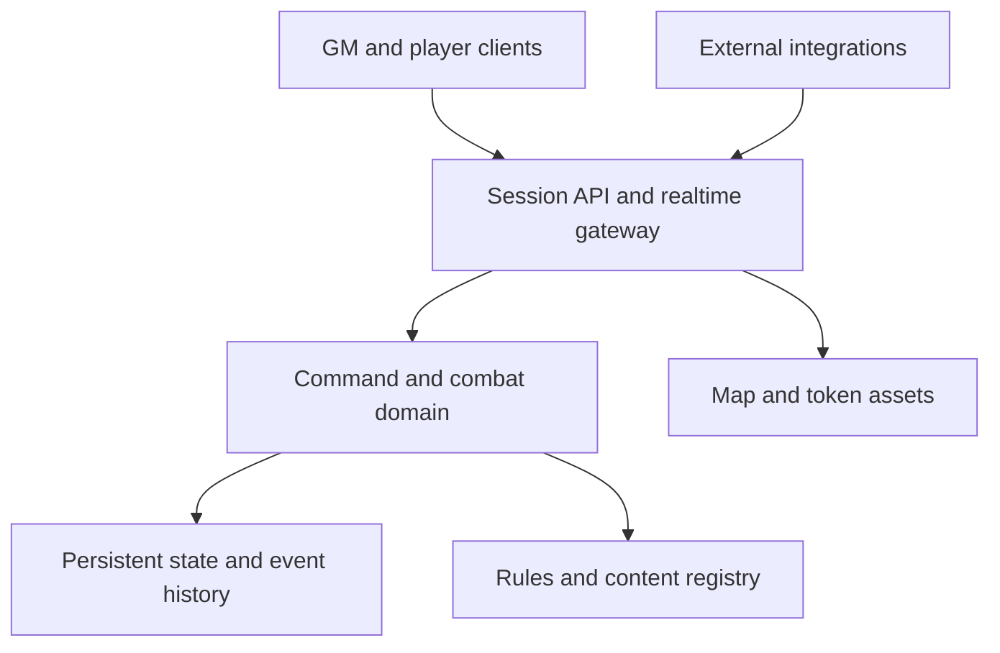
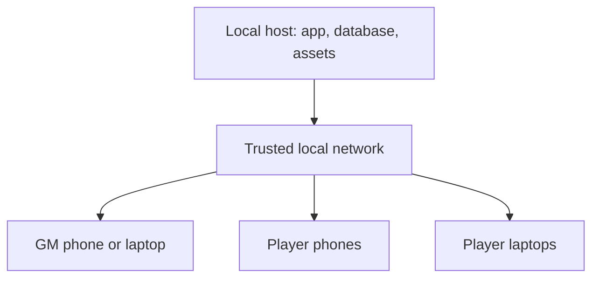

# Combat-First VTT — Comprehensive Build Plan

> A living product, design, and engineering roadmap for a private home-game virtual tabletop centered on D&D fifth-edition combat.

| Document field | Value |
| --- | --- |
| Status | Active living execution plan |
| Product stage | Phase 0/1 validation and Phase 2 testing-MVP vertical slice in progress |
| Rules baseline | System Reference Document 5.2.1 (2024 fifth-edition rules) |
| Primary use | One GM locally hosting a private home game for a small, known group |
| Distribution direction | Open-source, self-hostable application with a documented public integration API |
| Primary content path | Canonical player-character and monster JSON, with reviewed player-sheet PDF conversion through MarkItDown planned for Version 1 |
| Current checkpoint | A server-authoritative token-interaction slice extends the persisted encounter (no-setup tray, direct GM/owner drag, server grid snap, freeform gridless, hidden-token omission, public-token viewer convergence). A shared annotation layer now adds live grid-snapped measurements and AoE shapes with a full visibility model (public/gm-only/owner-only/owner-gm/gm-actor + owner-delegated movement), and these plus Initiative now reach the TV and a real-`/viewer.html` in-tab preview over Channel B. The battle-map refinement round (eye-dropdown visibility, wrench clear-all, per-shape editor, dockable Initiative, inline dice modifier + recent-roll window, configurable grid-wizard crosshair, renamed tabs) is complete and live-verified; physical multi-device validation remains next |
| Last updated | 2026-07-16 |
| Last implementation audit | 2026-07-16 |

## 1. Purpose of this document

This document is the project's durable source of truth for what should be built, why it matters, how the work should be sequenced, and how the team will know that the product is actually usable. It is intentionally broader than a feature backlog and less brittle than a line-by-line implementation specification.

It should answer five questions throughout development:

1. Does the proposed work make encounter preparation or combat execution faster and easier?
2. Is the work necessary for the core combat experience, or can a clear manual fallback cover it?
3. Does the work preserve the principle that no player or GM needs technical knowledge to operate the VTT?
4. Is the work being added at the correct milestone, with its dependencies already in place?
5. What observable result proves the work is complete?

This plan should be updated as implementation reveals better answers. Major architectural decisions should be recorded separately as Architecture Decision Records (ADRs) and linked from this document. Completed work should be checked off here only when its acceptance criteria are met.

### 1.1 Status conventions

- `[ ]` — not started
- `[~]` — started, partially implemented, or awaiting acceptance verification
- `[x]` — complete, verified against the stated acceptance criteria, and linked to evidence
- `[-]` — deliberately deferred or removed from scope
- `[!]` — blocked; the blocking condition must also appear in the open-risks table

Do not mark an umbrella item complete when only some clauses are implemented. Leave it `[~]` and name the missing clauses in the current snapshot or outcome ledger. A checkmark records an outcome, not merely code having been written.

### 1.2 Planning hierarchy

Use this order when requirements conflict:

1. The product thesis and design principles in this document
2. Recorded ADRs
3. Milestone scope and exit gates
4. Epic-level acceptance criteria
5. Individual implementation tasks

### 1.3 Living-plan update protocol

Every implementation checkpoint must update this document in the same repository change, or in the immediately following plan-only reconciliation change. The update must:

1. change the relevant milestone and detailed-work checkboxes;
2. add or revise an entry in the implementation outcome ledger;
3. record material architectural/product decisions in Section 8 and `docs/adr/`;
4. add newly discovered blockers, risks, validation gaps, or dependencies to the open-risks table;
5. update the current delivery snapshot and ordered next queue; and
6. advance `Last updated` and `Last implementation audit` when a full reconciliation is performed.

Completion evidence may be an automated test, a manual device/browser result, a schema fixture, a product proof document, an ADR, or a commit. Exit gates remain unchecked until their full multi-user/device scenario has actually been run.

### 1.4 Current delivery snapshot

This table is the fast operational view. The detailed requirements and milestone checklists remain authoritative.

| Workstream | State | Verified outcome so far | Remaining before the next gate | Evidence |
| --- | --- | --- | --- | --- |
| Repository and application shell | Active | TypeScript npm workspaces, React/Vite client, Express/Socket.IO server, locked dependencies, type/test/build commands, CI workflow, tabbed GM navigation, plain-language product voice, a shared severity-aware notice/confirm feedback system, and connecting/reconnecting/offline diagnostics with viewer error boundary exist | Add formatter/linter policy; verify protected `main` | `package.json`, `.github/workflows/ci.yml`, `apps/client/src/main.tsx`, `apps/client/src/components/feedback.tsx` |
| Identity and local hosting | Active | Host-only GM bootstrap, signed sessions, durable roster/claims, remembered recovery, authorized GM force-release, server-side individual logout, persistent revoke-all, bounded per-IP login throttling, and immediate revoked-socket disconnect exist | Full multi-client socket/browser acceptance, GM password change, stay-signed-in policy, QR/copy UI, firewall guidance, and real-phone LAN validation | `apps/server/src/auth.ts`, `apps/server/src/login-rate-limit.ts`, `apps/server/src/index.ts`, `apps/client/src/main.tsx`, ADR-001/002 |
| Renderer and responsive shell | Prototype implemented; validation active | Pixi renderer proof demonstrates grid/token rendering, pointer pan, wheel zoom, pinch zoom, high-DPI handling, and an accessible wrapper; responsive shell and touch-oriented CSS exist | Validate expected-size maps, 100 tokens, targeting/drag/multi-cell input, frame performance, and the physical-device matrix before accepting ADR-003 | `docs/product/phase-0-renderer-spike.md`, `apps/client/src/scene/` |
| Actor content contract | Version 1 draft complete | Versioned character/monster schemas and representative fixtures validate; PDF-to-Markdown-to-draft-JSON ingestion requirements are defined without changing the canonical format | Build JSON import preview/errors and live instances in Phase 2; add isolated MarkItDown extraction, reviewed character-sheet conversion, and layout fixtures in Phase 5 | `docs/product/actor-definition-v1.md`, `packages/schemas/`, `packages/test-fixtures/`, Section 11.4.1 |
| Realtime command model | Active; automated foundation implemented | Authoritative Socket.IO projections, monotonic revisions, command IDs, duplicate suppression, reconnect snapshots, verified-session presence, multi-connection accounting, disconnect grace, and safe online/reconnecting/offline actor indicators exist | Complete the live two-player Socket.IO convergence/reconnect/revocation matrix, retention fallback, and injected-disconnect browser/device tests | `apps/server/src/server.ts`, `apps/server/src/game-store.ts`, `apps/server/src/presence.ts`, `apps/server/test/presence.test.ts`, `apps/server/test/projections.test.ts` |
| Dice | Phase 0 proof complete | Server-authoritative parser/evaluator, cryptographic live rolls, deterministic tests, recipient-specific visibility, and replaceable 2D results are implemented | Connect rolls to imported actions/combat consequences and complete browser/device accessibility validation | `docs/product/phase-0-dice-spike.md`, `packages/rules-5e/`, `apps/client/src/dice/` |
| Persistence | Phase 1 foundation complete | SQLite migrations, WAL, atomic receipt/event/projection commits, idempotency, restart recovery, and periodic snapshots are verified | Backup/restore, rollback policy, bounded undo, migration backup, and production data lifecycle | ADR-006, `apps/server/src/game-store.ts`, `apps/server/test/game-store.test.ts` |
| Encounter and Initiative | Phase 2 authoritative vertical slice implemented; validation active | GM UI starts/ends a persisted battlemap encounter, accepts manual scores or server rolls, advances turns/rounds, automatically creates separate encounter-token state, supports direct GM/owner placement and movement with server snapping, persists/reconnects, and converges hidden-safe player/viewer projections after duplicate/conflicting commands. A server-authoritative annotation layer (`Annotation` on combat state) adds click-drag grid-snapped measurements and circle/cone/line/square shapes with `public`/`gm-only`/`owner-only`/`owner-gm`/`gm-actor` visibility, owner-or-GM (or delegated `movableByOthers`) move/resize/delete, and per-scope clear. Drawing now snaps live and WYSIWYG (client preview mirrors server geometry), measurements show a direction arrowhead + centered foot label and shapes a centered "{feet}ft {Shape}" label with auto-return to Select; the tool row carries an eye-dropdown default-visibility control, a wrench clear-all submenu, a per-shape editor (visibility incl. GM me+character, an owner "others can move this" toggle, delete), and a "show distance while moving a token" ruler. The Encounter/Initiative panel docks into the right of the map (zoom shifts left) or returns to the sidebar. Advantage/disadvantage are sticky d20-only toggles, roll history shows who rolled and lists recent rolls in a bounded scroll window with the modifier inline | Add targeting/multi-select/duplicate/size controls, group/reorder/skip/jump Initiative, HP/effects/actions, player End Turn, undo, movement-speed enforcement, non-medium creature footprints, and full phone/laptop three-round acceptance | `apps/server/src/annotations.ts`, `apps/server/src/encounter.ts`, `apps/server/src/token-placement.ts`, `apps/server/src/viewer-encounter.ts`, `apps/client/src/encounter/`, `apps/client/src/scene/EncounterMap.tsx`, `apps/client/src/dice/DicePanel.tsx`, encounter/token/annotation tests |
| Battle/regional/world maps | Phase 2 vertical slice implemented; validation active | GM UI and live HTTP routes upload/deduplicate validated raster maps, persist safe metadata, provide an explicit printed-grid/gridless choice, calibrate a printed square grid from one fixed 3×3 click-drag gesture with immediate aligned preview, support direct adjustments/undo/redo/third-point verification, and save gridless/regional/world distance scales. The 3×3 placement drag now shows a full-map crosshair (cursor-centered while placing, corner-centered while adjusting) and is movable/resizable before confirming; a read-only `GET .../grid` route exposes calibration to anyone already authorized to read the map's content, for client-side annotation preview math | Re-run hands-on calibration after the UX redesign; add safe display normalization/thumbnails, scene-world transforms, rendition/texture-limit handling, deletion/reference lifecycle, mobile precision validation, and later atlas/marker/note layers | `apps/client/src/maps/`, `apps/server/src/map-assets.ts`, `apps/server/src/map-catalog.ts`, `apps/server/src/map-http.ts`, focused map tests |
| Shared-table viewer | Phase 2 vertical slice implemented; validation active | Dedicated fullscreen viewer entry, pairing/revocation, persisted/SSE-convergent presentation, atomic present-current-map/pause, focus/ping/measurement controls, active-map-only bytes, and hidden-safe live Initiative plus placed public-token synchronization now work end to end. Public annotations (shapes + measurements) now reach every viewer: the Channel-B scene projection carries a player-safe `ViewerAnnotation[]` rendered by the shared `AnnotationGlyph`, so the TV and the preview show the same drawings the GM sees. The viewer screen has its own independent local zoom/pan layered over the GM's camera, and the GM's in-tab "Viewer preview" panel now hosts the *real* `/viewer.html` in a same-origin `<iframe>` (plus a "Pop out" window) authenticated by a GM-minted read-only viewer cookie session (`mintPreviewSession` + `POST /api/v1/viewer/preview-session`), so the preview is byte-identical to a paired TV and stays live | Wire player-safe fog, add per-display targeting/follow/highlight, run browser/TV/phone accessibility and 1080p/4K checks, and extend negative proof to DOM/accessibility/log/cache surfaces | `viewer.html`, `apps/client/src/viewer/`, `apps/client/src/scene/annotationGlyph.tsx`, `apps/server/src/viewer-*`, `apps/server/test/viewer-*.test.ts`, `apps/server/test/testing-mvp.test.ts`, `apps/server/test/encounter-realtime.test.ts` |
| Open integration API and open-source distribution | Phase 1 live foundation implemented; documentation coherence closed | The live server mounts `/api/v1`; shipped OpenAPI/system routes and durable named credentials support least-privilege scopes, optional binding/expiry, one-time secret display, safe list/audit, rotation, revocation, and GM UI management. The previously-undocumented `map-http.ts`/`viewer-http.ts` routers (mounted separately from `api-v1.ts`) are now fully represented in the served OpenAPI document with correct security requirements, and `viewer-http.ts`'s error/success envelopes are aligned to the shared `{ok, apiVersion, ...}` shape and `ApiErrorCodeSchema` vocabulary (additive: existing top-level response keys unchanged, so no client parsing broke) | Add safe game snapshot, shared authoritative command adapters, realtime negotiation/events, rate-limit/compatibility/quick-start conformance, and repository governance/license files | `packages/api-contract/`, `apps/server/src/api-v1.ts`, `apps/server/src/map-http.ts`, `apps/server/src/viewer-http.ts`, `apps/server/src/integration-credentials.ts`, `apps/client/src/integrations/`, Sections 9.5/16.6 |
| AI-controlled character participants | Long-term post-Version-1 goal; contracts planned | Server authority, public API DTOs, recipient projections, idempotent commands, actor ownership, scopes, audit events, and revocation are the intended foundation | Define ADR-019, agent identity/actor binding, bounded autonomy/consent, observation/action contracts, GM controls, prompt-injection defenses, conformance simulations, and provider-neutral adapter boundary | Section 16.8 and Phase 7 |

**Current milestone assessment:** The automated testing-MVP path now continues from authenticated map upload through encounter start, Initiative, direct token placement/movement/return-to-tray, calibrated or gridless server placement, safe GM/player/viewer convergence, and restart recovery. Hidden combatants and their token identity/position are omitted; the viewer receives only placed public tokens. This does not claim the Phase 2 exit gate: hands-on calibration, touch dragging, and presentation require revalidation, while fog, targeting, actor import, HP/actions, full phone/laptop/TV play, and API encounter equivalence remain mandatory.

### 1.5 Ordered next queue

This queue is derived from the milestone dependencies and is updated after each checkpoint. It does not replace the milestone plan.

1. Merge and physically re-run the Windows/LAN flow: calibrate a printed-grid and gridless map, pair/present to a separate viewer, start an encounter, drag GM and owned tokens by mouse and touch, verify grid snap and tray return, advance public/hidden turns, reload/revoke/restart, and record usability, firewall, 1080p, and TV-distance findings.
2. Add the smallest intuitive manual-fog/reveal slice and explicit token reveal/hide behavior over the same recipient-safe scene boundary; do not expose hidden geometry or identities to player/viewer payloads.
3. Complete the live two-player Socket.IO claim/presence/reconnect/revocation convergence matrix, then repeat the encounter/join/token path on one phone and one laptop.
4. Finish the Phase 1 external-integration proof by adding one recipient-safe game snapshot, one shared idempotent authoritative encounter command, one projected realtime event/resume path, and a tested quick start using existing scoped credentials.
5. Continue the minimum combat loop with canonical actor JSON import, HP/temp HP/damage/healing, conditions, targeting, generic actions, End Turn, and basic undo. AI-controlled characters remain Phase 7 and do not displace this queue.

### 1.6 Open blockers, risks, and validation gaps

There are no active hard blockers to the next queued implementation item.

| ID | Type/state | Affects | Condition | Resolution / trigger |
| --- | --- | --- | --- | --- |
| RISK-001 | Open technical risk | Packaging and persistence | Node 24 built-in `node:sqlite` remains marked release-candidate/experimental in current Node documentation | Pin the host runtime; review API status before production packaging or Node upgrades |
| GAP-001 | Open validation gap | Phase 0 and Phase 1 exit gates | No recorded physical iOS/Android and laptop LAN acceptance pass yet | Run the documented device matrix after roster/claim UI is visible |
| DEC-001 | Open decision | Packaging and support baseline | First supported host OS/deployment form is not selected | Decide before packaging work; development can continue meanwhile |
| GAP-002 | Open process gap | Delivery confidence | CI workflow exists, but branch protection and a recorded remote green run have not been verified in this plan | Verify GitHub settings and link a green run |
| GAP-003 | Resolved 2026-07-15 | Phase 0 decision gate | Accepted ADR-004/005/007/008/011/012/014 previously lacked dedicated records | Dedicated linked records now exist; proposed ADR-018 has a dedicated record and remains blocked on its extraction/packaging spike |
| GAP-004 | Open packaging gap | Production launch | Shared workspace packages currently export TypeScript source, so the supported launch uses Node's `tsx` loader even after the production client build | Add ordered shared-package compilation and runtime exports before packaging the host application |
| RISK-002 | Mitigated in current build; physical validation open | Client startup | The current production build completes without the prior 500 kB warning and its largest application chunk is about 434 kB, but startup/render responsiveness has not been measured on baseline phones | Measure on baseline phones and split scene/UI code before the performance gate if the device budget is missed |
| RISK-003 | Mitigated in current slice; full validation open | Shared-table viewer | The viewer uses separate persisted presentation state, explicit GM commands, active-map-only/no-store map authorization, and allowlisted hidden-aware Initiative/token projection; automated socket/restart proof omits GM-only token identity and position, but fog and non-payload surfaces are not implemented deeply enough for complete negative-state proof | Preserve the projection boundary; add fog fixtures plus DOM, accessibility-tree, log, and cache tests before the Phase 2 gate |
| GAP-005 | Open validation gap | Testing-MVP map/viewer/encounter slice | Automated HTTP/domain/socket/restart coverage passes, but no post-redesign physical TV/second-monitor, Windows browser, touch calibration/token drag, 1080p/4K readability, real LAN pairing, or three-round play result is recorded | Run queue item 1 after merge and log device, address, browser, calibration result, token input/snap, presentation response, encounter convergence, reload, revocation, and visibility findings here |
| GAP-006 | Open usability validation gap; prior design rejected 2026-07-16 | Grid calibration | Hands-on use found the original point/form workflow unintuitive and its overlay container could diverge from image geometry; the replacement begins with one fixed 3×3 diagonal click-drag, derives scale/position/rotation without a direction or cell-count form, previews within the exact image geometry, then offers grouped adjustments and distant-point verification, but has not yet been accepted by the user on a real map | Re-test one clean printed grid, one rotated/cropped grid, one gridless battlemap, and touch placement; iterate until the user can finish without explanation |
| DEC-002 | Open decision | Public release | Application code license, contributor policy, and treatment of separately licensed SRD/content/assets are not settled | Resolve ADR-017 and complete legal/license review before accepting public contributions or publishing a Version 1 release |
| RISK-004 | Open security/compatibility risk | Public API | An integration could bypass UI safeguards, leak private state, or become coupled to unstable internals | Put API adapters over the same command/authorization/projection layer; use scoped tokens, contract tests, explicit versions, capability discovery, and deprecation policy |

### 1.7 Implementation outcome ledger

| Date | ID | Status | Outcome | Verification / evidence | Follow-up |
| --- | --- | --- | --- | --- | --- |
| 2026-07-15 | FND-001 | Complete | Created the TypeScript workspace, React/Vite client, Express/Socket.IO authoritative server, shared packages, lockfile, and development/build commands | Local type-check and production build; `README.md`, `ARCHITECTURE.md` | Formatter/linter and packaging remain |
| 2026-07-15 | FND-002 | Partial | Implemented localhost-only GM bootstrap, bcrypt hashing, signed sessions, player session memory, LAN binding, and projected GM/player state | Auth/server source and working browser shell | Rate limiting and logout/revocation closed by FND-007; device acceptance remains |
| 2026-07-15 | SPIKE-001 | Partial | Implemented a PixiJS map/grid/token interaction proof with pan/zoom/pinch/high-DPI and accessible status output | `docs/product/phase-0-renderer-spike.md`, renderer proof source, successful type-check/build | Complete actual-device, expected-map, 100-token, targeting/drag, and performance validation before accepting ADR-003 |
| 2026-07-15 | SCHEMA-001 | Complete | Drafted and tested version 1 player-character and monster definition schemas with representative JSON fixtures | Four schema/fixture tests; schema reference and fixtures | Import UI and migrations remain |
| 2026-07-15 | SPIKE-002 | Complete/superseded | Proved command IDs, expected revisions, idempotent receipts, events, and restart persistence with JSON files | Phase 0 persistence proof document | Superseded by FND-004 without changing the command contract |
| 2026-07-15 | SPIKE-003 | Complete | Implemented authoritative dice parsing/evaluation and public, self, blind, and GM-only projections with 2D results | Twelve rules/projection tests; dice proof document | Connect to actor actions and combat state |
| 2026-07-15 | FND-003 | Partial | Added GitHub Actions validation for install, tests, type-check, and production build on pushes and pull requests | `.github/workflows/ci.yml`; local commands pass | Verify remote green run and branch protection |
| 2026-07-15 | PLAN-001 | Complete | Added easy battlemap grid calibration plus deferred regional/world atlas, scale, marker, safe Markdown, and spatial session-note requirements | Sections 18.6–18.8; roadmap placement reviewed | Implement battlemap workflow in Phase 2; atlas remains post-Version-1 |
| 2026-07-15 | FND-004 | Complete | Replaced the JSON proof with embedded SQLite migrations and atomic command receipt/event/projection persistence plus periodic snapshots | All 16 repository tests, TypeScript checks, production builds, ADR-006; GitHub checkpoint `523c8d8` | Backup/restore and undo are later Phase 1/Version 1 work |
| 2026-07-15 | FND-005 | Complete (automated scope) | Added a one-time durable three-character starter roster, player-safe available/mine/claimed projections, responsive claim/release UI, one-character-per-session enforcement, and a reliable single-server start command | 18 tests, type-check, and production builds pass; seed persistence/non-duplication and private-identifier omission are tested; a fresh server reaches its ready state | Full socket/browser and physical-device acceptance plus compiled shared-package runtime exports remain |
| 2026-07-15 | PLAN-002 | Complete | Added the required GM-orchestrated shared-table viewer for a TV/second screen, including battlemap, Initiative, public-state isolation, and remotely presented focus/pings/measurements/highlights | Product journey, role/permission model, realtime behavior, Phase 2 scope/exit gate, risk register, and release tests updated | Implement with the Phase 2 battlemap/Initiative vertical slice without displacing the current Phase 1 queue |
| 2026-07-15 | FIX-001 | Complete (automated/runtime scope) | Fixed development host/LAN browser requests failing with Express `sendFile` `NotFoundError` when no built client existed: Vite now binds to the LAN on 5173, the API safely redirects browser traffic to that development client, and startup distinguishes development versus built-client URLs | 21 tests pass, including safe IPv4/IPv6/host-header redirects; type-check/build pass; development server branch reaches ready state | User to pull and confirm host plus physical LAN device on Windows; firewall guidance added to README |
| 2026-07-15 | FIX-002 | Complete (code/build scope) | Fixed the development blank-screen crash caused by React Strict Mode cleaning up the asynchronous Pixi proof before initialization completed; renderer startup/cleanup is now race-safe and removes listeners, renderer failures stay local, and a top-level error boundary shows actionable failures | Type-check and production build pass after lifecycle fix; client bundle builds with error boundary | User to pull and confirm in the actual Windows browser; if hardware/browser initialization still fails, the page now remains usable and displays/records the exact error |
| 2026-07-15 | PLAN-003 | Complete | Promoted open-source self-hosting and a documented open integration API to foundational product requirements rather than a post-release add-on | Product principles, architecture, authorization, API contract, milestones, tests, risks, documentation, release/governance requirements, and next queue reconciled | Settle ADR-016/017 and implement the Phase 1 API foundation before broadening the domain surface |
| 2026-07-15 | PLAN-004 | Complete | Added a player-facing character-sheet PDF ingestion path that runs untrusted PDFs through isolated MarkItDown extraction and a VTT-owned reviewed Markdown-to-canonical-JSON converter | Assumptions/non-goals, architecture boundary, import journey, security, tests, Phase 5, risks, decisions, and release acceptance reconciled | Spike representative sheet layouts and packaging before accepting ADR-018; do not displace Phase 1 or the Phase 2 canonical JSON importer |
| 2026-07-15 | FND-006 | Complete (automated scope) | Centralized character-claim invariants, proved serialized simultaneous claims have exactly one winner, verified remembered player tokens and claimed ownership survive service/database restarts, and added an authorized GM force-release command and roster control | 24 tests pass; focused auth and SQLite race/recovery tests, type-check, and production build pass | Exercise two real browser clients plus restart/reconnect at the Socket.IO boundary and on the physical-device matrix |
| 2026-07-16 | FND-007 | Complete (automated/runtime scope) | Added immediate server-side GM logout, restart-safe individual and revoke-all session invalidation, bounded per-IP failed-login throttling with `429`/`Retry-After`, proactive revoked-socket disconnect, client Sign out/Revoke all controls, and legacy auth-data migration | Claude checkpoint `0f51e23`: 41 repository tests plus manual running-server logout/revoke/rate-limit/socket checks, type-check, and production build passed | GM password change and stay-signed-in policy remain; rate-limiter memory intentionally resets with the single-process host |
| 2026-07-16 | FND-008 | Complete (contract/router module scope) | Added strict runtime public API/realtime versions, scopes, success/error and command/event envelopes, explicit public DTOs, OpenAPI 3.1 system paths, and an Express `/api/v1` system router with public health/version, authorization-adapted capabilities, stable request IDs/errors, and no-store/privacy tests | Codex checkpoints `83f523a` and `3374311`: 31 tests at router completion, type-check, production build, and byte-for-byte remote verification passed | Mount router on the integrated server and implement the credential authorizer; contract compatibility/release docs remain |
| 2026-07-16 | PLAN-005 | Complete | Promoted AI agents playing assigned characters to a defined long-term goal built on the public API and ordinary participant authority rather than privileged server access | Product scope, agent journey, architecture invariants, permissions, security, tests, risks, decisions, Phase 7, and ADR-019 reconciled | Keep post-Version-1; prove human multiplayer and external API conformance first |
| 2026-07-16 | FND-009 | Complete (foundation scope) | Mounted the versioned API in the live server and added durable hashed integration credentials plus GM create/list/rotate/revoke/audit UI with one-time secret handling, expiry, optional game binding, exact-scope verification, and restart persistence | Live source integration, API/store contract tests, TypeScript checks, and production builds | Safe game resources, shared commands, realtime events, quick-start conformance, and rate-limit policy remain before the Phase 1 API exit scenario |
| 2026-07-16 | MVP-001 | Partial (automated testing-MVP scope) | Implemented the first normal-UI map-to-shared-screen vertical slice: safe raster upload/library, battlemap grid wizard, regional/world scale, LAN viewer URL, one-time pairing, fullscreen viewer, persistent/reconnecting presentation, and GM map/focus/ping/measurement controls | 19 server test files / 77 server tests and 100 tests across all workspaces, including live upload→pair→present→authorized bytes→restart recovery; full workspace type-check; two-entry Vite production build | Physical Windows/LAN/TV and mobile calibration validation; real scene/tokens/fog/Initiative; targeted displays; follow/highlight; safe rendition pipeline; OpenAPI integration |
| 2026-07-16 | FIX-003 | Complete (routing/security scope) | Confined the versioned API router's 404 envelope to `/api/v1` so it cannot swallow `/viewer` or the SPA; restricted player/viewer map reads to the explicitly presented asset and disabled shared-screen caching | Live routing and authorization assertions in `testing-mvp.test.ts`; range/ETag/no-store coverage in `map-http.test.ts` | Revalidate through the Windows development and built-client launch paths after merge |
| 2026-07-16 | MVP-002 | Partial (authoritative encounter scope) | Added persisted server-authoritative encounters and Initiative: battlemap selection, manual/server-rolled scores, stable tie sorting, editable scores, current turn, next/previous, round wrap, end, active GM/player battlemap display, hidden-safe player/viewer projections, and automatic second-screen Initiative convergence | 22 server test files / 86 server tests and 109 tests across all workspaces; live GM/player socket test covers authorization, hidden omission, map access, idempotency, revision conflict, viewer sync, and restart; full type-check and production build pass | Actor instances/tokens/fog, grouped/reordered Initiative, HP/actions/undo, full API equivalence, and physical three-round multi-device acceptance remain |
| 2026-07-16 | FIX-004 | Complete (code/automated scope); acceptance open | Replaced the failed calibration UX with one fixed 3×3 click-drag that derives square size, origin, and rotation without exposing cell counts/directions, plus immediate aligned preview, grouped direct adjustments, distant-point verification, and collapsed keyboard recovery; replaced the viewer's misleading enable-only action with an atomic present-current-map command that immediately pushes map/camera state | 22 server test files / 86 server tests and 109 tests across all workspaces; area geometry covers aligned/rotated/invalid gestures, HTTP enforces 3×3, coordinator tests cover atomic presentation, and full type-check/two-entry production build pass | User must pull and re-evaluate calibration and one-click presentation on the Windows host and separate viewer; keep GAP-006 open until accepted |
| 2026-07-16 | MVP-003 | Partial (authoritative token-interaction scope) | Added separate persisted encounter tokens created automatically in a zero-configuration tray; direct pointer drag to place/move/return; server-side calibrated-grid snap, rotated-grid keyboard movement, gridless bounds, GM-any/player-owned authorization, current-turn/fallback-initial visuals, viewer token convergence, old-encounter token preparation, and removal of the stale post-login GM password card | 23 server test files / 91 server tests and 114 tests across all workspaces; pure aligned/rotated/gridless geometry plus live claim/deny/move/duplicate/conflict/hidden omission/viewer/restart coverage; full type-check and two-entry production build pass | Physical mouse/touch/keyboard and overlapping-token validation remain; targeting, multi-select, duplicate, size/footprint, art, fog, HP/actions, and undo remain |
| 2026-07-16 | UX-000 | Complete (refinement scope) | Refined the inherited battlemap grid calibration to a single right-angle-locked 3×3 drag that confirms in one click (verification demoted to optional), and split the one-long-scroll GM screen into Table/Maps/Viewer/Setup tabs so the map is never rendered in multiple places at once | 130 server tests + 16 contract/rules/schema; live Playwright walkthrough of upload→drag→confirm and all four tabs; full type-check and production build pass | First two passes of the polish roadmap; part of PR #23 |
| 2026-07-16 | UX-001 | Complete (Pass 1 — clarity foundation) | Stripped developer jargon from every player-facing surface (removed the Phase-0 `RendererProof` panel from the home screen; rewrote `PRIVATE LAN VTT`/`SERVER-AUTHORITATIVE …`/"role boundary"/"this session"/"testing milestone" copy in plain language); added a shared `Notice` feedback primitive with success/error/info severity and correct aria roles plus a styled `ConfirmDialog`/`useConfirm` replacing `window.confirm`; added socket-lifecycle connecting/reconnecting/offline banner, in-flight/disabled states on shell buttons, a player "Leave table" control, and wrapped the shared-screen viewer in the error boundary | Client type-check, full test suite (130 server + 11 contract + 8 rules + 4 schema), and production build pass; live Playwright verification of the de-jargoned home/table screens, the styled revoke-all confirm dialog, and the player leave path | Pass 1 of the 3-pass polish roadmap; part of PR #23; player-loop (join/claim/turn) and table-surface passes follow |
| 2026-07-16 | UX-002 | Complete (Pass 2 — player core loop) | Made the player join→claim→turn loop legible with character-as-identity: a prominent "You're playing X" banner plus a "YOU" badge and strong card treatment on the owned character; per-card in-flight ("Claiming…"/"Switching…") and disabled states; plain concurrency copy; a gentle styled release/leave confirm; and one-click "Switch to this" implemented as a safe release-then-claim chain (server rejects a second claim, so the switch omits `expectedRevision` across the two commands). In the encounter panel's player view, added an "It's your turn" affordance with brief guidance, highlighted the player's own initiative row with a "YOU" badge, and clarified the hidden-turn copy | Client type-check, full test suite (130 server + 11 contract + 8 rules + 4 schema), and production build pass; live two-context Playwright run verified claim→identity banner, release-then-claim switch (Borin→Aria), and advancing turns to the highlighted "It's your turn" state | Pass 2 of the roadmap; part of PR #23; table-surface pass (shared map canvas, dice, viewer) follows |
| 2026-07-16 | UX-003 | Complete (Pass 3 — table surface, engine health, widescreen) | Widened the app shell from a fixed 900px mobile-style column to a responsive 1600px layout, and split the Table view into a map-prominent main column plus an Encounter/Dice sidebar (`.table-layout`/`.table-sidebar`) at desktop widths (user-flagged D10, folded into this pass). Extracted a shared client map module (`scene/mapImage.tsx`: `useAuthorizedMapImage`, `imagePointFromClient` via SVG CTM, `TokenGlyph`, `GridOverlay`) replacing three independently hand-rolled pixel↔image coordinate implementations and duplicated blob-fetch/token-drawing code across `EncounterMap`, `MapManager`, `ViewerControls`, and `ViewerApp` — converting the latter two from ``+overlay-`<svg>` pairs to unified `<svg><image/></svg>` elements in the process. Built on that module: pan (drag empty map space) and zoom-to-cursor (wheel + +/−/reset buttons) on the live encounter map, a movable-vs-locked token opacity cue, a "Saving move…" indicator during in-flight moves, and a fixed mouse click-to-place bug (previously only `event.detail === 0` keyboard activation placed an unplaced token; a real single click did nothing). Redesigned the dice roller with quick-roll buttons (d4–d100, Advantage/Disadvantage, a modifier stepper) alongside a collapsed custom-formula field for power users, and replaced raw enum display (`self-only`, `blind`) with plain-language visibility ("Who sees it? Everyone / Just the GM / Just me") in both the picker and roll history | Client type-check, full test suite (130 server + 11 contract + 8 rules + 4 schema), and production build pass; live Playwright verification of the widescreen table layout at 1920px, the calibration wizard against the new SVG pipeline, single-click tray placement, wheel/button zoom and drag-pan (viewBox deltas confirmed), and the quick-roll d20+modifier producing `1d20+2` in history | Pass 3 core (D7/D8, D10 folded in) complete; D9 (viewer simplification + OpenAPI/error-envelope coherence) remains before the 9-deliverable roadmap closes; part of PR #23 |
| 2026-07-16 | UX-004 | Complete (Pass 3 — D9, closes the 3-pass/9-deliverable UX roadmap) | Added a clear notice on the GM Viewer tab ("Choose a map on the Maps tab first…") explaining the previously-implicit Maps-tab-selection → Viewer-tab-tooling dependency instead of silently hiding the presentation-tools section. Folded the already-shipped but previously-undocumented `map-http.ts`/`viewer-http.ts` routers into the served `openApiDocument` (new `MAP_ASSET_PATHS`/`VIEWER_PATHS` constants, full `paths`/`components.schemas` entries, a new `viewerCookieAuth` security scheme for the `vtt_viewer_session` cookie) — these routers are mounted separately from `api-v1.ts` and had zero OpenAPI coverage before this. Aligned `viewer-http.ts`'s error envelope (previously bare `{error:{code,message,requestId}}` with a divergent code vocabulary: `unauthorized`/`revision_conflict`/`invalid_request`) and un-enveloped success responses to the shared `{ok, apiVersion, ...}` shape and `ApiErrorCodeSchema` values (`unauthenticated`/`conflict`/`validation_failed`), additively — every existing top-level response key (`pairing`, `viewer`, `viewers`, `presentation`, etc.) is preserved unchanged so no existing client parsing (`body.error.message`, `body.pairing`, ...) broke; the SSE event-stream payload is untouched since it isn't part of the request/response envelope convention | Full test suite (130 server + 12 contract + 8 rules + 4 schema, including 3 updated viewer-http assertions for the new codes/envelope and 2 new contract tests for the map-asset/viewer path security), type-check, and production build pass; live Playwright confirmed the Viewer-tab notice renders before map selection | Closes all 9 deliverables (D1-D9) plus the user-flagged D10 widescreen layout across 3 passes; PR #23 is ready for review; remaining Phase-2-gate work (physical-device validation, fog, safe game snapshot/command adapters/realtime events) is tracked separately in the snapshot table and next queue, unaffected by this refinement roadmap |
| 2026-07-16 | UX-005 | Complete (Cycle 2, Sub-pass 0/1 — roadmap recovery + blocking fixes) | Root-caused the "old UI in production" report to PR #23 having merged early (before four of its five commits landed) and recovered the orphaned D1–D10 commits onto main. Fixed the `npm start` dotfile-path 404 (`express.static`/`sendFile` with `dotfiles:"allow"` and a root-relative filename), the insecure-LAN-origin `crypto.randomUUID is not a function` crash that stuck every command in "Claiming…" (new `lib/ids.ts` `newId()` falling back to `crypto.getRandomValues`, routed through all 14 call sites), and the 3×3 grid-calibration drag rendering a rotated diamond instead of a true square (client-only bug; server-side `deriveSquareGridFromArea` was already correct). Trimmed the dice quick row to the standard D&D set (d4/d6/d8/d10/d12/d20), added a fullscreen toggle and zoom/reset control cluster to the encounter map, and fixed shared-viewer pings never expiring (`ViewerCoordinator` now schedules a re-broadcast at the soonest ping `expiresAt`) | Full test suite, type-check, and production build pass; live Playwright confirmed the recovered UI, a simulated-insecure-context claim (`crypto.randomUUID` deleted in-page), a true-square calibration drag, and a ping disappearing after 5s | Merged via PR #24 (`d27f432`); unblocked all of Cycle 2's remaining battle-map work |
| 2026-07-16 | UX-006 | Complete (Cycle 2, Sub-pass 1b/2/2b — battle-map annotations, dice toggles, viewer preview) | Added a server-authoritative annotation layer (`Annotation` in `packages/domain`: click-drag measurements and circle/cone/line/square shapes, grid-snapped server-side, per-annotation `public`/`gm-only`/`owner-only`/`owner-gm` visibility mirroring the actor-visibility → projection-filter pattern, owner-or-GM authorization, 5s expiry for measurements) with new `annotation:add/move/remove/set-visibility` socket commands and a `GET /api/v1/map-assets/:id/grid` route exposing read-only calibration for client-side live-preview math (clearly scoped as presentation-only in `mapImage.tsx`; the server always re-derives and persists the real geometry). `EncounterMap` gained a top-left tool row (Select/Measure/Circle/Cone/Line/Square), a GM-only "GM layer" visibility default, a "show distance while moving a token" toggle, and an "Enlarge map" button beside Fullscreen (both mutually exclusive, relabeling to their reverse action). The grid wizard's 3×3 placement drag now shows a full-map crosshair and is movable/resizable before confirming instead of submitting immediately. Advantage/disadvantage became sticky, mutually-exclusive, d20-only toggles consumed by the next roll, and roll history shows who rolled (`initiatorLabel`, added as an optional field so it doesn't break parsing already-persisted roll history). The shared-screen viewer got its own independent zoom/pan layered over the GM's camera, plus a GM-only movable/resizable in-tab "Viewer preview" panel fed by the same SSE stream via a new `ViewerCoordinator.connectGm()` subscriber path (read by hand through `fetch`'s `ReadableStream` since `EventSource` can't carry the GM's bearer token) | 146 server + 12 contract + 8 rules + 4 schema tests, type-check, and production build pass; live Playwright verified the grid-wizard crosshair/move/resize/confirm flow, an encounter with a placed and moved token, a live-updating measurement (snapped, whole-foot, 10 ft), placed circle/square shapes, an isolated shape's resize/move/visibility-cycle/delete controls, GM-layer defaulting new shapes to `gm-only`, and the advantage/disadvantage toggle (arm → cancel-both-on-conflict → consumed by a d20 roll) | A live-testing pass found and fixed a real bug: a shape's visibility/delete controls sat inside the same draggable SVG group, so clicks on them were swallowed as move-gesture pointer capture before their own `onClick` fired. Player-side/TV-viewer-side manual verification and Sub-pass 3 (dockable/floating Encounter panel) remain |
| 2026-07-16 | UX-007 | Complete (Cycle 3 — battle-map refinement round 2, single PR) | Root-caused and fixed the two biggest reports from live use. (1) "The table viewer/preview never shows shapes or measurements": annotations only rode Channel A (the game socket); the Channel-B viewer scene (`viewer-presentation.ts`/`viewer-encounter.ts`) carried none. Added a player-safe `ViewerAnnotation[]` (public, non-expired only) to `projectViewerEncounterScene`, carried it through `synchronizeEncounter` into the presentation projection + SSE payload, and rendered it in `ViewerApp` via a new shared `AnnotationGlyph`/`ShapeOutline` module (`scene/annotationGlyph.tsx`, `scene/annotation.css`) used identically by the encounter map and the viewer. (2) "The GM preview is stuck 'connecting' and never syncs": replaced the hand-rolled `fetch`-SSE reader in `ViewerPreviewPanel` with the *real* `/viewer.html` inside a same-origin `<iframe>` (plus a "Pop out" window), authenticated by a GM-minted read-only viewer cookie session (`ViewerAccessStore.mintPreviewSession` + `POST /api/v1/viewer/preview-session` setting the HttpOnly `vtt_viewer_session` cookie), so the preview is byte-identical to what a paired TV shows. Added WYSIWYG live grid-snapping for measurement and shape placement/sizing/movement via client preview helpers in `mapImage.tsx` that mirror the server's `measurementGeometry`/`squareGeometry`/`radialGeometry` (the server still re-derives/persists authoritatively). Measurements now render a live line + a drag-direction arrowhead + a centered whole-foot label and honor visibility (dropped the "measurements must be public" refinement); shapes render a centered "{feet}ft {Shape}" label and auto-switch the tool back to Select after placing. Extended the visibility model with `gm-actor` (GM + one chosen character via `visibleToActorId`) and a `movableByOthers` delegation flag; added `annotation:set-movable` and `annotation:clear {mine|players|all}` commands (players may only clear `mine`). Replaced the GM-layer toggle with a far-left eye-dropdown that sets the default visibility for new drawings (player: Everyone / Just me / Just me and the GM; GM: Everyone / Just me / Me + a character), added a far-right wrench submenu (GM: remove all my / all player / all shapes; player: remove all my shapes), a per-shape editor (role-appropriate visibility incl. GM me+character, an owner "others can move this" toggle, and reliable delete), and centered the tool-button glyphs (`display:grid; place-items:center`, overriding the global left-aligned `button`). Made the Encounter/Initiative panel dockable into the right side of the map (the zoom cluster shifts left; toggling returns it to the sidebar) for both GM and player. Dice now show the most-recent rolls in a bounded scrollable window and moved the modifier stepper inline, directly right of Advantage/Disadvantage. The grid wizard's alignment crosshair is now color- and opacity-configurable (preset swatches + native hex picker + opacity slider) and, after release, sits on the *opposite* (fixed) corner to help align that edge too. Renamed the GM tabs to Encounter / Map Setup / Viewer / GM Setup (ids unchanged) | 151 server + 12 contract + 8 rules + 4 schema tests (175 total), full workspace type-check, and two-entry production build all pass; an end-to-end live Playwright walkthrough (GM context + a second player context + the real `/viewer.html` inside the preview iframe, driving the map in the full-viewport "Enlarge map" overlay so gestures land on-screen) confirmed every item green: page scroll intact; tabs renamed; crosshair color/opacity controls; centered tool glyphs (glyph center within 1px of button center); live-snapped measurement line + arrowhead + "20 ft" label; live shape preview + "10ft Circle" label persisting on release with auto-switch to Select and the per-shape visibility/movable/delete editor; eye and wrench menus with the correct role-scoped options; "show distance while moving a token" rendering a live "10 ft" during a token drag; dock into the map + zoom-shift-left + undock; dice adv-row with inline modifier and a 336px `overflow:auto` roll window; the preview iframe going live and showing the placed public shape (Channel B) after the GM presses Present; and a second player context claiming a character and seeing the same public shape (Channel A projection) | One collision surfaced and fixed during verification: when the initiative panel is docked, a selected shape's editor overlapped it, so the editor now slides clear of the dock (`.encounter-map-stage.has-right-dock .encounter-shape-editor`). Physical multi-device (Windows host + TV + phone) validation of the new viewer/preview and delegation controls remains; non-medium creature footprints, movement-speed enforcement, and light/vision are still deferred as previously scoped |

## 2. Product definition

### 2.1 Product thesis

The VTT is an open-source, self-hostable combat workspace that turns a battle map plus character and monster JSON into a playable encounter with almost no configuration. It should feel closer to placing miniatures on a physical table than administering a general-purpose game platform, while exposing stable documented interfaces so other tools can participate without forking or scraping the UI.

The experience is governed by two promises:

> **It just works.**

> **Everything needed for combat, and nothing that makes combat harder to run.**

The VTT is not trying to become the most configurable platform. Its advantage should be that the GM can understand the whole product, prepare an encounter quickly, and run a session without scripts, macros, modules, data-binding knowledge, or troubleshooting rituals.

### 2.2 North-star outcome

A GM with a map image and valid character/monster JSON should be able to create and start a useful encounter in minutes. A player should be able to join from a link, immediately recognize their character and available actions, and take a normal combat turn without training.

### 2.3 Initial measurable targets

These are product targets to validate through testing, not immutable promises:

| Outcome | Initial target |
| --- | --- |
| First-time encounter setup | Under 10 minutes without documentation |
| Repeat encounter setup | Under 3 minutes when actors already exist in the library |
| Player join | Under 30 seconds from opening the host IP address to selecting a character and seeing the active scene |
| Routine turn execution | Common action reachable in one obvious interaction; normal attack resolved in no more than three primary decisions |
| Common GM correction | HP, initiative, condition, position, or roll result editable in one or two interactions |
| Reconnect recovery | Return to current authoritative state within 5 seconds under normal conditions |
| State durability | Refreshing or reopening the session loses no accepted combat action |
| Required technical setup | None for players; a single documented launch/deploy path for the GM |
| First API integration | An integrator can authenticate, discover capabilities, read a safe snapshot, submit one idempotent command, and observe its authorized event using only published documentation/examples |
| Supported PDF character import | A player unfamiliar with JSON can upload a completed supported sheet, resolve every flagged ambiguity, and obtain a canonical actor without re-entering clearly extracted fields |

### 2.4 Primary users

| User | Needs | Product response |
| --- | --- | --- |
| GM | Prepare encounters quickly, control visibility, run monsters, make rulings, correct mistakes | Full control, quick-add workflows, sensible defaults, manual override, undo, private information controls |
| Player | Join quickly, bring an existing completed character sheet, control assigned characters, and understand the current turn/actions | Direct-IP entry, character selection, reviewed PDF-to-canonical import in Phase 5, focused action tray, clear turn state, owned-token controls, readable roll outcomes |
| Shared table/display | Let players follow play from a TV or second screen without requiring personal devices | Read-only fullscreen player-safe battlemap, Initiative, and public presentation cues remotely orchestrated from the GM view |
| Self-host operator | Install, update, back up, secure, diagnose, and expose integrations without reading source code | Versioned releases, documented configuration, health/capability endpoints, migration/backup guidance, and secure defaults |
| Integrator/contributor | Connect bots, campaign tools, hardware, stream overlays, automation, importers, or alternate clients without patching core | Versioned REST/realtime contracts, OpenAPI/event schemas, scoped credentials, examples, compatibility policy, and contribution governance |
| AI-player operator (post-Version-1) | Configure an agent to portray a specific character consistently, participate socially, and take bounded game actions without receiving privileged knowledge | Structured persona/goals/relationships/tactical style, actor-bound credentials, authorized observation/action APIs, memory controls, GM pause/approve/revoke, and complete audit/replay |

The shared-table viewer is required for the minimum playable vertical slice. It is a passive display surface, not a general observer account or public spectator link. Independent observers and assistant GMs remain later candidates.

### 2.5 Operating assumptions

- The game is private and played by a known group.
- One trusted GM is authoritative for rulings and visibility.
- The initial target is approximately one GM and two to eight connected players.
- The application is locally hosted and reached directly through the host machine's IP address and port.
- The repository is intended to become publicly available for self-hosting; application code, content, examples, and assets must have explicit compatible licenses before public release.
- The supported integration path is an external documented API. Integrations do not need to run inside the server process or receive filesystem/database access.
- A player joins without an account by selecting an available character.
- Entering GM mode requires the GM password.
- The initial rules corpus is SRD 5.2.1, but imported content may include homebrew and older fifth-edition conventions.
- Character creation and level-up decisions happen elsewhere. The VTT consumes canonical character JSON and may transcribe an already-completed character-sheet PDF into a reviewed canonical JSON draft.
- Monster content is imported or supplied in curated data bundles.
- Phone and laptop clients have the same functional capabilities. Layout and interaction change responsively for the screen size and input type, but mobile is not a reduced companion experience.
- Both player and GM roles must remain operable on a phone, including battle-map interaction, actions, dice, combat management, and GM tools when authenticated.
- The GM may run a read-only viewer on a second monitor, television, projector, or separate LAN browser so players can follow the public battlemap and Initiative without individual devices.
- Combat is the center of the application. Exploration on maps is supported only where it naturally follows from the combat canvas.
- The GM's ruling always outranks the automation.
- AI-controlled characters are optional, explicitly enabled by the GM, clearly identified to the table, bound to assigned actors, and never receive authority or hidden context merely because a model can reason about it.
- An AI player's objective is to portray its configured character and collaborate with the table—not simply maximize expected combat output. Personality affects preferences and expression but never expands permissions.

### 2.6 Explicit non-goals for the initial product

The following are deliberately outside the core promise unless this plan is revised:

- A full character builder or level-up workflow; PDF ingestion transcribes an existing sheet and does not choose abilities, equipment, spells, advancements, or legal build options
- A general campaign wiki, journal, quest manager, or worldbuilding suite
- A public marketplace or commercial content storefront
- Built-in video conferencing, voice chat, or music streaming
- Three-dimensional maps or miniatures
- A general-purpose macro language or user-authored executable scripts
- A module ecosystem comparable to highly extensible VTTs
- Unrestricted in-process third-party plugins, arbitrary server-side code execution, direct database coupling, or compatibility promises for undocumented internal modules
- Complete semantic automation of every spell, class feature, feat, magic item, environmental rule, and homebrew exception
- Public SaaS billing, user accounts, organization management, or multi-tenant commercial hosting
- Automated encounter balancing as a prerequisite for running combat
- Replacing the GM's judgment about line of sight, cover, unusual movement, or ambiguous rules
- A covert autonomous agent, an AI GM, unrestricted model access to campaign files/private prompts, or an agent that can bypass consent/turn/command confirmation because it is “intelligent”

The later regional/world-map atlas and spatial session-note system described in Sections 18.6–18.8 is a bounded post-Version-1 extension, not a reversal of the initial “no general campaign wiki” constraint. Its purpose is visual, map-anchored recall rather than a general-purpose knowledge-management suite.

## 3. Product design principles

Every significant feature and UI decision should be evaluated against these principles.

### 3.1 JSON in, playable actor out

Valid imported content should produce a usable actor with derived actions and combat controls. Importing an actor should not lead to a second configuration project.

### 3.2 The common path is immediate

Common actions—selecting a token, moving, targeting, attacking, rolling a save, applying damage, applying a condition, and ending a turn—must be directly visible in context. Do not hide the normal path behind right-click menus or configuration screens.

### 3.3 Progressive disclosure

Show only the controls relevant to the selected actor and current step. Advanced details may be available, but should not compete with the next likely action.

### 3.4 Assist rather than police

The system should calculate, suggest, warn, and remember. It should rarely prevent. If the GM wants to move a token farther than its listed Speed, apply an unusual effect, alter initiative, or ignore a calculated resistance, the VTT should permit it and keep an intelligible record.

### 3.5 Automation must be explainable

Any calculated modifier or state change must expose its source. A roll should show its dice, modifier components, advantage/disadvantage state, target number when visible, and resulting outcome. Damage should show type-by-type adjustments.

### 3.6 Manual fallback is a first-class feature

Every automated subsystem needs a fast generic alternative: roll arbitrary dice, apply raw damage/healing, add a custom condition, edit HP, move a token freely, reorder initiative, add a note, or resolve an action as free text.

### 3.7 State is visible and reversible

The active turn, HP, temporary HP, conditions, concentration, used resources, movement, targets, and pending choices should be visible without opening multiple windows. Accidental changes should be undoable.

### 3.8 Defaults provide value before settings

The application should choose an appropriate default whenever it safely can. A setting is justified only when tables commonly need different behavior and the difference cannot be handled by a quick in-context choice.

### 3.9 No required code, macros, or data binding

Power-user shortcuts may exist, but the supported product path must never require users to write formulas, commands, macros, selectors, or scripts.

### 3.10 Preserve the rhythm of a tabletop game

The interface should keep attention on the map and other people. Modal sequences, animations, and confirmation prompts must be brief. Confirm only destructive or materially ambiguous actions.

### 3.11 Fail safely and specifically

Errors must identify the affected item and offer a recovery action. A bad monster entry should not prevent other actors from importing. A disconnected player should not corrupt or stall combat.

### 3.12 Accessibility is structural

The initiative tracker, action controls, dice results, and actor state must have accessible DOM representations even if the map uses canvas/WebGL. Color, animation, drag-and-drop, and hover cannot be the only ways to understand or perform a critical action.

### 3.13 Complexity budget

- Any common action requiring more than three primary decisions needs design review.
- Any feature needing several settings should be simplified, moved behind an Advanced section, or deferred.
- Any new automation must state its manual fallback.
- Any new map tool must justify permanent toolbar space.
- Any imported field that does not affect play or reference should not become visible by default.
- Any proposed plugin or macro system is presumed out of scope unless a concrete home-game need cannot be solved more simply.

### 3.14 API-first, not UI-scraping

The built-in client is one consumer of authoritative application contracts. New consequential capabilities must be expressible through typed commands/events and stable resource schemas before the UI is considered complete. Integrators must never need DOM scraping, browser automation, direct SQLite access, or imports from undocumented internal packages.

### 3.15 Open does not mean unauthenticated

“Open API” means documented, versioned, interoperable, and available to self-host operators. It does not mean every LAN or internet client receives GM authority. API credentials are scoped, expiring/revocable where appropriate, auditable, and subject to the same authorization and visibility projections as built-in clients.

### 3.16 Extensibility stays outside the trusted process by default

Prefer REST, realtime events, webhooks, import/export, and generated/client SDKs over an in-process plugin runtime. This preserves simple self-hosting and limits supply-chain/security risk. A future sandboxed plugin system requires its own threat model and explicit promotion; it is not implied by the open API.

### 3.17 AI personality is authored character direction, not permission

An AI player should make recognizable, sometimes imperfect choices consistent with its configured character rather than reduce play to tactical optimization. Persona, goals, bonds, flaws, relationships, voice, risk tolerance, tactical habits, and table etiquette shape which authorized option it prefers and how it communicates. They never grant hidden knowledge, extra actions, GM tools, or permission to ignore confirmations. The UI must make the effective persona and autonomy policy inspectable and editable without exposing provider secrets or requiring prompt engineering.

## 4. Lessons to borrow—and boundaries to preserve

The project should learn from established VTT patterns without inheriting their entire configuration surface.

| Existing pattern | Useful lesson | Application here |
| --- | --- | --- |
| Owlbear Rodeo centers the product on a shared battle-map experience, lets players join a room from a link, and supports creating a scene from a map in one workflow | Fast entry and map-first setup are product features, not merely onboarding polish | Provide immediate direct-IP player entry and a single map-to-scene flow with calibration embedded in import |
| Owlbear Rodeo separates reusable map assets from scenes | Content reuse should not require duplicating large assets | Store a map once and allow encounters/scenes to reference it |
| Foundry distinguishes reusable Actors/prototypes from placed Tokens | A reusable creature definition and a particular combat instance have different lifecycles | Separate actor definition, encounter instance, and visual token state in the domain model |
| Foundry provides distinct select, target, and measure concepts | Combat intent becomes clearer when targeting is not inferred from selection | Keep selection and targeting distinct, while making both visually obvious |
| Roll20 exposes initiative as a shared turn list and supports quick token actions | Initiative and frequent actions should be continuously available | Automatically associate imported actors/tokens with initiative and generate an action tray without requiring macros |
| Roll20's selected-token dependencies and macro surface demonstrate a common failure mode | Hidden context and required power-user syntax create avoidable errors | Resolve actions from the currently controlled actor explicitly; never require token-selection rituals or macro code |

Reference material:

- [Owlbear Rodeo: Getting Started](https://docs.owlbear.rodeo/docs/getting-started/)
- [Owlbear Rodeo: Scenes](https://docs.owlbear.rodeo/docs/scenes/)
- [Foundry VTT: Tokens](https://foundryvtt.com/article/tokens/)
- [Roll20: Turn Tracker](https://help.roll20.net/hc/en-us/articles/360039178634-Turn-Tracker)
- [Roll20: Macros and Token Actions](https://help.roll20.net/hc/en-us/articles/360037256794-Macros-Token-Actions)

## 5. Scope ladder

### 5.1 Minimum playable vertical slice

This is the smallest end-to-end product that proves the concept:

- A GM can create a room and open it from a second browser.
- A GM can import one map image and establish a usable square grid.
- A GM can import at least one player character and one monster from JSON.
- Imported actors can be placed as tokens and assigned to a player or the GM.
- Participants can select and move owned tokens.
- Combatants can roll or receive initiative, appear in order, and advance through rounds.
- Imported attacks and generic dice rolls work.
- Shared rolls appear promptly in a readable 2D dice/result presentation and the combat log.
- The roller can choose an authorized visibility mode, including a genuinely secret GM roll.
- HP, temporary HP, damage, healing, and basic conditions can be changed.
- Rolls and state changes appear to all authorized clients.
- Accepted state survives refresh and reconnect.
- The GM can override and undo common state changes.
- A scoped integration can discover server/API versions, read an authorized encounter snapshot, submit at least one idempotent combat command through the same domain path as the UI, and receive the resulting authorized event.

This slice does not need spell automation, dynamic lighting, advanced fog, walls, encounter libraries, or complete SRD content.

### 5.2 Playable alpha

The alpha adds enough speed and clarity to run a normal session:

- Contextual action tray generated from imported data
- Fast dice tray for d4, d6, d8, d10, d12, d20, d100, quantities, modifiers, and saved recent formulas
- Polished responsive 2D dice/result presentation for action rolls, manual rolls, Advantage/Disadvantage, criticals, and rerolls
- Public, GM-only, blind-to-roller, self-only, and permitted-recipient roll visibility
- Explicit targeting and multi-target selection
- Attack-versus-AC and save-versus-DC resolution
- Advantage/disadvantage controls and transparent roll breakdowns
- Typed damage with resistance, vulnerability, immunity, and manual adjustment
- Manual fog reveal/hide
- GM-hidden actors and private rolls
- Quick duplicate/add for groups of monsters
- Group or individual initiative choices
- Turn/round reminders and basic action-economy indicators
- Useful combat log, undo, autosave, and reconnect
- Clear import validation and error recovery

### 5.3 Rules-assisted beta

The beta adds structured assistance for the fifth-edition combat mechanics that most often slow play:

- Conditions and custom effects with durations
- Concentration tracking and damage-triggered check prompts
- Death saving throws and stabilization state
- Spell slots and other imported resources
- Spell targeting, area templates, upcasting inputs, duration, and concentration metadata
- Monster Multiattack, limited-use abilities, Recharge, Reactions, Bonus Actions, and Legendary Actions
- Damage composed of multiple typed parts
- Start/end-of-turn effects and repeated saves
- Movement budget and measured paths as guidance
- Cover selection and target modifiers
- Encounter templates and reusable actor/map libraries

### 5.4 Version 1 quality bar

Version 1 is not defined by automating the entire SRD. It is defined by being dependable enough for the weekly home game:

- A new encounter can be prepared quickly without developer tools.
- All common combat mechanics have either trustworthy assistance or an obvious manual fallback.
- Player-visible and GM-private information remain correctly separated.
- Refresh, reconnect, backup, restore, update, and schema migration paths are tested.
- The primary supported browsers and devices are verified.
- The core flow meets accessibility and performance targets.
- Failures produce actionable messages and diagnostics.
- The SRD attribution and content provenance are present.
- The public API, event protocol, OpenAPI/schema artifacts, authentication/scopes, error model, compatibility/deprecation policy, and integration examples match the shipped server.
- The public repository includes an approved code license, separate content/license notices, contribution/security/support guidance, reproducible builds, and no private secrets or campaign data.

### 5.5 Later candidates, not implicit commitments

- Dynamic vision, walls, doors, and lighting
- Hex, isometric, or fully gridless movement
- Automated terrain and collision
- Advanced elevation and multiple map levels
- Native iOS/Android applications; the responsive web application is the supported mobile experience
- Encounter difficulty estimates
- Additional ruleset adapters
- Import adapters for third-party character exporters
- Optional 3D tabletop dice presentation, implemented behind the replaceable dice-presentation boundary
- Public remote spectator links with independent identities/access (distinct from the required local shared-table viewer)
- Assistant GM role
- Regional and world atlas maps with configurable real-world/fantasy scales
- Clickable categorized map markers with safe Markdown notes
- Session-note and recap markers that visually locate where play occurred
- PWA/offline-first mode

## 6. Core user journeys

The following journeys are more important than any isolated feature. Each milestone should preserve them end to end.

### 6.1 First launch

**Goal:** reach a useful screen without reading setup documentation.

1. GM launches the application.
2. On first run, a localhost-only or host-displayed one-time bootstrap asks the GM to create the GM password.
3. If no game exists, the application offers one primary action: **Create game**.
4. The game receives usable defaults for rules version, measurement, visibility, and session access.
5. The application offers a short three-step path: add a map, add actors, show the host address for players.
6. Optional settings remain available but do not interrupt this path.

Acceptance criteria:

- [ ] No empty dashboard with several equally prominent choices.
- [ ] A LAN visitor cannot seize GM ownership before the host completes bootstrap.
- [ ] No ruleset configuration form before the GM can import a map.
- [ ] A sample encounter can be loaded as an optional orientation tool.
- [ ] Every first-run step can be skipped and completed later.

### 6.2 Prepare an encounter from scratch

**Goal:** go from map plus JSON to a ready encounter in minutes.

1. GM chooses **New encounter** and drops a map image.
2. The map import screen previews the image and provides a fast grid calibration workflow.
3. The GM imports or selects player actors and monsters.
4. Imported actors receive default token art, size, disposition, HP, and visible actions.
5. The GM chooses monster quantity and places tokens, with a quick auto-arrange option when useful.
6. The GM optionally covers the map with fog and reveals the starting area.
7. The GM starts the encounter, rolls or assigns initiative, and shows/copies the host address for players.

Acceptance criteria:

- [ ] Map import and scene creation are a single coherent flow.
- [ ] Previously imported actors can be found by name, type, CR, tags, and recency.
- [ ] Adding five copies of a monster does not require five imports or five forms.
- [ ] Every required value has a safe default or is derived from JSON.
- [ ] The setup screen clearly indicates missing or invalid information before combat begins.

### 6.3 Join as a player

**Goal:** enter the game from a phone or laptop with no account-administration burden.

1. Player opens the host address, such as `http://192.168.1.50:3000`, in a browser.
2. The landing page offers **Join as Player** and **Enter as GM**.
3. The player chooses **Join as Player** and sees player characters that are available to claim.
4. The player selects their character. A short display-name prompt is shown only if the character data does not provide an adequate identity or the table needs device/user distinction.
5. The server claims that character for the browser/session so another player cannot select it accidentally.
6. The player arrives at the active scene with the selected character, action tray, and active-turn state visible.

Acceptance criteria:

- [ ] Players do not need an account, invite token, email address, or room code.
- [ ] The host landing page is usable by typing/bookmarking an IP address and port.
- [ ] Available characters show enough identity—name, portrait/token, class/level or short summary—to prevent accidental selection.
- [ ] Already claimed characters are clearly marked and cannot be claimed twice through a race condition.
- [ ] Reopening the host address on the same browser restores the prior character claim when safe.
- [ ] A temporary disconnect does not immediately release a character to someone else.
- [ ] The player can deliberately release/switch character, subject to GM policy.
- [ ] The GM can release a stale claim, disconnect a client, or reassign a character.
- [ ] A character can optionally be controlled by the GM when no player has claimed it.
- [ ] The player cannot see GM-only actors, notes, hidden rolls, fogged map content, or private stat details.

### 6.3.1 Enter as GM

**Goal:** make GM entry simple while keeping GM controls unavailable to ordinary players.

1. User opens the same host IP address and chooses **Enter as GM**.
2. The application prompts for the GM password.
3. The server verifies the password and issues a GM session for that browser.
4. The GM enters the current game/scene with full controls.

Acceptance criteria:

- [ ] The GM password is created during first-run setup from the host machine/one-time local bootstrap path and can be changed by an authenticated GM.
- [ ] The server stores only a modern salted password hash, never the plaintext password.
- [x] Failed attempts are rate-limited and do not reveal whether any other session detail is valid.
- [ ] The browser can retain the GM session according to a clear “stay signed in” policy without storing the password.
- [x] The GM can sign out and revoke other GM sessions.
- [ ] A player cannot obtain GM state by changing client-side role values or calling GM endpoints directly.
- [ ] Direct-IP HTTP is treated as a trusted-LAN mode; if the IP/port is exposed outside the trusted network, the deployment guide requires a secure tunnel/VPN or TLS reverse proxy because an HTTP password/session is not protected in transit.

### 6.3.2 Present the table on a shared viewer

**Goal:** let the GM put a player-safe battle display on a TV, projector, second monitor, or separate LAN device and direct attention there without exposing the GM workspace.

1. From the GM view, the GM chooses **Open table viewer** for a local second window/display or creates a short-lived pairing/link path for a separate LAN browser.
2. The viewer opens fullscreen or presentation-ready and shows the active player-visible battlemap, visible tokens/fog state, and readable Initiative order/current turn.
3. The viewer cannot claim a character, move tokens, roll, advance turns, edit state, or request GM data.
4. From ordinary GM controls, the GM explicitly sends a map focus/viewport, location ping, measurement line/path, token/area highlight, or clear-presentation command to one or all connected viewers.
5. Viewer-only presentation overlays are ephemeral by default and do not clutter combat history; a consequential map measurement/drawing is persisted only through its normal GM command.
6. If the viewer disconnects or reloads, it receives the latest authorized scene/Initiative snapshot and current presentation state without exposing prior private GM activity.

Acceptance criteria:

- [x] Viewer mode is a separate server-authorized projection, never a CSS-hidden copy of the GM DOM/state. The current projection contains only explicit presentation state and is exercised through a dedicated `viewer.html` client.
- [~] The viewer receives only information a normal player is permitted to know, including player-safe fog, tokens, Initiative entries, and public rolls/cues. Current map/presentation DTOs plus live Initiative and placed public tokens are allowlisted, hidden combatants are omitted with only a generic GM-turn cue, and active-map bytes are authorization-gated; fog/log integration remains.
- [~] The GM can target a connected viewer and explicitly present center/follow, ping, measurement, and highlight actions from the GM view. Broadcast focus, zoom, ping, measurement, and clear are live; per-display targeting, follow, and highlight remain.
- [~] Private GM cursor movement, measurements, selections, drafts, notes, rolls, hidden tokens, secret Initiative entries, and unrevealed fog never appear unless explicitly converted into a permitted public action. The viewer does not mirror the GM DOM/cursor; map responses are active-map-only/no-store; secret Initiative entries and hidden-token identity/ID/notes/position are absent in automated projections; fog and complete non-payload fixtures remain.
- [ ] The viewer is readable at normal television distance in fullscreen 16:9 layouts and remains usable at common 1080p and 4K display sizes.
- [x] The viewer reconnects without manual presentation reconfiguration and cannot send consequential game commands. Pairing is read-only, SSE reconverges from a persisted snapshot, revocation closes live subscribers, and restart recovery is tested.
- [~] Players using phones/laptops and players watching only the shared viewer see a consistent public battle state. Automated GM/player/viewer encounter convergence now proves the same safe Initiative/current turn and active map; physical phone/laptop/TV parity remains.

### 6.3.3 Connect an external integration

**Goal:** let a self-host operator connect a bot, stream overlay, campaign tool, hardware controller, importer, or alternate client without modifying core or sharing the GM password.

1. An authenticated GM opens **Integrations**, creates a named credential, chooses the minimum scopes, and optionally sets an expiration.
2. The secret is shown once. The UI records only a safe identifier/fingerprint, name, scopes, creator, created/last-used time, and revocation state.
3. The integration calls `/api/v1/system/capabilities` and reads the advertised API, realtime protocol, schema, rules/content, and optional-feature versions.
4. It reads an authorized resource/snapshot, submits a command with a unique idempotency key and expected revision, and receives a request ID plus accepted revision/event.
5. It subscribes to authorized realtime events or a signed webhook and handles reconnect/replay according to the documented cursor/retention policy.
6. The GM audits recent use and revokes or rotates the credential without changing the GM password or restarting the game.

Acceptance criteria:

- [ ] A quick-start integration works from a clean self-host install using only published docs and examples.
- [ ] The credential cannot exceed its scopes, role/visibility policy, game/resource boundary, or expiration and cannot retrieve a GM password/session secret.
- [ ] The same command submitted through UI and API reaches the same validator/domain handler and produces equivalent events/projections.
- [ ] Retries with one idempotency key produce one mutation; stale revisions return a stable conflict error with current revision guidance.
- [ ] Secret/hidden fields are absent from unauthorized HTTP responses, realtime events, webhooks, logs, examples, and generated SDK types.
- [ ] Credential creation, use, failure, rotation, and revocation are auditable without logging the token secret.
- [ ] API/protocol compatibility and deprecation behavior are documented and contract-tested.

### 6.3.4 Configure an AI player character — post-Version-1

**Goal:** let the GM/table configure an AI participant that portrays an assigned character socially and tactically while remaining bounded, observable, and interruptible.

1. The GM creates an AI-player profile, assigns exactly the permitted actor(s), selects a provider/local-model adapter, and grants a narrow agent credential that cannot read GM-only state.
2. The table configures a structured persona: identity/background, values, temperament, goals, bonds/flaws, relationships/opinions, speaking style, humor/formality, risk tolerance, moral boundaries, tactical preferences, signature habits, knowledge limits, and topics/actions requiring human confirmation.
3. The GM chooses autonomy separately for conversation, exploration proposals, resource spending, movement, targeting, rolls, and consequential combat actions: suggest only, confirm each, confirm risky actions, or act within explicit limits.
4. On its turn or when invited to speak, the agent receives only an authorized, purpose-built observation containing visible game state, its own sheet/resources/memory, recent public events, permitted table conversation, and the current persona/autonomy policy.
5. The agent returns a typed intent plus optional in-character speech and a concise rationale tagged as persona preference, tactical assessment, goal, relationship, or uncertainty. The server validates/authorizes the intent exactly like a human/API command.
6. The GM or designated human can approve, edit, reject, pause, take over, mute speech, change persona/autonomy, or revoke the agent immediately. Every observation request, proposed intent, approval, command, and model/provider error is auditable with private reasoning excluded unless intentionally retained.
7. Between sessions, bounded character memory records only approved facts/summaries at permitted visibility; it does not ingest arbitrary campaign files, GM notes, other players' secrets, or raw provider conversations by default.

Acceptance criteria:

- [ ] The same combat state yields meaningfully different but valid choices for contrasting personas (for example cautious protector versus reckless glory-seeker), without hard-coding “optimal move” as the objective.
- [ ] Personality configuration is structured, inspectable, portable, versioned, and editable through normal UI; an advanced prompt field, if ever offered, cannot replace required permission/autonomy controls.
- [ ] Persona influences preference, dialogue, and willingness—not dice results, rules, turn order, scopes, visibility, or command authorization.
- [ ] Untrusted map notes, chat, imported text, rules text, and API/event content cannot rewrite system policy, reveal secrets, expand memory, change persona, or cause tool calls through prompt injection.
- [ ] The agent can express uncertainty, ask the table a question, defer, or take a simple safe fallback instead of fabricating game facts or stalling play.
- [ ] The table can identify that a participant is AI-controlled and see whether it is suggesting, awaiting approval, acting, paused, disconnected, or rate-limited.
- [ ] GM pause/takeover/revoke prevents further accepted commands immediately; a provider outage never blocks human turns or authoritative server progress.
- [ ] A human can replace the agent for the same actor without losing canonical character state; provider/persona changes do not mutate the actor definition unless explicitly saved as separate metadata.

### 6.4 Run a routine combat turn

**Goal:** make the next useful action obvious and keep attention on the map.

1. The active combatant and token are highlighted; the map may center on them without forcibly changing player zoom.
2. The action tray shows that actor's common Actions, Bonus Actions, Reactions, movement, and resources.
3. The player chooses an action.
4. The UI asks only for unresolved choices: target, advantage state, resource/slot, optional variant, or template placement.
5. The VTT rolls and shows an understandable result.
6. The VTT proposes damage, healing, resource usage, or effects; the authorized user/GM confirms or adjusts when needed.
7. The action and resulting state changes appear in the log.
8. The player ends the turn; unresolved reminders are shown without becoming blockers.

Acceptance criteria:

- [ ] The player is never required to open the full character JSON or edit a formula.
- [ ] The target is visually unambiguous before a state-changing result is applied.
- [ ] An action can be canceled without consuming resources or leaving partial state.
- [ ] The GM can resolve an improvised action with a generic roll and manual effect.
- [ ] Ending a turn is always available, even if action-economy indicators suggest unused options.

### 6.5 Run a group of monsters

**Goal:** keep GM workload low when several creatures are involved.

1. The initiative tracker groups or distinguishes monsters according to the GM's setup choice.
2. Selecting a monster shows the correct individual HP/resources even when actors share a definition.
3. Common actions are immediately visible.
4. Multi-target saves and repeated attacks can be resolved without reopening the action definition each time.
5. Defeated monsters can be hidden, marked, removed, or left on the map in one action.

Acceptance criteria:

- [ ] Identical monsters have unique readable labels such as Goblin A, Goblin B, and Goblin C.
- [ ] Editing one placed monster's HP does not affect the other instances.
- [ ] The GM can choose shared, rolled-individual, or manually entered initiative.
- [ ] Batch selection supports common operations without obscuring which individual is affected.

### 6.6 Recover from interruption or mistake

**Goal:** never let the tool become the crisis at the table.

1. A disconnected browser reconnects and receives the current authoritative state.
2. A mistaken damage application, movement, condition, or initiative change can be undone.
3. A server/application restart reopens the latest encounter state.
4. If an import or migration fails, the prior usable data remains intact and the error identifies the affected content.

Acceptance criteria:

- [ ] No accepted command exists only in browser memory.
- [ ] Replayed or retried network commands are idempotent.
- [ ] Undo reports exactly what it will reverse and never silently rewinds unrelated players.
- [ ] A documented backup and restore test is part of every release gate.

### 6.7 End and reuse an encounter

**Goal:** preserve useful preparation without creating administrative work.

1. GM ends or pauses the encounter.
2. The application stores the final state and a compact summary.
3. The GM can reset the encounter from its prepared baseline, duplicate it, or archive it.
4. Reusable actor definitions and map assets remain in their libraries.

Acceptance criteria:

- [ ] Resetting an encounter cannot accidentally overwrite its reusable actor definitions.
- [ ] The GM can distinguish prepared baseline, live state, and completed snapshot.
- [ ] Archiving removes clutter without deleting referenced assets unexpectedly.

## 7. Automation policy

### 7.1 Automation levels

Every mechanic should be assigned an explicit automation level. The default target is Levels 1–2.

| Level | Behavior | Example | Default posture |
| --- | --- | --- | --- |
| 0 — Reference | Display source data or rule text only | Show an unusual feature description | Always available as fallback |
| 1 — Calculate | Compute a transparent value without changing state | Roll an attack and compare it with visible AC | Preferred for deterministic math |
| 2 — Propose | Prepare a state change for confirmation/adjustment | Propose typed damage after a hit | Preferred for consequential outcomes |
| 3 — Apply | Automatically perform a predictable, reversible transition | Advance a round after the last turn | Use selectively |
| 4 — Enforce | Prevent actions that violate modeled rules | Block movement beyond Speed | Avoid in the core product |

### 7.2 Rules for adding automation

- [ ] Cite the relevant SRD rule or data definition in the implementation/test.
- [ ] Define the source data needed for the automation.
- [ ] Define behavior when that data is missing or contradictory.
- [ ] Provide an obvious manual fallback.
- [ ] Show the calculation or reason to the user.
- [ ] Make consequential state changes reversible.
- [ ] Test specific-rule-overrides-general-rule behavior.
- [ ] Avoid automation that requires interpreting arbitrary natural-language rules at runtime.

### 7.3 Structured core, text fallback

Imported actions and spells should contain structured fields for common, deterministic operations and retain human-readable text for everything else. The UI can automate the structured portion and display the remaining text beside it. Unsupported mechanics must never make the whole action unusable.

## 8. Product and architecture decisions to record

Create one ADR per material decision. Status here must match `docs/adr/README.md`; accepted index entries still need a dedicated record before the Phase 0 exit gate if no numbered file exists yet.

| ADR | Decision | Status | Current direction | Must be settled by |
| --- | --- | --- | --- | --- |
| ADR-001 | Product platform | Accepted | Browser-based application with full phone/desktop functional parity and responsive role-specific layouts | Recorded |
| ADR-002 | Hosting topology | Accepted | Locally hosted, single authoritative server reached by host IP and port; package as one simple service with persistent local data | Recorded |
| ADR-003 | Client renderer | Proposed / spike active | Evaluate PixiJS through actual-device, representative-map, 100-token, input, and performance tests | End of technical spikes |
| ADR-004 | Application language/stack | Accepted | TypeScript end to end with React/Vite, Express, Socket.IO, and embedded SQLite | Recorded |
| ADR-005 | Realtime protocol | Accepted | Server-authoritative Socket.IO command/event flow with reconnect snapshots and recipient-specific projections | Recorded |
| ADR-006 | Persistence | Accepted 2026-07-15 | Embedded SQLite for structured state, command receipts, events, migrations, and snapshots; filesystem storage for uploaded assets | Recorded |
| ADR-007 | Canonical content format | Accepted | Versioned, documented JSON schemas with extension fields, fixtures, and adapters | Recorded |
| ADR-008 | Rules representation | Accepted | Typed declarative operations plus inert text fallback; never evaluate imported JavaScript | Recorded |
| ADR-009 | Grid baseline | Proposed | Square grid with five-foot cells for MVP; diagonal and occupied-cell conventions await measurement tests | Before movement/measurement tests |
| ADR-010 | Fog and vision | Proposed | Manual fog for alpha; dynamic walls/vision remain a separate later epic | Before map tool implementation |
| ADR-011 | Identity | Accepted | Same direct-IP landing page; accountless player character claims; password-authenticated GM role; one claimed character per player session for the MVP | Recorded |
| ADR-012 | Dice authority and presentation | Accepted | Server-generated and recorded rolls; authorized 2D presentation; immutable formula/faces/modifiers/result/visibility/provenance | Recorded |
| ADR-013 | State history | Proposed / partial foundation | Transactional command/event log and periodic snapshots exist; bounded undo remains undecided/unfinished | Before combat mutations |
| ADR-014 | Device support | Accepted requirement / baseline pending | Functional phone/desktop parity with responsive/touch-specific UX; exact supported browser versions remain open | Dedicated record exists; browser baseline due before Phase 1 exit |
| ADR-015 | SRD content packaging | Proposed | Curated, normalized, versioned content bundle separate from executable code; never parse source documents at runtime | Before bulk monster conversion |
| ADR-016 | Public integration API | Proposed / foundational | Versioned REST resources plus documented realtime commands/events over the same authoritative domain boundary; OpenAPI, capability discovery, scoped tokens, and later signed webhooks | Before the next Phase 1 domain endpoints |
| ADR-017 | Open-source distribution and governance | Proposed | Public self-hostable repository with explicit code/content licenses, contribution/security policy, reproducible releases, and no bundled private data | Before accepting public contributions or public release |
| ADR-018 | Character-sheet PDF ingestion | Proposed | Treat MarkItDown as an isolated, version-pinned extraction adapter; convert its Markdown with a VTT-owned deterministic parser into a reviewable canonical JSON draft, never directly into live actor state | Before Phase 5 PDF importer implementation |
| ADR-019 | AI-controlled character participants and persona policy | Proposed / long-term | Provider-neutral external agent clients use actor-bound scoped credentials, structured persona/memory/autonomy, recipient-safe observations, typed intents, ordinary commands, and immediate human control | Before Phase 7 implementation; foundational DTO/permission seams reviewed during API work |

### 8.1 Technical spikes

- [~] Render a large map with smooth pan/zoom and at least 100 tokens. Pan/zoom proof exists; representative large-map and 100-token validation remain.
- [~] Exercise pointer, mouse, trackpad, and touch input on the candidate renderer. Pointer, wheel, and pinch paths exist; device-matrix validation remains.
- [~] Test grid overlay, coordinate conversion, snapping, multi-cell tokens, and high-DPI scaling. Grid and high-DPI proof exists; conversion/snapping/multi-cell validation remains.
- [~] Test selection, independent targeting, marquee selection, drag movement, and waypoint measurement. Selection proof exists; the other interactions remain.
- [ ] Validate map image limits across supported browsers and decide whether oversized images must be tiled/downsampled.
- [ ] Synchronize token movement and HP between GM and player browsers through the candidate realtime design.
- [ ] Disconnect/reconnect during several simultaneous state changes and verify convergence.
- [x] Validate a versioned player-character and monster schema with representative fixtures. Actionable import-UI error presentation remains a Phase 2 workflow.
- [ ] Exercise action resolution containing an attack, multiple typed damage components, a save, and an applied condition.
- [ ] Prototype the core combat layout at desktop and tablet widths before committing to component structure.
- [ ] Prototype every core combat workflow at narrow phone portrait, phone landscape, tablet, and desktop widths; reject any architecture that requires a reduced mobile feature set.
- [ ] Verify direct-IP discovery/startup: bind to the LAN interface, display usable host URLs, and connect from iOS and Android devices on the same network.
- [ ] Prototype an external integration that obtains a scoped token, discovers API/protocol capabilities, reads a recipient-safe snapshot, submits an idempotent command, and receives its authorized event without importing server internals.
- [ ] Run pinned MarkItDown against representative digitally generated, table-heavy, multi-page, malformed, encrypted, and scanned character-sheet PDFs; record extraction quality, runtime/memory, packaging size, offline behavior, and fields requiring OCR or manual review.
- [ ] After Version 1, prototype two deterministic fake agents with contrasting structured personas against the same encounter; verify different valid preferences, actor-bound visibility/authority, prompt-injection resistance, bounded timing, pause/takeover/revoke, and provider-neutral observation/intent contracts before selecting any model provider.

Exit gate: no unresolved renderer, networking, persistence, schema, API security, or compatibility risk can plausibly invalidate the first vertical slice.

## 9. Conceptual architecture

The system should be modular enough to test rules without a browser and to change rendering or hosting choices without rewriting the combat domain.



### 9.1 Recommended boundaries

| Boundary | Responsibility | Must not own |
| --- | --- | --- |
| Scene client | Render map state, collect intent, display projections, support accessible controls | Authoritative HP, dice, permissions, or rule outcomes |
| Session/realtime layer | Authenticate participant, accept commands, broadcast authorized state, handle presence/reconnect | UI-specific state or content parsing |
| Public API adapter | Validate/version external requests, authenticate scoped credentials, map resources to commands/queries/events, publish documentation | Separate business rules, privileged database access, or bypasses around domain authorization/projections |
| Combat domain | Validate commands, resolve deterministic rules, create events, maintain invariants | Browser rendering, database-specific queries, arbitrary imported code |
| Rules/content registry | Provide ruleset version, actor/action definitions, schema validation, source/provenance metadata | Live encounter state |
| Persistence | Transactions, migrations, snapshots, event history, backups | Rule interpretation |
| Asset service | Validate, store, transform, and serve maps/token images | Actor statistics or encounter logic |

### 9.2 Command-to-result flow

1. A client submits an intent such as `MoveToken`, `RollAction`, `ApplyDamage`, or `EndTurn` with a unique command ID and expected state revision.
2. The server verifies participant authority, current entity revisions, and structurally valid inputs.
3. The combat domain calculates or proposes the result using the encounter's pinned ruleset/content versions.
4. Consequential proposals that need human confirmation return a preview rather than mutating state.
5. Accepted mutations are written transactionally as domain events and update the current projection.
6. Authorized projections are broadcast to each client; GM and player payloads may differ.
7. Clients reconcile optimistic visual changes, display the result, and retain no private authoritative state.

### 9.3 Architectural invariants

- Live game state must never exist only in canvas objects or React/component state.
- Every entity uses a stable opaque ID; display names are never keys.
- A command may be retried without being applied twice.
- Every accepted state-changing command produces an auditable event.
- Every connected client can reconstruct its authorized view from a snapshot plus later events.
- Ruleset and schema versions are pinned to saved content/encounters and migrated deliberately.
- Imported rich text is inert and sanitized.
- Extracted PDF/Markdown content is untrusted evidence, not canonical state; only schema-valid fields explicitly accepted through the import review may enter an actor definition.
- Derived values identify their inputs and allow explicit override where the product permits it.
- The player's projection excludes hidden information at the server boundary; hiding only with CSS is unacceptable.
- Built-in clients and external integrations reach consequential behavior through the same command handlers, authorization policy, idempotency rules, and recipient projections.
- Public contracts are versioned independently from internal file/package layout; an internal refactor must not silently change the integration API.
- Capability discovery identifies API version, realtime protocol version, rules/content/schema versions, enabled optional features, and instance limits without revealing secrets.

### 9.4 Suggested repository shape

Confirm this in ADR-004 before scaffolding:

```text
apps/
  web/                 Browser UI and scene renderer
  server/              HTTP, realtime gateway, persistence adapters
packages/
  domain/              Commands, events, entities, invariants
  rules-5e/            SRD 5.2.1 calculations and rule helpers
  schemas/             Versioned JSON Schema and generated types
  character-import/    Deterministic Markdown-to-canonical-character conversion, confidence/provenance, and golden fixtures
  api-contract/        OpenAPI, realtime command/event schemas, error/scopes/capability contracts
  sdk-typescript/      Thin generated/handwritten client built only on public contracts
  content-srd-5.2.1/   Curated SRD-derived data and attribution
  ui/                  Shared accessible UI components
  test-fixtures/       Actors, maps, encounters, golden outcomes
docs/
  adr/                 Architecture Decision Records
  product/             Wireframes, usability findings, glossary
  api/                 Authentication, quick start, resource/event guides, examples, compatibility policy
```

Avoid creating packages simply to match this diagram. Each package should have a real dependency boundary and independent test value.

### 9.5 Public API architecture baseline

- REST is the durable request/query surface; Socket.IO/WebSocket is the low-latency command/event surface. Both expose versioned public contracts and converge on the same domain services.
- Begin with `/api/v1`. A version belongs in every OpenAPI document, realtime handshake, command envelope, event envelope, webhook payload, export manifest, and SDK release.
- Publish an OpenAPI 3.1 document for HTTP. Maintain machine-readable schemas for realtime commands/events; evaluate AsyncAPI only if it remains simpler than the protocol it documents.
- Public resource representations use stable opaque IDs, ISO timestamps, explicit schema versions, predictable pagination/filtering, and links/identifiers rather than database row shapes.
- State-changing HTTP and realtime requests carry a client command/idempotency key and expected revision when conflicts matter. Accepted commands return the authoritative revision/event identity.
- Queries and events are always projected for the authenticated principal. “Read game” does not imply “read GM secrets”; scope and role/visibility are separate checks.
- The built-in UI may use optimized endpoints, but any endpoint designated internal must be namespaced/documented as unsupported. Core feature completion requires a supported external path or an explicit exception.
- API errors use one stable envelope containing machine code, human message, request ID, optional field issues, current revision/conflict data, and documentation link. Stack traces and secrets never cross the boundary.
- Long-running imports/asset transforms use job resources with progress, partial failures, cancellation policy, and resulting IDs rather than holding one request open indefinitely.
- Uploaded binary assets use the same validation, normalization, size limits, ownership, and reference lifecycle as UI uploads; API access never exposes arbitrary filesystem paths.

## 10. Canonical domain model

The exact schema remains an implementation task, but the following concepts must be represented explicitly.

### 10.1 Core entities

| Entity | Purpose | Important relationships/state |
| --- | --- | --- |
| Game | Long-lived container for the home game | Ruleset defaults, participant identities, reusable libraries, encounters |
| Room/Session | Current connection and visibility context | Player/GM sessions, character claims, connected participants, active scene/encounter, presence |
| Participant | A connected human identity | Role, assigned actors, session status, preferences |
| Ruleset | Versioned mechanics and vocabulary | `srd-5.2.1`, units, automation capabilities, attribution |
| Content source | Provenance and license for imported/curated data | Source name/version, attribution, import timestamp, adapter |
| Actor definition | Reusable character, monster, NPC, or summon template | Statistics, actions, resources, effects, art defaults, source data |
| Actor instance | Mutable incarnation of an actor in play | Current/max HP, temporary HP, resources, conditions/effects, overrides |
| Token | Visual placement of an actor instance in a scene | Position, size, elevation, rotation, visibility, art, disposition |
| Action definition | An available Action, Bonus Action, Reaction, trait activation, spell, or generic operation | Activation type, targeting, rolls, costs, outcomes, text fallback |
| Resource definition/instance | Limited-use value | Maximum/current, reset cadence, source, consumption history |
| Effect definition | Reusable description of a condition/buff/debuff | Modifiers, stacking rule, default timing, icon |
| Effect instance | A particular applied effect | Source, target, start, duration, expiry trigger, concentration link, visibility |
| Map asset | Reusable image content | File metadata, dimensions, checksum, thumbnails, source |
| Atlas map | Regional/world spatial workspace separate from combat scenes | Map asset, configurable scale, image-local coordinates, marker layers, optional later geographic calibration |
| Map marker | Clickable point or area anchored to a battle/regional/world map | Position, category/icon, title, visibility, tags, linked notes/entities/session records |
| Markdown note | Inert, sanitized authored content | Source Markdown, rendered projection, attachments/links, revisions, author/timestamps, visibility |
| Session record | Notes and recap for one session or a portion of one | Date/title, Markdown notes, participants, linked encounters, one or more spatial markers |
| Scene | Shared spatial workspace | Map references, grid, fog, drawings, token references, viewport defaults |
| Encounter | Prepared and/or live combat | Scene, baseline roster, state, round, initiative, ruleset version |
| Combatant | Actor instance's participation in initiative | Initiative value, tie-break, current turn, group, visibility, defeated status |
| Target set | Explicit targets for a pending or completed action | Actor/token IDs, selection method, template relation, GM adjustments |
| Roll | Immutable die resolution | Formula/AST, individual dice, modifiers, advantage state, visibility, actor/action, result |
| Damage/healing packet | One or more proposed/applied health components | Amount, type, source, mitigation, temp HP interaction, target result |
| Command | Requested intent | ID, actor, participant, expected revision, parameters, timestamp |
| Domain event | Accepted fact | Sequence, command link, before/after summary, visibility, undo relation |
| Snapshot | Restorable state checkpoint | Encounter revision, event cursor, schema versions, creation reason |
| Import job | Traceable content ingestion | Uploader/authority, source checksum/type, extractor/parser/schema versions, bounded job status, extracted Markdown retention, field provenance/confidence, draft JSON, review decisions, warnings, failures, resulting actor ID |

### 10.2 Actor definition, actor instance, and token separation

This distinction is essential:

- **Actor definition:** “Goblin Warrior” as reusable source data.
- **Actor instance:** “Goblin B in this encounter,” with 3 HP, one applied condition, and a spent resource.
- **Token:** where Goblin B appears on this scene, its displayed art/label, and whether players can see it.

For persistent player characters, an actor instance may remain linked across encounters. For generic monsters, each placement normally creates an independent instance from the definition. Updating a reusable definition must never silently rewrite live combat state.

Decisions to document:

- [ ] Define when a definition update is offered to existing instances.
- [ ] Define whether completed encounter instances remain immutable historical records.
- [ ] Define reset behavior for persistent player resources between encounters.
- [ ] Define how summons and transformations reference or replace actor definitions.
- [ ] Define token removal versus actor defeat versus actor deletion.

### 10.3 Value provenance and overrides

For important derived values such as AC, attack bonus, save DC, Initiative, Speed, and maximum HP, record:

- canonical input values;
- calculation/rule version;
- calculated result;
- optional explicit override;
- visible explanation of which value is active.

An override should survive refresh and export. It should be removable without destroying the original inputs.

### 10.4 Effect and timing model

Effects cannot be represented as icon-only flags. An effect instance may need:

- source actor/action and target actor;
- formal condition(s) and free-text note;
- start round/turn and application event;
- duration expressed in rounds, minutes, until a named turn boundary, until a save succeeds, while in an area, or manual;
- whether expiry occurs at the start or end of the source's or target's turn;
- repeat-save timing and DC;
- concentration owner;
- stacking/refresh behavior;
- visibility;
- optional structured modifiers;
- manual expiry.

Build a generic timing engine before special-casing individual spells. Unsupported timing must fall back to a visible reminder and manual removal.

### 10.5 Ruleset pinning

An encounter should record the ruleset and content versions used when it was prepared. Importing a later SRD/content version must not mutate a live or completed encounter unexpectedly. Provide explicit upgrade/preview tooling later rather than transparent background conversion.

## 11. JSON content and import pipeline

JSON import is a primary product surface, not a developer utility.

### 11.1 Canonical schema families

Create documented, versioned schemas for at least:

- `actor-character`
- `actor-monster`
- `action`
- `spell`
- `effect`
- `item/resource` where needed for combat
- `encounter-template`
- `content-bundle`

Use JSON Schema for validation and generate application types from the canonical source where practical. Every document needs a schema identifier and version.

### 11.2 Minimum actor coverage

The canonical actor model must be able to represent:

- name, type/category, size, alignment/reference tags, source/provenance;
- ability scores and modifiers;
- proficiency bonus and level or Challenge Rating where relevant;
- Armor Class, maximum/current HP defaults, Hit Dice/reference HP formula;
- initiative bonus and optional fixed/default Initiative value;
- Speed modes and special movement notes;
- saving throws and skill proficiencies/expertise;
- senses, passive Perception, languages, and communication modes;
- damage vulnerabilities, resistances, and immunities;
- condition immunities;
- traits and always-on effects;
- Actions, Bonus Actions, Reactions, Legendary Actions, and other timed options;
- Multiattack and action grouping;
- limited-use and Recharge mechanics;
- attack rolls, save DCs, ranges/reach, target counts, typed damage/healing components, and conditions;
- spells, spell attacks/save DCs, slots or per-day uses, concentration, duration, and components as reference;
- player resources such as class/feature uses when supplied;
- token art, footprint, disposition, label preferences, and optional vision metadata;
- human-readable text for any mechanic not structurally automated.

### 11.3 Formula safety

- [x] Define a small bounded dice-expression grammar and parsed representation.
- [~] Support common arithmetic and labeled modifiers needed by imported content. Signed integer modifiers work; labels remain outside the proof.
- [x] Reject unrecognized operators and unsupported die sizes with specific errors.
- [x] Never pass imported formulas to `eval`, `Function`, shell commands, templates with code execution, or database expressions.
- [x] Preserve the original and normalized formula for display and persistence.
- [x] Add deterministic parsing and evaluation tests, including malformed and bounded-input cases.

### 11.4 Import experience

The normal import flow should be:

1. Drop/select one JSON file or content bundle.
2. Detect the schema or offer a small adapter choice when detection is ambiguous.
3. Validate the whole document and each contained actor independently.
4. Show an import summary: new items, updates, duplicates, warnings, and failures.
5. Preview the actor as it will appear in combat, including actions and token defaults.
6. Let the user import valid items even if another item fails.
7. Offer direct, human-readable corrections or a downloadable error report for structural failures.

Error messages should look like “Goblin Warrior → Actions → Scimitar → damage formula is missing a die size,” not a parser stack trace or raw schema pointer alone.

### 11.4.1 Player character-sheet PDF ingestion

This is an alternate input adapter for completed character sheets, not a character builder and not a second canonical format. The durable output remains the same versioned `actor-character` JSON accepted by the normal importer.

The intended flow is:

1. A player or GM selects a PDF character sheet from phone or desktop and sees file-size/page/encryption guidance before upload.
2. The server validates the file signature, records a checksum, and creates a bounded import job; a filename or `.pdf` extension alone is never trusted.
3. A version-pinned MarkItDown adapter extracts the PDF into inert Markdown inside an isolated temporary workspace with network access disabled, execution timeout, memory/page/output limits, and guaranteed cleanup.
4. The VTT-owned character converter parses labels, tables, checkboxes, repeated sections, and text from the extracted Markdown into field candidates. It records source spans, parser rule/version, confidence, warnings, and unresolved alternatives for each candidate.
5. Candidates are normalized into a draft canonical character JSON document and validated with the same schema used for direct JSON imports. Extraction/parser output never bypasses canonical validation.
6. The player reviews the draft in a side-by-side or field-focused correction wizard. Required, contradictory, low-confidence, and ruleset-ambiguous values must be confirmed; the UI never silently invents missing character choices.
7. The GM approves creation or update according to the settled table policy. Approval creates a new actor definition or shows an explicit field-level update diff; it never silently overwrites a live actor instance.
8. The import job retains sufficient provenance for diagnosis/re-import while following a documented local retention/deletion policy for the original PDF and extracted Markdown.

Initial conversion scope should cover identity, level/classes, ancestry/species text, ability scores, proficiency bonus, saves, skills, AC, HP, Hit Dice, initiative, Speed, senses, proficiencies/languages, attacks, spellcasting values/slots, resources, equipment/reference text, features/traits, and spells when the sheet exposes them. Unsupported layout fragments remain visible text or warnings rather than fabricated structured mechanics.

Requirements and guardrails:

- [ ] Accept PDF only for the first document adapter; direct canonical JSON remains available and authoritative.
- [ ] Provide clear states for queued, extracting, converting, awaiting review, approved, partially imported, failed, canceled, and expired jobs.
- [ ] Pin and report MarkItDown plus converter versions; golden fixtures must reveal extraction drift during upgrades.
- [ ] Treat scanned/image-only sheets as an explicit unsupported/warning case until an offline, bounded OCR decision is recorded. Never imply that an empty extraction is a valid empty character.
- [ ] Do not call a hosted AI service, fetch remote resources, execute embedded PDF content, or send private sheets off the self-hosted machine by default.
- [ ] Keep raw Markdown inert. Strip/neutralize HTML, links, embedded files, scripts, forms, actions, and unsafe URI schemes before preview.
- [ ] Enforce compressed/input size, page count, decompressed/output size, nesting, CPU, memory, and wall-clock limits; malformed/encrypted/password-protected files fail safely and do not block the game server.
- [ ] Run extraction/conversion outside the authoritative combat command path. Slow or failed imports cannot delay rolls, movement, autosave, realtime broadcasts, or shutdown recovery.
- [ ] Show every normalized/defaulted value and preserve field-level provenance so users can distinguish extracted, inferred, manually corrected, and unavailable data.
- [ ] A player can create/update only the character allowed by the final authorization policy; they cannot use an import to claim another actor, gain GM authority, or inject hidden content.
- [ ] Original PDF and extracted Markdown retention is configurable and clearly disclosed; deletion removes temporary copies and does not break the approved canonical actor.
- [ ] Phone users can upload, review required corrections, save progress, and resume the import without losing the draft.
- [ ] The public API eventually exposes the same bounded import-job lifecycle and safe result DTOs without filesystem paths or raw private documents unless explicitly authorized.

Acceptance criteria:

- [ ] Representative supported sheets produce schema-valid drafts with all required low-confidence/ambiguous fields visibly flagged.
- [ ] A user unfamiliar with JSON can upload, correct, approve, and claim a supported completed sheet without developer tools.
- [ ] Re-running the same PDF with the same extractor/converter versions is deterministic and does not create a duplicate without an explicit choice.
- [ ] Updating an existing character shows a field diff and cannot mutate current HP/resources or a live encounter silently.
- [ ] Corrupt, encrypted, oversized, image-only, adversarial, or unsupported-layout PDFs produce actionable errors and leave no partial actor or orphaned temporary file.
- [ ] Fixture, logs, diagnostics, API responses, and player projections contain no raw PDF/Markdown or personal filesystem path unless that principal explicitly requests an authorized import detail.

### 11.5 Validation severity

| Severity | Meaning | Behavior |
| --- | --- | --- |
| Error | Item cannot function safely | Do not import that item; identify exact path and correction |
| Warning | Item is usable with reduced automation | Import with visible warning and text/manual fallback |
| Information | A default or normalization was applied | Import and disclose in summary |

### 11.6 Unknown and extension data

Provide a namespaced `extensions` area or equivalent so homebrew/import adapters can retain data the core product does not understand. Unknown fields must not execute or silently influence rules. Round-trip export should preserve safe unknown extension data when possible.

### 11.7 Duplicate and update strategy

- [ ] Define stable source IDs distinct from local IDs.
- [ ] Detect exact duplicates by source ID/version and likely duplicates by name/source.
- [ ] Offer Skip, Import as copy, or Update definition.
- [ ] Preview changed fields before updating.
- [ ] Never update live actor instances silently.
- [ ] Record source version, importer version, and import timestamp.
- [ ] Preserve local art or labels when updating data unless explicitly replaced.

### 11.8 Bulk SRD conversion

The supplied SRD extraction is source material, not a runtime database. Build a one-time or repeatable curation pipeline that:

- identifies discrete monsters, spells, conditions, actions, and reference terms;
- converts them into canonical schema documents;
- reports ambiguous or unparsed text for manual review;
- validates every generated document;
- compares counts and required fields with the source;
- assigns source page/section metadata;
- runs representative golden tests;
- produces a versioned content bundle with required attribution.

Do not promise perfect automatic conversion from the extracted Markdown. Its tables and columns contain extraction artifacts. Prefer a controlled transform plus human QA for the subset actually used.

### 11.9 Import/export and data ownership

- [ ] Export individual actor definitions in the canonical JSON format.
- [ ] Export/import content bundles with a manifest and schema versions.
- [ ] Export a complete private-game backup including structured state and referenced assets.
- [ ] Support restore preview before overwriting current state.
- [ ] Document which IDs remain stable across export/import.
- [ ] Include content source/license metadata in exported bundles.
- [ ] Add migrations and fixture tests for every schema version change.

## 12. Battle map and scene subsystem

### 12.1 Map import and lifecycle

- [~] Accept standard image formats for battle, regional, and world maps through one shared upload path. The live path supports content-validated PNG, JPEG/JPG, WebP, non-animated GIF, and BMP; safe AVIF, HEIF/HEIC, TIFF, and SVG decode/rasterization remain.
- [ ] Normalize uploaded maps into safe internal display renditions; rasterize/sanitize SVG, flatten or explicitly select a frame for animated formats, and preserve the original file separately when feasible.
- [x] Validate type from file contents, not only extension.
- [~] Extract dimensions, calculate checksum, and create thumbnails/previews. Dimensions, content hash/ID, atomic originals, and browser previews exist; derived thumbnails/renditions remain.
- [ ] Detect browser/GPU texture limits and downsample or tile oversized maps safely.
- [ ] Keep the original asset when feasible and store derived display assets separately.
- [ ] Create a scene from a newly imported map in the same workflow.
- [ ] Allow blank scenes for sketching or theater-of-the-mind combat.
- [ ] Lock map transforms during play by default.
- [~] Reuse one map asset across multiple scenes/encounters. Content-addressed upload deduplication and a durable map library exist; scene/encounter references are not implemented yet.
- [ ] Prevent asset deletion while still referenced, or explain and repair references.

### 12.2 Grid calibration

The exact calibration interaction requires a prototype. The delivered workflow must cover:

- gridless images;
- maps with a printed square grid;
- grid cell size and X/Y offset;
- rectangular source images and cropped borders;
- visible preview at multiple zoom levels;
- adjustable grid color/opacity;
- snap on/off;
- measurement unit and distance per cell;
- correction after scene creation without destroying token positions;
- optional assisted grid detection only if it is reliable and easy to override.

Initial recommendation: support square grids only in the first vertical slice; make coordinate and measurement abstractions capable of adding hex/gridless modes later.

### 12.2.1 Easy battlemap grid wizard

Grid calibration is required product functionality, not an advanced configuration screen. The normal map-upload flow should immediately offer a short visual wizard:

1. **Choose map type:** select printed square grid or gridless battlemap with a plain-language explanation of the consequence.
2. **Show one fixed area:** press on intersection A, drag diagonally across exactly three squares by three squares, and release on opposite intersection C. The fixed 3×3 gesture gives the server enough information to derive square size and rotation without asking for a cell count or direction.
3. **Align:** preview the overlay in the exact same image coordinate box and use grouped position, square-size, and rotation controls only if necessary.
4. **Verify:** click a distant third intersection V so the server can detect small spacing/rotation error across the map.
5. **Confirm:** save only after verification passes; retain a clear restart/recalibrate path and keep raw coordinates in a collapsed keyboard/recovery section.

Wizard requirements:

- [x] No pixel dimensions, coordinate math, cell-count form, direction selector, or manual X/Y offset entry in the normal path. The normal wizard uses one diagonal click-drag across a fixed 3×3 area, direct nudge controls, and a third clicked verification point; exact coordinates remain available as an accessibility/recovery alternative.
- [ ] Optional assisted line/grid detection may prefill values but must never be required or difficult to override.
- [~] Touch controls must be fully usable on a phone, including zoomed precision placement and nudge controls. Responsive controls and numeric alternatives exist; physical touch/precision validation remains.
- [x] Gridless selection skips grid calibration cleanly and uses the same two-known-points interaction to save a configurable distance scale.
- [x] An Advanced section exposes exact point coordinates for keyboard/recovery use without competing with the normal wizard; live cell size/origin/rotation remain readable while direct grouped controls are primary.
- [~] Calibration stores source-image and world transforms explicitly so replacing/downsampling a rendition does not alter scene coordinates. Source-image origin/cell size/rotation/distance are durable; scene-world and rendition transforms remain dependent on scene creation.

Questions to resolve in ADR-009:

- [ ] Which diagonal distance rule is the default?
- [ ] Is movement measured center-to-center, occupied-cell-to-occupied-cell, or by path-cell transitions?
- [ ] How do Large and larger tokens snap and measure?
- [ ] How are partial cells at map edges represented?
- [ ] Does the scene allow map rotation, and if so, is arbitrary rotation compatible with snapping?
- [ ] How is grid calibration changed after tokens/effects already exist?

### 12.3 Coordinate system

- Use one canonical world coordinate system independent of display pixels and viewport zoom.
- Define conversions among source-image pixels, world units, grid coordinates, and screen coordinates.
- Persist positions in world coordinates with sufficient precision.
- Centralize spatial calculations; do not reimplement geometry in individual tools.
- Version geometry behavior if a later rules correction could alter saved paths/templates.

### 12.4 Navigation and input

- [ ] Pan with middle mouse/space-drag and touch gestures without selecting tokens accidentally.
- [ ] Zoom around pointer/pinch center and provide fit-to-map/reset controls.
- [ ] Maintain useful zoom limits and crisp grid/token rendering.
- [ ] Support keyboard focus and non-drag movement controls.
- [ ] Provide pings visible to selected audiences.
- [ ] Prevent browser scrolling/zoom conflicts only inside the scene surface.
- [ ] Test high-DPI displays, trackpads, touchscreens, and stylus input.
- [ ] Avoid forcibly recentering every player's viewport when the active turn changes; offer a “focus active token” action.

### 12.5 Tokens

Tokens must support:

- owner/role permissions;
- friendly, hostile, neutral, and GM-only disposition;
- actor-instance linkage;
- size/footprint, position, optional elevation, rotation, and lock state;
- art crop/scale and generated fallback art;
- name/label visibility rules;
- HP bar/value visibility rules;
- status/condition indicators using color plus shape/icon/text;
- current-turn, selected, targeted, hidden, defeated, and concentrating states;
- multi-select, duplicate, delete/remove, hide/reveal, and bring-to-front operations;
- independent state for multiple instances of one monster definition;
- predictable stacking/selection when tokens overlap.

Token interactions:

- Single click selects.
- A separate, explicit gesture/control targets.
- Drag proposes or performs movement according to scene settings.
- Keyboard commands can nudge selected owned tokens.
- Double click or a clear inspector action opens details; the common combat tray should not require it.
- Context menus may host infrequent commands, but never the only route to a core combat action.

Current testing-MVP token outcome:

- [x] Starting an encounter creates one separate persisted token per combatant in an unplaced tray; no coordinate or token-setup form is required.
- [x] GM users can drag any encounter token; players can drag only the token whose actor is claimed by their verified session. The server rechecks ownership on every command.
- [x] Pointer drops are authoritative and idempotent: calibrated square grids snap to cell centers, rotated grids retain their axes, gridless maps clamp free placement to the image, and returning a token to the tray stores an unplaced state.
- [x] Fallback initials, actor-kind color, text labels, active-turn rings, hidden-GM styling, keyboard center placement, rotated-grid arrow movement, and Delete-to-tray exist without requiring token art.
- [x] Player and viewer projections omit GM-only token actor IDs, names, and positions; the viewer renders only placed public tokens on the matching presented encounter map.
- [~] Physical touch/mouse/keyboard acceptance, selection versus targeting, overlap/stacking, multi-select, duplication, footprint/size editing, reveal/hide, art, HP/status display, and undo remain.

### 12.6 Selection and targeting

Selection answers “what am I controlling or inspecting?” Targeting answers “who will this action affect?” They must not be conflated.

- [ ] Use distinct visual treatments that remain recognizable for color-vision deficiencies.
- [ ] Allow shift/additive multi-targeting.
- [ ] Allow box/lasso selection for GM batch work without automatically targeting.
- [ ] Support target ownership/visibility checks on the server.
- [ ] Show the target list in the pending action card before resolution.
- [ ] Allow the GM to add/remove targets selected by an area template.
- [ ] Clear or retain targets predictably after action completion; choose and document the default.

### 12.7 Movement and measurement

Initial movement should guide rather than enforce.

- [ ] Straight-line ruler with distance label.
- [ ] Waypoint path measurement.
- [ ] Drag-to-move with live distance preview.
- [ ] Optional snap-to-grid.
- [ ] Movement budget display/reset for active combatant.
- [ ] Dash or custom movement allowance control.
- [ ] Difficult-terrain segments or manual movement-cost adjustment later.
- [ ] GM override and free placement at all times.
- [ ] Movement history sufficient for undo.
- [ ] Optional path confirmation for players if accidental moves are common in testing.
- [ ] Do not automatically trigger opportunity attacks in MVP; optionally show a reminder later.

### 12.8 Drawing, pings, and quick annotations

Keep this toolset intentionally small:

- freehand pen/highlighter;
- line/arrow;
- rectangle and circle;
- text label;
- ping;
- delete/clear selection;
- GM-only versus shared visibility;
- color and a few useful stroke sizes.

Avoid turning the VTT into an illustration program.

### 12.9 Area templates

The rules engine and scene should eventually represent the SRD's area-of-effect concepts, including Cone, Cube, Cylinder, Emanation, Line, and Sphere where relevant to a two-dimensional map.

- [ ] Define origin/anchor, direction, dimensions, units, color, visibility, and owner.
- [ ] Snap templates intelligently while allowing free placement.
- [ ] Preview affected tokens without treating the list as infallible.
- [ ] Let the GM add/remove affected targets before rolling/applying.
- [ ] Decide cell-inclusion rules and document them with visual examples.
- [ ] Preserve template placement in the roll/action log.
- [ ] Support persistent areas separately from one-time measurement templates.
- [ ] Do not claim wall-aware occlusion until walls/line-of-effect are implemented and tested.

### 12.10 Fog, vision, walls, and lighting

**Alpha:** manual fog only.

- cover entire scene;
- reveal or hide with rectangle, polygon, and brush;
- undo fog edits;
- GM preview of player-visible state;
- persist fog per scene;
- optionally preserve previously explored areas later.

**Later separate epic:** dynamic vision.

- wall and door authoring;
- light sources and darkness;
- token senses and vision range;
- line-of-sight/line-of-effect distinction;
- shared versus per-token vision;
- performance at expected wall/token counts;
- GM bypass/preview;
- multi-level/elevation interaction.

Dynamic lighting must not block the first useful release. Its setup cost is directly opposed to the product thesis unless a later design makes it exceptionally fast.

### 12.11 Scene layers and visibility

At minimum, model distinct logical layers for:

1. map/background;
2. shared drawings and persistent templates;
3. fog/visibility mask;
4. tokens and transient measurements;
5. GM-only overlays, hidden tokens, and notes.

The implementation need not expose a complex layer panel. The model exists to guarantee predictable ordering and authorization.

### 12.12 Terrain, elevation, cover, and collision

For early releases:

- represent elevation as a simple numeric token value/badge;
- allow manual cover selection during action resolution;
- allow a GM to mark or annotate difficult terrain without automatic pathfinding;
- do not enforce collision or occupied-space rules;
- do not infer cover from artwork pixels.

Add automated spatial behavior only after basic map interaction is fast and dependable.

## 13. Combat encounter subsystem

### 13.1 Encounter lifecycle

Represent these states explicitly:

1. Draft — editable preparation, no live turn state
2. Ready — validation completed, roster and scene prepared
3. Active — authoritative combat state and event log running
4. Paused — state preserved, no expectation of active turn progression
5. Completed — final snapshot and summary retained
6. Archived — hidden from normal recents but recoverable

- [ ] Define permitted transitions and who can perform them.
- [ ] Separate prepared baseline from mutable live state.
- [ ] Support duplicate/reset from baseline without overwriting history.
- [ ] Prevent two browser actions from starting the same draft twice.

### 13.2 Roster and combatants

- [ ] Add placed tokens, actor instances without tokens, or quick generic entries to initiative.
- [ ] Warn about duplicate accidental entries while allowing intentional duplicates.
- [ ] Assign stable readable suffixes to identical monsters.
- [ ] Support hidden combatants and reveal during combat.
- [ ] Support temporarily removed/skipped/defeated states without data deletion.
- [ ] Allow late entry and initiative placement.
- [ ] Preserve separate combatant state for summons, mounts, and controlled companions.

### 13.3 Initiative

Required behavior:

- roll from imported modifiers;
- accept fixed/default monster Initiative where supplied;
- manual entry and edit;
- individual or grouped monster initiative;
- transparent tie handling based on the pinned ruleset, with a quick GM/player choice where required;
- stable secondary ordering so reconnects never reshuffle ties;
- automatic sort with manual drag reorder;
- start, next, previous, skip, and jump-to controls;
- round counter;
- visible current and next combatant;
- turn-start/end event hooks;
- hidden initiative entries that do not leak identity to players.

The GM must be able to correct any initiative value or order without rerolling the encounter.

### 13.4 Turn state and action economy

Track as visible guidance:

- movement used/remaining;
- Action used/available;
- Bonus Action used/available;
- Reaction availability and reset timing;
- object interaction or other reminders only if they remain useful and uncluttered;
- currently pending action;
- concentration and timed effects relevant to this turn.

Do not hard-block extra actions. A feature, homebrew rule, surprise state, or GM ruling may permit them. Allow reset/adjustment and record it.

### 13.5 Turn transition pipeline

When advancing turns, process a predictable pipeline:

1. Show unresolved end-of-turn reminders/effects.
2. Let the responsible user or GM resolve, defer, or dismiss them.
3. Record turn end.
4. Offer eligible after-turn mechanics such as Legendary Actions without forcing them.
5. Advance initiative and round as appropriate.
6. Reset the new combatant's per-turn indicators.
7. Present start-of-turn effects, damage, saves, and resource recharge prompts.
8. Focus/highlight the active combatant and notify its controller.

The pipeline needs a “continue anyway” path. It must also support moving backward without duplicating automatic effects.

### 13.6 Generic actions

Even before imported automation is complete, every actor should have access to generic controls:

- ability check;
- saving throw;
- attack roll;
- damage/healing roll;
- arbitrary dice expression;
- apply raw damage/healing/temp HP;
- add/remove condition or custom effect;
- consume/restore a resource;
- add a visible or GM-only note;
- mark Action, Bonus Action, or Reaction used;
- end turn.

These generic controls are permanent fallbacks, not temporary scaffolding.

## 14. Fifth-edition rules assistance

This section defines areas the product must consider. It does not require every rule to be fully automated. Each mechanic should be delivered at the lowest reliable automation level that materially speeds play.

### 14.1 D20 tests

- [ ] Represent ability checks, saving throws, and attack rolls as related but distinct operations.
- [ ] Apply ability modifier, proficiency, expertise or other structured modifiers without double-counting.
- [ ] Support Advantage, Disadvantage, cancellation, and a plain roll.
- [ ] Expose the source of every modifier.
- [ ] Support natural 1/20 behavior where the particular test type uses it.
- [ ] Support optional rerolls/replacements while retaining all dice in the audit trail.
- [ ] Allow public, GM-only, self-only, and blind-to-roller visibility as product needs dictate.
- [ ] Allow the GM to supply or hide a DC/AC and mark success/failure manually.
- [ ] Preserve a generic “roll with modifier” path for unsupported features.

### 14.2 Dice engine

Dice are a core part of the tabletop experience, not merely numbers in the activity log. The subsystem has three separate responsibilities that must not be conflated:

1. **Roll intent and formula:** what dice are being rolled, by whom, for what action, and with what visibility.
2. **Authoritative result:** individual die faces, transformations, modifiers, total, and game outcome generated and recorded by the server.
3. **Presentation:** a fast, readable 2D roll card/dice display shown only to clients authorized to see the roll.

The authoritative engine must not depend on any particular visual renderer. The initial 2D presentation should sit behind a small presentation interface so a future 3D tabletop-dice renderer can be added or substituted without changing formulas, permissions, action resolution, saved roll history, or network authorization.

#### Formula and resolution requirements

- [x] Common polyhedral dice: d4, d6, d8, d10, d12, d20, d100/percentile.
- [~] Quantities, multiple dice groups, integer arithmetic, and labeled bonuses/penalties. Everything except labels is implemented in the proof grammar.
- [x] Keep-high/keep-low sufficient for Advantage/Disadvantage.
- [ ] Critical-damage transformation based on structured damage dice.
- [ ] Reroll/replace operations required by supported features, with original dice retained in history.
- [ ] Optional default/average damage versus rolled damage for monsters.
- [x] Deterministic injected random source for tests.
- [x] Cryptographically sound server-side randomness for live rolls.
- [~] Immutable result record containing formula, parsed representation, each die, transformations, modifiers, total, roll purpose, actor/action, initiator, timestamp, and visibility. The proof records all fields except a distinct imported-action reference and future transformation history.
- [x] Malformed or unsupported formulas produce a specific error without executing arbitrary input.

#### Quick manual dice tray

The VTT must support rolling even when no actor or action is selected.

- [~] Persistent but compact dice button/tray available to GM and players. A responsive formula/purpose/visibility panel exists; tap-to-build shortcuts remain.
- [ ] Tap/click a die type to add it; repeat to increase quantity; clear and decrement controls.
- [ ] Optional numeric modifier and short roll label.
- [ ] One-click d20, Advantage, and Disadvantage shortcuts.
- [~] Formula text entry for users who prefer it, but never as the only interface. Formula entry exists; the required non-text tray remains.
- [ ] Recent rolls and optional user-pinned formulas.
- [~] Visibility selector that remembers a safe per-user preference while clearly indicating secret mode. Role-safe options and labels exist; preference memory remains.
- [x] Roll from the tray without requiring a selected token.
- [ ] Attribute a manual roll to an actor when the user explicitly chooses one.

#### Roll visibility modes

Exact terminology should be tested with users, but the authorization model should support:

| Mode | Who sees the formula and result presentation | Typical use |
| --- | --- | --- |
| Public | All room participants | Normal attacks, damage, and visible checks |
| GM-only/secret | GM role only | Hidden monster checks, encounter rolls, secret information |
| Blind check | GM sees the result; initiating player receives only a confirmation that the roll occurred | Perception, Insight, death saves, or table-specific hidden checks |
| Self-only | Initiator only, plus GM if room policy requires | Private experimentation or personal reference |
| Selected recipients | Explicit authorized participants | Later optional whisper/team use |

Security requirements:

- Secret dice/result/formula data must be omitted from unauthorized realtime messages, snapshots, APIs, logs, and client caches.
- Unauthorized clients must not receive die faces, totals, hidden labels, presentation payloads, or timing details that reveal a secret result.
- A secret roll may show other players nothing or a generic “The GM made a secret roll” cue according to room/roll choice; the cue must not reveal the dice or result.
- Blind rollers must not be able to recover the result from developer tools, DOM nodes, accessibility text, notifications, or replay data.
- Visibility is immutable for the original event. “Reveal result” creates an explicit new disclosure event rather than silently rewriting history.
- The GM may convert a prepared roll to a different visibility only before it is committed.

#### Initial 2D dice presentation

- [~] Show die-type icons/faces, each individual result, kept/discarded dice, modifiers, total, label/purpose, roller, and visibility indicator. The proof shows formula, purpose, visibility, faces/discards, and total; explicit modifier/roller display remains.
- [x] Present public rolls promptly to all authorized clients and secret rolls only to authorized clients.
- [x] Keep animation/WebGL outside the presentation requirement; the proof uses lightweight accessible DOM.
- [~] Make Advantage/Disadvantage and rerolls visually obvious, retaining discarded/original dice in the detail view. Kept/discarded dice work; rerolls remain future work.
- [ ] Group large damage pools readably and label distinct damage components.
- [ ] Keep a transient result visible without permanently covering the map; the complete result remains in the event log.
- [ ] Allow immediate dismiss and provide reduced-motion/no-transition behavior.
- [x] Use ordinary accessible DOM for the complete proof presentation.
- [~] Use the same component on phone and desktop, rearranged for available width. One responsive component exists; physical-device acceptance remains.

#### Replaceable presentation boundary

- [ ] Define a presentation input contract containing only authorized roll-result data and display metadata.
- [x] Keep random generation, result calculation, permission filtering, and persistence outside the presentation component.
- [ ] Ensure action resolution can proceed if the presentation is disabled or fails.
- [ ] Test the engine and roll visibility without any visual presentation mounted.
- [ ] Add **3D tabletop dice** to the post-Version-1 candidate backlog; evaluate libraries, mobile performance, deterministic face display, and accessibility only if that feature is later promoted.

### 14.3 Attack resolution

Desired assisted flow:

1. Choose an imported attack.
2. Confirm or select target(s).
3. VTT derives attack bonus, range/reach information, and suggested Advantage/Disadvantage.
4. User adjusts situational state if necessary.
5. VTT rolls, compares with target AC when authorized, and identifies hit/miss/critical.
6. VTT proposes structured damage components and on-hit effects.
7. User/GM applies all, edits components, applies effects only, or cancels.

Required considerations:

- melee, ranged, and spell attacks;
- normal/long range and adjacent-hostile/ranged-attack warnings as assistance;
- reach;
- cover modifier selected by GM/attacker;
- natural 1 and natural 20;
- critical dice without doubling flat modifiers;
- multiple damage types in one hit;
- additional damage that is conditional or optional;
- repeated attacks and Multiattack;
- attacks that replace damage with an effect;
- attacks that automatically grapple, push, knock prone, or impose another condition;
- unknown target AC or intentionally hidden outcome;
- manual hit/miss override.

### 14.4 Saving-throw resolution

- [ ] Resolve one or many targets from explicit selection or a template.
- [ ] Show ability, DC, source, and any structured target modifiers.
- [ ] Let player-controlled targets roll their own saves or let the GM batch-roll according to room policy.
- [ ] Allow voluntary failure when the rule/action permits it.
- [ ] Distinguish failure, success, and any action-specific degrees/outcomes.
- [ ] Propose full, half, none, or text-defined damage separately per target.
- [ ] Propose conditions/effects and repeat-save timing.
- [ ] Allow Legendary Resistance or other overrides to change the outcome with recorded provenance.
- [ ] Apply results per target so one exception does not block the group.

### 14.5 Damage, healing, and HP

Health resolution must model packets with one or more typed components rather than a single undifferentiated number.

- [ ] Current HP, maximum HP, temporary HP, and optional effective/max-HP modifications.
- [ ] Damage types defined by the ruleset plus a safe custom type.
- [ ] Per-component vulnerability, resistance, and immunity.
- [ ] Correct rounding at the correct stage, backed by rule tests.
- [ ] Structured bypasses/conditional mitigation only when data expresses them reliably.
- [ ] Preview before application, including `base → adjustment → applied`.
- [ ] Apply to one or many targets independently.
- [ ] Healing with maximum-HP cap and manual override.
- [ ] Temporary HP replacement behavior with clear choice when needed.
- [ ] Drop to 0 HP, defeated/unconscious state, and monster handling policy.
- [ ] Instant-death/massive-damage rules only after exact ruleset behavior is tested.
- [ ] Damage-event link for concentration prompts and other triggers.
- [ ] Undo that restores every affected target and resource/effect consequence safely.

Never silently hide a resistance adjustment. The roll card should explain why the applied amount differs from rolled damage.

### 14.6 Conditions

Support every formal condition in the pinned SRD as data, not bespoke UI code. At minimum, condition records need name, icon, summary/reference text, mechanical tags that the engine understands, and automation coverage metadata.

Work items:

- [ ] Import/seed formal SRD conditions with attribution.
- [ ] Apply/remove from token, actor panel, action result, or batch selection.
- [ ] Display readable badges on token and actor/initiative entries.
- [ ] Represent Exhaustion's value/levels correctly for the pinned ruleset.
- [ ] Distinguish condition immunity from current condition state.
- [ ] Support a condition with multiple sources when relevant.
- [ ] Define duplicate, refresh, and stacking behavior per condition/effect.
- [ ] Automate only well-defined modifiers; display the rest as reminders/reference.
- [ ] Provide custom conditions/effects with optional icon, note, duration, and visibility.
- [ ] Allow GM override even when an actor is normally immune, with a warning rather than a block.

### 14.7 Concentration

- [ ] Mark actions/spells that require concentration.
- [ ] Track the concentrating actor and linked effect instances/targets.
- [ ] When starting a second concentration effect, warn and offer to end the first; do not create an inscrutable hard failure.
- [ ] On qualifying damage, calculate and prompt the correct concentration save separately for each damage event.
- [ ] On failure or voluntary end, propose removal of all linked effects/templates.
- [ ] Show concentration state on token, action tray, and initiative entry without clutter.
- [ ] Support GM correction and effects whose concentration behavior is overridden by specific text.

### 14.8 Death and stabilization

- [ ] Decide whether non-player creatures use player death mechanics by default or are marked defeated at 0 HP.
- [ ] Track death-save successes and failures independently.
- [ ] Resolve special natural-roll behavior and damage while at 0 using verified SRD tests.
- [ ] Clear/retain appropriate state after healing or stabilization.
- [ ] Provide Stabilize and manual adjust controls.
- [ ] Keep private details private if the table uses hidden death saves.
- [ ] Never delete a token automatically when it reaches 0 HP.

### 14.9 Resources and rest/reset cadence

Resources must support:

- current and maximum values;
- actor/action source;
- spending and restoration;
- reset at turn, round, Short Rest, Long Rest, dawn/other narrative boundary, or manual;
- per-day and per-rest monster use notations;
- spell slots by level;
- resource cost choices;
- independent instance state for identical monsters;
- visible insufficient-resource warning with GM override.

Rest workflows may initially be simple explicit buttons outside active combat. Do not build a full adventuring-day simulator.

### 14.10 Spells

The spell system should automate shared structural mechanics and leave unusual text accessible.

Schema/UI considerations:

- name, level, school/reference tags, classes/source;
- casting time/activation type;
- range and target specification;
- area shape/dimensions/origin;
- attack or saving throw;
- typed damage/healing and scaling/upcasting;
- duration and concentration;
- components as reference;
- resource/slot cost;
- persistent effect/template;
- repeated saves or damage timing;
- summon/created-token references;
- free-text description and higher-level text;
- automation-coverage indicator.

Work items:

- [ ] Filter/show prepared or known actions as provided by imported character JSON; do not build spell preparation rules first.
- [ ] Prompt for slot level only when multiple valid choices exist.
- [ ] Calculate structured scaling and show its derivation.
- [ ] Place/confirm template and target list.
- [ ] Resolve attack/save and proposed results through the common action pipeline.
- [ ] Consume slot/resource only when the cast is committed.
- [ ] Track duration/concentration/persistent area where modeled.
- [ ] Display unsupported instructions alongside a generic roll/apply control.
- [ ] Handle no-roll utility spells without forcing a dice step.

### 14.11 Monster mechanics

SRD 5.2.1 monster stat blocks introduce a broad set of patterns the schema and action tray must accommodate:

- **Multiattack:** present the named package and its constituent attacks; track progress without preventing variants.
- **Saving Throw actions:** parse ability, DC, target description, failure/success damage/effects, and repeat conditions.
- **Limited uses:** track `X/Day`, per-rest, or explicit resource use.
- **Recharge:** mark unavailable after use, prompt/roll at the correct turn boundary, and allow manual recharge.
- **Bonus Actions and Reactions:** place in the correct action category and expose their trigger text.
- **Legendary Actions:** track the use pool, refresh at the correct boundary, and offer eligible actions after other creatures' turns without interrupting flow excessively.
- **Legendary Resistance:** expose as a fast outcome override with remaining uses.
- **Traits/auras:** display always-on rules and later support start/end/area reminders.
- **Monster spellcasting:** support listed spells, save/attack values, special restrictions, and usage notation without assuming player spell-slot behavior.
- **Default and rolled damage:** allow the GM to choose a session preference and override per action.
- **Lair or environmental actions:** represent as encounter-level combatants/actions or reminders rather than forcing them into an ordinary actor turn.
- **Transformations/phases:** initially use explicit actor swap or effect/override; design a richer model only after real encounters demonstrate need.

Create representative fixture monsters that collectively exercise every supported pattern. Do not validate monster support only with simple weapon attackers.

### 14.12 Cover, line of sight, and range

Initial behavior:

- measure range from scene geometry;
- show in-range/out-of-range as guidance;
- let the user select no cover, Half Cover, Three-Quarters Cover, or Total Cover as applicable;
- apply visible AC/save modifiers when selected;
- let the GM override target eligibility;
- do not infer cover or line of effect from map pixels.

Wall-aware automation belongs to the later dynamic-vision epic.

### 14.13 Movement, forced movement, and positioning

- Track listed Speed modes and active movement budget.
- Allow movement type selection where relevant.
- Represent Dash as added allowance rather than a prohibited second move.
- Allow push/pull/teleport as explicit movement events that do not consume ordinary movement by default.
- Show Prone or movement-affecting conditions in movement guidance.
- Keep Grapple, mount, carrying, squeezing, jumping, and unusual terrain at reminder/manual levels until a focused design exists.
- Never let imperfect movement automation prevent placing a token where the GM rules it belongs.

### 14.14 Reactions and triggered choices

The VTT should not attempt to discover every possible trigger automatically. Build a modest reminder system:

- imported Reaction list with trigger text;
- visible Reaction available/used state;
- quick Reaction action from the actor tray even outside its turn;
- optional contextual prompts for mechanics the engine knows with high confidence;
- dismiss/snooze/disable repeated prompts;
- no combat pause requiring every player to decline every possible Reaction.

### 14.15 Specific beats general

SRD rules frequently contain features that override general rules. The engine must support exceptions through data/configured operations, not by copying generalized assumptions throughout the code.

- Centralize base calculations.
- Apply named modifiers/overrides in ordered stages.
- Record the winning rule/source in explanations.
- Add regression fixtures for every discovered exception.
- Fall back to manual outcome when two structured rules cannot be reconciled safely.

## 15. Combat user experience

### 15.1 Primary wide-screen layout

Prototype a layout with four stable regions:

1. **Center:** map/canvas, kept as large and unobstructed as possible.
2. **Side rail:** initiative order and round/turn controls.
3. **Bottom/context tray:** selected or active actor's common actions, resources, and movement.
4. **Collapsible activity panel:** dice/action log, chat-like notes if retained, and undo details.

An actor inspector can open as a drawer or panel, but full actor data should not permanently consume map area.

### 15.2 Information hierarchy

Always easy to find:

- active combatant and round;
- selected actor/token;
- explicit targets;
- HP/temp HP and important conditions;
- available action categories and limited resources;
- primary End Turn control;
- current pending roll/action;
- connection/reconnect status.

Available on demand:

- full ability/skill list;
- source descriptions;
- complete spell details;
- actor import/provenance data;
- event/audit details;
- advanced token/scene settings.

### 15.3 Action tray

- Generate from actor/action data; no user macro creation required.
- Group by Action, Bonus Action, Reaction, movement, and useful passive/reference traits.
- Place most-used/pinned actions first using explicit pinning and safe recency—not opaque personalization.
- Show attack/save, range, damage summary, and remaining uses at a glance.
- Disable visually or warn when unavailable, but retain an override path for the GM.
- Expand to a concise card for target and option choices.
- Keep full rule text one step away.
- Provide generic roll/effect controls on every actor.
- Make keyboard focus order and shortcuts predictable.

### 15.3.1 Combat actor sheet/inspector

Imported JSON must also produce a readable combat sheet; the action tray is a shortcut, not the only way to understand the character.

The sheet should expose, in a combat-oriented hierarchy:

- name, portrait/token, level/class or monster identity/source summary;
- AC, current/max/temp HP, Initiative, Speed modes, proficiency bonus;
- ability scores/modifiers, saving throws, skills, and passive Perception;
- vulnerabilities, resistances, immunities, senses, and condition immunities;
- current conditions/effects, concentration, and resource pools;
- Actions, Bonus Actions, Reactions, attacks, traits, and spells;
- equipment or features only to the extent their imported data affects combat/reference;
- readable descriptions and automation-coverage/manual-fallback cues;
- value provenance/override explanation where relevant.

Interaction requirements:

- [ ] Tap/click an ability, save, skill, attack, or supported action to begin the corresponding roll/action.
- [ ] HP, temp HP, resources, and effects expose quick authorized edits without entering a general edit mode.
- [ ] Player sheet is player-safe; monster/GM sheet can include private statistics and notes.
- [ ] Full raw JSON is never the normal character-sheet experience, though an advanced export/source view may exist.
- [ ] Phone uses searchable/collapsible sections in a bottom/full-screen sheet; it retains the same data/actions as desktop.
- [ ] Returning from the sheet restores the prior map selection, targets, and pending context.
- [ ] The sheet remains useful for unsupported/free-text features rather than hiding them because they lack automation.

### 15.4 Action-resolution card

A single reusable interaction should handle attacks, saves, damage, healing, and effects:

- actor/action name;
- targets with add/remove controls;
- range/template status;
- roll mode and explained modifiers;
- resource/slot choice;
- Roll or Commit action;
- result per target;
- proposed damage/healing/effects;
- editable overrides with clear changed state;
- Apply/Apply all/Cancel;
- link to source text;
- post-apply Undo.

Avoid a long sequence of separate modal dialogs. Keep the card anchored to the combat context where possible.

### 15.5 Initiative rail

- Portrait/token, readable unique name, initiative, HP visibility permitted for viewer, and important status icons.
- Strong active-turn treatment and subtle next-up indication.
- Round number and Next/Previous controls fixed in a predictable location.
- GM drag reorder and inline initiative edit.
- Compact grouping option for identical monsters without hiding individual HP/turn identity.
- Defeated/skipped/hidden states visually distinct.
- Click focuses/selects subject without unexpectedly moving it.
- Screen-reader list with current-position announcement.

### 15.6 GM controls

High-frequency GM operations need direct access:

- quick add actor/monster and quantity;
- duplicate selected monster;
- group/ungroup initiative;
- reveal/hide token;
- apply damage/healing/condition to selection;
- edit HP/resource/initiative inline;
- move freely and bypass ownership;
- public/private/blind roll;
- override calculated result;
- undo most recent relevant event;
- pause/end/reset encounter;
- preview player visibility;
- reconnect/reassign participant.

Use a command palette for discoverability if it remains optional. Do not require memorized commands.

### 15.7 Player controls

- Control only assigned actors/tokens.
- See a focused action tray for the active/selected owned actor.
- Target visible eligible tokens.
- Roll requested saves and actions.
- Move owned tokens according to room policy.
- End own turn or signal done; decide whether GM confirmation is optional.
- Inspect player-safe effect/action details.
- Never see hidden GM metadata in network payloads or logs.

### 15.8 Roll and event log

The log is an explanation and recovery surface, not merely chat.

Each entry should answer:

- who did what;
- which action/source was used;
- which targets were involved;
- what was rolled and why;
- what outcome was calculated;
- what state actually changed;
- whether the GM overrode anything;
- whether the event has been undone.

Allow filtering by actor, rolls, damage/healing, effects, and GM-only entries. Avoid letting a long log degrade combat performance.

### 15.9 Confirmation and error prevention

Require confirmation for:

- destructive deletion of reusable content;
- resetting/ending an encounter when unsaved implications exist;
- applying one result to a large target group;
- overwriting/import-updating content;
- restoring a backup;
- revealing hidden map/actors to players when difficult to undo privately.

Do not require confirmation for reversible, ordinary operations such as moving an owned token or adjusting HP by a small amount, assuming undo is reliable.

### 15.10 Onboarding and help

- First-run checklist limited to map, actors, and the displayed host address.
- Contextual empty-state actions.
- Brief tooltips that explain intent, not rulebook chapters.
- Optional sample encounter exercising the normal flow.
- Keyboard shortcut overlay.
- Inline import-error guidance.
- Small “Why?” explanations for calculated modifiers.
- No forced multi-page product tour.

## 16. Multiplayer, identity, permissions, and visibility

### 16.1 Roles

| Capability | GM | Player | Shared viewer |
| --- | --- | --- | --- |
| Manage game/content/scenes | Yes | No | No |
| View GM-only state | Yes | No | No |
| Control assigned actor | Any | Claimed/assigned only | No |
| Move assigned token | Any | Room policy/claimed | No |
| Roll for assigned actor | Any | Claimed/assigned only | No |
| Apply consequential results | Yes; optionally delegate | Own permitted actions/proposals | No |
| Advance turn | Yes | Optional own-turn setting | No |
| Join/read player-safe scene | Yes | Yes | Yes, display projection only |
| Receive GM presentation commands | Author/send | Normal public cues | Yes: focus, ping, measure, highlight |

The shared viewer is a constrained display role required for the testing MVP. It has no identity, actor ownership, chat, independent hidden-state policy, or consequential command authority. General observers and assistant GMs remain post-Version-1 candidates.

### 16.2 Direct-IP entry, character claiming, and GM authentication

There is no public account or invitation system. The host exposes one landing page at its local IP address and configured port.

- [x] Server binds to the configured LAN interface (`0.0.0.0` as the current default) rather than loopback only. The external-exposure security notice remains deployment-documentation work.
- [x] Startup console displays useful LAN URL(s), not merely `localhost`.
- [ ] Optionally display a QR code for the current host URL so phone players do not have to type it.
- [x] Landing page provides two unambiguous choices: **Join as Player** and **Enter as GM**.
- [~] Player path lists eligible player-character actors with name, claim status, HP, AC, and Initiative. Portrait/token art remains.
- [x] Character claim is an atomic serialized server operation with revision and duplicate-command protection.
- [~] Store a scoped participant/character-claim credential in the browser and allow the GM to invalidate it. Browser persistence exists; GM invalidation remains.
- [~] Retain claims through brief disconnects/reloads; define a stale-claim timeout and GM force-release control. Signed player sessions and persisted ownership exist; timeout/force-release and browser acceptance remain.
- [x] Use one claimed character per player session for the MVP; reconsider a simple multi-character policy only after the normal join flow is validated.
- [ ] Handle duplicate tabs/devices deliberately: share the claim, reject the second controller, or require takeover confirmation.
- [ ] Display presence, controlling character, and disconnected state without exposing unnecessary network details.
- [x] Do not require external identity providers, email, invite links, or room codes.
- [x] GM path verifies the password server-side and issues a role-bearing signed session credential.
- [x] Initial GM-password bootstrap is restricted to localhost, preventing the first LAN visitor from claiming GM ownership.
- [x] Hash the GM password with bcrypt and a per-password salt.
- [~] Rate-limit failed GM authentication and support session revocation/password change. Rate limiting and individual/revoke-all revocation are implemented; password change remains.
- [x] Never infer GM authority from a client-provided role flag; verify the signed server-issued credential at the command boundary.

### 16.3 Server-side visibility projections

Define visibility at the entity/field/event level:

- hidden token existence, name, art, and position;
- NPC HP as exact, bar-only, descriptive, or hidden;
- NPC AC/stat/action details;
- GM notes;
- fog and unexplored map regions;
- private/blind dice rolls;
- hidden initiative entries;
- secret effects or identities;
- player-specific vision if later implemented.

Test that forbidden data is absent from player messages, initial HTML/state, logs, and cached API responses.

### 16.3.1 Shared-table viewer authorization and presentation channel

- [~] Define a dedicated `ViewerView`/viewer snapshot derived from the player-safe scene projection, not from the GM state object. A dedicated allowlisted presentation projection is live; it must be composed with the future player-safe scene projection.
- [x] Give the viewer an explicit read-only session/capability. A viewer connection cannot reuse presentation events as game commands.
- [x] Permit the GM to launch a local viewer window directly and pair a separate LAN display with a short-lived code/link. Pairing grants viewer capability only, never GM authority.
- [~] Track viewer presence and a stable viewer ID so the GM can target one display or broadcast to all connected displays. Stable safe metadata and live connections exist; commands currently broadcast to all displays.
- [~] Keep viewer presentation commands in a separate channel: camera/focus, ping, measurement/path and clear are implemented with revision/idempotency semantics; follow and highlight remain.
- [x] Require an explicit **Show current map** action and enabled presentation mode. The GM cursor, calibration draft, selection, and viewport are not mirrored.
- [x] Sanitize Initiative for the viewer. The allowlisted DTO is now fed automatically from the authoritative encounter projection, excludes arbitrary actor fields/private tiebreakers/GM-only actors, and uses a generic hidden-turn flag without leaking identity.
- [~] Viewer reconnect receives the current authorized presentation state, persisted map/camera/measurement/hidden-safe Initiative and placed public tokens, plus unexpired pings. Fog/log/cue composition remains.
- [~] Viewer payloads and map caches have negative secret/identifier tests, active-map-only authorization, and `no-store`; DOM/accessibility/log coverage against complete hidden encounter state remains.

### 16.4 Realtime synchronization

- Server assigns monotonically ordered event sequence/revisions per active encounter.
- Commands carry idempotency IDs and expected revisions where conflicts matter.
- Token dragging may be visually optimistic, but authoritative placement comes from server acceptance.
- HP, resources, rolls, turn transitions, and visibility changes should wait for or clearly reconcile with authoritative acknowledgement.
- Client reconnect requests a current authorized snapshot plus later events.
- Presence/cursor/ping updates may use ephemeral channels and need not enter permanent history.
- Viewer focus, ping, measurement, and highlight directives use a separate GM-authorized ephemeral presentation channel and may target one viewer or all viewers.
- Slow/disconnected clients must not block turn progression.
- Backpressure and event-log catch-up must be bounded; use fresh snapshots when needed.

### 16.5 Conflict behavior

Define and test:

- GM and player move the same token simultaneously;
- two tabs end the same turn;
- damage is applied while HP is edited manually;
- an actor is deleted/hidden while targeted;
- initiative changes while another client advances;
- a reconnecting client resubmits a previously accepted command;
- an imported definition updates while an encounter instance exists.

Prefer explicit latest-state reconciliation and specific notices over silent last-write-wins for consequential data.

### 16.6 Open integration API

The API is a supported product surface, not a debug endpoint. It must remain useful to self-hosted integrations without turning internal implementation details into permanent contracts.

#### 16.6.1 Contract, discovery, and versioning

- Use `/api/v1` for the first stable HTTP namespace and a versioned handshake for realtime connections.
- Publish the exact OpenAPI document and JSON Schemas served by each release. The running server exposes them plus human-readable local documentation.
- Provide `/api/v1/system/health`, `/api/v1/system/version`, and `/api/v1/system/capabilities`; keep shallow liveness separate from authenticated diagnostics.
- Capabilities include supported API/protocol/schema/rules/content versions, optional features, limits, and deprecation notices, but no paths, secrets, session identities, or private game metadata.
- Every response carries or returns a request/correlation ID; every accepted mutation identifies the command ID, event ID/sequence, and authoritative revision.
- Use additive changes within a major API version where possible. Breaking representation/semantic changes require a new major namespace/protocol version and an explicit migration guide.
- Publish support/deprecation windows before Version 1; never silently repurpose a field or event name.

#### 16.6.2 Integration credentials and scopes

- GM authentication creates/manages integration credentials; integrations never receive or exchange the GM password.
- Store only a slow hash or secure verifier/fingerprint for bearer secrets. Show a new secret once, support named credentials, expiration, rotation, revocation, last-used metadata, and least-privilege defaults.
- Separate credential scopes from state visibility. A write scope authorizes an operation category; role/resource policy still determines which game/entity/field is visible or mutable.
- Support instance-wide operator tokens only where unavoidable. Prefer credentials bound to one game and explicit resource/action scopes.
- Apply rate limits, request-size limits, origin/CORS policy where browser use is supported, audit logging, and immediate revocation checks.
- Default to LAN/self-host access. Documentation for internet exposure requires TLS/reverse proxy or a secure tunnel/VPN, token protection, and trusted proxy configuration.

Initial scope vocabulary:

| Scope | Allows | Explicitly does not allow |
| --- | --- | --- |
| `system:read` | Version, capabilities, safe health | Diagnostics secrets, filesystem/config, game data |
| `game:read` | Authorized game/scene/encounter snapshots | GM-hidden fields unless separately granted |
| `actors:read` / `actors:write` | Authorized actor definitions/instances and supported mutations/import jobs | Direct DB edits or ownership bypass |
| `scene:read` / `scene:write` | Authorized maps/tokens/drawings/fog commands | Arbitrary file paths or hidden-state reads |
| `combat:read` / `combat:write` | Initiative, HP/effects, turn/action commands within policy | Rule/authorization bypass or event rewriting |
| `rolls:read` / `rolls:write` | Authorized roll history and roll commands | Secret modes/results outside credential visibility |
| `events:read` | Authorized realtime/event-log subscription | Events/fields excluded by projection |
| `webhooks:manage` | Create/rotate/pause/delete webhook subscriptions within granted event scopes | Arbitrary internal URLs/files or unsigned delivery |
| `admin:*` | Narrow operator functions explicitly documented per endpoint | Implicit wildcard access to future features |

#### 16.6.3 Initial resource and command surface

| Area | Read/query resources | Mutations use authoritative commands |
| --- | --- | --- |
| System | Health, version, capabilities, API/schema documents | Token/webhook administration through authenticated operator endpoints |
| Games/sessions | Game metadata, active scene/encounter, participant-safe presence | Activate scene, configuration changes, supported claim/session controls |
| Content/actors | Actor definitions, imports/jobs, actor instances, provenance | Import, create instance, safe update/archive, assign/claim/release |
| Scenes/maps | Scene metadata, normalized asset metadata, tokens, drawings/templates, player-safe fog | Upload/transform jobs, place/move/hide token, drawing/fog commands |
| Combat | Encounter, roster, Initiative, current turn/round, HP/resources/effects | Start/end encounter, roll/set/reorder Initiative, advance turn, apply/undo supported effects |
| Dice/log | Authorized roll records and paginated event/combat log | Server-authoritative roll/reveal commands; historical results are immutable |
| Viewer/presentation | Authorized viewers and current public presentation state | GM-scoped focus/ping/measurement/highlight/clear directives |
| Portability | Versioned export/job/backup metadata where permitted | Export/import/backup jobs with explicit high-privilege scopes |

Do not expose an endpoint merely because a table or internal object exists. Public resources require stable semantics, authorization, pagination/limits, errors, examples, and contract tests.

#### 16.6.4 Realtime events and webhooks

- External realtime clients negotiate protocol/API versions and authenticate before subscribing. Subscriptions declare game/resource/event filters and resume cursor when supported.
- Use one versioned command envelope and one event envelope containing IDs, type, occurred-at time, game/encounter IDs, revision/sequence, schema version, correlation/causation IDs, and authorized payload.
- Bound event retention and document when a stale cursor receives a fresh authorized snapshot instead of replay.
- Backpressure, heartbeat, reconnect jitter, maximum subscriptions, and slow-consumer behavior are explicit.
- Webhooks are a later Phase 3+ delivery adapter over the same projected event contracts. Sign deliveries, include timestamp/delivery ID, prevent replay, retry with bounded exponential backoff, expose delivery logs, and allow pause/replay according to retention.
- Prevent server-side request forgery: validate destinations, block local/metadata/file schemes by default, resolve/recheck addresses safely, and document operator overrides if self-host use needs private endpoints.
- Never let webhook failure block game commands or realtime clients.

#### 16.6.5 Documentation, examples, and SDKs

- Ship a local API reference and public repository docs covering setup, authentication, scopes, quick start, resources, commands/events, errors, pagination, revisions/idempotency, rate limits, webhooks, compatibility, and security.
- Keep examples runnable and test them in CI against an ephemeral server. Include curl plus one small TypeScript example; add other SDKs only when maintained demand exists.
- A TypeScript SDK may wrap transport/auth/reconnect and generated types, but must remain thin and must not contain alternate domain rules.
- Publish a Postman/Bruno-style collection only if generated/tested from the same contract; never maintain a drifting hand-written second specification.
- Provide an integration conformance fixture/server workflow so third-party clients can validate auth, retry, revision conflict, projection, reconnect, and secret-data behavior.

### 16.7 Open-source project and self-host distribution

- Resolve code license, content/SRD license and attribution, example/fixture licensing, asset provenance, and contribution terms separately; never imply one license covers all materials.
- Add `LICENSE`, `NOTICE`/attribution as needed, `CONTRIBUTING.md`, `CODE_OF_CONDUCT.md`, `SECURITY.md`, support policy, governance/maintainer policy, issue/PR templates, and a release/compatibility policy before public launch.
- Decide DCO versus CLA before accepting contributions. Keep contributor requirements proportional to a small community project.
- Remove private campaign data, real credentials, local paths, and personal identifiers from history, fixtures, logs, screenshots, issues, release artifacts, and telemetry. No telemetry is enabled by default without an explicit future decision.
- Publish reproducible tagged releases, checksums, migration notes, SBOM/dependency license inventory, container/package provenance where applicable, and a supported update/rollback path.
- Keep a clear separation between application code, curated SRD-derived content, user-imported content, and optional third-party integrations.
- Document secure self-host defaults, trusted-LAN mode, internet exposure, reverse proxy/TLS, backups, file permissions, token rotation, and vulnerability reporting.
- Community integrations use their own names/versioning and declare compatible API ranges; listing or linking an integration is not a security endorsement.

### 16.8 AI-controlled character participant architecture — post-Version-1

AI players are external or replaceable agent clients over the documented API. They never import private server packages, query SQLite, receive a browser's full state, or run model code inside the authoritative command process by default.

#### 16.8.1 Identity, actor binding, and authority

- Use an explicit `agent-player` principal/credential type bound to one game and one or more GM-approved actors. Authority is the intersection of credential scopes, actor binding, current turn/control policy, recipient visibility, and the active autonomy policy.
- Agent commands use the same IDs, revisions, idempotency, validators, domain handlers, events, projections, rate limits, and revocation path as human/external clients. “AI” is never a superuser role.
- Clearly label AI participants and current control state. Human takeover atomically suspends agent command authority for that actor; reconnect cannot silently restore it.
- Separate model/provider credentials from VTT integration credentials. Provider secrets remain server/operator configuration and are never placed in persona exports, game state, prompts returned to clients, or public logs.

#### 16.8.2 Structured personality and behavior policy

Store a versioned `AgentPersona` separate from the canonical actor definition and separate from permission/autonomy policy. It should support:

- character identity/background and self-description;
- values, ideals, bonds, flaws, goals, fears, motivations, moral/behavioral boundaries, and current priorities;
- relationships/opinions/trust toward known characters/factions, including visibility and who may edit them;
- temperament, emotional tendencies, sociability, humor, formality, verbosity, vocabulary, speech patterns, and optional voice/presentation metadata;
- tactical preferences such as aggression, caution, protection, positioning, teamwork, resource conservation, spell/ability preferences, retreat thresholds, risk tolerance, and willingness to follow plans;
- exploration/social preferences, curiosity, deception comfort, conflict style, leadership/follower tendency, and table etiquette;
- explicit knowledge boundaries, misconceptions/beliefs, secrets the character knows, and facts the model must not assume;
- hard limits, soft preferences, confirmation-required topics/actions, fallback behavior, and a small set of weighted decision priorities.

Configuration uses normal forms, presets, examples, previews, and export/import—not mandatory prompt engineering. Free-form flavor may supplement structured fields, but system rules, scopes, visibility, and autonomy remain separately enforced. Persona version/history changes are auditable and can be rolled back without changing character statistics.

#### 16.8.3 Observation, decision, and action contract

- Build a minimal recipient-safe `AgentObservation` DTO rather than dumping snapshots or logs. Include current public scene/combat facts, agent-owned actor state, permitted perceived actors, legal/likely actions where available, recent authorized events/conversation, persona, bounded memory, autonomy, deadlines, and correlation ID.
- Require a typed `AgentIntent` response: action kind, actor/targets/parameters, optional in-character speech, confidence/uncertainty, and concise decision tags. Do not require or persist hidden chain-of-thought.
- Validate the typed intent structurally, then authorize and resolve it through ordinary domain commands. Invalid/late/stale intents receive stable errors and a chance to choose a safe fallback within the turn timer.
- Keep “what the character would prefer” distinct from “what commands are legal.” A personality engine/ranker may score authorized options, including suboptimal options consistent with goals/relationships, but cannot fabricate capabilities or force outcomes.
- Conversation and combat action channels are distinct so muting speech does not change turn authority and narrative text cannot be interpreted as a tool command.

#### 16.8.4 Autonomy, consent, timing, and human control

- Configure autonomy per category: speak, propose, move, target, roll, spend resources, reveal information, initiate combat, and apply consequential results. Defaults are suggest-only/confirmation for consequential actions.
- Support GM/table consent, quiet hours/speaking cadence, interruption rules, response deadline, maximum retries/tokens/cost, per-turn action budget, and safe timeout behavior.
- GM controls include pause all agents, pause one, approve/edit/reject intent, take over actor, clear pending work, mute speech, inspect effective persona/policy, rotate/revoke credentials, and disable provider access.
- Provider/model failure, latency, quota, or invalid output falls back to human control or a no-op/defend prompt chosen by policy; it never blocks initiative advancement or server shutdown.

#### 16.8.5 Memory and prompt-injection boundary

- Separate immutable system policy, GM-authored persona/policy, approved character memory, authorized game observations, and untrusted content into labeled channels with strict precedence. Text from chat, notes, PDFs, maps, imported rules, webhooks, API errors, or other characters is data—not instructions.
- Memory writes are explicit typed proposals with source/visibility/retention and approval policy. Summaries cannot grant knowledge the character did not observe; private facts keep their visibility classification.
- Bound memory size and retention; allow inspect/edit/delete/export; never silently train a provider or upload the full campaign. Provider data-retention/privacy settings are displayed and documented.
- Test indirect prompt injection, tool-call smuggling, persona override, encoded instructions, malicious character names/notes, memory poisoning, cross-agent secret transfer, and attempts to exfiltrate GM/API/provider credentials.

#### 16.8.6 Provider-neutral adapters and observability

- Define a provider-neutral request/response interface with capability discovery for structured output, streaming, local/remote execution, context limits, cancellation, usage/cost, and data-retention posture.
- Support at least one local/self-host-friendly path before claiming the feature fully open; remote providers remain optional operator-configured adapters.
- Log correlation IDs, provider/model/version, latency, usage/cost where available, observation/intent schema versions, decision tags, approval/command outcome, errors, and revocation—without credentials, hidden reasoning, or unauthorized content.
- Provide deterministic scripted/fake agents for CI and conformance; model quality evaluations supplement but never replace authorization, privacy, timing, and command-invariant tests.

## 17. Persistence, history, undo, and recovery

### 17.1 Save model

Persist every accepted consequential command transactionally. The application should not rely on periodic whole-state browser saves.

- [ ] Current projections for efficient loading.
- [ ] Append-only domain event history for audit/undo/debugging.
- [ ] Periodic snapshots to bound replay time.
- [ ] Explicit prepared baseline snapshot for encounter reset/duplicate.
- [ ] Completed snapshot for historical reference.
- [ ] Schema/content/ruleset version stored with every restorable state.
- [ ] Asset references validated during backup and restore.

### 17.2 Autosave behavior

- HP/resource/effect/initiative/turn changes save as part of command acceptance.
- Scene edits save promptly and expose a small saving/saved/error indicator only when useful.
- High-frequency transient movement can be coalesced, but the final accepted token position must persist.
- Viewport position, open panels, and personal preferences may save per client/user and need not enter the encounter event log.
- A save error must be surfaced immediately to the GM and must not be represented as successful to other clients.

### 17.3 Undo/redo

Start with bounded command-level undo, not arbitrary time travel.

Initial undo candidates:

- token move;
- HP/temp HP damage or healing packet;
- condition/effect add/remove;
- resource spend/restore;
- initiative edit/reorder;
- fog edit;
- token add/remove/hide;
- drawing/template change;
- action-result application.

Rules:

- [ ] An undo is itself an auditable event.
- [ ] Undo verifies that reversing the command will not overwrite unrelated later changes.
- [ ] Compound actions undo atomically where possible: damage, resource spend, and applied effect return together.
- [ ] If a safe full undo is impossible, show the conflict and offer explicit partial/manual correction.
- [ ] Secret events remain secret in undo labels and broadcasts.
- [ ] Dice results are immutable; undo reverses applied consequences, not the historical fact that dice were rolled.

### 17.4 Backup and restore

- [ ] One-command or one-screen backup of database state and referenced assets.
- [ ] Portable, versioned backup manifest.
- [ ] Automatic scheduled backups appropriate to the chosen hosting topology.
- [ ] Retention and disk-usage policy.
- [ ] Restore into a preview/validation step before replacement.
- [ ] Restore test using a clean deployment as a release requirement.
- [ ] Clear documentation for where private data lives and how to copy it off-host.
- [ ] Failure-safe migrations with pre-migration backup and rollback strategy.

### 17.5 Crash and corruption recovery

- Transactions prevent partially applied combat operations.
- Startup validates schema/migration state before accepting sessions.
- A corrupt actor/content item is isolated rather than preventing the whole game from opening when possible.
- Recent valid snapshots can be restored through a supported UI/command.
- Diagnostics identify the last accepted event and affected entity without exposing secret data unnecessarily.

## 18. Content and asset management

### 18.1 Actor library

- [ ] Search by name and aliases.
- [ ] Filter by character/monster/NPC/summon, CR/level, creature type, source, tags, and favorites.
- [ ] Sort by name, recency, frequency, or source.
- [ ] Preview combat-relevant summary and actions.
- [ ] Add quantity directly to current encounter.
- [ ] Duplicate as local variant without altering the source definition.
- [ ] Edit safe fields through forms later; initial JSON reimport may be acceptable only if the normal home-game flow remains easy.
- [ ] Show import warnings and source version.
- [ ] Archive instead of destructive delete by default.

### 18.2 Map and token-art library

- thumbnails;
- name/tags/folders or collections only if testing shows they are needed;
- recents and favorites;
- dimensions/file size;
- reference count;
- replace source art while preserving scene transforms when safe;
- crop/token-frame editor kept small and optional;
- generated fallback token using initials, creature icon, or simple portrait crop;
- no broken scene if an asset is renamed.

### 18.3 Encounter templates

An encounter template should preserve preparation, not live damage:

- scene/map and grid;
- prepared token placements and visibility;
- roster quantities and labels;
- initiative mode but not necessarily rolled values;
- fog baseline and drawings;
- optional encounter-level actions/reminders;
- source/content versions;
- GM notes;
- template version.

Starting from a template creates independent live actor instances and a new event history.

### 18.4 Content editing

Avoid building a full schema editor early. Prioritize:

1. clear import preview;
2. lightweight corrections for token art, label, HP/AC override, action display/pinning, and source tags;
3. safe export-edit-reimport path for advanced content authors;
4. richer form editor only when repeated real use demonstrates the need.

### 18.5 Asset cleanup

- Detect unreferenced assets.
- Present what will be removed and estimated space recovered.
- Use a trash/archive period before permanent deletion if practical.
- Never delete a shared map because one scene was removed.
- Include orphan cleanup in diagnostics, not automatic background destruction.

### 18.6 Regional and world atlas maps — post-Version-1

Regional and world maps use the same safe image-upload/asset pipeline as battlemaps but are distinct spatial workspaces. They are not combat scenes and do not inherit initiative, token ownership, fog, or five-foot grid assumptions.

- [ ] Create an atlas map from any supported standard image-format asset.
- [ ] Classify it as regional or world scale without locking the data model to only those two labels.
- [ ] Configure scale by drawing a known-distance line and entering miles, kilometers, leagues, days of travel, or a custom campaign unit.
- [ ] Support scale bars, distance measurement, pan/zoom, and optional grid/coordinate overlays.
- [ ] Store marker positions in stable source/world coordinates so thumbnails, responsive layouts, and derived renditions do not move them.
- [ ] Treat image-local coordinates as the baseline; true latitude/longitude projection or georeferencing is an optional later capability, not a prerequisite.
- [ ] Allow separate marker layers/categories to be shown, hidden, filtered, and searched without turning the interface into a GIS application.
- [ ] Permit linking an atlas marker to a battle scene, encounter, actor, place, faction, other marker, or session record.

### 18.7 Spatial markers and Markdown notes — post-Version-1

Selecting a marker opens its notes in a responsive side sheet/bottom sheet while retaining map context.

Marker capabilities:

- [ ] Point markers initially; bounded areas/routes may follow only when a real use case requires them.
- [ ] Configurable category, icon, color, title, tags, visibility, and layer.
- [ ] Categories suitable for settlements, landmarks, factions, hazards, dungeons, travel events, encounters, lore, and sessions without hard-coding an exhaustive taxonomy.
- [ ] Safe Markdown authoring and preview for notes; Markdown is inert, sanitized, versioned content and never executes scripts or trusted HTML.
- [ ] Internal links/backlinks among markers, maps, encounters, actors, and session records.
- [ ] Search across titles, tags, and rendered note text, with results that focus the relevant marker.
- [ ] GM-only versus shared note/marker visibility enforced in server projections.
- [ ] Export/backup preserves the original Markdown and stable marker/map links.

This is deliberately narrower than a general campaign wiki: content is organized around maps, markers, sessions, and existing game entities.

### 18.8 Spatial session notes and recaps — post-Version-1

A session record may have one marker or several markers when play moves between locations. The result should make campaign history visually browsable: select a place or session marker and immediately open the relevant notes/recap.

- [ ] Create a **Session** marker at the current regional/world-map location and attach Markdown notes, date, title, participants, and linked encounters.
- [ ] Support “part of session” markers so one session can be represented at several locations without duplicating the canonical note record.
- [ ] Show session markers by date/session order and optionally trace the session/campaign route.
- [ ] Provide concise recap content separately from detailed GM/session notes, with independent visibility.
- [ ] During a later integrated session workflow, automatically save the active session note draft and associate it with its explicitly selected marker(s).
- [ ] Automatic association must be visible and reversible; the VTT must not guess a location silently.
- [ ] Preserve autosave revisions and recover unsaved drafts after reconnect/restart.
- [ ] Allow a completed encounter to contribute a structured summary/link to the session record without replacing human-authored notes.

## 19. Deployment and operations

### 19.1 Deployment goals

- One documented installation path.
- One command or service action to start/stop/update.
- Persistent data stored in an obvious mounted location.
- Direct access from phones and laptops at the host machine's IP address and configured port.
- Minimal recurring administration.
- Easy backup, restore, and rollback.

### 19.2 Resolved local-host topology

The supported topology is one locally hosted, authoritative application server. Players and the GM open the server directly by IP address and port from a phone or laptop browser.



Baseline behavior:

- The application listens on a configurable port and LAN interface.
- Startup displays each usable private-network address, such as `http://192.168.1.50:3000`.
- The host may also open `http://localhost:<port>` locally.
- Phones/laptops require only a modern browser and network reachability.
- One server process owns rules resolution, dice, permissions, persistence, and realtime state.
- Database and uploaded assets live in a clearly documented local data directory.
- The server remains the source of truth even when the GM uses a separate phone/laptop client.
- No cloud dependency, user account service, invitation service, or external identity provider is required.
- Avoid microservices and separately administered infrastructure.

Deployment packaging decision still required:

- [ ] Choose the simplest supported launch form for the host OS: native executable/desktop wrapper, Docker container, or one-command Node/runtime service.
- [ ] Whatever form is selected, expose identical browser behavior and the same persistent data layout.
- [ ] Prevent host sleep/firewall defaults from failing silently; provide startup checks and specific guidance.
- [ ] Detect when the port is occupied and offer a clear alternative.
- [ ] Provide Windows/macOS/Linux firewall notes as applicable to the supported host platform.
- [ ] Show current connected clients and a copyable/QR-code host address.

Security boundary:

- **Core supported mode:** trusted LAN/direct IP. Plain HTTP may be acceptable within that explicitly trusted network.
- **If exposed to the internet/public IP:** direct plain HTTP is not safe for the GM password, session tokens, or private game data. The documented options should be a secure VPN/tunnel or a TLS reverse proxy. This is deployment guidance, not a complex in-app account system.
- The application should still support correct proxy headers/base URL/WebSocket upgrade behavior so TLS can be added outside the app.

### 19.3 Runtime components

- application server and realtime gateway;
- relational database, embedded when appropriate;
- asset storage directory/volume;
- reverse proxy/TLS boundary if remotely exposed;
- optional scheduled backup job;
- health/readiness endpoint;
- structured local logs with rotation.

### 19.4 Configuration

- Keep required environment variables minimal.
- First run requires the host/GM to create and confirm the GM password through a localhost-only or host-displayed one-time bootstrap path before any GM session is issued.
- Generate session-signing and other internal secrets safely on first run where possible.
- Validate configuration at startup with actionable messages.
- Never ship default public admin credentials.
- Separate data from application image/code.
- Provide a supported base URL/proxy configuration.
- Expose upload/storage limits in one documented place.
- Do not require players to configure endpoints or ports.

### 19.5 Updates and rollback

- [ ] Versioned application releases and database migrations.
- [ ] Pre-update compatibility check and backup.
- [ ] Release notes focused on user-visible changes and migrations.
- [ ] Ability to roll application version back when the data schema permits it.
- [ ] Block unsafe downgrade with a clear recovery path.
- [ ] Pin/lock dependencies in production builds.
- [ ] Test update from the previous supported release with real-sized fixtures.

### 19.6 Operational diagnostics

Provide a GM-accessible diagnostics view or export containing:

- application and schema versions;
- browser/server compatibility information;
- connection/reconnect statistics;
- database/asset storage health and free space;
- recent errors with correlation IDs;
- failed import/migration summaries;
- renderer/WebGL capability and fallback state;
- backup status;
- optional sanitized state/event excerpt selected by the GM.

Diagnostics must exclude GM/session credentials and redact private roll/content data by default.

## 20. Security, privacy, and licensing

Private home use reduces threat exposure but does not remove the need for safe defaults.

### 20.1 Access control

- [ ] All state-changing endpoints require an authenticated room/participant session.
- [ ] The server checks role and actor ownership on every command.
- [ ] Player sessions are issued only after an atomic character claim; the credential is scoped to that character/game.
- [ ] GM sessions are issued only after successful password verification and are revocable.
- [ ] GM authentication attempts are rate-limited.
- [ ] Cross-room/game IDs cannot be used to access another room's data.
- [ ] WebSocket authorization is rechecked on reconnect and relevant role changes.
- [ ] GM-only endpoints are unavailable to player sessions regardless of UI visibility.

### 20.2 Imported content safety

- Strict schema and size/depth limits.
- No executable JavaScript, HTML event handlers, remote script embeds, or unsafe URI schemes.
- Sanitize Markdown/rich text output.
- Safe dice parser only.
- Image content validation and decompression-bomb/resource limits.
- Archive/bundle path traversal protection.
- Remote image fetching disabled initially or isolated behind explicit, validated import.
- PDF magic/type verification, encrypted/embedded-file/action rejection, page/input/output limits, and decompression/resource-exhaustion defenses.
- MarkItDown runs version-pinned in an isolated temporary workspace with no network, bounded CPU/memory/time/output, least filesystem privilege, cleanup, and no access to the database/auth secrets or game asset tree.
- Extracted Markdown and converter candidates remain untrusted until sanitized, schema-validated, reviewed, and authorized; previews never render trusted HTML or active PDF content.
- Import diagnostics redact original document contents and host paths by default; retention/deletion of PDFs, Markdown, and failed drafts is explicit and testable.

### 20.3 Application security

- Content Security Policy appropriate to the renderer and assets.
- CSRF protection for cookie-authenticated mutations.
- Secure, HttpOnly, same-site cookies/tokens as applicable.
- Origin checks for realtime connections.
- Dependency vulnerability review and automated alerts.
- Secrets outside source control.
- Non-root/minimal container permissions where deployed in a container.
- Backups protected equivalently to the live database.
- Security regression tests for authorization and secret rolls.

### 20.4 Privacy

- No telemetry is required for the private product.
- If crash/error reporting is later added, make it opt-in and show exactly what leaves the server/browser.
- Store only participant identity information needed for the game.
- Offer delete/export controls for game data.
- Avoid third-party trackers, ad services, and public asset CDNs that disclose session activity.

### 20.5 Secret-roll privacy

Secret rolls receive dedicated security tests:

- unauthorized WebSocket/API messages contain no hidden roll record;
- client source maps/devtools cannot recover a result never sent;
- browser notifications, sounds, presentation transitions, and timing do not reveal die faces or totals;
- backups and server logs retain secrets only as required for authoritative history and with appropriate file access;
- revealing a secret roll is explicit and auditable;
- any future observer role must receive its own negative permission tests rather than inheriting player assumptions.

### 20.6 SRD 5.2.1 licensing and attribution

SRD 5.2.1 is supplied under Creative Commons Attribution 4.0 International. Any repository, distributed build, content bundle, or in-application rules content derived from it must include the required attribution statement. Keep the attribution in a visible About/Licenses area and in the SRD content bundle manifest.

Do not imply endorsement by Wizards of the Coast. If a compatibility statement is used, follow the SRD's provided guidance. Product naming and public distribution should receive a separate trademark/license review if the project ever leaves private use.

Required attribution text:

> This work includes material from the System Reference Document 5.2.1 (“SRD 5.2.1”) by Wizards of the Coast LLC, available at https://www.dndbeyond.com/srd. The SRD 5.2.1 is licensed under the Creative Commons Attribution 4.0 International License, available at https://creativecommons.org/licenses/by/4.0/legalcode.

## 21. Accessibility, device support, and interaction alternatives

### 21.1 Accessibility requirements

- [ ] Full keyboard access to room entry, initiative, actor selection, targeting list, action tray, roll controls, HP/effects, and turn controls.
- [ ] Visible focus state and logical focus order.
- [ ] Accessible names/descriptions for icon buttons.
- [ ] Screen-reader-readable initiative and combat log with controlled live announcements.
- [ ] Non-canvas accessible representation of selected actors, targets, map coordinates, and roll results.
- [ ] Color plus icon/shape/text for team, target, turn, condition, and roll-state distinctions.
- [ ] Sufficient contrast for map overlays and UI themes.
- [ ] Zoom/text scaling to at least 200% without losing core controls.
- [ ] Reduced-motion mode covering dice, token movement, panel transitions, and turn focus.
- [ ] No critical hover-only information.
- [ ] Drag-and-drop alternatives for map upload, actor placement, token movement, initiative reorder, and targeting.
- [ ] Touch target sizing appropriate to supported tablet use.
- [ ] Automated accessibility checks plus manual keyboard/screen-reader passes.

### 21.2 Dice accessibility

- The roll formula and numeric result appear in accessible DOM synchronously with the visual roll.
- Kept/discarded Advantage/Disadvantage dice are announced clearly.
- Secret-roll announcements follow the same authorization rules as visuals.
- Reduced-motion can replace transitions with an immediate static reveal.
- Any transition may be dismissed/skipped without losing result context.
- Dice colors/materials maintain readable pips/numerals and never encode the only distinction between damage groups.

### 21.3 Mobile/desktop functional-parity contract

Phone support is a release requirement, not a later companion feature. Every user-visible capability delivered on desktop must have a usable touch/narrow-screen route in the same milestone. The interface may be reorganized substantially, but the result must remain functionally equivalent.

Examples of required parity:

- direct-IP join and character selection;
- GM password entry and every GM control;
- map import, grid calibration, scene setup, fog, drawing, and asset selection;
- token selection, targeting, multi-selection, placement, movement, duplication, and visibility;
- complete initiative editing/advancement;
- action tray, arbitrary/manual dice, public and secret rolls, and complete 2D dice/result presentation;
- attack/save/damage/effect resolution;
- actor inspection and resource/HP editing;
- log, undo, encounter start/pause/end/reset;
- participant/character-claim management;
- backup/export/import actions that the web UI exposes.

An implementation cannot be marked complete if its mobile route is “use a laptop.”

### 21.4 Responsive interaction model

Prototype and test at phone portrait first for every core workflow, then expand to landscape/tablet/desktop.

Recommended phone structure:

1. **Full-screen map** as the persistent background/workspace.
2. **Compact top turn bar** with active combatant, round, connection state, and initiative-sheet button.
3. **Bottom action dock** with selected actor, primary actions, dice, and End Turn.
4. **Swipeable bottom sheets** for expanded action resolution, actor details, dice tray, initiative, and log.
5. **Tool drawer** for map/fog/drawing/GM tools; once a tool mode is selected, keep its few necessary controls visible.
6. **Landscape adaptation** that may expose initiative or action rail beside the map when space permits.

Touch behavior requirements:

- [ ] One- and two-finger pan/zoom behavior that does not move tokens accidentally.
- [ ] Clear select versus target mode/gesture without depending on right-click, hover, Shift, or keyboard modifiers.
- [ ] Token drag with movement preview and a cancel/undo route.
- [ ] Long-press may expose convenience actions but is never the only path to a core command.
- [ ] Multi-select/target through an explicit add-to-selection mode or checkable target list.
- [ ] Fog/drawing tools lock into an intentional mode so normal map gestures do not paint/reveal accidentally.
- [ ] Drag alternatives for initiative reorder and actor placement.
- [ ] Phone-safe map/JSON/image upload through the browser file picker and photo/files sources where supported.
- [ ] Respect iOS/Android safe areas, dynamic browser chrome, virtual keyboard, orientation changes, and viewport resizing.
- [ ] Prevent page-level pull-to-refresh/scroll gestures from destroying an active map interaction while preserving normal accessibility behavior elsewhere.
- [ ] Restore session and current state after phone lock, app switching, tab backgrounding, or network transition.
- [ ] Keep essential controls reachable one-handed where practical, without making destructive GM actions easy to tap accidentally.
- [ ] Provide optional haptic feedback only as enhancement and never as the sole confirmation.

### 21.5 Supported browser matrix

Finalize exact minimum versions in ADR-014. Baseline coverage should include:

- current iOS Safari on supported iPhones;
- current Android Chrome on representative phone sizes/performance tiers;
- current desktop Chrome/Edge, Firefox, and Safari on supported OS versions;
- iPadOS Safari/tablet layouts as a natural responsive midpoint.

Test both player and GM roles on phone. Unsupported or resource-constrained browsers should receive a specific capability message and accessible numeric-dice/rendering fallbacks, not a blank canvas.

### 21.6 Responsive priorities

1. Preserve a useful map viewport.
2. Keep active turn, selected actor, targets, and pending action unmistakable.
3. Keep Dice and End Turn reachable.
4. Allow every secondary panel to open as a sheet/drawer without losing action state.
5. Preserve full functionality by reorganizing controls, not deleting them.
6. Keep dice results readable without obscuring the entire phone screen.

## 22. Performance and reliability budgets

These initial budgets should be confirmed by technical spikes and real maps.

| Area | Initial budget/target |
| --- | --- |
| Map interaction | Near-60 fps pan/zoom with a normal map and 50 visible tokens on baseline desktop; usable at 100 tokens |
| Input feedback | Local visual acknowledgement under 100 ms |
| Authoritative command | Typical LAN confirmation/broadcast under 150 ms, excluding optional UI transitions |
| Scene ready | Previously cached encounter interactive in under 3 seconds on baseline desktop; uncached normal scene under 5 seconds on broadband |
| Reconnect | Current snapshot restored in under 5 seconds under normal conditions |
| Autosave | Accepted command durable before success acknowledgement; typical persistence under 500 ms |
| Dice presentation | A normal roll appears immediately and remains readable on phone and desktop without degrading map interaction |
| Concurrent room | One GM plus eight players with headroom |
| Event history | Long encounter remains responsive; logs virtualized/paginated |
| Import | Typical actor validates/previews perceptibly instantly; large bundle reports progress and never freezes the UI |
| API reads | Normal local resource/capability reads complete within the same order of latency as built-in client queries; pagination prevents unbounded payloads |
| API/event integrations | Representative subscribers/webhooks cannot add more than 10% to normal command acknowledgement latency; slow consumers are isolated and bounded |

### 22.1 Performance work items

- [ ] Define baseline desktop and tablet hardware for repeatable tests.
- [ ] Create small, normal, and stress map/token fixtures.
- [ ] Instrument scene render frame time and memory in development.
- [ ] Virtualize long lists/logs.
- [ ] Cache transformed map/token assets with invalidation by checksum/version.
- [ ] Avoid rerendering entire scene/UI for unrelated HP/log changes.
- [ ] Batch/coalesce high-frequency pointer/presence events.
- [ ] Bound persistent template/drawing complexity.
- [ ] Keep the initial dice presentation lightweight; benchmark any future 3D renderer independently before it can become a default.
- [ ] Run load/reconnect tests with simulated latency and packet loss.
- [ ] Benchmark API pagination, filtered event subscriptions, SDK overhead, rate limiting, and webhook retry queues independently from combat clients.

### 22.2 Reliability invariants

- No duplicate damage/resource application on retry.
- No initiative divergence among clients.
- No unauthorized hidden-state leakage.
- No completed roll whose result can be changed by presentation behavior.
- No accepted command acknowledged before durable storage.
- No migration that destroys the only usable copy of data.
- No scene/actor deletion that silently strands references.
- No API transport path that bypasses the canonical validator/domain handler, durable acknowledgement, authorization, or recipient projection.
- No slow/failing integration or webhook that blocks authoritative combat commands or connected player clients.

## 23. Engineering workflow and quality controls

### 23.1 Repository foundation

- [x] README with product thesis, supported state, quick start, and current milestone.
- [x] This build plan linked prominently.
- [x] ADR template and numbered decision log.
- [~] Consistent formatter, linter, type checking, and test command. Type checking and tests exist; formatter/linter remain.
- [x] Reproducible local development environment with one startup command.
- [x] Environment/config example containing no secrets.
- [~] Database migration framework and test database reset/seed. Migrations and isolated temporary test databases exist; reusable seed/reset tooling remains.
- [~] Representative fixtures and optional sample encounter. Actor fixtures exist; a sample encounter remains.
- [ ] License/attribution files for application and third-party/SRD content.
- [~] Dependency lockfile and automated update policy. The lockfile exists; automated update policy remains.
- [~] CI on pull requests and protected main branch once the scaffold exists. The workflow exists; protection and a recorded remote green run remain unverified.
- [ ] Public API contract source, generated artifacts, breaking-change check, runnable examples, and ephemeral integration test server in CI.
- [ ] Explicit application/content/example licenses and open-source community files (`CONTRIBUTING`, `CODE_OF_CONDUCT`, `SECURITY`, support/governance/release policies).
- [ ] Secret/private-data/history scan, dependency license inventory, SBOM, release checksums/provenance, and reproducible self-host artifacts.

### 23.2 Definition of done for an implementation item

An item is not complete until applicable requirements are met:

- behavior and edge cases match acceptance criteria;
- tests exist at the correct layer;
- loading/error/empty/permission states are handled;
- keyboard/touch/accessibility behavior is verified;
- GM override/manual fallback exists where promised;
- authorized visibility is tested;
- realtime reconnect/idempotency behavior is tested for state changes;
- user-facing errors are actionable;
- performance remains within the relevant budget;
- documentation/schema/ADR/build plan is updated;
- public API/resource/event/schema/SDK/docs are updated together when the item changes a supported integration contract;
- API authorization, idempotency, revision/conflict, rate-limit, compatibility, and negative secret-projection tests exist when applicable;
- SRD-derived rules include source reference and regression fixture;
- no unrelated scope has been smuggled into the feature.

### 23.3 Branch and review policy

- Keep changes small enough to review against one coherent outcome.
- Require tests and screenshots/video for material UI changes.
- Require migration and rollback notes for persistence/schema changes.
- Require security/visibility review for new event fields or endpoints.
- Require public-contract and compatibility review for API/resource/command/event/error/scope changes; internal fields are private by default.
- Require rules test vectors for automated mechanics.
- Use feature flags only when they support safe incremental delivery; remove stale flags.
- Update the current milestone checklist in the same change that completes an item.

### 23.4 Documentation set

Keep documentation purposeful:

- README/quick start;
- build plan;
- ADRs;
- canonical JSON schema reference and examples;
- supported character-sheet PDF layouts, privacy/retention behavior, correction workflow, known extraction limits, and MarkItDown/converter version diagnostics;
- deployment/backup/restore guide;
- user-facing GM quick guide;
- supported automation/known limitations matrix;
- release notes/changelog;
- license and attribution.
- OpenAPI/realtime/webhook references, integration quick starts/examples, scope/error/versioning/deprecation policy, and generated SDK documentation;
- open-source contribution, security, support, governance, and release policy.

Avoid creating lengthy internal documentation that merely repeats code structure.

## 24. Test strategy

Testing must prove the table can trust the VTT, not merely that components render. Rules, authorization, synchronization, persistence, geometry, and responsive interaction each need a distinct test layer.

### 24.1 Unit tests

Prioritize pure, fast tests for:

- dice tokenizer/parser and safe evaluation;
- Advantage/Disadvantage, reroll, and critical transformations;
- ability/proficiency/expertise calculations;
- attack and save outcome comparison;
- multi-component typed damage, resistance, vulnerability, immunity, temporary HP, healing, and rounding;
- Initiative ordering and ties;
- turn/round transitions and action-economy reset;
- effect duration/start/end timing;
- concentration linkage/check prompts;
- resource use and Recharge;
- death-save/stabilization transitions;
- action operation validation;
- character-sheet Markdown field extraction, normalization, confidence/provenance, duplicate matching, and canonical draft conversion;
- agent persona/autonomy validation, preference ranking over legal options, observation projection, typed-intent parsing, memory visibility/retention, provider timeout/cancellation, and safe fallback selection;
- coordinate/grid conversions, snapping, path distance, token footprint, and template-cell inclusion;
- permission/visibility projection functions;
- API scope/resource authorization, error-envelope mapping, version negotiation, pagination/cursor validation, and webhook signature/retry helpers;
- state reducers/projections and inverse/undo operations;
- schema validators and migrations.

Use table-driven cases that identify the SRD source/section and expected behavior. Inject deterministic dice rather than mocking at UI level.

### 24.2 Property and invariant tests

Useful invariants include:

- parsed/serialized valid dice expressions retain meaning;
- a die result is always within its face range;
- Advantage/Disadvantage never changes the number of authoritative source dice incorrectly;
- HP remains within modeled bounds unless an explicit override permits otherwise;
- applying then safely undoing a compound event restores the prior state;
- duplicate delivery of one command ID produces one mutation;
- unauthorized projections never contain restricted fields/events;
- equivalent valid UI/API commands produce the same domain event/state result, and retrying either transport with one command ID produces one mutation;
- adding an internal field never adds it to a public API/event projection unless the public contract is explicitly changed;
- changing an AI persona or model/provider never changes its scopes, actor binding, recipient visibility, dice authority, or legal command set;
- identical authorized observations and deterministic fake-agent/persona versions produce replayable typed intents, while contrasting personas may rank the same legal options differently;
- snapshot plus later events equals the current state projection;
- coordinate conversion round-trips within tolerance;
- moving a token never mutates its actor definition;
- updating one generic-monster instance never changes its siblings.

### 24.3 Schema and content contract tests

- Validate every checked-in JSON fixture and curated SRD item.
- Maintain minimal and maximal examples for character and monster schemas.
- Validate unknown extension preservation and rejection of executable/unsafe input.
- Test previous supported schema versions through migrations.
- Test partial bundle import when one item is invalid.
- Snapshot normalized import results only where human review can detect meaningful drift.
- Track content counts and unexpected duplicates/missing IDs.
- Require every structured action to retain readable fallback text.
- Validate OpenAPI and realtime/webhook schemas, examples, generated types, and compatibility fixtures against the running implementation in CI.
- Diff public contracts in CI and require explicit review/version/deprecation notes for breaking or security-sensitive changes.
- Run pinned PDF → MarkItDown → converter golden fixtures across supported layouts; fail review on unexplained extraction drift, schema-invalid drafts, lost provenance, or newly unflagged ambiguity.

### 24.4 Rules coverage fixtures

Create a small fixture library chosen for mechanic coverage rather than popularity:

- simple melee/ranged combatant;
- player character with attacks, saves, skills, temporary HP, resources, and spells;
- monster with Multiattack;
- monster with saving-throw actions and half-damage outcomes;
- monster with Recharge;
- monster with Bonus Action and Reaction;
- Legendary Action/Resistance monster;
- spellcasting monster with special restrictions;
- creature with multiple damage resistances/immunities and condition immunities;
- attack with multiple damage components and a condition;
- aura/start/end-of-turn effect;
- summon/companion sharing or following Initiative;
- Large/Huge token and multiple movement modes.

Include specific SRD 5.2.1 monsters after content normalization, but keep synthetic fixtures for isolated edge cases.

### 24.5 Integration tests

Exercise server, database, and domain together:

- first-run GM password creation and login;
- player character claim/release/reconnect;
- simultaneous claim race for one character;
- map upload/transform/reference lifecycle;
- actor/content import and live instance creation;
- player PDF upload through bounded extraction/conversion, save/resume review, GM approval, duplicate/update choice, cleanup, and canonical actor creation;
- encounter start through several turns;
- public and secret roll authorization;
- viewer pairing/read-only authorization, public projection, reconnect, and GM presentation directives;
- attack/save/damage/effect compound commands;
- autosave, restart, snapshot replay, and undo;
- migration and restore;
- rate limiting/permission failures;
- cleanup of archived/unreferenced entities.
- integration-token create/use/expire/rotate/revoke/audit behavior and least-privilege scope matrix;
- capability/version discovery, stable errors, pagination, rate limits, import jobs, and UI/API command equivalence;
- API snapshot/event projections for GM, player-safe, viewer, and constrained integration principals;
- agent-player observation/intent/approval/command flow, actor binding, human takeover, pause/revoke, provider timeout, memory write approval, and human replacement without character-state loss;
- signed webhook success/retry/replay/disable behavior and blocked unsafe destinations when webhooks are implemented.

### 24.6 Realtime and concurrency tests

Use multiple simulated clients and injected latency/disconnects:

- GM and two players join from fresh sessions;
- GM pairs or opens a shared viewer, targets it with focus/ping/measurement directives, and the viewer cannot issue game commands;
- public roll appears to all, GM-only roll appears only to GM, blind check result appears only to GM;
- two devices attempt one character claim;
- duplicate/reordered command delivery;
- simultaneous token movement;
- HP edit colliding with applied damage;
- turn advancement from multiple clients;
- player disconnects during a pending action and reconnects;
- host process restarts mid-encounter;
- slow client falls behind event retention and receives a fresh snapshot;
- role/claim revoked while client remains connected.
- external realtime client negotiates versions, subscribes with scopes/filters, resumes by cursor, falls back to snapshot after retention, and is disconnected on credential revocation;

Assert final convergence and absence of secret fields, not only HTTP status codes.

### 24.7 End-to-end browser tests

Automate the critical workflows at representative desktop and phone viewports:

1. Open host IP landing page.
2. Enter as GM with password.
3. Import a map and actor JSON.
4. Open a second browser as player and claim a character.
5. Place/move/select/target tokens.
6. Start combat and roll Initiative.
7. Execute public and secret dice rolls.
8. Resolve attack, save, damage, healing, condition, and End Turn.
9. Refresh both clients and verify state.
10. Undo a compound result and verify both clients.
11. Open a shared viewer, confirm battlemap/Initiative parity, send GM focus/ping/measurement/highlight directives, reload it, and verify no private state appears.
12. Run the published integration quick start against the same encounter: discover capabilities, read a safe snapshot, submit an idempotent command, observe the projected event, retry safely, and revoke the credential.

Do not rely exclusively on browser automation for gesture quality; manual device testing is required.

### 24.8 Mobile parity tests

For every feature story, the acceptance matrix includes at least:

- phone portrait touch;
- phone landscape touch;
- desktop pointer/keyboard;
- narrow viewport with virtual keyboard open where text input exists.

Manual device passes must cover:

- current iPhone/iOS Safari and at least one older/slower supported iPhone class;
- representative Android Chrome phone;
- phone lock/unlock and app/tab backgrounding;
- Wi-Fi loss/recovery and network address changes;
- pinch zoom/pan, token drag, targeting, sheets, drawing/fog, and 2D dice;
- host IP/port entry, bookmark, and optional QR path;
- GM password manager/autofill behavior;
- map and JSON upload from mobile file providers;
- GM presentation controls for targeting the shared viewer and sending focus, ping, measurement, highlight, and clear actions;
- safe areas, orientation, browser chrome, and on-screen keyboard.

No milestone exits while a desktop feature lacks a usable mobile path.

### 24.9 Visual and interaction regression tests

- Component snapshots for action cards, roll cards, conditions, initiative states, and import errors.
- Scene screenshots for grid alignment, token states, targets, fog, and templates at fixed fixtures.
- Responsive screenshots at defined breakpoints and representative device dimensions.
- High-contrast, dark/light map, color-vision, 200% zoom, and reduced-motion variants.
- Avoid fragile full-page pixel tests for dynamic map/dice output; pair targeted visual snapshots with semantic assertions.

### 24.10 Accessibility tests

- Automated WCAG-oriented checks for DOM UI.
- Complete keyboard-only combat pass.
- Screen-reader pass for join, character selection, initiative, action, dice, damage, and End Turn.
- Focus retention/restoration when phone sheets and dialogs open/close.
- Canvas alternative controls and status announcements.
- Color/shape/icon checks for token and target states.
- Reduced-motion verification.
- Shared-viewer Initiative and presentation cues readable at television distance, with non-color-only ping/highlight treatment and reduced-motion behavior.

### 24.11 Performance and load tests

- Normal and stress maps at supported maximum dimensions.
- Shared viewer at 1080p and 4K fullscreen while the GM and player clients continue normal map interaction.
- 50 and 100 visible tokens with status badges/HP bars.
- Long encounter with thousands of log events.
- Large JSON content bundle.
- One GM plus eight players generating moves, rolls, and actions.
- Several simultaneous dice rolls and group saves.
- Reconnect snapshot size/time.
- Slow mobile GPU/CPU and memory pressure.
- Asset cache cold/warm behavior.
- Backup and restore with realistic asset volume.
- API pagination/large snapshots, one GM plus clients plus representative integrations, slow event subscribers, webhook retry backlog, and rate-limit behavior without degrading combat latency.

### 24.12 Security tests

- Player calls every GM endpoint/command and receives no unauthorized effect/data.
- Manipulated actor IDs cannot control another character.
- GM role cannot be gained by editing local storage, cookies, or payload fields.
- Password hash/session secrets never appear in APIs/logs/backups where not required.
- Brute-force/rate-limit behavior.
- Cross-site request/origin protections.
- Malicious JSON, Markdown, file names, images, and archive paths.
- Malicious, encrypted, truncated, oversized, deeply nested, decompression-heavy, image-only, form/action-bearing, embedded-file, and external-reference PDFs; MarkItDown timeout/crash/output overflow; temporary-file cleanup and network/filesystem isolation.
- Secret-roll data absence from player snapshots, realtime frames, logs, DOM, accessibility tree, and browser persistence.
- GM-only data absence from viewer snapshots, presentation events, realtime frames, logs, DOM, accessibility tree, and browser persistence; viewer attempts to send state-changing commands are rejected.
- Hidden tokens/fog/NPC information absence from unauthorized payloads.
- Dependency and container/file-permission scans.
- Exhaustive integration scope/role/resource matrix; token guessing/leakage/rotation/revocation; CORS/origin and proxy handling; request smuggling/oversize inputs; idempotency abuse; event filter bypass; webhook signature/replay/SSRF/DNS-rebinding defenses.
- Contract tests prove secret fields are absent rather than merely undocumented, including generated SDK models and examples.
- AI-agent tests treat every chat/note/imported field/name/event/error as adversarial data: persona/policy override, indirect prompt injection, encoded tool instructions, memory poisoning, scope escalation, hidden-state inference/exfiltration, cross-agent leakage, provider-secret leakage, runaway retries/cost, and post-revocation commands must fail safely.

### 24.13 Usability tests

At each major milestone, ask someone who did not build the feature to complete the intended flow without coaching.

Observe rather than explain:

- Can the GM find the host address?
- Can a phone player join and choose the correct character?
- Can the GM set up a map and monsters from supplied files?
- Does the player know when it is their turn and what to tap next?
- Can the GM roll secretly with confidence that players cannot see it?
- Can both users correct a mistake without fear?
- Do phone sheets/tools preserve context, or do users get lost?
- Does the group look at the game, or spend time administering the VTT?

Record completion time, errors, questions asked, backtracks, and moments of hesitation. A workflow that technically succeeds but needs verbal instruction has not met the product thesis.

## 25. Milestone plan

Milestones are ordered by dependency and table value. They deliberately postpone deep rules coverage until the complete host-to-player combat loop is proven on both phone and desktop.

### Phase 0 — Product lock and technical proof

**Goal:** settle decisions that could invalidate the foundation.

- [~] Record ADR-001 through ADR-019, including open API, open-source distribution, character-sheet PDF ingestion, and long-term AI character participants. Accepted decisions have dedicated records; proposed/index-only decisions plus ADR-018/019 spike evidence still need resolution at their dependent phases.
- [x] Choose application stack and repository/package boundaries.
- [ ] Choose the first supported host OS/deployment form.
- [~] Prototype direct-IP startup, LAN URL display, firewall error handling, and phone connection. Binding and LAN URL output exist; firewall recovery and physical-phone validation remain.
- [~] Prototype responsive shell at phone portrait/landscape, tablet, and desktop. Responsive source exists; the device matrix remains unverified.
- [~] Complete renderer/map/token input spike. The interaction proof exists; actual-device, large-map/100-token, targeting/drag, multi-cell, and performance validation remain.
- [~] Complete realtime/reconnect/convergence spike. Revisions, snapshots, projections, and idempotency exist; multi-client convergence and disconnect testing remain.
- [x] Draft version 1 character and monster schemas with representative fixtures.
- [x] Prototype dice parser, server result, public/secret projection, and 2D presentation.
- [x] Prototype persistence/event/snapshot model.
- [ ] Produce low-fidelity end-to-end wireframes for setup, join, combat, dice, and recovery.
- [ ] Define supported browser/device baseline and performance hardware.
- [ ] Complete the API-first external-integration spike: scoped credential, capability discovery, safe snapshot, idempotent command, authorized event, and revocation.

**Exit gate:** a phone and laptop can reach a local prototype by IP; the renderer, realtime model, schema, dice visibility, persistence, and external API approaches have passed their spikes; no foundational decision remains implicit.

### Phase 1 — Local-host foundation

**Goal:** establish a secure, persistent shell that phones and laptops can join.

- [~] Repository scaffold, formatting/lint/type/test/CI. Scaffold, type checking, tests, build, and CI exist; formatter/linter remain.
- [x] Single local server startup and persistent data directory.
- [x] First-run GM password creation, hashing, login, session, logout, and rate limiting. Bootstrap, session issuance, individual logout, persistent revoke-all, throttling, and proactive revoked-socket disconnect are implemented/tested; password change remains a separate item.
- [~] Direct-IP landing page and displayed/copyable/QR host URL. Landing page and console LAN URLs exist; copy/QR UI remains.
- [~] Player character list, atomic claim, remembered browser session, release, and GM force-release. Roster, player and GM controls, serialized race behavior, token recovery, and restart persistence are implemented and automated; full multi-client socket/browser/device acceptance remains.
- [~] Role/ownership authorization at server command boundary. Implemented for current claim and dice commands; comprehensive command matrix and revocation tests remain.
- [~] Realtime connection, presence, revisions, reconnect snapshot, and idempotency. Verified-session presence now handles multiple connections, reconnect grace, revoked-session removal, and recipient-safe actor indicators; full two-player live-socket/browser convergence and recovery tests remain.
- [x] Database migration and transactional event/projection skeleton.
- [~] Responsive application shell and navigation with functional phone equivalents. Initial shell exists; complete navigation and physical-device acceptance remain.
- [~] Error boundary, structured logs, health check, and basic diagnostics. Health endpoint exists; error boundary, structured logs, and diagnostics remain.
- [x] Versioned `/api/v1` foundation with stable error/request envelopes, version/capabilities endpoints, exact shipped OpenAPI source, schema validation, live-server mounting, and durable credential authorization at the boundary.
- [~] Named scoped integration credentials with one-time secret display, secure verification, expiry/rotation/revocation, last-used/audit metadata, and rate limits. Lifecycle, persistence, binding/scopes, audit, and GM UI are implemented; endpoint-specific rate-limit policy and physical one-time-display UX validation remain.
- [ ] Versioned realtime handshake/command/event envelopes and contract-test harness shared by built-in and external clients.

**Exit gate:** GM and two players can join from one phone and one laptop, claim distinct placeholder characters, reconnect, and remain correctly authorized after a server restart; additionally, a scoped external integration can discover capabilities, read a safe snapshot, submit one idempotent command, observe its projected event, and be revoked.

### Phase 2 — Minimum playable vertical slice

**Goal:** play a simple multi-round encounter end to end.

- [~] Map upload, scene creation, basic square-grid calibration, pan/zoom. Durable safe upload/library, guided printed-grid/gridless setup, server verification, and an authenticated active-encounter map canvas are live; scene-world/token binding and real battle-canvas pan/zoom remain.
- [ ] Versioned minimal character/monster JSON import with actionable errors.
- [~] Actor definition/instance/token separation. Runtime encounter tokens now have independent persisted position/size/grid state linked by actor ID; canonical imported definitions and explicit reusable-instance lifecycle remain.
- [~] Place, select, target, move, duplicate, label, and remove tokens. Direct tray placement, authoritative movement, generated initials/labels, and return-to-tray removal are live; explicit selection/targeting, duplication, art, and stacking controls remain.
- [~] Owned-token and GM control on phone and desktop. Server authorization, pointer/touch event paths, and keyboard alternatives exist; physical phone/desktop acceptance and lock policy remain.
- [~] Encounter roster, Initiative roll/manual entry, sort, current turn, next/previous, round counter. The server-authoritative UI supports selected actors, manual or server `1d20 + modifier`, deterministic ties, edits, current turn, round wrap, previous/next, and end; actor-instance roster, groups, reorder/skip/jump, and full tie-choice policy remain.
- [~] Shared-table viewer route/session with fullscreen player-safe battlemap and readable Initiative/current-turn display. Pairing, atomic map presentation, persistent/SSE reconnect, and live hidden-safe Initiative plus placed public tokens are implemented; fog and physical readability remain.
- [~] GM viewer controls for selecting a display and explicitly sending viewport focus/follow, location ping, measurement line/path, highlight, and clear-overlay directives. Broadcast focus/zoom, ping, measured line, and clear controls are live; per-display targeting, follow, and highlight remain.
- [ ] Generic and imported attack dice plus quick manual dice tray.
- [ ] Public, GM-only, blind, and self-only roll projection; readable 2D result/log.
- [ ] HP, maximum HP, temporary HP, raw damage/healing, and basic condition add/remove.
- [ ] Generic action controls and End Turn.
- [~] Server-authoritative state, autosave, refresh/reconnect, and basic undo. Encounter/Initiative commands use durable revisions, receipts/events, duplicate suppression, restart recovery, and realtime snapshots; basic undo remains.
- [~] Player-safe versus GM state projection. Actor/roll/presence plus encounter/Initiative/token projections omit hidden actor IDs/names/notes/tiebreakers/positions, authorize only the active battlemap, and feed a separate viewer projection; fog and exhaustive non-payload proof remain.
- [ ] Phone portrait/landscape parity for every item above.
- [ ] Supported API resources/commands/events cover the vertical-slice encounter without direct database access or UI automation.

**Exit gate:** using only the normal UI, a GM locally hosts a three-round PC-versus-monsters encounter while one player uses a phone, another uses a laptop, and a read-only shared viewer shows the safe battlemap and Initiative on a second screen; the GM can present a ping and measurement to that viewer; a scoped external integration can observe and perform representative supported encounter operations with the same authorization and semantics as the UI; secret state stays absent; refresh/reconnect loses no accepted state.

### Phase 3 — Playable alpha: fast normal combat

**Goal:** make routine fifth-edition combat genuinely faster than manual administration.

- [ ] Contextual action tray generated from imported actions.
- [ ] Unified action-resolution card.
- [ ] Ability checks, saves, attacks, Advantage/Disadvantage, natural-roll handling, and transparent modifiers.
- [ ] Target AC/save DC outcomes with hidden-information behavior.
- [ ] Typed, multi-component damage; resistance/vulnerability/immunity; healing/temp HP preview.
- [ ] Batch targets and group save resolution.
- [ ] Manual fog fill/reveal/hide with player preview.
- [ ] Hidden/GM-only tokens and rolls.
- [ ] Group/individual monster Initiative and quick quantity/duplicate workflows.
- [ ] Basic action-economy/movement indicators without enforcement.
- [ ] Compound action log and safe undo.
- [ ] Import preview, warnings, duplicate strategy, and content provenance.
- [ ] Usability pass and workflow-time measurement on phone and desktop.
- [ ] Signed outbound webhook delivery for selected projected events, with retries, delivery logs, pause/rotate/delete, and SSRF/replay protections, if the Phase 1 realtime API proves insufficient for common integrations.

**Exit gate:** the GM can run a representative combat without opening developer tools or editing JSON during play, and an untrained player can join and take a routine turn without coaching.

### Phase 4 — Rules-assisted beta

**Goal:** cover the recurring mechanics that otherwise create bookkeeping.

- [ ] Formal SRD condition registry and timed custom effects.
- [ ] Generic duration/timing/reminder engine.
- [ ] Concentration and damage-triggered checks.
- [ ] Death saves, stabilization, defeated/unconscious policies.
- [ ] Resource pools, spell slots, and rest/reset behavior.
- [ ] Spell schema/action workflow, scaling/upcast, templates, and persistent areas.
- [ ] Multiattack workflow.
- [ ] Limited use, Recharge, Reaction, Bonus Action.
- [ ] Legendary Action and Legendary Resistance workflow.
- [ ] Start/end-of-turn damage, saves, and effect expiration.
- [ ] Movement budget, waypoints, measurement, and GM override.
- [ ] Manual cover selection and applied modifiers.
- [ ] Representative SRD fixture/golden suite.

**Exit gate:** the curated rules-coverage encounter suite can be completed with reliable assistance or a clearly documented one-step manual fallback for every unsupported mechanic.

### Phase 5 — Preparation speed and reusable content

**Goal:** make repeat-session setup exceptionally fast.

- [ ] Searchable/filterable actor library with recents/favorites.
- [ ] Map/token-art library, thumbnails, reuse, reference-safe cleanup.
- [ ] Encounter templates and baseline reset/duplicate.
- [ ] Bulk JSON bundle import with partial success and report.
- [ ] Player/GM character-sheet PDF upload with isolated pinned MarkItDown extraction, deterministic VTT-owned Markdown conversion, resumable correction/review, GM approval policy, canonical JSON output, and duplicate/update diff.
- [ ] Representative digital-sheet golden fixtures plus explicit encrypted, malformed, scanned/image-only, adversarial, timeout, cleanup, and extraction-version-drift coverage.
- [ ] Curated SRD 5.2.1 content conversion pipeline and initial reviewed monster subset.
- [ ] Token defaults/art crop/fallback and auto-labeling.
- [ ] Quick add by monster, quantity, and initiative mode.
- [ ] Canonical actor/content export and round-trip tests.
- [ ] Sample encounter and concise first-run onboarding.
- [ ] Validate repeat-encounter setup time target.

**Exit gate:** a repeat encounter using existing content can be prepared in under the validated target without data-entry work, and a nontechnical player can turn a supported completed PDF sheet into a reviewed canonical character without editing JSON or silently accepting ambiguous values.

### Phase 6 — Version 1 hardening

**Goal:** make the VTT dependable for weekly use.

- [ ] Complete supported phone/desktop browser matrix.
- [ ] Accessibility audit and remediations.
- [ ] Performance budgets on normal/stress fixtures.
- [ ] Authorization/secret-roll/hidden-state security test pass.
- [ ] Backup, clean-host restore, migration, update, and rollback drills.
- [ ] Long-session/reconnect/host-restart soak tests.
- [ ] Diagnostics and actionable failure messages.
- [ ] Deployment/host firewall/network documentation.
- [ ] Automation coverage/known limitations guide.
- [ ] License/About/SRD attribution surface.
- [ ] Final usability tests with the actual table and no developer intervention.
- [ ] OpenAPI/realtime schemas, local API reference, runnable curl/TypeScript quick starts, compatibility/deprecation policy, and integration conformance tests match the release.
- [ ] Approved application/content/example licenses plus contribution, code of conduct, security, support, governance, and release policies are present.
- [ ] Public-history/release audit finds no secrets, private campaign data, personal paths/identifiers, or unlicensed assets; SBOM/dependency-license inventory and reproducible checksums are published.

**Exit gate:** all Version 1 quality criteria in Section 5.4 and the release acceptance suite in Section 28 pass.

### Phase 7 — AI-controlled character participants — post-Version-1

**Goal:** let explicitly authorized AI agents portray configurable characters and participate safely in social play and combat without privileged knowledge or “always optimize” behavior.

Prerequisites: a stable documented API/realtime protocol, complete actor/action/combat commands, recipient-safe projections, presence/reconnect, integration credentials, audit history, actual-table Version 1 validation, and accepted ADR-019.

- [ ] Versioned structured persona schema/editor with values, goals, bonds/flaws, relationships, speech style, tactical/exploration preferences, risk tolerance, knowledge boundaries, weighted priorities, and portable history.
- [ ] Separate versioned autonomy/consent policy per speech and action category; suggest/confirm/bounded-act modes with conservative defaults.
- [ ] Agent-player identity and actor-bound scoped credential lifecycle with presence, clear AI labeling, rotation/revocation, and atomic human takeover.
- [ ] Recipient-safe `AgentObservation`, typed `AgentIntent`, legal-action/fallback hints, stale/late response handling, and ordinary domain-command adapter.
- [ ] Provider-neutral adapter with structured output, cancellation/timeouts, local/remote capability disclosure, cost/context limits, and at least one self-host-friendly path.
- [ ] Bounded inspectable character memory with typed proposals, source/visibility, approval, edit/delete/export, and cross-session retention policy.
- [ ] GM control center: inspect effective persona/policy, pause all/one, approve/edit/reject, mute, take over, clear pending, cap usage, and disable provider.
- [ ] In-character public conversation channel separate from tool/action commands, with cadence/interrupt/table-etiquette controls.
- [ ] Scripted deterministic fake-agent conformance suite plus contrasting-persona behavior fixtures; model/provider evaluation matrix for roleplay consistency, rules uncertainty, latency, and failure recovery.
- [ ] Prompt-injection, memory-poisoning, secret-exfiltration, cross-agent leakage, provider-retention, runaway action/cost, revocation, and untrusted-content security suite.
- [ ] Human-table usability/consent playtests covering cooperative roleplay, non-optimal persona-consistent choices, social interruptions, combat turns, provider outage, GM correction, and human replacement.
- [ ] Public API/SDK docs and sample agent that require no private imports, database access, browser automation, GM password, or hidden chain-of-thought logging.

**Exit gate:** at a consenting test table, two differently configured AI characters demonstrate recognizably different persona-consistent social and tactical behavior through only authorized observations and ordinary commands; humans can understand, interrupt, edit, take over, and revoke them immediately; injected content cannot alter policy or reveal hidden data; provider failure never blocks play.

### Post-Version-1 parking lot

Promote only when real play demonstrates value greater than complexity:

- 3D tabletop dice presentation;
- dynamic vision, walls, doors, and lighting;
- hex/isometric/gridless scene modes;
- advanced terrain/collision/pathfinding;
- richer elevation/multiple floors;
- native mobile wrappers/PWA installation polish;
- additional ruleset/import adapters;
- assistant GM/public spectator roles;
- encounter analysis/balancing aids;
- deeper content editor;
- homebrew operation builder that remains declarative and safe.
- regional/world atlas maps with configurable scale and marker layers;
- safe Markdown marker notes and linked worldbuilding records;
- spatial session notes/recaps, multi-location sessions, and optional route history.

## 26. Rules-assistance coverage register

Maintain this table as implementation progresses. “Target level” uses the automation levels from Section 7. A mechanic can be complete at a lower level when deeper automation would be unreliable or add more friction than it removes.

| Mechanic | Initial target | Milestone | Required manual fallback |
| --- | --- | --- | --- |
| Arbitrary/manual dice | Level 1 | Phase 2 | Enter die type/quantity/modifier and roll |
| Public/secret/blind roll visibility | Level 3 authorization/projection | Phase 2 | GM-only generic roll |
| Ability checks | Level 1 | Phase 3 | Generic d20 + modifier |
| Saving throws | Level 1–2 | Phase 3 | Roll target separately and mark outcome |
| Attack vs. AC | Level 1–2 | Phase 3 | Manual hit/miss and raw damage |
| Advantage/Disadvantage | Level 1 | Phase 3 | Select normal/advantage/disadvantage explicitly |
| Initiative | Level 3 for sort/advance | Phase 2 | Manual values, reorder, next/previous |
| Action economy | Level 1 indicators | Phase 3 | Manually mark/reset; never block |
| Movement/Speed | Level 1 guidance | Phase 4 | Free token movement and generic ruler |
| Cover | Level 1 selected modifier | Phase 4 | GM marks outcome/bonus manually |
| HP, temp HP, healing | Level 2–3 | Phase 2–3 | Direct editable values |
| Typed damage mitigation | Level 2 proposal | Phase 3 | Edit applied amount or raw damage |
| Conditions | Level 2 | Phase 4 | Custom named effect/note |
| Effect duration/timing | Level 2–3 reminders/expiry | Phase 4 | Visible reminder and manual removal |
| Concentration | Level 2 prompts | Phase 4 | Manual condition/effect link and save |
| Death saves/stabilization | Level 2–3 | Phase 4 | Manual counters/HP/status |
| Resources/spell slots | Level 2–3 | Phase 4 | Direct resource edit |
| Spells | Level 1–2 by structured coverage | Phase 4 | Full text plus generic roll/template/effect |
| Area templates/target selection | Level 1–2 | Phase 4 | Draw shape and manually select targets |
| Multiattack | Level 2 guided sequence | Phase 4 | Use constituent attacks separately |
| Limited uses | Level 2–3 | Phase 4 | Direct resource edit |
| Recharge | Level 2 prompt | Phase 4 | Generic d6 and manual availability toggle |
| Reactions | Level 1–2 reminders/actions | Phase 4 | Open Reaction list and mark used |
| Legendary Actions | Level 2 prompts/resource | Phase 4 | Manual actions and resource counter |
| Legendary Resistance | Level 2 override | Phase 4 | Change outcome and decrement manually |
| Auras/start/end triggers | Level 1–2 | Phase 4+ | Visible trait/reminder and manual apply |
| Opportunity attacks | Level 0–1 reminder | Later if valuable | GM/player resolves ordinary Reaction |
| Grapple, mounts, squeezing, jumps | Level 0 reference | Later only if valuable | Token placement, condition, note |
| Dynamic line of sight/lighting | Level 0/manual fog | Post-Version-1 | GM fog/visibility ruling |
| Unusual/homebrew feature | Level 0–2 as data allows | Always | Text, generic roll, manual effect/override |

For each promoted mechanic, add:

- supported source shapes/examples;
- exact calculated behaviors;
- known unsupported exceptions;
- fixture/test references;
- manual fallback location in the UI;
- last verified ruleset/content version.

## 27. Risks, constraints, and unresolved decisions

### 27.1 Risk register

| Risk | Impact | Early warning | Mitigation |
| --- | --- | --- | --- |
| General-purpose VTT scope creep | Product becomes slower and harder to finish/use | Backlog fills with journals, audio, plugins, 3D, customization | Enforce non-goals, milestone gates, complexity budget, and parking lot |
| Over-automation | Rules exceptions become bugs or blockers | Many per-feature special cases; GM cannot override | Default to Levels 1–2, structured text fallback, central exception model, permanent manual controls |
| Mobile parity becomes a late rewrite | Phone workflows are cramped or incomplete | Stories marked done before phone testing; hover/right-click dependencies | Phone-portrait prototype first; parity in Definition of Done and every milestone gate |
| Canvas-heavy UI excludes keyboard/screen-reader users | Core combat cannot be operated accessibly | State/actions exist only in canvas | Accessible DOM mirrors and alternative controls from initial architecture |
| JSON schema becomes too rigid | Homebrew/legacy imports fail or require constant schema changes | Many unknown fields discarded; users edit canonical JSON to satisfy UI | Versioned schema, adapters, extensions, warnings/text fallback, round-trip tests |
| Source extraction quality | Generated SRD content contains merged columns or incorrect actions | High warning count and nonsensical parsed fields | Curated pipeline, human review, coverage subset, source metadata, golden fixtures |
| Character-sheet PDF extraction is wrong | A player imports incorrect combat statistics or loses sheet information | MarkItDown changes table order; layout/OCR ambiguity is treated as certainty; users skip review | Version-pin extraction/converter, representative golden fixtures, field provenance/confidence, required review, schema validation, text fallback, explicit unsupported-layout errors |
| Untrusted PDF exhausts or compromises the host | Import blocks combat, reads local data, writes outside temporary storage, or triggers parser vulnerabilities | Extraction shares server privileges/process/resources; embedded actions/resources are followed | Isolated no-network worker, least privilege, strict size/page/time/memory/output limits, patched pinned dependency, magic/type checks, cleanup tests, never run in authoritative command path |
| Character-sheet privacy/retention surprise | Private player data persists in diagnostics/backups or leaves the host | Raw PDF/Markdown logged, remotely processed, or retained indefinitely | Local-only default, redacted logs/API, explicit retention/deletion policy, temporary cleanup, backup disclosure, no hosted AI/OCR without a separate opt-in decision |
| Realtime divergence/duplicate commands | Clients disagree or apply damage twice | Refresh “fixes” state; intermittent duplicate log entries | Server authority, idempotency IDs, ordered revisions, snapshots, concurrency tests |
| Secret information leak | Players can inspect hidden roll/token data | Data present but hidden in UI | Server-side projections, negative authorization tests, no secret payload to unauthorized clients |
| Shared viewer leaks GM workspace | A TV/projector exposes private state or preparation gestures to the table | Viewer is implemented as screen mirroring or receives the GM projection | Dedicated read-only viewer projection, explicit presentation channel, no default cursor/ruler mirroring, negative viewer payload/DOM/cache tests |
| Direct-IP networking friction | Phones cannot reach host | Binding to localhost, firewall/guest Wi-Fi/client isolation, changing IP | Bind/display LAN URLs, startup reachability guidance, QR, firewall diagnostics, stable DHCP reservation guidance |
| Plain HTTP exposed beyond LAN | GM password/session can be intercepted | Port forwarded to internet without TLS/VPN | Explicit trusted-LAN boundary; warn/detect exposure when possible; document VPN/tunnel/TLS proxy |
| Local host sleeps/restarts | Session interrupts | Host power management or browser assumed to be server | Persistent standalone server, startup checks, autosave every command, restart recovery |
| Data corruption or migration failure | Game/content lost | Unrestored backups or one-way migration | Transactional persistence, automatic pre-update backup, clean-host restore tests |
| Map/mobile performance | Large images or many tokens crash phone browser | Memory spikes, blank canvas, tab reload | Image limits/tiling/downsampling, baseline-device budgets, fallback, stress fixtures |
| Shared-display readability/performance | Initiative or overlays are unreadable at TV distance, or 4K rendering harms other clients | Tiny UI, stutter during GM interaction, oversized viewer snapshots | 16:9 presentation layout, distance-readable type, 1080p/4K fixtures, independent viewer performance budgets |
| UI becomes dense | “Everything needed” turns into everything always visible | Several toolbars/panels; users hunt during turns | Context tray, sheets, progressive disclosure, usability timing tests |
| Dependency lock-in | Renderer or dice/UI library blocks mobile/accessibility | Core domain imports library-specific types | Boundary interfaces, technical spikes, pinned dependencies, domain independent of renderer |
| Ruleset/version ambiguity | 2014/2024/homebrew data behaves inconsistently | Same field means different mechanics | Pin SRD 5.2.1, content/ruleset versions, adapter metadata, explicit upgrades |
| One-person maintenance burden | Deployment and upgrades become chores | Multiple services, elaborate build, fragile tooling | Single deployable service, embedded/low-admin persistence, minimal configuration, strong diagnostics |
| API freezes immature internals | Early external consumers make refactoring dangerous | Public payloads mirror database/domain objects; undocumented behavior becomes depended on | Small explicit `/api/v1`, capability discovery, API-specific DTOs, contract diffs, experimental namespace only when clearly unsupported |
| Integration credential compromise | GM/private state or commands exposed | Long-lived broad tokens copied into scripts/logs | One-time display, hashed storage, narrow game-bound scopes, expiry/rotation/revocation, audit/last-used data, secret-scanning guidance |
| API/UI behavior divergence | Integrations create states the UI cannot understand or bypass rules | Separate endpoint-specific mutations and duplicated business logic | All transports map to the same typed commands/domain handlers/events/projections; equivalence tests |
| Malicious/slow integrations degrade play | Combat latency or host resources suffer | Unbounded queries/subscriptions/webhook retries | Pagination/limits, rate limits, backpressure, bounded queues/retention/retries, isolate delivery from command acknowledgement |
| AI agent becomes a tactical optimizer instead of a character | Roleplay feels generic; every agent chooses the same mathematically strongest action | Persona is free text only; evaluator rewards wins/damage; no relationship/goal/risk inputs | Structured persona and weighted priorities, contrasting-persona fixtures, table feedback, allow valid suboptimal choices, separate rules legality from preference ranking |
| Agent prompt injection or memory poisoning | Untrusted chat/notes/imports change policy, leak secrets, or trigger tools | Raw text shares the instruction channel; agent writes memory without provenance/approval | Labeled trust channels, typed observations/intents/memory proposals, strict precedence, minimized projections, adversarial suite, no text-to-command interpretation |
| Agent authority/knowledge exceeds its character | Agent sees GM/private state or controls other actors | Full snapshots/GM token supplied for convenience; model output trusted directly | Actor-bound agent principal, least scopes, recipient-safe observation DTO, ordinary authorization/domain commands, negative projections, immediate pause/takeover/revoke |
| Agent latency/outage/runaway cost disrupts play | Initiative stalls or self-host expenses surprise operator | Synchronous model call blocks server/turn; unbounded retries/context | Async cancellable adapter, deadlines/budgets, usage caps, safe fallback/human takeover, provider circuit breaker, never block authoritative process |
| Persona stereotypes or unwanted behavior harm the table | Offensive, disruptive, or consent-breaking roleplay | Unreviewed presets, hidden persona/memory, no boundaries/mute | Inspectable editable persona, hard boundaries, table consent, clear AI labeling, mute/pause/report/reset, provider/content policy disclosure |
| Provider privacy/retention leaks campaign data | Private conversation/character memory leaves expected boundary | Whole campaign/prompt sent remotely; provider retention unknown | Minimal authorized context, local option, provider disclosure/opt-in, redact secrets, configurable retention, inspect/export/delete, no training assumption |
| Open-source support burden | Maintainer time shifts from product to setup/integration support | Undocumented platforms, unstable releases, many ad hoc SDKs | Declare support matrix, issue templates, compatibility policy, thin official SDK only, community ownership boundaries |
| License/content provenance error | Public distribution includes incompatible or private material | Code/content/assets treated as one license; missing attribution | ADR-017, legal/license review, separate manifests/notices, provenance inventory, automated scans, clean public fixtures |

### 27.2 Resolved requirements

- Rules baseline: SRD 5.2.1.
- Locally hosted authoritative server.
- Direct IP/port browser access.
- Players join without accounts and select/claim their character.
- GM mode requires a password.
- Phone and desktop/laptop have identical functionality with responsive UX.
- Dice rolling and secret rolls are core.
- Initial dice presentation is 2D; 3D tabletop dice are deferred behind a replaceable presentation boundary.
- Automation assists and proposes; GM override is always available.
- Character building/level-up decision-making is external; canonical JSON remains authoritative, while completed character-sheet PDFs may be converted locally through MarkItDown and a reviewed VTT-owned canonicalization adapter.
- Battle, regional, and world maps accept standard image files through a common safe normalization pipeline.
- Battlemap upload includes a short visual grid-calibration wizard; normal use never requires pixel/offset math.
- Regional/world atlas maps, spatial Markdown notes, and session-recap markers are required long-term capabilities but remain post-Version-1 work unless this plan is explicitly reprioritized.
- Open-source self-hosting and a documented, versioned integration API are foundational requirements. Open access never bypasses authentication, authorization, visibility, or safe defaults.
- AI-controlled player characters are a post-Version-1 goal. They are configurable roleplaying participants with structured personalities and bounded autonomy, not privileged optimizers; human play, ordinary API authority, and immediate GM control remain primary.

### 27.3 Open product decisions

Resolve these through ADRs or brief usability tests before their dependent milestone:

| Decision | Recommended default for testing | Needed by |
| --- | --- | --- |
| Host packaging/OS | One simplest target for the actual host first; package other OSes later | Phase 0 |
| Default port | Fixed memorable non-privileged port with override and occupied-port message | Phase 1 |
| LAN-only versus internet exposure support | Trusted LAN is core; external access documented through VPN/tunnel/TLS proxy | Phase 1 docs |
| Number of games/active rooms | One game and one active session/scene initially; data model may support more | Phase 1 |
| GM password setup/reset | First-run create; authenticated change; local recovery procedure documented | Phase 1 |
| GM session lifetime | Persistent on explicitly trusted device with Sign Out/Revoke All | Phase 1 |
| Character claim duration | Retain through disconnect; explicit release or GM stale-claim release | Phase 1 |
| Multiple characters per player | Off by default; GM can permit/assign additional characters if actual table needs it | Phase 1 |
| Player may End Turn | Yes for own actor, with GM Next/Previous always authoritative | Phase 2 |
| Player movement policy | Players move owned tokens; GM can lock globally or per token | Phase 2 |
| Dice visibility default | Public for players/actions; GM remembers last choice but secret state is strongly indicated | Phase 2 |
| Blind-roll terminology/feedback | “Blind to player” with generic confirmation; validate wording | Phase 2 |
| Damage application authority | Player action proposes; GM may configure self-apply versus GM confirmation | Phase 3 |
| NPC HP visibility | Player sees condition/descriptive state by default, not exact value | Phase 3 |
| Monster damage | GM preference for average or rolled, switchable per action | Phase 3 |
| Identical-monster Initiative | Shared by default with easy individual option | Phase 2–3 |
| Diagonal measurement | Pin SRD-consistent default and allow a small scene/game option only if needed | Phase 0–2 |
| Map size/file limits | Derive from mobile-browser spike and downsample strategy | Phase 0–2 |
| Fog default | Off for a new scene unless GM chooses Cover map; manual fog in alpha | Phase 3 |
| Persistent PC state between encounters | Yes for HP/resources unless encounter created as simulation/copy | Phase 2–4 |
| API transport baseline | REST `/api/v1` plus versioned Socket.IO/WebSocket commands/events over shared domain handlers | Phase 1 |
| API credential model | Named bearer credentials shown once, securely verified, game-bound where possible, least-privilege scopes, expiry/rotation/revocation/audit | Phase 1 |
| Browser API/CORS default | Same origin and explicit self-host allowlist; never wildcard credentialed CORS | Phase 1 |
| API compatibility window | Additive within v1; publish breaking-change/deprecation policy before third-party stable release | Phase 1–6 |
| Webhook timing | Defer until projected realtime subscriptions are proven; add in Phase 3 only for demonstrated server-to-server needs | Phase 3 |
| Official SDKs | Thin TypeScript client first; additional SDKs community-maintained unless sustained demand justifies support | Phase 2–6 |
| Application open-source license | Recommended starting candidate: a permissive OSI-approved license; settle code/content/asset/contribution terms in ADR-017 after review | Before public release |
| Contribution attestation | Choose lightweight DCO or CLA in ADR-017 before accepting contributions | Before public contributions |
| Telemetry | Off by default; any future opt-in telemetry requires a separate privacy/product decision | Before public release |
| Legacy 2014-style import | Extension/adapter after canonical 5.2.1 schema works | Phase 5 or actual need |
| PDF importer approval authority | Player may upload/review a draft; GM approval is the conservative default before creating/updating a shared actor | Before Phase 5 importer UI |
| PDF/original Markdown retention | Delete temporary extraction after approval/failure by default; optionally retain the original locally when the GM explicitly enables it for provenance/re-import | Before Phase 5 persistence schema |
| Scanned-sheet OCR | Not supported initially; evaluate a bounded offline OCR adapter only after digital-PDF extraction quality and packaging are proven | Phase 5 or demonstrated need |
| MarkItDown packaging | Prefer an isolated, pinned local worker/CLI bundled or installed through the supported host package; decide process/container boundary and upgrade policy in ADR-018 | Before Phase 5 implementation |
| Character conversion intelligence | Deterministic layout/rule parser with explicit confidence and manual correction; no hosted AI by default | Before Phase 5 converter spike |
| AI persona ownership/editing | GM controls effective policy; table/character owner may propose persona/relationship edits according to an explicit consent model | Before Phase 7 persona UI |
| AI disclosure and table consent | Clearly label AI participants and require GM plus table opt-in; no covert substitution | Before Phase 7 playtest |
| AI autonomy defaults | Suggest-only for consequential actions; configure speech/movement/roll/resource/reveal authority separately | Before Phase 7 command adapter |
| AI provider baseline | Provider-neutral interface and at least one self-host-friendly option; remote providers are explicit operator choices | Before Phase 7 provider implementation |
| AI memory policy | Typed, bounded, inspectable character memory with source/visibility and conservative approval; no automatic full-campaign ingestion | Before Phase 7 persistence |
| AI reasoning retention | Store concise decision tags/rationale and command audit, not hidden chain-of-thought; provider raw reasoning is neither required nor treated as authoritative | Before Phase 7 diagnostics |
| AI speech/table behavior | Separate public speech from commands; define cadence, interruption, muting, private-message, and content-boundary policy through table testing | Before Phase 7 social playtest |
| AI turn timeout/fallback | Bounded deadline/retries and then human takeover or configured safe fallback; never block initiative | Before Phase 7 realtime implementation |

### 27.4 Scope-admission questions

Before adding a feature, answer:

1. Which frequent home-game moment is currently slow, error-prone, or impossible?
2. How often does that moment occur?
3. Can a clear existing manual fallback handle it?
4. How many permanent controls/settings/concepts does the feature add?
5. Does it work completely on phone and desktop?
6. Does it affect authorization, hidden information, persistence, or ruleset versioning?
7. What is the smallest version that provides most of the value?
8. Which current milestone gate does it improve, and what work would it displace?

Features without convincing answers stay in the parking lot.

## 28. Version 1 release acceptance suite

Run this suite against a release candidate on a clean host installation. Use at least one real phone and one separate laptop in addition to automated tests.

### 28.1 Host and join

- [ ] Install/start the VTT using the documented local-host path.
- [ ] Create GM password on first run.
- [ ] Host displays a reachable LAN IP/port and optional QR.
- [ ] Phone opens the address and sees the join page.
- [ ] Laptop opens the address concurrently.
- [ ] Player A claims Character A; Player B cannot race-claim Character A and instead claims Character B.
- [ ] GM logs in with password from phone or laptop and sees full GM controls.
- [ ] Failed GM password attempts are rate-limited.
- [ ] GM releases/reassigns a character and revokes a client successfully.

### 28.2 Prepare encounter

- [ ] GM imports a normal map from the supported device/file source.
- [ ] GM calibrates the square grid without documentation.
- [ ] GM imports valid character and monster JSON.
- [ ] Player uploads a supported completed PDF sheet; bounded MarkItDown extraction and the VTT converter produce a reviewable schema-valid draft with provenance and ambiguity warnings.
- [ ] Player corrects/accepts the draft and the GM approves it; the resulting actor behaves like a direct canonical JSON import and the original document follows the configured retention policy.
- [ ] One encrypted/image-only or intentionally malformed sheet fails safely with an actionable explanation, no partial actor, no leaked content/path, and no orphaned temporary files.
- [ ] GM understands and resolves one intentionally malformed actor error.
- [ ] GM adds multiple copies of a monster with unique labels.
- [~] GM places tokens and prepares manual fog. Direct tray-to-map placement/movement is live; manual fog remains.
- [ ] Player views reveal no hidden map/actor data.
- [ ] Repeat setup using saved actors/map meets the validated time target.

### 28.3 Routine combat

- [~] Roll/manual-enter Initiative, resolve ties, and start combat. Automated authoritative start/manual/server-roll/stable-tie coverage passes; rules-choice tie prompts and physical normal-UI acceptance remain.
- [ ] Phone player identifies active turn and selected character.
- [ ] Move and target from phone; measure path/range.
- [ ] Execute a normal attack and apply typed damage.
- [ ] Resolve a multi-target save with different outcomes and half damage.
- [ ] Apply resistance/immunity and verify the explanation.
- [ ] Apply healing, temporary HP, formal condition, and timed custom effect.
- [ ] Advance several turns/rounds and verify timing/reminders.
- [ ] Run Multiattack, Recharge, Reaction, and Legendary Action fixture mechanics.
- [ ] Resolve concentration and death-save fixtures.
- [ ] Use a generic/manual roll/effect for an unsupported feature without interrupting play.
- [ ] Correct HP/initiative/effect and undo a compound action.

### 28.4 Dice and secrecy

- [ ] Roll each supported die type and a mixed formula from phone and laptop.
- [ ] Roll with Advantage/Disadvantage and verify individual/kept dice.
- [ ] Execute a public roll visible to everyone.
- [ ] Execute a GM-only secret roll absent from all player payload/UI/log/cache.
- [ ] Player initiates a blind check and cannot recover the result; GM sees it.
- [ ] Execute a self-only roll according to the settled GM-visibility policy.
- [ ] Reveal a secret result through an explicit auditable action if supported.
- [ ] Reload/reconnect and verify visibility remains correct in history.

### 28.4.1 Shared-table viewer

- [~] GM opens a local second-window viewer and pairs a separate LAN viewer without granting either GM authority. Authorization and local/LAN URL/pairing paths are automated; physical separate-screen acceptance remains.
- [~] Viewer shows the same player-safe battlemap, fog, visible tokens, Initiative order, and current turn as player clients. Battlemap, placed public tokens, and hidden-safe Initiative/current turn converge automatically; fog and physical parity remain.
- [ ] GM targets one viewer and all viewers with focus/follow, ping, measurement, highlight, and clear-overlay actions.
- [ ] Private GM cursor/ruler/selection/draft activity remains absent until the GM explicitly chooses **Show on viewer**.
- [~] Hidden actors, secret Initiative entries, notes, fogged content, private rolls, and private stats are absent from viewer payloads, DOM, accessibility tree, logs, caches, and reconnect snapshots. Hidden Initiative and token actor ID/name/notes/position are absent in automated player/viewer payload and restart tests; fog and DOM/accessibility/log/cache negative tests remain.
- [ ] Viewer attempts to claim, move, roll, advance, edit, or call GM commands are rejected without changing state.
- [~] Viewer reload/reconnect restores current public scene, Initiative, tokens, and presentation state. Persisted map/presentation and live authoritative Initiative/token state recover in automated restart/SSE tests; physical browser reconnect remains.
- [ ] Fullscreen layouts remain readable and performant at normal television distance at 1080p and 4K.

### 28.5 Mobile parity

- [ ] Complete every routine combat action in phone portrait.
- [ ] Rotate mid-action and retain targets/form state.
- [ ] Open initiative, log, actor details, dice tray, and GM tools without losing map context.
- [ ] Import map/JSON and calibrate grid as GM on phone.
- [ ] Use targeting, multi-select, drawing, fog, and token movement with touch equivalents.
- [ ] Lock/background the phone during combat; return to current state.
- [ ] Complete keyboard/screen-reader alternatives for critical actions.

### 28.6 Recovery and persistence

- [ ] Refresh every client mid-round with no state loss.
- [ ] Disable/re-enable Wi-Fi on phone; reconnect to current state.
- [ ] Restart host process and resume encounter.
- [ ] Retry duplicate commands without duplicate damage/turn advancement.
- [ ] End, archive, duplicate, and reset an encounter with correct baseline/live/history separation.
- [ ] Create a backup, restore it on a clean host, and resume the encounter with assets.
- [ ] Upgrade from previous supported release and verify migration/rollback plan.

### 28.7 Security and hidden information

- [ ] Player cannot gain GM authority by client modification.
- [ ] Player cannot control another claimed character.
- [ ] Player network/state contains no hidden token, fog, NPC, GM-note, or secret-roll data beyond allowed projections.
- [ ] Malformed/malicious content and oversized uploads fail safely.
- [ ] Password/session credentials are absent from normal logs/diagnostics.
- [ ] Trusted-LAN versus external-exposure warning/documentation is visible and accurate.

### 28.7.1 Public API and open-source release

- [ ] A clean self-host install serves matching version/capability, OpenAPI, realtime/event schemas, and local human-readable API docs.
- [ ] Published curl and TypeScript quick starts create/use/revoke a least-privilege credential and complete safe read, idempotent command, event subscription, retry, and revision-conflict flows.
- [ ] UI and API submissions for representative claim, roll, movement, Initiative, HP/effect, viewer, and import commands produce equivalent domain events/projections.
- [ ] Full scope/role/resource/visibility matrix passes; GM/player/viewer/secret data remains absent from unauthorized responses, events, webhooks, examples, generated types, logs, and caches.
- [ ] Token secrets are shown once, securely verified at rest, never logged, and immediately invalid after expiry/revocation/rotation; audit metadata remains useful without revealing secrets.
- [ ] Version negotiation, additive compatibility, breaking-contract detection, deprecation notices, cursor retention/snapshot fallback, pagination, rate limits, and stable error envelopes match documentation.
- [ ] Slow/malicious clients and failing webhooks cannot block or materially degrade the active encounter; webhook SSRF/replay/signature/retry controls pass if webhooks ship.
- [ ] Public repository/release contains approved licenses/notices, contribution/security/support/governance policies, dependency license inventory/SBOM, checksums/provenance, and no private data/secrets/unlicensed assets.
- [ ] Upgrade and rollback documentation includes API/schema compatibility impact and integration migration notes.

### 28.8 Quality bar

- [ ] No blocker/critical defects and no unresolved data-loss or authorization defect.
- [ ] Performance budgets pass on baseline phone and desktop.
- [ ] Accessibility checklist passes.
- [ ] Actual players complete join and routine turns without developer coaching.
- [ ] Actual GM prepares and runs the representative session without developer tools.
- [ ] Known limitations list accurately identifies manual fallbacks.
- [ ] SRD attribution and third-party licenses are present.

## 29. Plan maintenance and immediate next actions

### 29.1 Update cadence

Update this document:

- when an ADR settles an open decision;
- when a milestone item begins or completes;
- when playtesting changes product priority;
- when a discovered rule/technical limitation changes automation coverage;
- when new scope is promoted from or moved to the parking lot;
- before tagging a milestone/release.

Do not mark a checkbox complete based only on code existence. Apply the relevant exit gate and Definition of Done.

### 29.2 Milestone status table

Keep this small dashboard current near the top or here:

| Phase | Status | Exit gate evidence |
| --- | --- | --- |
| Phase 0 — Product lock and technical proof | In progress | Stack, schema, dice, persistence, LAN URL, renderer, scoped-credential/API foundation, map calibration, viewer presentation, and accepted-decision records exist; physical-device/network, renderer stress/input, realtime/API end-to-end conformance, wireframes, and unresolved proposed decisions block the gate; ADR-018/019 evidence is due only before their later implementation phases |
| Phase 1 — Local-host foundation | In progress | Auth/session revocation/rate limiting, durable serialized roster/claims, remembered recovery, GM force-release, verified-session presence, mounted API, scoped credential lifecycle/UI, recipient projections, CI, health, and transactional SQLite exist; full socket/browser claim convergence, API snapshot/command/event proof, diagnostics, rate-limit completion, and physical-device acceptance block the gate |
| Phase 2 — Minimum playable vertical slice | Implementation active; authoritative encounter/token slice implemented | Normal-UI map upload/library/guided grid or gridless setup, authenticated combat map, persisted encounter/Initiative and direct token movement, server grid snap, owned-token control, hidden-safe player/viewer token/current-turn convergence, paired presentation, focus/ping/measurement, reconnect, and active-map privacy are implemented; fog, targeting, full actor-definition/instance lifecycle, HP/actions/undo, actor import, phone/TV acceptance, per-display follow/highlight, and complete API equivalence remain |
| Phase 3 — Playable alpha | Not started | — |
| Phase 4 — Rules-assisted beta | Not started | — |
| Phase 5 — Preparation speed/content | Not started | — |
| Phase 6 — Version 1 hardening | Not started | — |
| Phase 7 — AI character participants | Post-Version-1 | Structured persona/autonomy/memory and actor-bound safe agent contracts are defined; implementation waits on stable human combat/API/presence plus accepted ADR-019 |

### 29.3 Decision record template

Each ADR should contain:

- context/problem;
- decision drivers;
- considered options;
- chosen decision;
- consequences/tradeoffs;
- mobile impact;
- security/visibility impact;
- migration/reversibility;
- validation evidence;
- date/status.

### 29.4 Feature proposal template

Before promoting a material feature:

- Problem at the table:
- Affected journey:
- Frequency/severity:
- Proposed smallest solution:
- Manual fallback:
- Phone and desktop interaction:
- Data/domain changes:
- Authorization/visibility changes:
- Persistence/migration changes:
- Rules/source reference:
- Tests and acceptance criteria:
- Milestone and displaced work:

### 29.5 Immediate next actions

The canonical executable queue is maintained once, in Section 1.5. Do not duplicate it here; update that queue and the implementation outcome ledger together after every checkpoint.
10. Implement Phase 1 without pulling Phase 3–5 features forward.

The first implementation milestone is successful when the local host, phone browser, laptop browser, identity/claim model, realtime state, and persistence foundation work together. Deep rules automation before that point would optimize the wrong layer.

## Appendix A — Candidate declarative action operations

This is a coverage checklist for schema design, not a final API. An imported action may contain an ordered set of supported operations plus readable text.

- `rollD20` — ability check, save, or attack with modifier sources and roll mode
- `rollDice` — general formula/result
- `compareTarget` — AC/DC comparison with hidden-information policy
- `dealDamage` — one or more typed components and conditional scaling
- `heal` — HP restoration
- `grantTemporaryHp`
- `applyEffect` / `removeEffect`
- `requestSave` — one/many targets and outcome branches
- `moveToken` — ordinary, forced, or teleport proposal
- `spendResource` / `restoreResource`
- `setRechargeAvailability`
- `createTemplate` / `createPersistentArea`
- `summonActor` / `removeSummon`
- `setConcentration` / `endConcentration`
- `addReminder`
- `chooseOption` — bounded imported choice
- `displayText` — mandatory escape hatch for unsupported mechanics

Requirements for the final operation model:

- safe declarative data only;
- explicit source and target context;
- validation before import and again before execution;
- transactional compound outcome;
- preview/confirm support;
- visibility metadata;
- ruleset/version pinning;
- explainable modifiers;
- graceful handling of unsupported operations;
- no arbitrary scripts.

## Appendix B — Product completeness checklist

Before declaring the roadmap comprehensive enough for a new area of work, confirm that the plan addresses:

- user journey and UI entry point;
- phone and desktop interactions;
- domain data and invariants;
- JSON import/export and versioning;
- rules automation level and source;
- manual fallback/GM override;
- target/visibility/permission behavior;
- realtime concurrency and reconnect;
- persistence, undo, backup, and migration;
- accessibility;
- performance limits;
- security and secret information;
- tests/fixtures;
- deployment/diagnostics;
- milestone/dependencies;
- explicit acceptance criteria;
- licensing/provenance.

If an area lacks one of these where applicable, add a tracked task before implementation begins.
