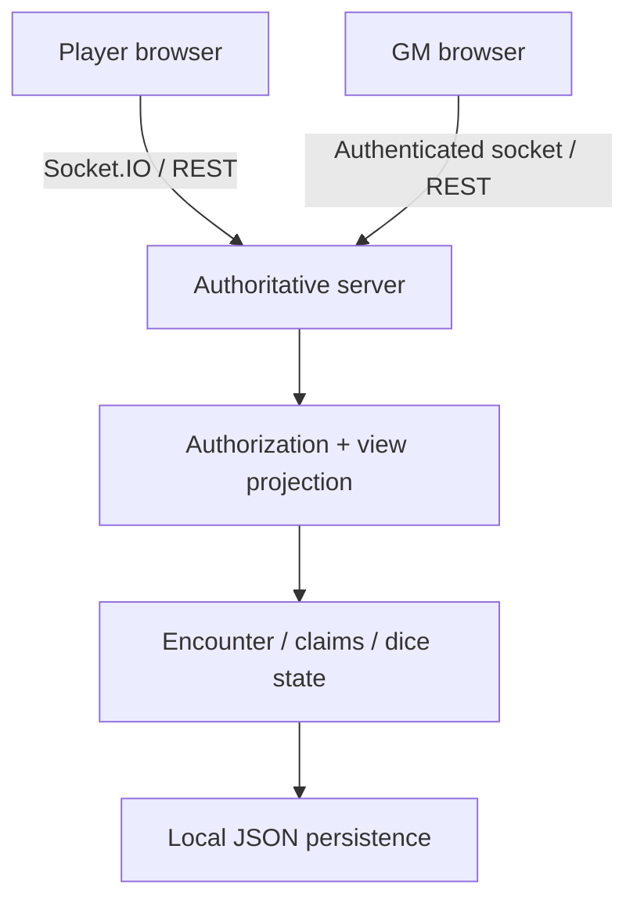

> ## ⚠ ARCHIVED — 2026-08-01
>
> **What this is:** Architecture overview from the pre-SQLite era, kept as the record of the original shape.
> **Current through:** 2026-07-24  (last commit that kept it true: `1e158de`)
> **Superseded by:** `docs/ai-context/architecture.md` for the rules, `docs/app-map.md` (generated) for the shape.
> **Read this for:** the original component split and the reasoning behind an authoritative LAN server.
> **Do not read this for:** how persistence works — it says "Local JSON", and the app has used `node:sqlite`/WAL since ADR-0006.
> **Paths, line numbers and counts inside this file are as of the date above and are not maintained.**

# Architecture

## Packages

| Package | Responsibility |
| --- | --- |
| `apps/client` | Responsive React interface; no privileged game decisions. |
| `apps/server` | HTTP, Socket.IO, GM authentication, authorization, state ownership, persistence. |
| `packages/schemas` | Versioned actor/content validation schemas. |
| `packages/domain` | Commands, projections, state invariants, and socket contracts. |
| `packages/rules-5e` | Safe, declarative 5e calculation helpers; no imported executable logic. |

## State and security boundary

The server maintains the canonical `GameState`. Every outbound state update is projected for a recipient role:

- Player projection contains only currently visible actors and public combat information.
- GM projection includes all actors and management metadata.
- Socket actions are checked against the signed session and, for player actions, the actor claim.

The durable store is an embedded SQLite database using WAL mode and versioned migrations. Each accepted command transaction writes its idempotency receipt, ordered domain event, and current state projection atomically; periodic snapshots bound future replay/recovery work. The database implementation does not change client contracts or socket events.

## Networking

The server binds to `0.0.0.0` so LAN clients can reach it. Direct LAN HTTP is a trusted-LAN mode, not Internet authentication. Do not port-forward it. Use a VPN or a TLS reverse proxy before any external access.
