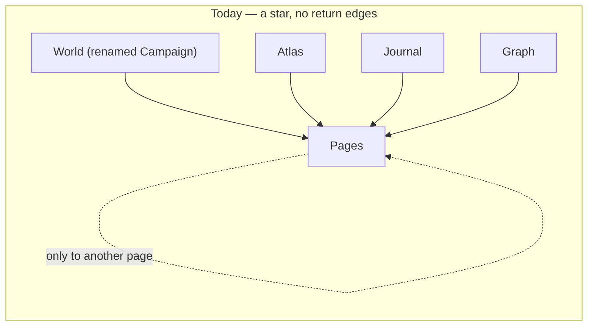
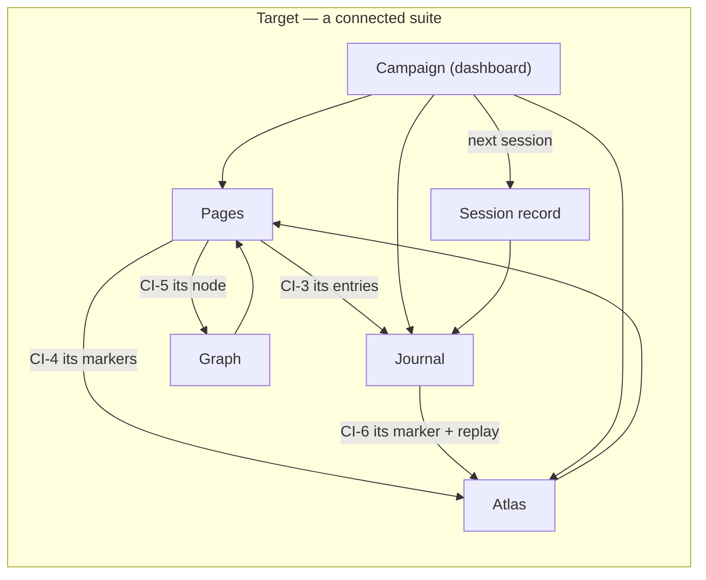

> ## ⚠ ARCHIVED — 2026-08-01
>
> **What this is:** Stage Three (design half) experience design for the Codex worldbuilding suite.
> **Current through:** 2026-07-28  (last commit that kept it true: `066f47a`)
> **Superseded by:** nothing; the design shipped in `706eab5` (#52). Live rules: `docs/ai-context/codex.md`.
> **Read this for:** why the navigation, vocabulary and save model took the shape they did, and what was rejected.
> **Do not read this for:** current status or current UI. Its "awaiting owner approval" banner is spent; the shipped UI is `apps/client/src/codex/`.
> **Paths, line numbers and counts inside this file are as of the date above and are not maintained.**

# Codex worldbuilding suite — experience design

Date: 2026-07-28 · Status: Stage Three (design half) — **awaiting owner approval.** No product code
changed.

Sits between `codex-suite-spec.md` (approved requirements) and `codex-suite-plan.md` (milestones).
This document decides *how the suite behaves and holds together*; it introduces **no capability that
is not already an approved requirement**. Where it makes a structural choice the spec did not
dictate, that choice is called out as **DESIGN DECISION** and needs approval.

---

## 1. What the app's design language already requires

Read from `docs/ai-context/design-language.md`. These are not new rules — they are existing,
authoritative rules the Codex must now meet.

| Rule | Source | Codex today |
| --- | --- | --- |
| "Compose from `@vtt/ui` primitives; **if you need a new one, add it to `@vtt/ui`** … **not inline in a feature**." | §10.2 | **Broken.** Six primitives re-implemented locally (assessment §4). |
| "Reference `var(--…)` tokens, never hex." | §10.1 | Mostly held. |
| 44px touch floor, "say which route you took." | §4, §10.4 | **Broken.** `.tap-target` used zero times in the Codex. |
| Panels may carry a 2px top accent hairline to label a kind — **cyan = notes**. | §5 | Unused by the Codex. |
| At most one glowing element per region; glow marks the *answer*, not the filter. | §8.1 | Not systematically applied. |
| Hover owns the surface lift; **selection owns the edge, glow and check**. | §5 | Inconsistent across list surfaces. |
| Disabled dims **per property**, never group `opacity`. | §5 | **Broken** — hidden markers use `opacity` alone (`codex.css:349-350`). |
| Sentence case; actions name their result; errors say what happened and how to fix it. | §9 | Partly held. |

**This is the single most important framing for the whole overhaul:** most "make it feel intentional"
work is *conforming to rules the project already wrote down*, not inventing a new aesthetic.

---

## 2. The organising idea

Three concepts carry the whole suite. Everything else hangs off them.

1. **The world** — what exists. Entities (pages), places (atlas), and how they connect (graph).
2. **The chronicle** — what happened and what will. One in-world timeline: journal entries, dated
   events, sessions, deadlines, downtime.
3. **The campaign** — how play is run. Sessions, prep, quests, faction standing, the party's position.

The suite's five modes cover (1) well and (2) partially, and had no home for (3). The resolution is
**not** a new mode: (3) is state that belongs to surfaces that already exist — the dashboard (renamed
from `World` to `Campaign`), the chronicle, and the atlas. See DESIGN DECISION 1.

---

## 3. Information architecture

### DESIGN DECISION 1 — no sixth mode. `World` becomes **`Campaign`**, the dashboard.

*Superseded the original proposal (a sixth "Campaign" tab) after owner brainstorm. Recorded because
the reasoning matters for future work.*

The five modes stay five. **`World` is renamed `Campaign`** and becomes the dashboard the owner
approved under CI-7 — entities at a glance *plus* the campaign's live state.

```
Codex
├── Campaign   · the dashboard (was "World")   — CI-7 + campaign state
├── Pages      · write and organise entities
├── Atlas      · where things are               — + party marker
├── Journal    · the chronicle, two lenses      — CT-11, CT-12
└── Graph      · how the world connects         — CI-8
```

**Why no sixth tab.** Campaign material is not a *place*; it is state that belongs to surfaces that
already exist. A sixth tab would create a second surface that knows about time, competing with the
Journal timeline we just unified (P3).

**Where each thing actually lives:**

| Campaign concept | Home |
| --- | --- |
| Dashboard summary | `Campaign` mode |
| Session record (prep + recap) | its own record; reachable from the dashboard **and** Journal's by-session lens |
| Prep, while working elsewhere | the **session console** drawer (DESIGN DECISION 3) |
| Quests | own record; listed on the dashboard, opened full-view |
| Deadlines · downtime · progression · standing changes | **timeline records** in Journal |
| Faction standing (current value) | the faction entity + dashboard card |
| Party location | a flagged marker in Atlas |
| Reveal audit | a global utility (DESIGN DECISION 2) |

**Rejected:** a sixth tab (creates a rival timeline surface); folding campaign material into Journal
(re-creates the two-things-in-one-surface problem CT-12 exists to fix).

### DESIGN DECISION 3 — prep has two routes, never one

The owner was explicit: prep must be referenceable *while browsing other things*, but the drawer must
not be the only way in.

1. **Destination** — the session record's full view, reachable from the dashboard's "Next session"
   card and from Journal's by-session lens. All editing lives here.
2. **Session console** — a collapsible drawer toggled from the mode bar, showing the current
   session's prep from **any** Codex mode. Reference surface; its open/closed state persists.

Both read the same record. The console is a view, never a second store.

### DESIGN DECISION 2 — the reveal audit is a global utility, not a mode

CT-9 ("what have I shown players?") is cross-cutting, not campaign-specific. It joins Search / Import
/ Export in the mode-bar operations cluster, alongside the approved GM preview (CP-2). Grouping the
two together is deliberate: *"what can they see"* and *"what does it look like to them"* are one
question asked two ways.

---

## 4. Navigation — killing the star topology

Today every mode routes **into** Pages and nothing routes out (assessment §6.1).





**Rule (new, enforceable):** *every cross-mode jump prepares its destination.* The dashboard→Pages
handoff already does this — it sets the filter, clears the query, clears the selection and switches
mode in one gesture. Every other jump currently just sets mode and id, leaving stale filter state.
This becomes a consistency rule, not a per-case fix.

**Where the return edges live:** the page editor's context card (its third pane) gains a
**Connections** section listing this entity's markers, journal entries and graph neighbourhood, each
a real link. This reuses the pane that already holds Outline/backlinks/pinned entries rather than
adding chrome.

---

## 5. The chronicle — one timeline

CT-11 and CT-12 make Journal the single chronology. These record kinds resolve onto it:

| Kind | Source | Reveal default |
| --- | --- | --- |
| Journal entry | GM writes | GM choice |
| Dated `event` page | CT-11 | follows the page |
| Combat entry | auto (CP-8) | **GM-only** (D-5) |
| Deadline (`kind='deadline'`) | CT-5 | GM-only until fired |
| Downtime (`kind='downtime'`) | CT-10 | GM choice |
| Milestone (`kind='milestone'`) | CT-8 | GM choice |
| Standing change (`kind='standing'`) | CT-6 | GM choice |
| Session | CT-1 | recap is the player layer |

**Two lenses (CT-12):** a `SegmentedControl` toggling **By session** / **By in-world date**. Same
records, two orderings. Session grouping answers "what happened last time"; in-world grouping answers
"what happened in the world."

**Consistency rule:** every kind renders in the same row shape — icon, title, date, reveal state —
differing only by icon and accent. A reader must never have to learn a layout per kind. Kind is carried by
icon **plus** label, never colour alone (design language §5, condition-chip precedent).

---

## 6. Campaign material — what is a table and what is a timeline record

Owner delegated this decision with one constraint: **future growth must not be hampered.** That
constraint reversed one of the lead's own proposals (quests), which is recorded here deliberately.

**Governing principle.** Something is a **table** when it has independent identity and lifecycle —
you create it, name it, browse it, and it outlives any single moment. Something is a **timeline
record** when it is fundamentally *a thing that happened, or will happen, at a time*.

### Three new tables

| Table | Why it earns one |
| --- | --- |
| `codex_sessions` | Number, real date, attendees, **prep (GM layer)**, **recap (player layer)**, status. Prep exists days before the session and is edited over time — independent lifecycle. Prep is *not* a separate table: it is the session's GM layer, exactly like `gmBody` on a page. |
| `codex_quests` | **Reverses the lead's "quest as a 9th entity type" idea.** Entity `fields` are a flat `Record<string,string>`, so objectives would be JSON stuffed into a string, and quest *status* must be queryable for the dashboard. Quests also plausibly grow — assignees, calendar-linked due dates, sub-quests, rewards. Once storage for a checklist field kind is needed anyway, a table costs little more and leaves headroom. |
| `codex_standing` | Faction → current value → history. Queryable for the dashboard; leaves room for per-character or multi-axis reputation. |

### Not tables — timeline records

`codex_journal` already carries a `kind` discriminator (it distinguishes combat entries today). These
become new kinds, plus one additive `payload_json` column following the established
`page_ids_json`/`scene_ids_json` precedent (migration v8):

| Kind | Payload |
| --- | --- |
| `deadline` | what, target date, fired flag |
| `downtime` | who, activity, time cost, outcome |
| `milestone` | level, reason (CT-8) |
| `standing` | faction, delta, reason |

Each inherits two-layer bodies, reveal, dating, calendar reflow, pinning and search **for free**.

**Net effect:** three new tables instead of five, no new tab, and prep/recap fall out of the existing
two-layer pattern instead of needing a new concept.

---

## 7. Two-layer secrecy — unchanged language, extended reach

Every new record type follows the established rule verbatim: `RevealSwitch` for record reveal,
`GmOnlyTag` + `.codex-gm-block` for GM-only content, violet meaning GM-only and nothing else.

**Hard constraint restated (K2).** Encounter replays contain GM-only narration and are documented as
unreachable by players. CP-9 surfaces replays **GM-only**; the player-facing side of a combat entry
carries prose only, never replay data. This must be proven by an HTTP-boundary test, not by
inspection.

**New surfaces that must project (P2):** **dated `event` pages (CT-11)**, **session** (prep is the
GM layer, recap is the player layer — one record, split by projection), **quest**, and the four new
timeline kinds (**deadline, downtime, milestone, standing**), plus faction standing and the party marker.

**Why events and deadlines are called out explicitly:** `PlayerCodex.tsx:42` fetches the timeline via
`playerCodexApi.timeline(token)`. The moment any new record kind resolves onto the chronicle it becomes
**player-reachable by default**. Events and deadlines are therefore projection surfaces, not display
changes, and carry the same HTTP-boundary test obligation as any other player-facing read.

### GM preview of the player Codex (CP-2) — how it must actually work

The app's existing `ViewerPreviewPanel` is **not** a component rendering player data. It POSTs
`/api/v1/viewer/preview-session` to mint a **separate viewer principal**, then loads `/viewer.html` in
an iframe (`viewer/ViewerPreviewPanel.tsx:24-46`). The Codex has neither a preview-session mint nor a
separate player document.

This matters because `roleOf()` checks `authorizeGm` **first** (`codex-http.ts:146-151`). Mounting
`PlayerCodex` with a GM token would return **role `gm`** and therefore **GM projections** — the
"preview" would show unrevealed pages, hidden maps and GM-only bodies while telling the GM *this is
what players see*. A false preview on the repo's hardest invariant is worse than no preview.

**Required:** CP-2 needs a genuine player principal — either a Codex preview-session mint mirroring
the viewer's, or an explicit, audited role downgrade that forces every read through
`codex-projections.ts`. This is **server work**, not a client mount.

---

## 8. Component decisions

**Adopt, don't re-invent (CF-1).** Six replacements, each behaviour-preserving:

| Local | Becomes | Watch |
| --- | --- | --- |
| `SaveStatus`/`statusLabel` | `SaveState` | conflict state must survive the swap |
| `.codex-filter-chip` ×2 | `Chip` | must keep the clear affordance |
| `.codex-template-menu` + scrim | `Menu`/`MenuItem` | keyboard + focus return |
| comma-split tags `<Input>` | `TagInput` | existing comma data must migrate cleanly |
| ad-hoc loading | `Skeleton` | `MapSurface`/`CodexImage` have bespoke ones |
| `Notice` + raw `<p>` error | `Alert` / `useToast` | error must be visible in every mode (CF-2) |

**New primitives go to `@vtt/ui`, per §10.2 — not inline.** The campaign work needs an
**objective checklist** (quests) and a **deadline/countdown readout**. Faction standing reuses
`Meter`. Anything genuinely new is added to `@vtt/ui` with `nh-` CSS and registered in `/styleguide`.
*This rule is the whole point of the overhaul; the plan must not violate it while fixing it.*

---

## 9. Consistency rules (testable)

| # | Rule |
| --- | --- |
| R1 | Every cross-mode jump prepares its destination (filter, query, selection, mode). |
| R2 | Every timeline record uses one row shape; kind reads by icon + label, never colour alone. |
| R3 | Every interactive control meets 44px, and the route taken is stated. |
| R4 | Every mode has a loading state and a visible error state. |
| R5 | Reveal is always `RevealSwitch`; GM-only content is always `GmOnlyTag` + violet. |
| R6 | Selection owns edge/glow/check; hover owns surface lift. Never both. |
| R7 | Disabled and hidden states dim per property, never group `opacity`. |
| R8 | One search box, one result list, all record types. |
| R9 | No new component inline in the Codex — it goes to `@vtt/ui` + `/styleguide`. |

---

## 10. Open design questions

| # | Question | Default if unanswered |
| --- | --- | --- |
| DQ-1 | ~~Campaign as a sixth mode?~~ **RESOLVED** — no sixth mode; `World` renamed **`Campaign`** and becomes the dashboard. | resolved |
| DQ-2 | ~~Player Campaign surface?~~ **RESOLVED** — the recap **is** the player projection of the session record. It headlines the player's `Campaign` dashboard, with a "new since you last looked" indicator on the Codex button. **No new player surface.** | resolved |
| DQ-3 | Should the party marker be **one special marker** or an ordinary marker flagged as the party? | Ordinary marker with a flag — cheaper, reuses everything |
| DQ-4 | Does a **quest** appear in the Graph and in search alongside entities? (spec U-4) | Yes to search, no to Graph in this programme |
