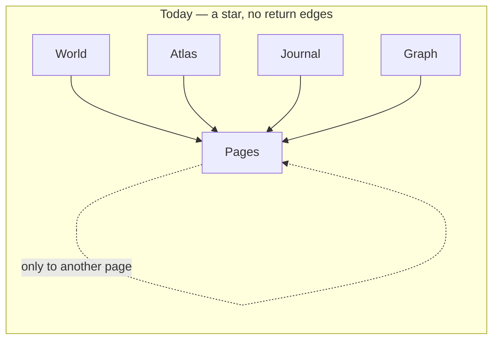
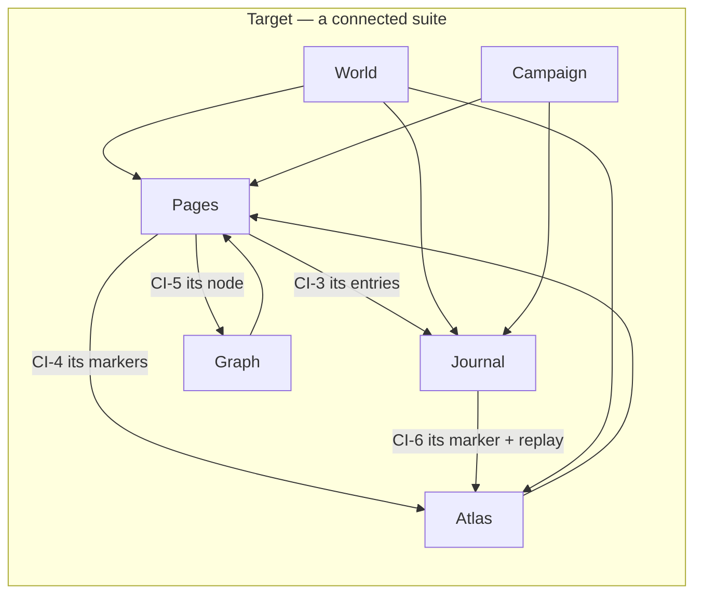

# Codex worldbuilding suite — experience design

Date: 2026-07-28 · Status: Stage Three (design half) — **awaiting owner approval.** No product code
changed.

Sits between `codex-suite-spec.md` (approved requirements) and `codex-suite-plan.md` (milestones).
This document decides *how the suite behaves and holds together*; it introduces **no capability that
is not already an approved requirement**. Where it makes a structural choice the spec did not
dictate, that choice is called out as **DESIGN DECISION** and needs approval.

---

## 1. What the app's design language already requires

Read from `docs/ai-context/design-language.md`. These are not new rules — they are existing,
authoritative rules the Codex must now meet.

| Rule | Source | Codex today |
| --- | --- | --- |
| "Compose from `@vtt/ui` primitives; **if you need a new one, add it to `@vtt/ui`** … **not inline in a feature**." | §10.2 | **Broken.** Six primitives re-implemented locally (assessment §4). |
| "Reference `var(--…)` tokens, never hex." | §10.1 | Mostly held. |
| 44px touch floor, "say which route you took." | §4, §10.4 | **Broken.** `.tap-target` used zero times in the Codex. |
| Panels may carry a 2px top accent hairline to label a kind — **cyan = notes**. | §5 | Unused by the Codex. |
| At most one glowing element per region; glow marks the *answer*, not the filter. | §8.1 | Not systematically applied. |
| Hover owns the surface lift; **selection owns the edge, glow and check**. | §5 | Inconsistent across list surfaces. |
| Disabled dims **per property**, never group `opacity`. | §5 | **Broken** — hidden markers use `opacity` alone (`codex.css:349-350`). |
| Sentence case; actions name their result; errors say what happened and how to fix it. | §9 | Partly held. |

**This is the single most important framing for the whole overhaul:** most "make it feel intentional"
work is *conforming to rules the project already wrote down*, not inventing a new aesthetic.

---

## 2. The organising idea

Three concepts carry the whole suite. Everything else hangs off them.

1. **The world** — what exists. Entities (pages), places (atlas), and how they connect (graph).
2. **The chronicle** — what happened and what will. One in-world timeline: journal entries, dated
   events, sessions, deadlines, downtime.
3. **The campaign** — how play is run. Sessions, prep, quests, faction standing, the party's position.

The suite's current five modes cover (1) well, (2) partially, and (3) not at all. That is the
structural reason it feels incomplete now that campaign tracking is in scope.

---

## 3. Information architecture

### DESIGN DECISION 1 — add a sixth mode, "Campaign"

The approved campaign-tracking requirements (CT-1…CT-8) have no home. The five existing modes are
all *nouns of the world*; sessions, prep and quests are *the play*. Forcing them into Journal would
make Journal two things again — the exact problem CT-12 exists to fix.

```
Codex
├── World      · what my world is, at a glance          (CI-7)
├── Pages      · write and organise entities
├── Atlas      · where things are                        (+ party marker CT-7)
├── Journal    · the chronicle — one timeline, two lenses (CT-11, CT-12)
├── Campaign   · how play is run — NEW                   (CT-1…CT-6, CT-8)
└── Graph      · how the world connects                  (CI-8)
```

**Campaign** holds: the current/next session (prep), past sessions, quests, faction standing, and a
progression log. **Journal** stays the chronicle; a session's *entries* still live there, and the
Campaign session record links to them.

**Rejected alternative:** renaming Journal to "Chronicle" and splitting differently. The owner
approved "Journal is one timeline with two lenses" (CT-12) — renaming it is unapproved scope.

**Risk accepted:** six tabs is more than five. Mitigated because the mode bar is already a scrolling
`Tabs` control and the sixth is a genuinely distinct job. If the owner prefers five, the fallback is
Campaign as a sub-view of Journal — worse, but viable.

### DESIGN DECISION 2 — the reveal audit is a global utility, not a mode

CT-9 ("what have I shown players?") is cross-cutting, not campaign-specific. It joins Search / Import
/ Export in the mode-bar operations cluster, alongside the approved GM preview (CP-2). Grouping the
two together is deliberate: *"what can they see"* and *"what does it look like to them"* are one
question asked two ways.

---

## 4. Navigation — killing the star topology

Today every mode routes **into** Pages and nothing routes out (assessment §6.1).





**Rule (new, enforceable):** *every cross-mode jump prepares its destination.* The World→Pages
handoff already does this — it sets the filter, clears the query, clears the selection and switches
mode in one gesture. Every other jump currently just sets mode and id, leaving stale filter state.
This becomes a consistency rule, not a per-case fix.

**Where the return edges live:** the page editor's context card (its third pane) gains a
**Connections** section listing this entity's markers, journal entries and graph neighbourhood, each
a real link. This reuses the pane that already holds Outline/backlinks/pinned entries rather than
adding chrome.

---

## 5. The chronicle — one timeline

CT-11 and CT-12 make Journal the single chronology. Five record kinds resolve onto it:

| Kind | Source | Reveal default |
| --- | --- | --- |
| Journal entry | GM writes | GM choice |
| Dated `event` page | CT-11 | follows the page |
| Combat entry | auto (CP-8) | **GM-only** (D-5) |
| Deadline | CT-5 | GM-only until fired |
| Downtime | CT-10 | GM choice |

**Two lenses (CT-12):** a `SegmentedControl` toggling **By session** / **By in-world date**. Same
records, two orderings. Session grouping answers "what happened last time"; in-world grouping answers
"what happened in the world."

**Consistency rule:** every kind renders in the same row shape — icon, title, date, reveal state —
differing only by icon and accent. A reader must never have to learn five layouts. Kind is carried by
icon **plus** label, never colour alone (design language §5, condition-chip precedent).

---

## 6. Campaign — the new mode

**Session record (CT-1, CT-2, CT-3).** One record, three faces:

- **Prep** (GM-only) — planned scenes, NPCs to have ready, notes. *The owner named this key.* This is
  the default view for the next session.
- **Log** — the journal entries and encounters that occurred, gathered automatically.
- **Recap** (player-facing, CT-3) — curated prose, surfaced at the top of the player Codex.

The three are tabs within the session, not three records. Prep→Log→Recap is the natural lifecycle of
one session, and modelling it as one record is what lets the recap draw on the log.

**Quests (CT-4).** Status (active / completed / failed), ordered tickable objectives, links to
involved entities via the existing `EntityPicker`. Two-layer like everything else: a quest has a
player-facing description and GM-only truth.

**Faction standing (CT-6).** Uses the existing `Meter` primitive from `@vtt/ui` — no new component.
Standing changes are dated records, so they land on the chronicle.

**Progression (CT-8).** Milestone/level events, dated, on the chronicle. No XP arithmetic (D-8).

---

## 7. Two-layer secrecy — unchanged language, extended reach

Every new record type follows the established rule verbatim: `RevealSwitch` for record reveal,
`GmOnlyTag` + `.codex-gm-block` for GM-only content, violet meaning GM-only and nothing else.

**Hard constraint restated (K2).** Encounter replays contain GM-only narration and are documented as
unreachable by players. CP-9 surfaces replays **GM-only**; the player-facing side of a combat entry
carries prose only, never replay data. This must be proven by an HTTP-boundary test, not by
inspection.

**New surfaces that must project (P2):** **dated `event` pages (CT-11)**, session (prep is GM-only,
recap is player-facing), quest, **deadline (CT-5)**, downtime, faction standing, party marker.

**Why events and deadlines are called out explicitly:** `PlayerCodex.tsx:42` fetches the timeline via
`playerCodexApi.timeline(token)`. The moment any new record kind resolves onto the chronicle it becomes
**player-reachable by default**. Events and deadlines are therefore projection surfaces, not display
changes, and carry the same HTTP-boundary test obligation as any other player-facing read.

### GM preview of the player Codex (CP-2) — how it must actually work

The app's existing `ViewerPreviewPanel` is **not** a component rendering player data. It POSTs
`/api/v1/viewer/preview-session` to mint a **separate viewer principal**, then loads `/viewer.html` in
an iframe (`viewer/ViewerPreviewPanel.tsx:24-46`). The Codex has neither a preview-session mint nor a
separate player document.

This matters because `roleOf()` checks `authorizeGm` **first** (`codex-http.ts:146-151`). Mounting
`PlayerCodex` with a GM token would return **role `gm`** and therefore **GM projections** — the
"preview" would show unrevealed pages, hidden maps and GM-only bodies while telling the GM *this is
what players see*. A false preview on the repo's hardest invariant is worse than no preview.

**Required:** CP-2 needs a genuine player principal — either a Codex preview-session mint mirroring
the viewer's, or an explicit, audited role downgrade that forces every read through
`codex-projections.ts`. This is **server work**, not a client mount.

---

## 8. Component decisions

**Adopt, don't re-invent (CF-1).** Six replacements, each behaviour-preserving:

| Local | Becomes | Watch |
| --- | --- | --- |
| `SaveStatus`/`statusLabel` | `SaveState` | conflict state must survive the swap |
| `.codex-filter-chip` ×2 | `Chip` | must keep the clear affordance |
| `.codex-template-menu` + scrim | `Menu`/`MenuItem` | keyboard + focus return |
| comma-split tags `<Input>` | `TagInput` | existing comma data must migrate cleanly |
| ad-hoc loading | `Skeleton` | `MapSurface`/`CodexImage` have bespoke ones |
| `Notice` + raw `<p>` error | `Alert` / `useToast` | error must be visible in every mode (CF-2) |

**New primitives go to `@vtt/ui`, per §10.2 — not inline.** The campaign work needs an
**objective checklist** (quests) and a **deadline/countdown readout**. Faction standing reuses
`Meter`. Anything genuinely new is added to `@vtt/ui` with `nh-` CSS and registered in `/styleguide`.
*This rule is the whole point of the overhaul; the plan must not violate it while fixing it.*

---

## 9. Consistency rules (testable)

| # | Rule |
| --- | --- |
| R1 | Every cross-mode jump prepares its destination (filter, query, selection, mode). |
| R2 | Every timeline record uses one row shape; kind reads by icon + label, never colour alone. |
| R3 | Every interactive control meets 44px, and the route taken is stated. |
| R4 | Every mode has a loading state and a visible error state. |
| R5 | Reveal is always `RevealSwitch`; GM-only content is always `GmOnlyTag` + violet. |
| R6 | Selection owns edge/glow/check; hover owns surface lift. Never both. |
| R7 | Disabled and hidden states dim per property, never group `opacity`. |
| R8 | One search box, one result list, all record types. |
| R9 | No new component inline in the Codex — it goes to `@vtt/ui` + `/styleguide`. |

---

## 10. Open design questions

| # | Question | Default if unanswered |
| --- | --- | --- |
| DQ-1 | Approve **Campaign as a sixth mode** (DESIGN DECISION 1)? | Proceed as designed |
| DQ-2 | Does the player see a **Campaign** surface at all (recaps, revealed quests), or only recaps inside their existing tabs? | Recaps surface in the player Codex; no separate player Campaign tab |
| DQ-3 | Should the party marker be **one special marker** or an ordinary marker flagged as the party? | Ordinary marker with a flag — cheaper, reuses everything |
| DQ-4 | Does a **quest** appear in the Graph and in search alongside entities? (spec U-4) | Yes to search, no to Graph in this programme |
